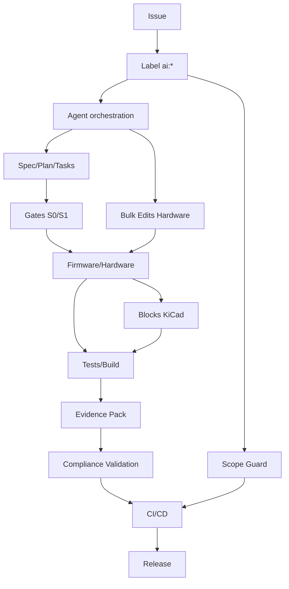

# Diagramme de flux Kill_LIFE

```mermaid
graph TD
    A[Issue] --> B[Label ai:*]
    B --> C[Agent orchestration]
    C --> D[Spec/Plan/Tasks]
    D --> E[Gates S0/S1]
    E --> F[Firmware/Hardware]
    F --> G[Tests/Build]
    G --> H[Evidence Pack]
    H --> I[Compliance Validation]
    I --> J[CI/CD]
    J --> K[Release]
    B --> L[Scope Guard]
    L --> J
    C --> M[Bulk Edits Hardware]
    M --> F
    F --> N[Blocks KiCad]
    N --> G
```

Ce diagramme illustre le pipeline complet, de l'issue à la release, en passant par les agents, gates, evidence, compliance, CI/CD, et sécurité.