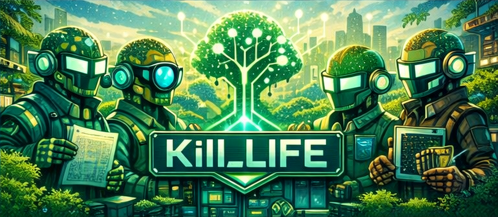
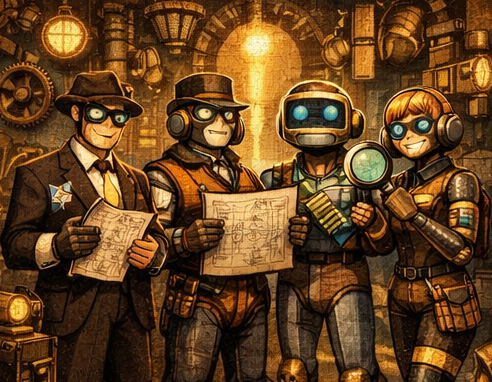
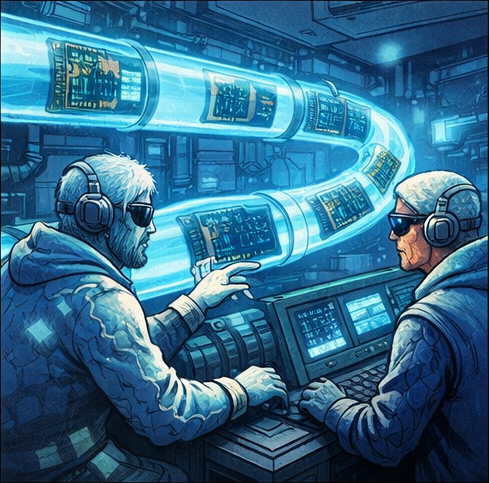
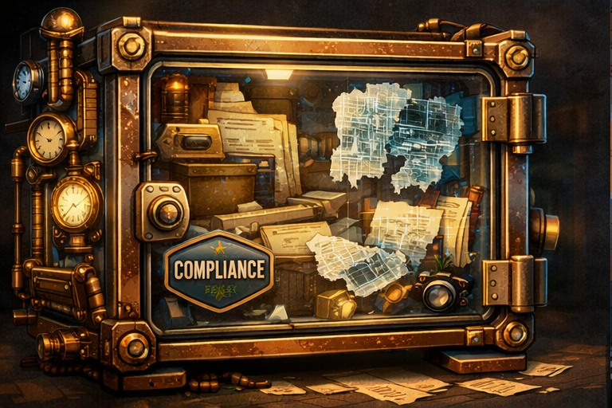
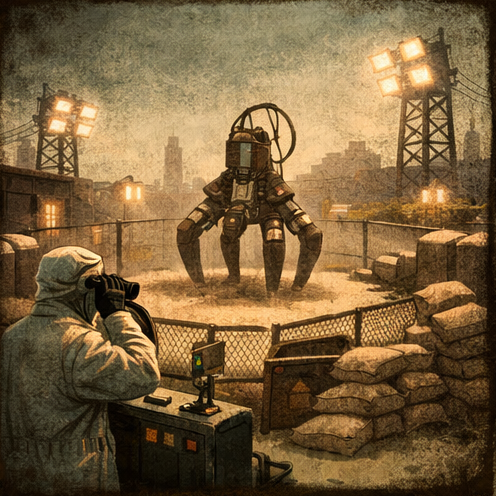
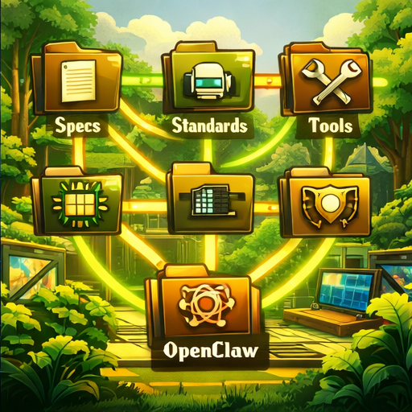

# Kill_LIFE 🚀 — Modèle de Projet Embarqué IA-Natif


<!-- Badges qualité & conformité -->
[](https://github.com/electron-rare/Kill_LIFE/actions)
[](licenses/MIT.txt)
[](docs/COMPLIANCE.md)
[](docs/evidence/)
[](docs/coverage_report.html)


---

## Sommaire


Bienvenue dans **Kill_LIFE**, le modèle open source pour systèmes embarqués IA où chaque étape est traçable, chaque evidence pack est rangé, et chaque agent suit un workflow sécurisé. Ce projet vise la reproductibilité, la conformité et l’automatisation pour l’embarqué IA multi-cibles.


## 🧩 Présentation

Kill_LIFE est un modèle agentique pour systèmes embarqués IA, orienté spec-first, sécurité et traçabilité. Il s’appuie sur des agents spécialisés, des workflows automatisés et une arborescence claire.

<div align="center" style="margin: 16px 0;">
  
</div>

## 🧩 Workflows agentiques, gates et rituels

Le projet Kill_LIFE s’appuie sur une architecture agentique inspirée des approches spec-first (Spec Kit), des méthodes d’exécution orchestrée (Agent Zero) et des rituels d’industrialisation (Agent OS / BMAD), adaptée aux contraintes hardware : toolchains multiples, tests HIL, traçabilité et evidence packs reproductibles.

## 🧠 1) Les agents (qui fait quoi)

- **PM / Spec Agent** : transforme l’intention en specs testables *(acceptance criteria, non-goals, risques)*.
- **Architect Agent** : découpe en modules, interfaces, contraintes *(RTOS, mémoire, IO, latence)*.
- **Firmware Agent** : implémente, maintient la compatibilité multi-cibles, garantit les invariants.
- **HW Agent** : contraintes PCB / alimentation / signaux / bring-up, checklists hardware.
- **QA / Test Agent** : tests unitaires + intégration + smoke HIL, stabilise les reproductions.
- **Doc Agent** : docs “opérables” *(runbooks)*, exemples, troubleshooting, changelog.
- **Compliance / Release Agent** : conformité *(standards)*, SBOM, versions, evidence pack final.

> **Règle d’or** : un agent = une responsabilité + des artefacts obligatoires. Pas d’action “magique”.

---

## 🧱 2) Les gates (les points de contrôle non négociables)

Chaque gate **produit** un ensemble d’artefacts et **échoue** si les preuves attendues ne sont pas présentes.

| Gate | Objectif | Output attendu (exemples) |
|---|---|---|
| **G0 – Spec Freeze** | specs claires, testables | `spec.md`, critères d’acceptation, risques |
| **G1 – Design Freeze** | arch & interfaces validées | ADRs, diagrammes, mapping IO, BOM/contraintes |
| **G2 – Build Reproductible** | build identique sur machines propres | logs build, versions toolchain, checksums |
| **G3 – Tests Logiciels** | unit + intégration stables | rapports tests, couverture *(si dispo)*, logs |
| **G4 – Smoke Hardware (HIL)** | flash + test minimal sur cible | logs flash, preuve boot, tests IO/audio/etc. |
| **G5 – Conformité & Sécurité** | règles projet respectées | lint, scan secrets, licence/SBOM, checklist |
| **G6 – Release Evidence Pack** | paquet final auditable | bundle signé, changelog, preuves complètes |

>  “ultra simple” : garde **4 gates** *(Spec / Build / Test / Release)* et ajoute HIL & conformité en “extensions”.

---

## 🕯️ 3) Les rituels (comment on avance sans dériver)

- **Spec Review (rituel hebdo / par feature)**  
  On valide : objectifs, non-objectifs, critères d’acceptation, risques, contraintes HW.

- **Design Review (avant implémentation)**  
  On valide : interfaces, compromis *(RAM/flash/latence)*, plan de test.

- **RC (Release Candidate) ritual**  
  On exécute la chaîne complète “clean” et on publie un **RC live summary** + **evidence pack**.

- **Post-RC / Postmortem (si gate casse)**  
  On documente la cause, la prévention, et on ajoute un test/guardrail.

> Kill_LIFE privilégie les rituels “courts mais systématiques” : **moins de réunions, plus de preuves**.

---

## 📦 4) Evidence packs (la preuve comme produit)

Un **evidence pack** = tout ce qu’il faut pour **refaire** et **vérifier** :

- la spec
- l’archi / décisions *(ADR)*
- la build *(versions + logs)*
- les tests *(rapports + logs)*
- la preuve hardware *(flash + smoke)*
- la conformité *(SBOM / licence / scans / checklists)*
- le binaire final *(+ hash)*

**Convention de rangement (simple et robuste) :**
- `artifacts/<date_or_tag>/<target>/...`
- `logs/<gate>/...`
- `evidence/<release>/manifest.json` *(ou `.md`)* listant **quoi / où / hash**

---

## 🔐 5) Sécurité & traçabilité (le “workflow sécurisé”)

- **Least privilege** : un agent n’a accès qu’aux dossiers/outils nécessaires.
- **No secrets in prompts** : jamais de tokens/keys dans les specs ou logs.
- **Actions traçables** : chaque exécution écrit un log + un manifeste.
- **Dry-run first** : par défaut, on peut simuler *(build/test)* avant de flasher.


> Les liens entre agents, gates et rituels sont explicités dans les plans de chaque agent : chaque passage de gate implique des artefacts produits par les agents, chaque rituel s’appuie sur ces artefacts pour garantir la cohérence et la traçabilité.

L’ensemble du workflow est pensé comme une partition modulaire : chaque agent joue sa partie, les gates sont les mesures, les rituels les temps forts.

>Kill_LIFE, c’est l’agentique… mais avec des gants : chaque action laisse une trace, chaque décision devient un artefact, chaque build est reproductible. Inspiré par les méthodes spec-first et l’orchestration multi-agents, le projet impose des gates, des rituels et des evidence packs pour que l’embarqué IA reste fiable, vérifiable, et industrialisable.
---
> « Bienvenue dans le meilleur des mondes : ici, chaque commit est validé, chaque gate est passé, et chaque agent sait que la vraie liberté, c’est d’avoir un evidence pack bien rangé. »
> — Aldous Huxley, version CI/CD
---
## 🧩 Architecture & Principes

- **Spec-first** : Chaque évolution commence par une définition claire dans `specs/` ([Spec Generator FX](https://www.youtube.com/watch?v=9bZkp7q19f0)).
- **Injection de standards** : Standards versionnés et profils injectés (Agent OS).
- **BMAD / BMAD-METHOD** : Agents par rôles (PM, Architecte, Firmware, QA, Doc, HW), rituels, gates, handoffs ([agents/](agents/), [bmad/](bmad/)).
- **Tool-first** : Scripts reproductibles ([tools/](tools/)), evidence pack dans `artifacts/`.
- **Pipeline hardware/firmware** : Bulk edits, exports, tests, conformité, snapshots.
- **Sécurité & conformité** : Sanitisation, sorties sûres, sandboxing, scope guard, anti-prompt injection ([OpenClaw Sandbox](https://www.openclaw.io/)).
  >Schaeffer : Les agents du pipeline écoutent le bruit des specs comme une symphonie de sons trouvés.

<div align="center" style="margin: 18px 0;">
  
</div>


## 🏅 Conformité & Couverture

Ce projet vise la conformité stricte avec les specs (RFC2119) et la traçabilité par evidence pack. Les badges ci-dessus indiquent :
- **Conformité RFC2119** : respect des exigences formelles et validation par gates.
- **Evidence Pack** : traçabilité des artefacts produits à chaque étape.
- **Test Coverage** : taux de couverture des tests automatisés ([rapport détaillé](docs/coverage_report.html)).

Pour toute question fréquente, consulte la [FAQ](docs/FAQ.md).

> « La réponse à la question ultime de la vie, de l’univers et du développement embarqué IA : 42 specs, 7 agents, et un pipeline qui ne panique jamais. »
> « Kill_LIFE, c’est l’open source embarqué version IA, mais aussi un clin d’œil à la fin du monde : ici, on ne craint ni l’apocalypse, ni les bugs, ni les injections de prompt. On rêve, on code, on documente, et on fait des bulk edits comme des réplicants en quête de conformité. »
> 
> — Le README qui ne panique jamais car qui sait si
> [Les particules font l’amour ironique ?](https://lelectron-fou.bandcamp.com/album/les-particules-font-elles-l-amour-la-physique)

---

## ✨ Fonctionnalités principales




- **Développement guidé par la spec** : User stories, contraintes, architecture, plans, backlog.
- **Automatisation** : Issue → PR avec tests unitaires, sanitisation, evidence pack.
- **Multi-cibles** : ESP32, STM32, Linux, tests natifs.
- **Pipeline matériel** : KiCad, exports SVG/ERC/DRC/BOM/netlist, bulk edits.
- **Conformité** : Profils injectés, validation automatique.
- **OpenClaw** : Labels & commentaires sanitisés, jamais de commit/push, sandbox obligatoire.

<br clear="left"/>


---

## 🖥️ Schéma agentique (Mermaid)

```mermaid
flowchart TD
  Issue[Issue (label ai:*)] --> PR[Pull Request]
  PR --> Gate[Gate (tests, conformité)]
  Gate --> Evidence[Evidence Pack]
  Evidence --> CI[CI/CD]
  CI --> Deploy[Deploiement multi-cible]
  PR --> Agents[Agents (PM, Architect, Firmware, QA, Doc, HW)]
  Agents --> Specs[specs/]
  Agents --> Firmware[firmware/]
  Agents --> Hardware[hardware/]
  Agents --> Docs[docs/]
  Agents --> Compliance[compliance/]
  Agents --> Tools[tools/]
  Agents --> OpenClaw[openclaw/]
  Specs --> Standards[standards/]
  Firmware --> Tests[tests/]
  Hardware --> Exports[exports/]
  Compliance --> Evidence
  OpenClaw --> Sandbox[Sandbox]

---

## 📋 Plan de suivi d’audit & amélioration continue

Ce dépôt fait l’objet d’un suivi régulier :

- Les axes d’amélioration sont listés dans [specs/04_tasks.md](specs/04_tasks.md) et suivis via issues labellisées `ai:qa` ou `ai:tasks`.
- Toute action corrective ou suggestion doit être documentée dans une PR dédiée, avec evidence pack associé.
- Les audits de sécurité, conformité et couverture de tests sont à planifier à chaque release majeure.
- Les contributeurs sont invités à consulter la checklist d’audit (en tête du README) avant toute contribution majeure.
- La traçabilité des actions est assurée par les evidence packs ([docs/evidence/](docs/evidence/)).

Pour toute question ou suggestion, ouvrir une issue ou contacter l’équipe via [docs/FAQ.md](docs/FAQ.md).

``` 


> _Parmegiani : Un bulk edit, c’est une métamorphose électronique, un peu comme un pack d’évidence qui se transforme en nuage de sons._ <

---

## 🗺️ Schéma de flux

Voir [KIKIFOU/diagramme.md](KIKIFOU/diagramme.md) pour un diagramme complet du pipeline.

## 🧾 Table de mapping

Voir [KIKIFOU/mapping.md](KIKIFOU/mapping.md) pour une synthèse des dossiers et dépendances.

---

## 🚀 Installation & initialisation

### Prérequis


### Installation rapide

```bash
git clone https://github.com/electron-rare/Kill_LIFE.git
cd Kill_LIFE
bash install_kill_life.sh
```
> 🚀 Pour démarrer rapidement, consultez le guide [docs/QUICKSTART.md](docs/QUICKSTART.md)

Voir [INSTALL.md](INSTALL.md) pour les détails.

---

## 🤝 Contribuer


1. Forke le dépôt et clone-le localement.
2. Suis le guide d’onboarding ([docs/index.md](docs/index.md), [RUNBOOK.md](RUNBOOK.md)).
3. Ajoute des exemples minimalistes pour chaque agent (voir [agents/](agents/)).
4. Propose des blocks hardware, profils de conformité, tests.
5. Documente tes scripts et contributions.
6. Ouvre une PR, passe les gates, fournis un evidence pack.
7. Respecte les conventions de commit et de labelling (`ai:*`).
8. Vérifie la conformité et la sécurité (voir section Sécurité).

<br clear="left"/>
Pour toute question, consulte la [FAQ](docs/FAQ.md) ou ouvre une issue.


> « Les particules rêvent-elles d’électron-ironique ? Peut-être font-elles l’amour dans le dossier hardware, pendant que les agents QA se demandent si la conformité est un rêve ou une réalité. »
> — Inspiré par Le Réplicant de K. Dick & Les particules font-elles l’amour
_« J’ai vu des evidence packs briller dans l’obscurité près des gates S1… »_

---

## 🔗 Liens utiles

- [Documentation complète](docs/index.md)
- [RUNBOOK opérateur](RUNBOOK.md)
- [Guide d’installation](INSTALL.md)
- [Synthèse technique et recommandations](KIKIFOU/synthese.md)
- [Diagramme pipeline](KIKIFOU/diagramme.md)
- [Mapping dossiers](KIKIFOU/mapping.md)
- [Gate Runner](https://gate-runner.com) — passe les gates, évite les bugs.

---

## 🛡️ Sécurité & conformité



- OpenClaw : sandbox obligatoire, jamais d’accès aux secrets ou au code source.
- Workflows CI : validation, sanitisation, scope guard, anti-prompt injection.
- Evidence packs : tous les rapports dans `artifacts/<domaine>/<timestamp>/`.
- Tests hardware reproductibles via scripts documentés.
- Respect des conventions de labelling et de commit.

<br clear="left"/>
  
---



## 🛠️ Fonctions clés

- **specs/** : Source de vérité, plans, backlog.
- **standards/** : Standards globaux, profils injectés.
- **bmad/** : Gates, rituels, templates.
- **agents/** : Prompts pour chaque rôle.
- **tools/** : Scripts IA, cockpit, conformité, watch.
- **firmware/** : PlatformIO, tests Unity, multi-cibles.
- **hardware/** : KiCad, bulk edits, exports.
- **openclaw/** : Labels, commentaires, sandbox.
- **.github/** : Workflows CI, scope guard, enforcement labels.
- **licenses/** : MIT, CERN OHL v2, CC-BY 4.0.


<br clear="right"/>


---

## 🦾 Workflows agents

- **Scope guard** : Le label détermine les dossiers modifiables.
- Ouvre une issue avec le label `ai:spec`.
- L’agent PM/Architecte génère le plan et l’architecture.
- L’agent Firmware implémente le code dans `firmware/`.
- L’agent QA ajoute des tests Unity.
- Evidence pack généré automatiquement.
  > Générateur de phrases dystopiques pour motiver les contributeurs.
- **Bulk Edit Hardware KiCad**
- **Documentation & Conformité**
  1. Ouvre une issue avec le label `ai:docs` ou `ai:qa`.
  2. L’agent Doc met à jour `docs/` et le README.
  3. L’agent Conformité valide le profil et génère le rapport.
  > _RtFM: Les agents QA écoutent le paysage du repo, à la recherche d’un bug caché dans le souffle._
  > Trouve la phrase supprimée par le sanitizer, score affiché.

<div align="center" style="margin: 18px 0;">
  
</div>
---
  > _« Un evidence pack peut-il rêver de conformité ? »_

---

## 📝 Installation & Sécurité

Un guide d’installation détaillé ([INSTALL.md](INSTALL.md)) explique comment installer le projet, configurer les environnements, sécuriser OpenClaw, lancer les tests hardware, générer la documentation et utiliser Docker.
Un script d’installation unique ([install_kill_life.sh](install_kill_life.sh)) automatise tout : dépendances, spec, profil de conformité, environnement Python, modules IA/hardware/firmware, tests, doc, Docker, et vérification de la sécurité OpenClaw.

Sécurité OpenClaw : sandbox obligatoire, jamais d’accès aux secrets ou au code source.
Tests hardware reproductibles via scripts documentés.

---

## 🧬 Architecture agentique avancée

- Structure multi-agent (BMAD) : rôles PM, Architecte, Firmware, QA, Doc, HW, orchestrés par rituels, gates et handoffs.
- Développement spec-first : chaque évolution commence par une spécification, standards versionnés et profils injectés.
- Automatisation & sécurité : workflows CI, sanitisation, sorties sûres, scope guard, anti-prompt injection, OpenClaw sandbox.
- Multi-cibles & pipelines reproductibles : ESP32, STM32, Linux, tests natifs, bulk edits hardware KiCad, exports automatisés.
- Documentation claire & onboarding : README détaillé, FAQ, workflows, arborescence graphique, guides d’installation, politique de contribution.

<div align="center" style="margin: 18px 0;">
  
  </div>
> _RtFM : Parfois, le README résonne comme un drone, et tout le projet s’accorde._
Toutes les conventions, instructions d’installation, sécurité, multi-agents, conformité, workflows et support multi-plateforme (Docker inclus) sont synthétisées.
Architecture, étapes d’initialisation, fonctions clés, sécurité OpenClaw, contribution.

---

## ❓ FAQ

**Q : Comment démarrer rapidement ?**
R : Suis la section « Installation & initialisation » ou le guide INSTALL.md.

**Q : Comment installer tout automatiquement ?**
R : Utilise le script `install_kill_life.sh`.

**Q : Comment sécuriser OpenClaw ?**
R : Sandbox obligatoire, jamais d’accès aux secrets ou au code source.

**Q : Comment lancer les tests hardware ?**
R : Suis les scripts documentés dans le README et INSTALL.md.

**Q : Comment contribuer ?**
R : Ajoute des profils, améliore les scripts, enrichis les standards, et respecte la politique anti-injection.

**Q : Où trouver la documentation complète ?**
R : Voir [docs/index.md](docs/index.md), [RUNBOOK.md](RUNBOOK.md), [INSTALL.md](INSTALL.md).

---

## 🦾 Workflows détaillés

  
  
### 1. Spécification → Implémentation Firmware

1. Rédige la spec dans `specs/`.
2. Ouvre une issue avec le label `ai:spec`.
3. L’agent PM/Architecte génère le plan et l’architecture.
4. L’agent Firmware implémente le code dans `firmware/`.
5. L’agent QA ajoute des tests Unity.
6. Evidence pack généré automatiquement.

 [Spec Generator](https://www.websynths.com/grooves/)

### 2. Bulk Edit Hardware KiCad

1. Ouvre une issue avec le label `ai:hw`.
2. L’agent HW effectue un bulk edit via `tools/hw/schops`.
3. Exporte ERC/DRC, BOM, netlist.
4. Snapshot avant/après dans `artifacts/hw/<timestamp>/`.

### 3. Documentation & Conformité

1. Ouvre une issue avec le label `ai:docs` ou `ai:qa`.
2. L’agent Doc met à jour `docs/` et le README.
3. L’agent Conformité valide le profil et génère le rapport.

<br clear="right"/>

---

   > _RtFM: Les agents QA écoutent le paysage du repo, à la recherche d’un bug caché dans le souffle._
   > Trouve la phrase supprimée par le sanitizer, score affiché.
   > _« Un evidence pack peut-il rêver de conformité ? »_


