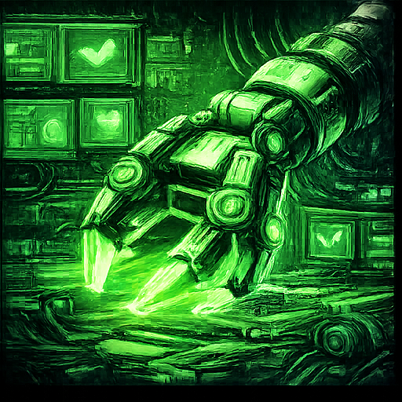
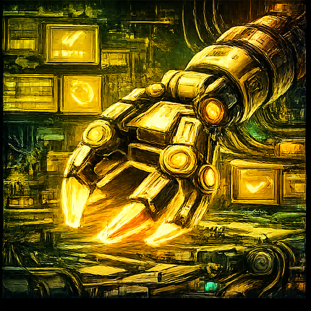
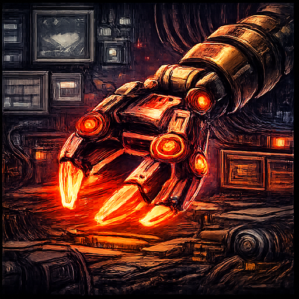
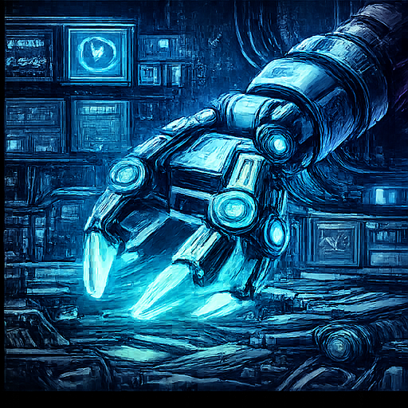
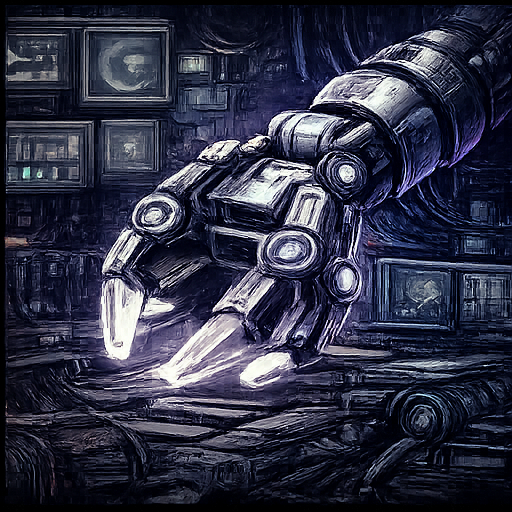

# Kill_LIFE 🚀 — AI-Native Embedded Project Template


<!-- Badges personnalisés -->
[](https://github.com/electron-rare/Kill_LIFE/actions)
[](licenses/MIT.txt)
[](docs/COMPLIANCE.md)
[](docs/coverage_report.html)


---

## Sommaire


<div align="center">
  
</div>
<div align="center" style="margin: 8px 0;">
  
  <a href="https://www.youtube.com/playlist?list=PLApocalypse42" target="_blank">Playlist apocalypse</a>
</div>


Bienvenue dans **Kill_LIFE**, le template open source pour systèmes embarqués IA, où chaque étape est traçable, chaque evidence pack est rangé, et chaque agent suit un workflow sécurisé. Ce projet vise la reproductibilité, la conformité, et l’automatisation pour l’embarqué IA multi-cibles.


> "La réponse à la question ultime de la vie, de l’univers et du développement embarqué IA : 42 specs, 7 agents, et un pipeline qui ne panique jamais."  
> "Kill_LIFE, c’est l’open source embarqué version IA, mais aussi un clin d’œil à la fin du monde : ici, on ne craint ni l’apocalypse, ni les bugs, ni les injections de prompt. On rêve, on code, on documente, et on fait des bulk edits comme des réplicants en quête de compliance."  
> — Le README qui ne panique jamais


## 🚦 Quickstart


1. Clone le repo et installe les dépendances ([INSTALL.md](INSTALL.md)).
2. Initialise un environnement Python (venv ou conda) et PlatformIO.
3. Lance les scripts de validation (Makefile, tools/).
4. Ouvre une issue, ajoute un label `ai:*` pour déclencher l’automatisation.
5. Suis le flux Issue → PR, gates, evidence pack.
6. Vérifie la conformité via les scripts de compliance.


Pour plus de détails, consulte [docs/index.md](docs/index.md), [RUNBOOK.md](RUNBOOK.md), [INSTALL.md](INSTALL.md).

## 🧩 Présentation

Kill_LIFE est un template agentique pour systèmes embarqués IA, orienté spec-first, sécurité, et traçabilité. Il s’appuie sur des agents spécialisés, des workflows automatisés, et une arborescence claire.

---

## 🧩 Architecture & Principes

- **Spec-first** : Chaque évolution commence par une définition claire dans `specs/` ([Spec Generator FX](https://www.youtube.com/watch?v=9bZkp7q19f0)).
- **Standards injection** : Standards versionnés + profils injectés (Agent OS).
- **BMAD / BMAD-METHOD** : Agents par rôles (PM, Architect, Firmware, QA, Doc, HW), rituels, gates, handoffs ([agents/](agents/), [bmad/](bmad/)).
- **Tool-first** : Scripts reproductibles ([tools/](tools/)), evidence pack dans `artifacts/`.
- **Pipeline hardware/firmware** : Bulk edits, exports, tests, compliance, snapshots ([Les particules font-elles l’amour ?](https://lelectron-fou.bandcamp.com/album/les-particules-font-elles-l-amour-la-physique)).
  - [Fête technique](https://www.youtube.com/watch?v=dQw4w9WgXcQ) — robots IA dansant sur du code PCB.
- **Sécurité & conformité** : Sanitisation, safe outputs, sandboxing, scope guard, anti-prompt injection ([OpenClaw Sandbox](https://www.openclaw.io/)).

> "Les particules rêvent-elles d’électron-ironique ? Peut-être font-elles l’amour dans le dossier hardware, pendant que les agents QA se demandent si la conformité est un rêve ou une réalité."  
> — Inspiré par Le Réplicant de K. Dick & Les particules font-elles l’amour
_« J’ai vu des evidence packs briller dans l’obscurité près des gates S1… »_

> "Bienvenue dans le meilleur des mondes : ici, chaque commit est validé, chaque gate est passé, et chaque agent sait que la vraie liberté, c’est d’avoir un evidence pack bien rangé."  
> — Aldous Huxley, version CI/CD

---

## ✨ Fonctionnalités principales

- **Développement guidé par la spec** : User stories, contraintes, archi, plans, backlog.
- **Automatisation** : Issue → PR avec tests unitaires, sanitisation, evidence pack.
- **Multi-cibles** : ESP32, STM32, Linux, tests natifs.
- **Pipeline matériel** : KiCad, exports SVG/ERC/DRC/BOM/netlist, bulk edits.
- **Compliance** : Profils injectés, validation automatique.
- **OpenClaw** : Labels & commentaires sanitisés, jamais de commit/push, sandbox obligatoire.

---


## 🖥️ Schéma agentique (Mermaid)

<div align="center">

```mermaid
flowchart TD
  Issue[Issue (label ai:*)] --> PR[Pull Request]
  PR --> Gate[Gate (tests, compliance)]
  Gate --> Evidence[Evidence Pack]
  Evidence --> CI[CI/CD]
  CI --> Deploy[Déploiement multi-cible]
  PR --> Agents[Agents (PM, Architect, Firmware, QA, Doc, HW)]
  Agents --> Specs[specs/]
  Agents --> Firmware[firmware/]
  Agents --> Hardware[hardware/]
  Agents --> Docs[docs/]
  Agents --> Compliance[compliance/]
  Agents --> Tools[tools/]
  Agents --> OpenClaw[openclaw/]
  Specs --> Standards[standards/]
  Firmware --> Tests[tests/]
  Hardware --> Exports[exports/]
  Compliance --> Evidence
  OpenClaw --> Sandbox[Sandbox]
```

</div>

---

## 🗺️ Schéma de flux

Voir [KIKIFOU/diagramme.md](KIKIFOU/diagramme.md) pour un diagramme complet du pipeline.

## 🧾 Table de mapping

Voir [KIKIFOU/mapping.md](KIKIFOU/mapping.md) pour une synthèse des dossiers et dépendances.

---

## 🥚 Easter Eggs Kill_LIFE

> **Pierre Schaeffer** : _« Les agents du pipeline écoutent le bruit des specs comme une symphonie de sons trouvés. »_
> **Éliane Radigue** : _« Ici, chaque evidence pack vibre lentement, comme une onde analogique dans le silence du hardware. »_
> **Luc Ferrari** : _« Parfois, le firmware improvise, et c’est toute la machine qui devient paysage sonore. »_
> **Daphne Oram** : _« Les gates sont modulés par l’Oramics de la conformité. »_
> **Bernard Parmegiani** : _« Un bulk edit, c’est une métamorphose électronique, un peu comme un pack d’évidence qui se transforme en nuage de sons. »_
> **François Bayle** : _« L’espace du repo est acousmatique : on ne sait jamais d’où viendra la prochaine spec. »_
> **Annea Lockwood** : _« Les tests hardware sont parfois submergés, comme un piano brûlé dans le sandbox. »_
> **Kiyoshi Yamaya** : _« Les artefacts du pipeline sont des fragments d’un rêve sonore, dispersés dans le code. »_
> **Zbigniew Karkowski** : _« La conformité, c’est parfois bruitiste : il faut oser saturer les scripts. »_
> **Hildegard Westerkamp** : _« Les agents QA écoutent le paysage du repo, à la recherche d’un bug caché dans le souffle. »_
> **Yoshi Wada** : _« Parfois, le README résonne comme un drone, et tout le projet s’accorde. »_

---

## 🚀 Installation & initialisation


### Prérequis

- OS : Linux, macOS, Windows (WSL)
- Python >= 3.8
- PlatformIO
- KiCad (hardware)
- Docker (optionnel)

### Installation rapide

```bash
git clone https://github.com/electron-rare/Kill_LIFE.git
cd Kill_LIFE
bash install_kill_life.sh
```

Suivre le guide [INSTALL.md](INSTALL.md) pour les détails.

---


## 🤝 Contribuer


1. Fork le repo, clone-le localement.
2. Suis le guide onboarding ([docs/](docs/index.md), [RUNBOOK.md](RUNBOOK.md)).
3. Ajoute des exemples minimalistes pour chaque agent (voir [agents/](agents/)).
4. Propose des blocks hardware, profils compliance, tests.
5. Documente tes scripts et contributions.
6. Ouvre une PR, passe les gates, fournis un evidence pack.
7. Respecte les conventions de commit et de labelling (`ai:*`).
8. Vérifie la conformité et la sécurité (voir section Sécurité).


Pour toute question, consulte la [FAQ](docs/FAQ.md) ou ouvre une issue.


---

## 🔗 Liens utiles

- [Documentation complète](docs/index.md)
- [RUNBOOK opérateur](RUNBOOK.md)
- [Guide d’installation](INSTALL.md)
- [Synthèse technique et recommandations](KIKIFOU/synthese.md)
- [Diagramme pipeline](KIKIFOU/diagramme.md)
- [Mapping dossiers](KIKIFOU/mapping.md)
- [Gate Runner](https://gate-runner.com) — passe les gates, évite les bugs.

---


---

## 🛡️ Sécurité & conformité

- OpenClaw : sandbox obligatoire, jamais d’accès aux secrets ou au code source.
- Workflows CI : validation, sanitisation, scope guard, anti-prompt injection.
- Evidence packs : tous les rapports dans `artifacts/<domain>/<timestamp>/`.
- Tests hardware reproductibles via scripts documentés.
- Respect des conventions de labelling et de commit.

---

---


## 🛠️ Fonctions clés

- **specs/** : Source de vérité, plans, backlog.
- **standards/** : Standards globaux, profils injectés.
- **bmad/** : Gates, rituels, templates.
- **agents/** : Prompts pour chaque rôle.
- **tools/** : Scripts AI, cockpit, compliance, watch.
- **firmware/** : PlatformIO, tests Unity, multi-cibles.
- **hardware/** : KiCad, bulk edits, exports.
- **openclaw/** : Labels, commentaires, sandbox.
<div align="center" style="margin: 8px 0;">
  
  
  
  
  
</div>
<div align="center" style="margin: 8px 0;">
  
  <a href="https://docs/assets/badge_42_generated.gif" target="_blank">Clique pour une blague mathématique</a>
</div>
- **.github/** : Workflows CI, scope guard, enforcement labels.
- **licenses/** : MIT, CERN OHL v2, CC-BY 4.0.

---


---

## 🦾 Workflows agents

- **Scope guard** : Label détermine les dossiers modifiables.
2. Ouvre une issue avec le label `ai:spec`.
3. L’agent PM/Architect génère le plan et l’architecture.
4. L’agent Firmware implémente le code dans `firmware/`.
5. L’agent QA ajoute des tests Unity.
6. Evidence pack généré automatiquement.
> Générateur de phrases dystopiques pour motiver les contributeurs.
- **Bulk Edit Hardware KiCad**
- **Documentation & Compliance**
  1. Ouvre une issue avec le label `ai:docs` ou `ai:qa`.
  2. L’agent Doc met à jour `docs/` et le README.
  3. L’agent Compliance valide le profil et génère le rapport.> Trouve la phrase supprimée par le sanitizer, score affiché.
> _« Un evidence pack peut-il rêver de conformité ? »_
---

## 📝 Installation & Sécurité

Un guide d’installation détaillé ([INSTALL.md](INSTALL.md)) explique comment installer le projet, configurer les environnements, sécuriser OpenClaw, lancer les tests hardware, générer la documentation, et utiliser Docker.
Un script d’installation unique ([install_kill_life.sh](install_kill_life.sh)) automatise tout : dépendances, spec, profil compliance, environnement Python, modules AI/hardware/firmware, tests, doc, Docker, et vérification de la sécurité OpenClaw.
Sécurité OpenClaw : sandbox obligatoire, jamais d’accès aux secrets ou au code source.
Tests hardware reproductibles via scripts documentés.

---

## 🧬 Architecture agentique avancée

- Structure multi-agent (BMAD) : rôles PM, Architect, Firmware, QA, Doc, HW, orchestrés par rituels, gates et handoffs.
- Développement spec-first : chaque évolution commence par une spécification, standards versionnés et profils injectés.
- Automatisation & sécurité : workflows CI, sanitisation, safe outputs, scope guard, anti-prompt injection, OpenClaw sandbox.
- Multi-cibles & pipelines reproductibles : ESP32, STM32, Linux, tests natifs, bulk edits hardware KiCad, exports automatisés.
- Documentation claire & onboarding : README détaillé, FAQ, workflows, arborescence graphique, guides d’installation, politique de contribution.

---

## 🚀 Conventions, contribution & cross-platform

Toutes les conventions, instructions d’installation, sécurité, multi-agents, compliance, workflows, et support cross-platform (Docker inclus) sont synthétisées.
Architecture, étapes d’initialisation, fonctions clés, sécurité OpenClaw, contribution.

---

## ❓ FAQ
**Q : Comment démarrer rapidement ?**
A : Suis la section "Installation & initialisation" ou le guide INSTALL.md.

**Q : Comment installer tout automatiquement ?**
A : Utilise le script `install_kill_life.sh`.

**Q : Comment sécuriser OpenClaw ?**
A : Sandbox obligatoire, jamais d’accès aux secrets ou au code source.

**Q : Comment lancer les tests hardware ?**
A : Suis les scripts documentés dans le README et INSTALL.md.

**Q : Comment contribuer ?**
A : Ajoute des profils, améliore les scripts, enrichis les standards, et suis la politique anti-injection.

**Q : Où trouver la documentation complète ?**
A : Voir [docs/index.md](docs/index.md), [RUNBOOK.md](RUNBOOK.md), [INSTALL.md](INSTALL.md).
---

---

## 🦾 Workflows détaillés

### 1. Spécification → Implémentation Firmware
1. Rédige la spec dans `specs/`.
2. Ouvre une issue avec le label `ai:spec`.
3. L’agent PM/Architect génère le plan et l’architecture.
4. L’agent Firmware implémente le code dans `firmware/`.
5. L’agent QA ajoute des tests Unity.
6. Evidence pack généré automatiquement.
> [Spec Generator](https://webkaoss.herokuapp.com/) — science-fiction automatisée.

### 2. Bulk Edit Hardware KiCad
1. Ouvre une issue avec le label `ai:hw`.
2. L’agent HW effectue un bulk edit via `tools/hw/schops`.
3. Exporte ERC/DRC, BOM, netlist.
4. Snapshot avant/après dans `artifacts/hw/<timestamp>/`.

### 3. Documentation & Compliance
1. Ouvre une issue avec le label `ai:docs` ou `ai:qa`.
2. L’agent Doc met à jour `docs/` et le README.
3. L’agent Compliance valide le profil et génère le rapport.
> Trouve la phrase supprimée par le sanitizer, score affiché.
> _« Un evidence pack peut-il rêver de conformité ? »_

