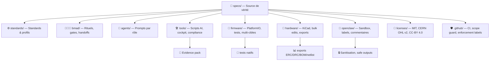

# Kill_LIFE 🚀 — AI-Native Embedded Project Template


Bienvenue dans **Kill_LIFE**, le template open source pour systèmes embarqués IA, où les specs rêvent d’électron-ironique, les agents QA se prennent pour des réplicants (voir [Le Réplicant](https://fr.wikipedia.org/wiki/Blade_Runner)), et le pipeline ne panique jamais grâce à sa serviette (voir [Don’t Panic](https://hitchhikers.fandom.com/wiki/Don%27t_Panic)), même en cas d’apocalypse. Ici, chaque commit est validé, chaque gate est passé, et chaque evidence pack est rangé comme dans [le meilleur des mondes](https://fr.wikipedia.org/wiki/Le_Meilleur_des_mondes). Si tu cherches la réponse à la question ultime du développement embarqué IA, c’est probablement [42](https://fr.wikipedia.org/wiki/42_(nombre))… ou un bulk edit réussi ([Bulk Edit Party FX](https://www.youtube.com/watch?v=dQw4w9WgXcQ)).

> "La réponse à la question ultime de la vie, de l’univers et du développement embarqué IA : 42 specs, 7 agents, et un pipeline qui ne panique jamais."  
> — H2G2, version Kill_LIFE

> "Kill_LIFE, c’est l’open source embarqué version IA, mais aussi un clin d’œil à la fin du monde : ici, on ne craint ni l’apocalypse, ni les bugs, ni les injections de prompt. On rêve, on code, on documente, et on fait des bulk edits comme des réplicants en quête de compliance."  
> — Le README qui ne panique jamais

le meilleur des fin de monde ?


## 🚦 Quickstart

1. Clone le repo et installe les dépendances (voir INSTALL.md).
2. Initialise un environnement Python et PlatformIO.
3. Lance les scripts de validation (Makefile, tools/).
4. Ouvre une issue, ajoute un label `ai:*` pour déclencher l’automatisation.
5. Suis le flux Issue → PR, gates, evidence pack.

Pour plus de détails, consulte [docs/](docs/index.md), [RUNBOOK.md](RUNBOOK.md), [INSTALL.md](INSTALL.md).

## 🧩 Architecture & Principes

- **Spec-first** : Chaque évolution commence par une définition claire dans `specs/` ([Spec Generator FX](https://www.youtube.com/watch?v=9bZkp7q19f0)).
- **Standards injection** : Standards versionnés + profils injectés (Agent OS).
- **BMAD / BMAD-METHOD** : Agents par rôles (PM, Architect, Firmware, QA, Doc, HW), rituels, gates, handoffs ([agents/](agents/), [bmad/](bmad/)).
- **Tool-first** : Scripts reproductibles ([tools/](tools/)), evidence pack dans `artifacts/`.
- **Pipeline hardware/firmware** : Bulk edits, exports, tests, compliance, snapshots ([Les particules font-elles l’amour ?](https://lelectron-fou.bandcamp.com/album/les-particules-font-elles-l-amour-la-physique)).
- **Sécurité & conformité** : Sanitisation, safe outputs, sandboxing, scope guard, anti-prompt injection ([OpenClaw Sandbox](https://www.openclaw.io/)).

> "Les particules rêvent-elles d’électron-ironique ? Peut-être font-elles l’amour dans le dossier hardware, pendant que les agents QA se demandent si la conformité est un rêve ou une réalité."  
> — Inspiré par Le Réplicant de K. Dick & Les particules font-elles l’amour

> "Bienvenue dans le meilleur des mondes : ici, chaque commit est validé, chaque gate est passé, et chaque agent sait que la vraie liberté, c’est d’avoir un evidence pack bien rangé."  
> — Aldous Huxley, version CI/CD

---

## ✨ Fonctionnalités principales

- **Développement guidé par la spec** : User stories, contraintes, archi, plans, backlog.
- **Automatisation** : Issue → PR avec tests unitaires, sanitisation, evidence pack.
- **Multi-cibles** : ESP32, STM32, Linux, tests natifs.
- **Pipeline matériel** : KiCad, exports SVG/ERC/DRC/BOM/netlist, bulk edits.
- **Compliance** : Profils injectés, validation automatique.
- **OpenClaw** : Labels & commentaires sanitisés, jamais de commit/push, sandbox obligatoire.

---

## 🖥️ Arborescence graphique



---

## 🗺️ Schéma de flux

Voir [KIKIFOU/diagramme.md](KIKIFOU/diagramme.md) pour un diagramme complet du pipeline.

## 🧾 Table de mapping

Voir [KIKIFOU/mapping.md](KIKIFOU/mapping.md) pour une synthèse des dossiers et dépendances.


## 🚀 Installation & initialisation

### Prérequis

---

## 🤝 Contribuer

1. Fork le repo, clone-le localement.
2. Suis le guide onboarding (docs/, RUNBOOK.md).
3. Ajoute des exemples minimalistes pour chaque agent.
4. Propose des blocks hardware, profils compliance, tests.
5. Documente tes scripts et contributions.
6. Ouvre une PR, passe les gates, fournis un evidence pack.

Pour toute question, consulte la FAQ (docs/FAQ.md) ou ouvre une issue.

```bash
## 🔗 Liens utiles

- [Documentation complète](docs/index.md)
- [RUNBOOK opérateur](RUNBOOK.md)
- [Guide d’installation](INSTALL.md)
- [Synthèse technique et recommandations](KIKIFOU/synthese.md)

cd Kill_LIFE
```

### 2. Initialiser la spec
```bash
python tools/ai/specify_init.py --name <feature-or-epic>
```

### 3. Choisir le profil compliance
```bash
python tools/compliance/use_profile.py --profile prototype
```

### 4. Installer les dépendances firmware
```bash
cd firmware
python -m pip install -U platformio
```

### 5. Build & tests firmware
```bash
pio run -e esp32s3_arduino
pio test -e native
```

### 6. Pipeline hardware (KiCad)
```bash
bash tools/hw/hw_gate.sh hardware/kicad
python tools/watch/watch_hw.py
```

### 7. Générer la documentation
```bash
python -m pip install -U mkdocs
mkdocs build --strict
```

### 8. Docker (optionnel)
Si un fichier docker-compose.yml est présent :
```bash
sudo docker-compose up -d
```

---

## 🛠️ Fonctions clés

- **specs/** : Source de vérité, plans, backlog.
- **standards/** : Standards globaux, profils injectés.
- **bmad/** : Gates, rituels, templates.
- **agents/** : Prompts pour chaque rôle.
- **tools/** : Scripts AI, cockpit, compliance, watch.
- **firmware/** : PlatformIO, tests Unity, multi-cibles.
- **hardware/** : KiCad, bulk edits, exports.
- **openclaw/** : Labels, commentaires, sandbox.
- **.github/** : Workflows CI, scope guard, enforcement labels.
- **licenses/** : MIT, CERN OHL v2, CC-BY 4.0.

---


## 🦾 Workflows agents

- **Issue → PR** : Label `ai:*` obligatoire, sanitisation, diff minimal, tests auto. (Ne panique jamais et garde ta serviette !)
- **Scope guard** : Label détermine les dossiers modifiables.
- **Evidence pack** : Tous les rapports dans `artifacts/<domain>/<timestamp>/` (rangé comme dans une dystopie bien organisée).
- **Compliance** : Validation stricte via scripts.

### Exemples de workflows

#### 1. Spécification → Implémentation Firmware
1. Rédige la spec dans `specs/` (mode Gangnam Style https://www.youtube.com/watch?v=9bZkp7q19f0 !).
2. Ouvre une issue avec le label `ai:spec`.
3. L’agent PM/Architect génère le plan et l’architecture.
4. L’agent Firmware implémente le code dans `firmware/`.
5. L’agent QA ajoute des tests Unity.
6. Evidence pack généré automatiquement.

#### 2. Bulk Edit Hardware KiCad
1. Ouvre une issue avec le label `ai:hw`.
2. L’agent HW effectue un bulk edit via `tools/hw/schops` (fête le bulk edit avec [Bulk Edit Party FX](https://www.youtube.com/watch?v=dQw4w9WgXcQ)).
3. Exporte ERC/DRC, BOM, netlist.
4. Snapshot avant/après dans `artifacts/hw/<timestamp>/`.

#### 3. Documentation & Compliance
1. Ouvre une issue avec le label `ai:docs` ou `ai:qa`.
2. L’agent Doc met à jour `docs/` et le README.
3. L’agent Compliance valide le profil et génère le rapport.

---

## 📝 Installation & Sécurité

- Un guide d’installation détaillé ([INSTALL.md](INSTALL.md)) explique comment installer le projet, configurer les environnements, sécuriser OpenClaw, lancer les tests hardware, générer la documentation, et utiliser Docker.
- Un script d’installation unique ([install_kill_life.sh](install_kill_life.sh)) automatise tout : dépendances, spec, profil compliance, environnement Python, modules AI/hardware/firmware, tests, doc, Docker, et vérification de la sécurité OpenClaw.
- Sécurité OpenClaw : sandbox obligatoire, jamais d’accès aux secrets ou au code source.
- Tests hardware reproductibles via scripts documentés.

---

## 🧬 Architecture agentique avancée

- Structure multi-agent (BMAD) : rôles PM, Architect, Firmware, QA, Doc, HW, orchestrés par rituels, gates et handoffs.
- Développement spec-first : chaque évolution commence par une spécification, standards versionnés et profils injectés.
- Automatisation & sécurité : workflows CI, sanitisation, safe outputs, scope guard, anti-prompt injection, OpenClaw sandbox.
- Multi-cibles & pipelines reproductibles : ESP32, STM32, Linux, tests natifs, bulk edits hardware KiCad, exports automatisés.
- Documentation claire & onboarding : README détaillé, FAQ, workflows, arborescence graphique, guides d’installation, politique de contribution.

---

## 🚀 Conventions, contribution & cross-platform

- Toutes les conventions, instructions d’installation, sécurité, multi-agents, compliance, workflows, et support cross-platform (Docker inclus) sont synthétisées.
- Architecture, étapes d’initialisation, fonctions clés, sécurité OpenClaw, contribution.

---

## ❓ FAQ

**Q : Comment démarrer rapidement ?**
A : Suis la section "Installation & initialisation" ou le guide INSTALL.md.

**Q : Comment installer tout automatiquement ?**
A : Utilise le script `install_kill_life.sh`.

**Q : Comment sécuriser OpenClaw ?**
A : Sandbox obligatoire, jamais d’accès aux secrets ou au code source.

**Q : Comment lancer les tests hardware ?**
A : Suis les scripts documentés dans le README et INSTALL.md.

**Q : Comment contribuer ?**
A : Ajoute des profils, améliore les scripts, enrichis les standards, et suis la politique anti-injection.

---

## 🦾 Workflows détaillés

### 1. Spécification → Implémentation Firmware
1. Rédige la spec dans `specs/`.
2. Ouvre une issue avec le label `ai:spec`.
3. L’agent PM/Architect génère le plan et l’architecture.
4. L’agent Firmware implémente le code dans `firmware/`.
5. L’agent QA ajoute des tests Unity.
6. Evidence pack généré automatiquement.

### 2. Bulk Edit Hardware KiCad
1. Ouvre une issue avec le label `ai:hw`.
2. L’agent HW effectue un bulk edit via `tools/hw/schops`.
3. Exporte ERC/DRC, BOM, netlist.
4. Snapshot avant/après dans `artifacts/hw/<timestamp>/`.

### 3. Documentation & Compliance
1. Ouvre une issue avec le label `ai:docs` ou `ai:qa`.
2. L’agent Doc met à jour `docs/` et le README.
3. L’agent Compliance valide le profil et génère le rapport.

---

## 🥚 Easter Eggs Kill_LIFE

- **Ne panique jamais** :  [Playlist apocalypse](https://www.youtube.com/playlist?list=PLApocalypse42)
- **Bulk Edit Party** : [Fête technique](https://www.youtube.com/watch?v=dQw4w9WgXcQ) — robots IA dansant sur du code PCB.
- **Citation dystopique** : _« J’ai vu des evidence packs briller dans l’obscurité près des gates S1… »_
- **Badge 42** :  — clique pour une blague mathématique.
- **Mini-jeu Gate Runner** : [Gate Runner](https://gate-runner.example.com) — passe les gates, évite les bugs.
- **Le meilleur des mondes** : Générateur de phrases dystopiques pour motiver les contributeurs.
- **OpenClaw interactif** :  — change de couleur selon le statut CI/CD.
- **Spec Generator FX** : [Spec aléatoire](https://spec-generator.example.com) — science-fiction automatisée.
- **Sanitizer Challenge** : Trouve la phrase supprimée par le sanitizer, score affiché.
- **Agent QA Replicant** : _« Un evidence pack peut-il rêver de conformité ? »_

---

