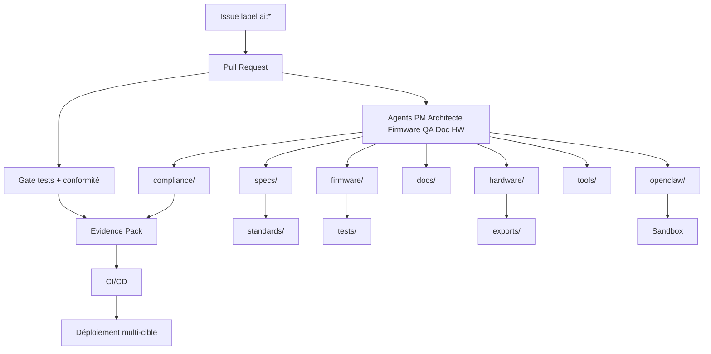

# Kill_LIFE 🚀 — Modèle de Projet Embarqué IA-Natif

<!-- Badges -->
[](https://github.com/electron-rare/Kill_LIFE/actions)
[](licenses/MIT.txt)
[](docs/COMPLIANCE.md)

---

Bienvenue dans **Kill_LIFE**, le modèle open source pour systèmes embarqués IA où chaque étape est traçable, chaque evidence pack est rangé, et chaque agent suit un workflow sécurisé. Ce projet vise la reproductibilité, la conformité et l'automatisation pour l'embarqué IA multi-cibles.

## 🧩 Présentation

Kill_LIFE est un modèle agentique pour systèmes embarqués IA, orienté spec-first, sécurité et traçabilité. Il s'appuie sur des agents spécialisés, des workflows automatisés et une arborescence claire.

> « Bienvenue dans le meilleur des mondes : ici, chaque commit est validé, chaque gate est passé, et chaque agent sait que la vraie liberté, c'est d'avoir un evidence pack bien rangé. »
> — Aldous Huxley, version CI/CD

<div align="center">
  
</div>
<div align="center" style="margin: 8px 0;">
  
  <a href="https://www.youtube.com/playlist?list=PLApocalypse42" target="_blank">Playlist apocalypse</a>
</div>
<div align="center" style="margin: 8px 0;">
  
</div>

---

## 🧩 Architecture & Principes

- **Spec-first** : Chaque évolution commence par une définition claire dans `specs/` ([Spec Generator FX](https://www.youtube.com/watch?v=9bZkp7q19f0)).
  > _Schaeffer : Les agents du pipeline écoutent le bruit des specs comme une symphonie de sons trouvés._
- **Injection de standards** : Standards versionnés et profils injectés (Agent OS).
- **BMAD / BMAD-METHOD** : Agents par rôles (PM, Architecte, Firmware, QA, Doc, HW), rituels, gates, handoffs ([agents/](agents/), [bmad/](bmad/)).
<div align="center" style="margin: 8px 0;">
  
</div>

- **Tool-first** : Scripts reproductibles ([tools/](tools/)), evidence pack dans `artifacts/`.
- **Pipeline hardware/firmware** : Bulk edits, exports, tests, conformité, snapshots.
- **CAD headless** : KiCad 10 first + FreeCAD + OpenSCAD via MCP, conteneurisés.
- **Sécurité & conformité** : Sanitisation, sorties sûres, sandboxing, scope guard, anti-prompt injection ([OpenClaw Sandbox](https://www.openclaw.io/)).
- **Runtime agentique** : `ZeroClaw` en local on-demand, `LangGraph` et `AutoGen` comme patterns d'intégration optionnels.

> « La réponse à la question ultime de la vie, de l'univers et du développement embarqué IA : 42 specs, 7 agents, et un pipeline qui ne panique jamais. »
> — Le README qui ne panique jamais

([Les particules font-elles l'amour ?](https://lelectron-fou.bandcamp.com/album/les-particules-font-elles-l-amour-la-physique))

---

## ✨ Fonctionnalités principales

- **Développement guidé par la spec** : User stories, contraintes, architecture, plans, backlog.
- **Automatisation** : Issue → PR avec tests unitaires, sanitisation, evidence pack.
- **Multi-cibles** : ESP32, STM32, Linux, tests natifs.
- **Pipeline matériel** : KiCad, exports SVG/ERC/DRC/BOM/netlist, bulk edits.
<div align="center" style="margin: 8px 0;">
  
</div>

- **Conformité** : Profils injectés, validation automatique.
- **OpenClaw** : Labels & commentaires sanitisés, jamais de commit/push, sandbox obligatoire.
- **Workflow catalog** : Workflows JSON éditables par [`crazy_life`](https://github.com/electron-rare/crazy_life), validés contre un schéma JSON.

---

## 🖥️ Schéma agentique (Mermaid)

<div align="center">


```mermaid
flowchart TD
  Issue[Issue label ai:*] --> PR[Pull Request]
  PR --> Gate[Gate tests + conformité]
  Gate --> Evidence[Evidence Pack]
  Evidence --> CI[CI/CD]
  CI --> Deploy[Déploiement multi-cible]
  PR --> Agents[Agents PM Architecte Firmware QA Doc HW]
  Agents --> Specs[specs/]
  Agents --> Firmware[firmware/]
  Agents --> Hardware[hardware/]
  Agents --> Docs[docs/]
  Agents --> Compliance[compliance/]
  Agents --> Tools[tools/]
  Agents --> OpenClaw[openclaw/]
  Specs --> Standards[standards/]
  Firmware --> Tests[tests/]
  Hardware --> Exports[exports/]
  Compliance --> Evidence
  OpenClaw --> Sandbox[Sandbox]
```

</div>

> _Parmegiani : Un bulk edit, c'est une métamorphose électronique, un peu comme un pack d'évidence qui se transforme en nuage de sons._

---

## 🗺️ Structure du projet

```text
Kill_LIFE/
├── firmware/                    # Code PlatformIO (ESP32/STM32)
├── hardware/                    # Assets hardware et blocs KiCad
├── specs/                       # Specs et tâches canoniques
├── workflows/                   # Workflows JSON canoniques + templates
├── agents/                      # 6 agents spécialisés (PM, Archi, FW, QA, Doc, HW)
├── bmad/                        # Gates, rituels, handoffs
├── compliance/                  # Profils réglementaires, evidence
├── openclaw/                    # Labels, sandbox, onboarding
├── tools/
│   ├── compliance/              # Validation compliance
│   ├── hw/                      # Stack CAD, MCP, exports, smoke
│   ├── ai/                      # ZeroClaw launchers, intégrations
│   ├── mistral/                 # Safe patch et outils Mistral
│   └── ci/                      # Audit CI
├── deploy/cad/                  # Dockerfiles et compose CAD/runtime
├── docs/                        # Docs opérateur, bridge, plans, workflows
├── test/                        # Tests Python
├── mcp.json                     # Profil MCP par défaut
└── mkdocs.yml                   # Site docs
```

Voir [KIKIFOU/diagramme.md](KIKIFOU/diagramme.md) pour le diagramme complet et [KIKIFOU/mapping.md](KIKIFOU/mapping.md) pour la table de mapping.

---

## 🚀 Installation & démarrage rapide

### Prérequis

- OS : Linux, macOS, Windows (WSL)
- Python ≥ 3.10
- Docker + `docker compose`
- `gh` pour les opérations GitHub
- PlatformIO en natif ou via la stack conteneurisée
- KiCad (hardware)

### Installation rapide

```bash
git clone https://github.com/electron-rare/Kill_LIFE.git
cd Kill_LIFE
bash install_kill_life.sh
```

Voir [INSTALL.md](INSTALL.md) pour les détails.

### Bootstrap Python repo-local

```bash
bash tools/bootstrap_python_env.sh
```

Options utiles :
- `--venv-dir /tmp/kill-life-venv` pour vérifier le bootstrap sur un environnement vierge
- `--reinstall` pour recréer proprement le venv cible

Le chemin supporté pour le Python du repo est `./.venv/bin/python`.

### Tests Python

```bash
bash tools/test_python.sh
```

| Suite | Commande | Contenu |
|---|---|---|
| `stable` | `--suite stable` | Tests repo-locaux (specs, compliance, sanitizer, safe patch, schops) |
| `mcp` | `--suite mcp` | Tests MCP locaux (knowledge-base, github-dispatch, nexar) |
| `all` | `--suite all` | Les deux suites enchaînées |

Options : `--bootstrap` pour créer le venv avant, `--list` pour lister les commandes couvertes.

### Vérifications utiles

```bash
.venv/bin/python tools/compliance/validate.py --strict
.venv/bin/python tools/validate_specs.py --json
bash tools/hw/cad_stack.sh doctor
KILL_LIFE_PIO_MODE=container .venv/bin/python tools/auto_check_ci_cd.py
```

---

## 🔧 CAD & MCP

La stack CAD est documentée dans [`deploy/cad/README.md`](deploy/cad/README.md) et pilotée par [`tools/hw/cad_stack.sh`](tools/hw/cad_stack.sh).

- Cible actuelle : **KiCad 10 first** + FreeCAD + OpenSCAD
- Launcher MCP : [`tools/hw/run_kicad_mcp.sh`](tools/hw/run_kicad_mcp.sh)
- Configuration MCP : [`docs/MCP_SETUP.md`](docs/MCP_SETUP.md) et [`mcp.json`](mcp.json)

---

## 🤖 ZeroClaw (optionnel)

Le runtime opérateur `ZeroClaw` peut tourner nativement sur la machine opérateur. Le chemin supporté est le binaire officiel installé dans `~/.cargo/bin`.

```bash
bash tools/ai/zeroclaw_stack_up.sh    # démarrer
bash tools/ai/zeroclaw_stack_down.sh  # arrêter
```

Les runbooks et intégrations vivent dans [`tools/ai/integrations/`](tools/ai/integrations/) et restent consultables même quand le runtime n'est pas démarré.

---

## 📦 Workflow catalog

Les workflows éditables par `crazy_life` vivent dans [`workflows/`](workflows/) et sont validés contre [`workflows/workflow.schema.json`](workflows/workflow.schema.json).

- `workflows/*.json` : workflows canoniques
- `workflows/templates/*.json` : templates de création
- `.crazy-life/runs/` : état des runs locaux
- `.crazy-life/backups/workflows/` : révisions et restores

---

## 🦾 Workflows agents détaillés

### 1. Spécification → Implémentation Firmware

1. Rédige la spec dans `specs/`.
2. Ouvre une issue avec le label `ai:spec`.
3. L'agent PM/Architecte génère le plan et l'architecture.
4. L'agent Firmware implémente le code dans `firmware/`.
5. L'agent QA ajoute des tests Unity.
6. Evidence pack généré automatiquement.

### 2. Bulk Edit Hardware KiCad

1. Ouvre une issue avec le label `ai:hw`.
2. L'agent HW effectue un bulk edit via `tools/hw/schops`.
3. Exporte ERC/DRC, BOM, netlist.
4. Snapshot avant/après dans `artifacts/hw/<timestamp>/`.

### 3. Documentation & Conformité

1. Ouvre une issue avec le label `ai:docs` ou `ai:qa`.
2. L'agent Doc met à jour `docs/` et le README.
3. L'agent Conformité valide le profil et génère le rapport.

---

## 🛡️ Sécurité & conformité

- OpenClaw : sandbox obligatoire, jamais d'accès aux secrets ou au code source.
- Workflows CI : validation, sanitisation, scope guard, anti-prompt injection.
- Evidence packs : tous les rapports dans `artifacts/<domaine>/<timestamp>/`.
- Tests hardware reproductibles via scripts documentés.

---

## 🛠️ Fonctions clés

- **specs/** : Source de vérité, plans, backlog.
- **standards/** : Standards globaux, profils injectés.
- **bmad/** : Gates, rituels, templates.
- **agents/** : Prompts pour chaque rôle.
- **tools/** : Scripts IA, cockpit, conformité, watch.
- **firmware/** : PlatformIO, tests Unity, multi-cibles.
- **hardware/** : KiCad, bulk edits, exports.
- **openclaw/** : Labels, commentaires, sandbox.
<div align="center" style="margin: 8px 0;">
  
  
  
  
</div>

- **.github/** : Workflows CI, scope guard, enforcement labels.
- **licenses/** : MIT, CERN OHL v2, CC-BY 4.0.

---

## 🌐 Écosystème

| Repo | Rôle |
|---|---|
| **Kill_LIFE** | Source de vérité : workflows, runtime, evidence packs, firmware, CAD, compliance |
| [**crazy_life**](https://github.com/electron-rare/crazy_life) | Surface web/devops et workflow editor |
| [**mascarade**](https://github.com/electron-rare/mascarade) | Orchestration et bridge historique (sync uniquement) |

Articulation détaillée : [`docs/MASCARADE_BRIDGE.md`](docs/MASCARADE_BRIDGE.md)

---

## ⚙️ CI & release

- `.github/workflows/ci.yml` : gate repo-local stable (bootstrap Python + `bash tools/test_python.sh --suite stable`)
- `.github/workflows/release_signing.yml` : release versionnée (tag `v*` ou `workflow_dispatch`)
- GitHub Pages : surfaces secondaires docs/evidence (pas un gate canonique)

---

## 🤝 Contribuer

1. Forke le dépôt et clone-le localement.
2. Suis le guide d'onboarding ([docs/index.md](docs/index.md), [RUNBOOK.md](RUNBOOK.md)).
3. Ajoute des exemples minimalistes pour chaque agent (voir [agents/](agents/)).
4. Propose des blocks hardware, profils de conformité, tests.
5. Ouvre une PR, passe les gates, fournis un evidence pack.
6. Respecte les conventions de commit et de labelling (`ai:*`).

> « Les particules rêvent-elles d'électron-ironique ? Peut-être font-elles l'amour dans le dossier hardware, pendant que les agents QA se demandent si la conformité est un rêve ou une réalité. »
> — Inspiré par Le Réplicant de K. Dick & Les particules font-elles l'amour

_« J'ai vu des evidence packs briller dans l'obscurité près des gates S1… »_

---

## 🔗 Liens utiles

- [Documentation complète](docs/index.md)
- [RUNBOOK opérateur](RUNBOOK.md)
- [Guide d'installation](INSTALL.md)
- [Configuration MCP](docs/MCP_SETUP.md)
- [Synthèse technique](KIKIFOU/synthese.md)
- [Diagramme pipeline](KIKIFOU/diagramme.md)
- [Mapping dossiers](KIKIFOU/mapping.md)

---

## ❓ FAQ

**Q : Comment démarrer rapidement ?**
R : `bash install_kill_life.sh` puis `bash tools/bootstrap_python_env.sh`.

**Q : Comment lancer les tests ?**
R : `bash tools/test_python.sh --suite stable`

**Q : Comment sécuriser OpenClaw ?**
R : Sandbox obligatoire, jamais d'accès aux secrets ou au code source.

**Q : Comment contribuer ?**
R : Forke, suis le RUNBOOK, ouvre une PR avec evidence pack, respecte les labels `ai:*`.

**Q : Où trouver la documentation complète ?**
R : [docs/index.md](docs/index.md), [RUNBOOK.md](RUNBOOK.md), [INSTALL.md](INSTALL.md).

---

## 📜 Licence

MIT. Voir [`licenses/MIT.txt`](licenses/MIT.txt).
