# Kill_LIFE 🚀 — Modèle de Projet Embarqué IA-Natif

<!-- Badges -->
[](https://github.com/electron-rare/Kill_LIFE/actions)
[](licenses/MIT.txt)
[](docs/COMPLIANCE.md)

<div align="center">
  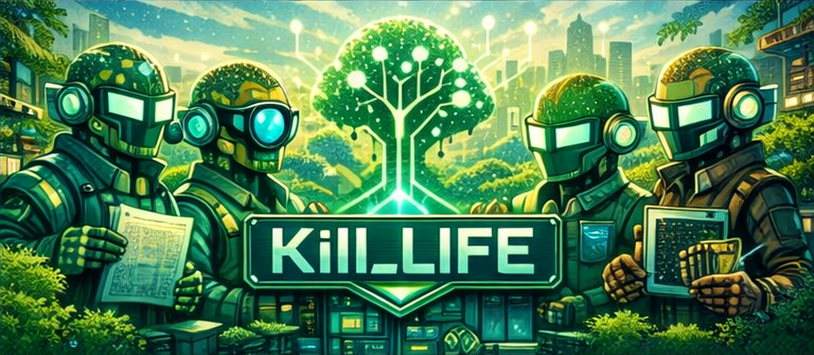
</div>

---

Bienvenue dans **Kill_LIFE**, le modèle open source pour systèmes embarqués IA où chaque étape est traçable, chaque evidence pack est rangé, et chaque agent suit un workflow sécurisé. Ce projet vise la reproductibilité, la conformité et l'automatisation pour l'embarqué IA multi-cibles.

<div align="center" style="margin: 16px 0;">
  
  <a href="https://www.youtube.com/playlist?list=PLApocalypse42" target="_blank">Playlist apocalypse</a>
</div>

## 🧩 Présentation

Kill_LIFE est un modèle agentique pour systèmes embarqués IA, orienté spec-first, sécurité et traçabilité. Il s'appuie sur des agents spécialisés, des workflows automatisés et une arborescence claire.

> « Bienvenue dans le meilleur des mondes : ici, chaque commit est validé, chaque gate est passé, et chaque agent sait que la vraie liberté, c'est d'avoir un evidence pack bien rangé. »
> — Aldous Huxley, version CI/CD

---

## 🧩 Architecture & Principes

- **Spec-first** : Chaque évolution commence par une définition claire dans `specs/` ([Spec Generator FX](https://www.youtube.com/watch?v=9bZkp7q19f0)).
  > _Schaeffer : Les agents du pipeline écoutent le bruit des specs comme une symphonie de sons trouvés._
- **Injection de standards** : Standards versionnés et profils injectés (Agent OS).
- **BMAD / BMAD-METHOD** : Agents par rôles (PM, Architecte, Firmware, QA, Doc, HW), rituels, gates, handoffs ([agents/](agents/), [bmad/](bmad/)).
- **Tool-first** : Scripts reproductibles ([tools/](tools/)), evidence pack dans `artifacts/`.
- **Pipeline hardware/firmware** : Bulk edits, exports, tests, conformité, snapshots.
- **CAD headless** : KiCad 10 first + FreeCAD + OpenSCAD via MCP, conteneurisés.
- **Sécurité & conformité** : Sanitisation, sorties sûres, sandboxing, scope guard, anti-prompt injection ([OpenClaw Sandbox](https://www.openclaw.io/)).
- **Runtime agentique** : `ZeroClaw` en local on-demand, `LangGraph` et `AutoGen` comme patterns d'intégration optionnels.

<div align="center" style="margin: 16px 0;">
  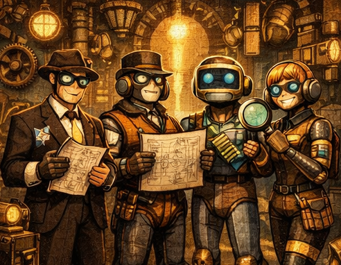
</div>

> « La réponse à la question ultime de la vie, de l'univers et du développement embarqué IA : 42 specs, 7 agents, et un pipeline qui ne panique jamais. »
> — Le README qui ne panique jamais
> 

([Les particules font-elles l'amour ?](https://lelectron-fou.bandcamp.com/album/les-particules-font-elles-l-amour-la-physique))

---

## ✨ Fonctionnalités principales

- **Développement guidé par la spec** : User stories, contraintes, architecture, plans, backlog.
- **Automatisation** : Issue → PR avec tests unitaires, sanitisation, evidence pack.
- **Multi-cibles** : ESP32, STM32, Linux, tests natifs.
- **Pipeline matériel** : KiCad, exports SVG/ERC/DRC/BOM/netlist, bulk edits.
- **Conformité** : Profils injectés, validation automatique.
- **OpenClaw** : Labels & commentaires sanitisés, jamais de commit/push, sandbox obligatoire.
- **Workflow catalog** : Workflows JSON éditables par `crazy_life`, validés contre un schéma JSON.

<div align="center" style="margin: 16px 0;">
  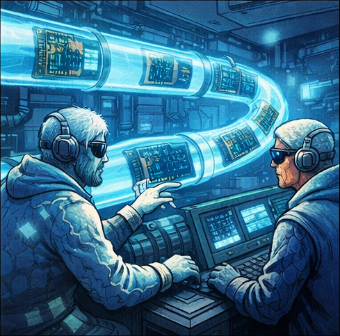
</div>

---

## 🖥️ Schéma agentique (Mermaid)

<div align="center">

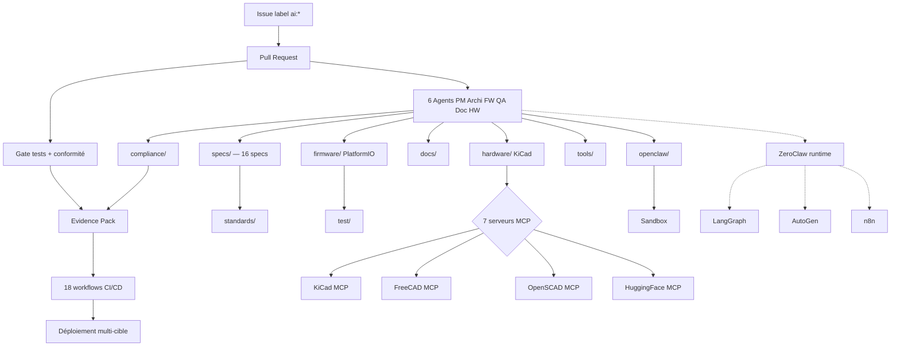
```mermaid
flowchart TD
  Issue[Issue label ai:*] --> PR[Pull Request]
  PR --> Gate[Gate tests + conformité]
  Gate --> Evidence[Evidence Pack]
  Evidence --> CI[18 workflows CI/CD]
  CI --> Deploy[Déploiement multi-cible]
  PR --> Agents[6 Agents PM Archi FW QA Doc HW]
  Agents --> Specs[specs/ — 16 specs]
  Agents --> Firmware[firmware/ PlatformIO]
  Agents --> Hardware[hardware/ KiCad]
  Agents --> Docs[docs/]
  Agents --> Compliance[compliance/]
  Agents --> Tools[tools/]
  Agents --> OpenClaw[openclaw/]
  Specs --> Standards[standards/]
  Firmware --> Tests[test/]
  Hardware --> MCP{7 serveurs MCP}
  MCP --> KiCad[KiCad MCP]
  MCP --> FreeCAD[FreeCAD MCP]
  MCP --> OpenSCAD[OpenSCAD MCP]
  MCP --> HF[HuggingFace MCP]
  Compliance --> Evidence
  OpenClaw --> Sandbox[Sandbox]
  Agents -.-> ZeroClaw[ZeroClaw runtime]
  ZeroClaw -.-> LangGraph[LangGraph]
  ZeroClaw -.-> AutoGen[AutoGen]
  ZeroClaw -.-> N8N[n8n]
```

</div>

> _Parmegiani : Un bulk edit, c'est une métamorphose électronique, un peu comme un pack d'évidence qui se transforme en nuage de sons._

---

## 🗺️ Structure du projet

<div align="center" style="margin: 16px 0;">
  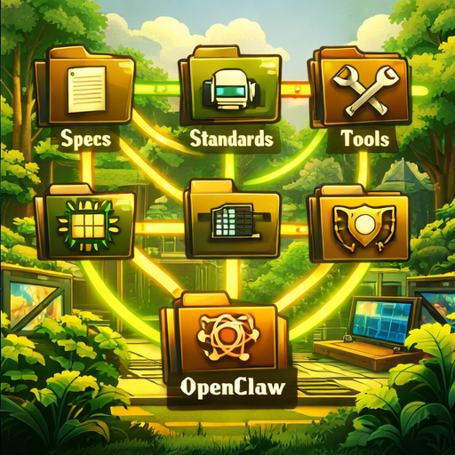
</div>

```text
Kill_LIFE/
├── firmware/                    # Code PlatformIO (ESP32/STM32)
├── hardware/                    # Assets hardware et blocs KiCad
├── specs/                       # 16 specs et tâches canoniques (00_intake → 04_tasks + MCP/ZeroClaw/CAD)
├── workflows/                   # Workflows JSON canoniques + templates + schéma
├── agents/                      # 6 agents spécialisés (PM, Archi, FW, QA, Doc, HW)
├── bmad/                        # Gates (S0, S1), rituels (kickoff), templates (handoff, status)
├── compliance/                  # Profils réglementaires, standards catalog, evidence
├── standards/                   # Standards globaux versionnés
├── openclaw/                    # Labels, sandbox, onboarding
├── tools/
│   ├── compliance/              # Validation compliance
│   ├── hw/                      # Stack CAD, MCP, exports, smoke, schops
│   ├── ai/                      # ZeroClaw launchers, intégrations (langgraph, autogen, n8n)
│   ├── mistral/                 # Safe patch et outils Mistral
│   └── ci/                      # Audit CI
├── deploy/cad/                  # Dockerfiles et compose CAD/runtime
├── docs/                        # Docs opérateur, bridge, plans, workflows
├── test/                        # Tests Python (stable + MCP)
├── .github/
│   ├── agents/                  # 6 définitions agents GitHub
│   ├── prompts/                 # 37 prompts (plan_wizard_*, start_*, Eureka_*)
│   └── workflows/               # 18 workflows CI/CD
├── KIKIFOU/                     # Diagnostic, diagramme, mapping, recommandations
├── mcp.json                     # 7 serveurs MCP configurés
└── mkdocs.yml                   # Site docs
```

### Chaîne de specs

Le workflow spec-first suit une séquence canonique dans `specs/` :

```text
00_intake.md → 01_spec.md → 02_arch.md → 03_plan.md → 04_tasks.md
```

Specs spécialisées : `kicad_mcp_scope_spec.md`, `knowledge_base_mcp_spec.md`, `github_mcp_conversion_spec.md`, `cad_modeling_tasks.md`, `zeroclaw_dual_hw_orchestration_spec.md`, `mcp_agentics_target_backlog.md`.

Contraintes : [`specs/constraints.yaml`](specs/constraints.yaml) — source de vérité pour cibles, toolchain, sécurité IA et compliance.

### Agents & prompts

6 agents spécialisés dans [`agents/`](agents/) et [`.github/agents/`](.github/agents/) :

| Agent | Rôle |
|---|---|
| `pm_agent` | Gestion de projet, planning, backlog |
| `architect_agent` | Architecture système, ADR |
| `firmware_agent` | Code embarqué PlatformIO |
| `hw_schematic_agent` | Schémas KiCad, bulk edits |
| `qa_agent` | Tests, qualité, evidence packs |
| `doc_agent` | Documentation, onboarding |

37 prompts dans [`.github/prompts/`](.github/prompts/) couvrent : brainstorming, spécification, coordination agents, CI/CD, compliance, troubleshooting, release, bulk edit HW, et les prompts de démarrage (`start_*`) et d'idéation (`Eureka_*`).

### BMAD (gates & rituels)

Le framework BMAD dans [`bmad/`](bmad/) structure la progression :

- **Gates** : `gate_s0.md` (pré-spec), `gate_s1.md` (pré-implémentation)
- **Rituels** : `kickoff.md`
- **Templates** : `handoff.md`, `status_update.md`

Voir [KIKIFOU/diagramme.md](KIKIFOU/diagramme.md) pour le diagramme complet et [KIKIFOU/mapping.md](KIKIFOU/mapping.md) pour la table de mapping.

---

## 🚀 Installation & démarrage rapide

### Prérequis

- OS : Linux, macOS, Windows (WSL)
- Python ≥ 3.10
- Docker + `docker compose`
- `gh` pour les opérations GitHub
- PlatformIO en natif ou via la stack conteneurisée
- KiCad (hardware)

### Installation rapide

```bash
git clone https://github.com/electron-rare/Kill_LIFE.git
cd Kill_LIFE
bash install_kill_life.sh
```

Voir [INSTALL.md](INSTALL.md) pour les détails.

### Bootstrap Python repo-local

```bash
bash tools/bootstrap_python_env.sh
```

Options utiles :
- `--venv-dir /tmp/kill-life-venv` pour vérifier le bootstrap sur un environnement vierge
- `--reinstall` pour recréer proprement le venv cible

Le chemin supporté pour le Python du repo est `./.venv/bin/python`.

### Tests Python

```bash
bash tools/test_python.sh
```

| Suite | Commande | Contenu |
|---|---|---|
| `stable` | `--suite stable` | Tests repo-locaux (specs, compliance, sanitizer, safe patch, schops) |
| `mcp` | `--suite mcp` | Tests MCP locaux (knowledge-base, github-dispatch, nexar) |
| `all` | `--suite all` | Les deux suites enchaînées |

Options : `--bootstrap` pour créer le venv avant, `--list` pour lister les commandes couvertes.

### Vérifications utiles

```bash
.venv/bin/python tools/compliance/validate.py --strict
.venv/bin/python tools/validate_specs.py --json
bash tools/hw/cad_stack.sh doctor
KILL_LIFE_PIO_MODE=container .venv/bin/python tools/auto_check_ci_cd.py
```

---

## 🔧 Serveurs MCP

Le projet expose **7 serveurs MCP** (Model Context Protocol) configurés dans [`mcp.json`](mcp.json) :

| Serveur | Type | Rôle |
|---|---|---|
| `kicad` | local | Gestion de projet, schémas, PCB, bibliothèques, validation, exports, sourcing |
| `validate-specs` | local | Validation specs, compliance, RFC2119 (CLI + MCP stdio) |
| `knowledge-base` | local | Recherche, lecture, ajout de memos (docmost) |
| `github-dispatch` | local | Dispatch de workflows GitHub allowlistés |
| `freecad` | local | Modélisation 3D, rendu, export, validation |
| `openscad` | local | Modélisation paramétrique, export, validation |
| `huggingface` | distant | Accès au Hub HuggingFace (datasets, modèles, papers) |

La stack CAD est documentée dans [`deploy/cad/README.md`](deploy/cad/README.md) et pilotée par [`tools/hw/cad_stack.sh`](tools/hw/cad_stack.sh).

- Cible actuelle : **KiCad 10 first** + FreeCAD + OpenSCAD
- Launcher MCP : [`tools/hw/run_kicad_mcp.sh`](tools/hw/run_kicad_mcp.sh)
- Configuration MCP : [`docs/MCP_SETUP.md`](docs/MCP_SETUP.md) et [`mcp.json`](mcp.json)

---

## 🤖 ZeroClaw & intégrations agentiques (optionnel)

Le runtime opérateur `ZeroClaw` peut tourner nativement sur la machine opérateur. Le launcher supporté essaie d'abord le binaire repo-local `zeroclaw/target/release/zeroclaw`, puis retombe sur `command -v zeroclaw` (typiquement `~/.cargo/bin/zeroclaw`).

```bash
bash tools/ai/zeroclaw_stack_up.sh    # démarrer
bash tools/ai/zeroclaw_stack_down.sh  # arrêter
```

Les runbooks et intégrations vivent dans [`tools/ai/integrations/`](tools/ai/integrations/) :

| Intégration | Rôle |
|---|---|
| `zeroclaw/` | Runtime opérateur local, boucles agentiques |
| `langgraph/` | Pattern d'intégration LangGraph |
| `autogen/` | Pattern d'intégration AutoGen |
| `n8n/` | Orchestration no-code / workflows externes |

Ces intégrations restent consultables même quand le runtime n'est pas démarré.

---

## 📦 Workflow catalog

Les workflows éditables par `crazy_life` vivent dans [`workflows/`](workflows/) et sont validés contre [`workflows/workflow.schema.json`](workflows/workflow.schema.json).

| Workflow | Fichier |
|---|---|
| Spec-first | `workflows/spec-first.json` |
| Embedded CI local | `workflows/embedded-ci-local.json` |
| Compliance release | `workflows/compliance-release.json` |

- `workflows/templates/*.json` : templates de création
- `.crazy-life/runs/` : état des runs locaux généré par `crazy_life` si l'éditeur est utilisé
- `.crazy-life/backups/workflows/` : révisions/restores générés localement par `crazy_life` (non versionnés)

---

## 🦾 Workflows agents détaillés

### 1. Spécification → Implémentation Firmware

1. Rédige la spec dans `specs/`.
2. Ouvre une issue avec le label `ai:spec`.
3. L'agent PM/Architecte génère le plan et l'architecture.
4. L'agent Firmware implémente le code dans `firmware/`.
5. L'agent QA ajoute des tests Unity.
6. Evidence pack généré automatiquement.

<div align="center" style="margin: 16px 0;">
  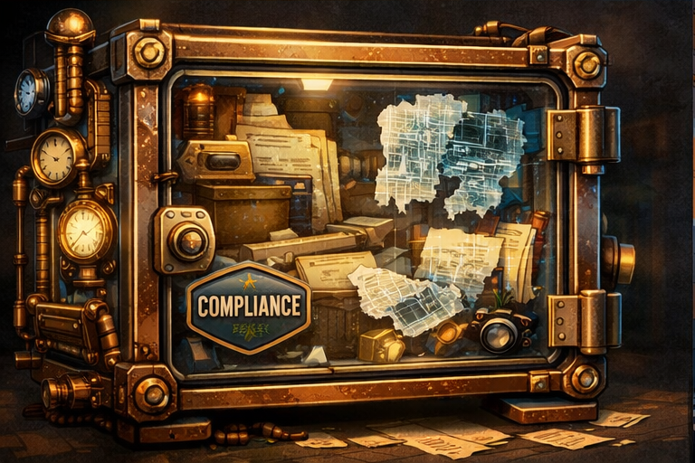
</div>

### 2. Bulk Edit Hardware KiCad

1. Ouvre une issue `type:systems` + `scope:hardware`, puis ajoute `ai:plan` (ou `ai:impl` si le batch est déjà cadré).
2. L'agent HW effectue un bulk edit via `tools/hw/schops`.
3. Exporte ERC/DRC, BOM, netlist.
4. Snapshot avant/après dans `artifacts/hw/<timestamp>/`.

<div align="center" style="margin: 16px 0;">
  
</div>

### 3. Documentation & Conformité

1. Ouvre une issue avec le label `ai:docs` ou `ai:qa`.
2. L'agent Doc met à jour `docs/` et le README.
3. L'agent QA valide le profil de conformité et génère le rapport, avec relais doc si nécessaire.

<div align="center" style="margin: 16px 0;">
  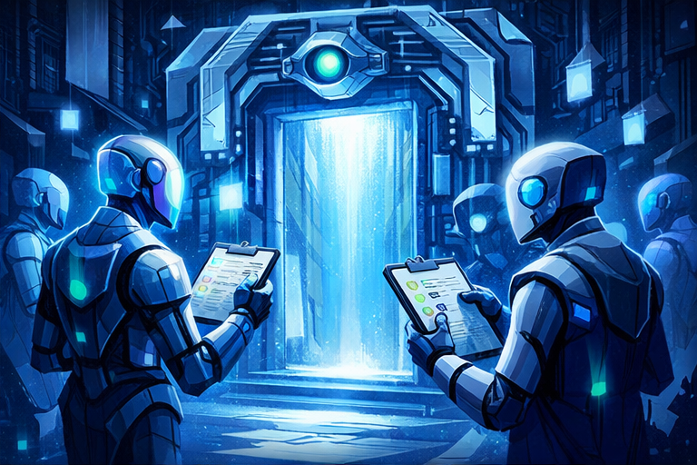
</div>

---

## 🛡️ Sécurité & conformité

- OpenClaw : sandbox obligatoire, jamais d'accès aux secrets ou au code source.
- Workflows CI : validation, sanitisation, scope guard, anti-prompt injection.
- Evidence packs : tous les rapports dans `artifacts/<domaine>/<timestamp>/`.
- Tests hardware reproductibles via scripts documentés.

<div align="center" style="margin: 16px 0;">
  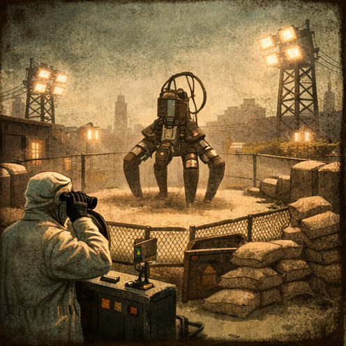
  <br/><br/>
  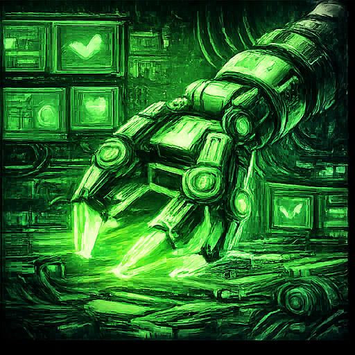
  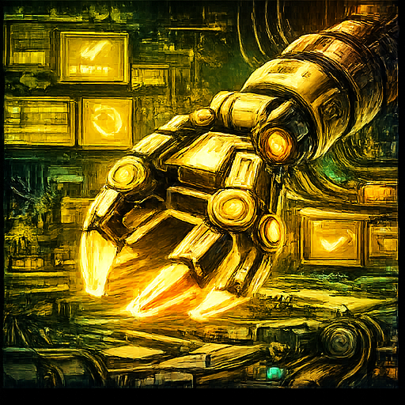
  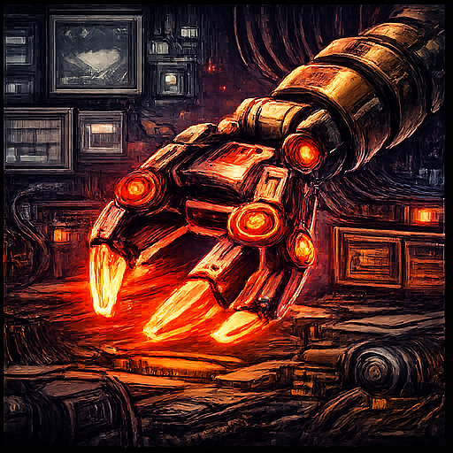
  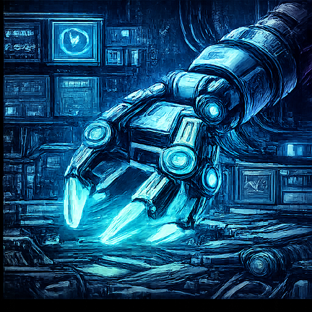
  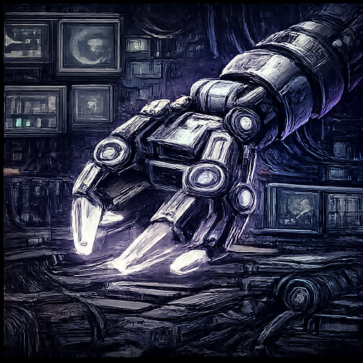
</div>

### Chaîne de compliance

```text
compliance/
├── active_profile.yaml          # Profil actif (ex: "prototype")
├── profiles/
│   ├── prototype.yaml           # Standards requis + evidence pour prototype
│   └── iot_wifi_eu.yaml         # Profil IoT WiFi marché EU
├── standards_catalog.yaml       # Catalogue de standards versionnés
├── plan.yaml                    # Produit, marché, radio, alimentation
└── evidence/
    ├── risk_assessment.md       # Évaluation des risques
    ├── security_architecture.md # Architecture de sécurité
    ├── test_plan_radio_emc.md   # Plan de test radio/EMC
    └── supply_chain_declarations.md
```

Contraintes projet (depuis [`specs/constraints.yaml`](specs/constraints.yaml)) :
- **Orientation** : ESP-first (cibles : esp32s3, esp32, esp32dev)
- **Firmware** : PlatformIO + Unity (tests requis)
- **Hardware** : KiCad ≥ 9 minimum, chemin préféré KiCad 10-first, bulk edits autorisés, ERC green requis
- **IA** : un label `ai:*` adapte a l'etape est requis, secrets interdits, pas d'hypothese reseau
- **Compliance** : profil actif injecté, validé par `tools/compliance/validate.py`

---

## 🌐 Écosystème

| Repo | Rôle | Accès |
|---|---|---|
| **Kill_LIFE** | Source de vérité : workflows, runtime, evidence packs, firmware, CAD, compliance | 🌍 public |
| **crazy_life** | Surface web/devops et workflow editor | 🔒 privé |
| **mascarade** | Orchestration et bridge historique (sync uniquement) | 🔒 privé |

### Datasets HuggingFace

8 datasets de fine-tuning publiés sur [HuggingFace](https://huggingface.co/clemsail) (JSON, 1K-10K entrées chacun) :

`mascarade-stm32` · `mascarade-spice` · `mascarade-iot` · `mascarade-power` · `mascarade-dsp` · `mascarade-emc` · `mascarade-kicad` · `mascarade-embedded`

Articulation détaillée : [`docs/MASCARADE_BRIDGE.md`](docs/MASCARADE_BRIDGE.md)

---

## ⚙️ CI & release

**18 workflows GitHub Actions** couvrent l'ensemble du cycle :

| Catégorie | Workflows |
|---|---|
| **Gate principal** | `ci.yml` (bootstrap Python + suite stable) |
| **Release** | `release_signing.yml` (tag `v*` ou `workflow_dispatch`) |
| **Qualité** | `badges.yml`, `evidence_pack.yml`, `repo_state.yml`, `repo_state_header_gate.yml` |
| **Sécurité** | `secret_scan.yml`, `sbom_validation.yml`, `supply_chain.yml`, `incident_response.yml` |
| **Tests avancés** | `api_contract.yml`, `model_validation.yml`, `performance_hil.yml` |
| **Infra** | `dependency_update.yml`, `community_accessibility.yml` |
| **Pages** | `jekyll-gh-pages.yml`, `static.yml` (surfaces secondaires docs/evidence) |
| **Orchestration** | `zeroclaw_dual_orchestrator.yml` |

---

## 🤝 Contribuer

1. Forke le dépôt et clone-le localement.
2. Suis le guide d'onboarding ([docs/index.md](docs/index.md), [RUNBOOK.md](RUNBOOK.md)).
3. Ajoute des exemples minimalistes pour chaque agent (voir [agents/](agents/)).
4. Propose des blocks hardware, profils de conformité, tests.
5. Ouvre une PR, passe les gates, fournis un evidence pack.
6. Respecte les conventions de commit et de labelling (`ai:*`).

> « Les particules rêvent-elles d'électron-ironique ? Peut-être font-elles l'amour dans le dossier hardware, pendant que les agents QA se demandent si la conformité est un rêve ou une réalité. »
> — Inspiré par Le Réplicant de K. Dick & Les particules font-elles l'amour

_« J'ai vu des evidence packs briller dans l'obscurité près des gates S1… »_

---

## 🔗 Liens utiles

- [Documentation complète](docs/index.md)
- [RUNBOOK opérateur](RUNBOOK.md)
- [Guide d'installation](INSTALL.md)
- [Configuration MCP](docs/MCP_SETUP.md)
- [Synthèse technique](KIKIFOU/synthese.md)
- [Diagramme pipeline](KIKIFOU/diagramme.md)
- [Mapping dossiers](KIKIFOU/mapping.md)

---

## ❓ FAQ

**Q : Comment démarrer rapidement ?**
R : `bash install_kill_life.sh` puis `bash tools/bootstrap_python_env.sh`.

**Q : Comment lancer les tests ?**
R : `bash tools/test_python.sh --suite stable`

**Q : Comment sécuriser OpenClaw ?**
R : Sandbox obligatoire, jamais d'accès aux secrets ou au code source.

**Q : Comment contribuer ?**
R : Forke, suis le RUNBOOK, ouvre une PR avec evidence pack, respecte les labels `ai:*`.

**Q : Où trouver la documentation complète ?**
R : [docs/index.md](docs/index.md), [RUNBOOK.md](RUNBOOK.md), [INSTALL.md](INSTALL.md).

---

## 📜 Licence

MIT. Voir [`licenses/MIT.txt`](licenses/MIT.txt).
