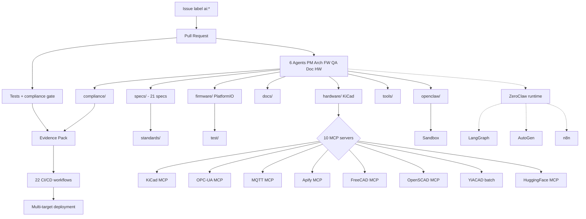

# Kill_LIFE 🚀 — AI-native Control Plane, Operator Cockpit, and Extension Pilot Batch

<!-- Badges -->
[](https://github.com/electron-rare/Kill_LIFE/actions)
[](licenses/MIT.txt)
[](docs/COMPLIANCE.md)

<div align="center">
  
</div>

---

Welcome to **Kill_LIFE**, the public control plane of the `Kill_LIFE` agentic program. The repo now concentrates the operator cockpit, the spec-first pipeline, runtime/MCP contracts, execution evidence, and the pilot batch that powers sister VS Code extensions `kill-life-studio`, `kill-life-mesh`, and `kill-life-operator`.

The 2026-03-22 reading rule is simple:

- this `README.md` describes the product/program and consolidation decisions
- `docs/index.md` is the canonical operator navigation
- `tools/cockpit/README.md` is the canonical tooling/TUI entry point
- `specs/README.md` remains the source of truth for the spec-first pipeline
- `docs/KILL_LIFE_CONSOLIDATION_AUDIT_2026-03-22.md` contains the structural audit, risks, AI matrix, and feature map

The short local governance loop is now:

`lot_chain -> intelligence_tui(memory) -> runtime_ai_gateway(status)`

The currently active intelligence integration program is tracked in:

- `docs/plans/22_plan_integration_intelligence_agentique.md`
- `docs/plans/22_todo_integration_intelligence_agentique.md`
- `docs/plans/23_plan_yiacad_git_eda_platform.md`
- `docs/plans/23_todo_yiacad_git_eda_platform.md`
- `specs/04_tasks.md`

<div align="center" style="margin: 16px 0;">
  
  <a href="https://www.youtube.com/playlist?list=PLApocalypse42" target="_blank">Apocalypse playlist</a>
</div>

## Canonical Entry Points

| Surface | Role | Recommended entry point |
| --- | --- | --- |
| Product / program | Overview, scope, strategy | `README.md` |
| Operator navigation | Docs index, runbooks, evidence, routines | `docs/index.md` |
| Cockpit / TUI | Shell commands, `cockpit-v1` contracts, runtime health | `bash tools/cockpit/yiacad_operator_index.sh --action status` |
| Intelligence governance | owners, memory, and next actions | `bash tools/cockpit/intelligence_tui.sh --action status --json` |
| Runtime/MCP/AI gateway | consolidated runtime, mesh, and Mascarade summary | `bash tools/cockpit/runtime_ai_gateway.sh --action status --refresh --json` |
| Spec-first pipeline | Intake -> spec -> arch -> plan -> tasks | `specs/README.md` |
| Consolidated audit | strengths, weaknesses, opportunities, risks, AI | `docs/KILL_LIFE_CONSOLIDATION_AUDIT_2026-03-22.md` |
| OSS watch | MCP benchmark, orchestration, VS Code agents | `docs/WEB_RESEARCH_OPEN_SOURCE_2026-03-22.md` |

## 🧩 Overview

Kill_LIFE is no longer just an embedded skeleton. The repo now serves as the public source of truth for a broader program: local operations, tri-repo governance, MCP/AI runtime, YiACAD batch, and progressive specialization of VS Code extensions.

The positioning chosen for this consolidation pass is:

- `Kill_LIFE` = control plane, cockpit, contracts, evidence, and documentation reference
- `kill-life-studio` = product, specs, decisions, scope, roadmap
- `kill-life-mesh` = multi-repo orchestration, handoffs, ownership, dependencies
- `kill-life-operator` = execution, checks, evidence, runbooks

> "Welcome to the best of all worlds: here, every commit is validated, every gate is passed, and every agent knows that true freedom is having a neatly organized evidence pack."
> — Aldous Huxley, CI/CD edition

---

## 🧩 Architecture & Principles

- **Spec-first**: Every evolution starts with a clear definition in `specs/` ([Spec Generator FX](https://www.youtube.com/watch?v=9bZkp7q19f0)).
  > _Schaeffer: Pipeline agents listen to the noise of specs like a symphony of found sounds._
- **Standards injection**: Versioned standards and injected profiles (Agent OS).
- **BMAD / BMAD-METHOD**: Role-based agents (PM, Architect, Firmware, QA, Doc, HW), rituals, gates, handoffs ([agents/](agents/), [bmad/](bmad/)).
- **Tool-first**: Reproducible scripts ([tools/](tools/)), canonical evidence pack in `docs/evidence/` and exposed as a CI artifact.
- **Hardware/firmware pipeline**: Bulk edits, exports, tests, compliance, snapshots.
- **Headless CAD**: KiCad 10 first + FreeCAD + OpenSCAD via MCP, containerized.
- **YiACAD**: AI-native KiCad + FreeCAD fusion batch (with dedicated logs and canary smoke).
- **Tri-repo steering**: `ready|degraded|blocked` contract driven by `mesh_sync_preflight.sh` + `refonte_tui.sh`.
- **Security & compliance**: Sanitization, safe outputs, sandboxing, scope guard, anti-prompt injection ([OpenClaw Sandbox](https://www.openclaw.io/)).
- **Agentic runtime**: `ZeroClaw` local on-demand, `LangGraph` and `AutoGen` as optional integration patterns.

<div align="center" style="margin: 16px 0;">
  
</div>

> "The answer to the ultimate question of life, the universe, and AI embedded development: 42 specs, 7 agents, and a pipeline that never panics."
> — The README that never panics
> 

([Do particles make love?](https://lelectron-fou.bandcamp.com/album/les-particules-font-elles-l-amour-la-physique))

---

## ✨ Main Features

- **Spec-driven development**: User stories, constraints, architecture, plans, backlog.
- **Automation**: Issue → PR with unit tests, sanitization, evidence pack.
- **Multi-target**: ESP32, STM32, Linux, native tests.
- **Hardware pipeline**: KiCad, SVG/ERC/DRC/BOM/netlist exports, bulk edits.
- **Compliance**: Injected profiles, automatic validation.
- **OpenClaw**: Sanitized labels & comments, never commit/push, mandatory sandbox.
- **Workflow catalog**: JSON workflows editable by `crazy_life`, validated against a JSON schema.
- **Mascarade LLM Router**: Fake Ollama API, Agentic RAG, Cody Gateway, 5-machine fleet (Tower/KXKM/Photon/CILS/Local).
- **10 MCP servers**: kicad, freecad, openscad, github-dispatch, knowledge-base, apify, huggingface, mascarade-llm, opcua, mqtt.
- **Factory 4.0**: Industrial agents (copilot, maintenance predictor, log analyst), OPC-UA/MQTT MCP servers.
- **EDA AI tools**: PCBDesigner, Quilter, KiCadHappy providers for automated PCB design + fabrication.
- **Project template**: `templates/kill-life-project/` scaffold for client repos (see `docs/PROJECT_TEMPLATE.md`).

<div align="center" style="margin: 16px 0;">
  
</div>

---

## 🖥️ Agentic Diagram (Mermaid)

<div align="center">


```mermaid
flowchart TD
  Issue[Issue label ai:*] --> PR[Pull Request]
  PR --> Gate[Tests + compliance gate]
  Gate --> Evidence[Evidence Pack]
  Evidence --> CI[22 CI/CD workflows]
  CI --> Deploy[Multi-target deployment]
  PR --> Agents[6 Agents PM Arch FW QA Doc HW]
  Agents --> Specs[specs/ - 21 specs]
  Agents --> Firmware[firmware/ PlatformIO]
  Agents --> Hardware[hardware/ KiCad]
  Agents --> Docs[docs/]
  Agents --> Compliance[compliance/]
  Agents --> Tools[tools/]
  Agents --> OpenClaw[openclaw/]
  Specs --> Standards[standards/]
  Firmware --> Tests[test/]
  Hardware --> MCP{10 MCP servers}
  MCP --> KiCad[KiCad MCP]
  MCP --> OPC[OPC-UA MCP]
  MCP --> MQTT[MQTT MCP]
  MCP --> Apify[Apify MCP]
  MCP --> FreeCAD[FreeCAD MCP]
  MCP --> OpenSCAD[OpenSCAD MCP]
  MCP --> YiACAD[YiACAD batch]
  MCP --> HF[HuggingFace MCP]
  Compliance --> Evidence
  OpenClaw --> Sandbox[Sandbox]
  Agents -.-> ZeroClaw[ZeroClaw runtime]
  ZeroClaw -.-> LangGraph[LangGraph]
  ZeroClaw -.-> AutoGen[AutoGen]
  ZeroClaw -.-> N8N[n8n]
```

</div>

> _Parmegiani: A bulk edit is an electronic metamorphosis, a bit like an evidence pack turning into a cloud of sounds._

---

## 🗺️ Project Structure

<div align="center" style="margin: 16px 0;">
  
</div>

```text
Kill_LIFE/
├── firmware/                    # PlatformIO code (ESP32/STM32)
├── hardware/                    # Hardware assets and KiCad blocks
├── specs/                       # 21 canonical specs and tasks (00_intake -> 04_tasks + MCP/ZeroClaw/CAD)
├── workflows/                   # Canonical JSON workflows + templates + schema
├── agents/                      # 6 specialized agents (PM, Arch, FW, QA, Doc, HW)
├── bmad/                        # Gates (S0, S1), rituals (kickoff), templates (handoff, status)
├── compliance/                  # Regulatory profiles, standards catalog, evidence
├── standards/                   # Versioned global standards
├── openclaw/                    # Labels, sandbox, onboarding
├── tools/
│   ├── compliance/              # Compliance validation
│   ├── hw/                      # CAD stack, MCP, exports, smoke, schops
│   ├── ai/                      # ZeroClaw launchers, integrations (langgraph, autogen, n8n)
│   ├── mistral/                 # Safe patch and Mistral tools
│   └── ci/                      # CI audit
├── web/                         # YiACAD Next.js frontend (dashboard, editor, viewer, review)
├── deploy/cad/                  # Dockerfiles and CAD/runtime compose
├── docs/                        # Operator docs, bridge, plans, workflows
├── test/                        # Python tests (stable + MCP)
├── .github/
│   ├── agents/                  # 6 GitHub agent definitions
│   ├── prompts/                 # 37 prompts (plan_wizard_*, start_*, Eureka_*)
│   └── workflows/               # 22 CI/CD workflows
├── KIKIFOU/                     # Diagnostics, diagram, mapping, recommendations
├── mcp.json                     # 7 configured MCP servers
└── mkdocs.yml                   # Docs site
```

## Refactor / AI-native Governance

- Consolidation audit: [docs/KILL_LIFE_CONSOLIDATION_AUDIT_2026-03-22.md](docs/KILL_LIFE_CONSOLIDATION_AUDIT_2026-03-22.md)
- Intelligence spec: [specs/agentic_intelligence_integration_spec.md](specs/agentic_intelligence_integration_spec.md)
- Intelligence feature map: [docs/AGENTIC_INTELLIGENCE_FEATURE_MAP_2026-03-21.md](docs/AGENTIC_INTELLIGENCE_FEATURE_MAP_2026-03-21.md)
- Manifesto: [docs/REFACTOR_MANIFEST_2026-03-20.md](docs/REFACTOR_MANIFEST_2026-03-20.md)
- Mesh contract: [docs/TRI_REPO_MESH_CONTRACT_2026-03-20.md](docs/TRI_REPO_MESH_CONTRACT_2026-03-20.md)
- Batch plans: [specs/04_tasks.md](specs/04_tasks.md)
- Agent management: [docs/plans/12_plan_gestion_des_agents.md](docs/plans/12_plan_gestion_des_agents.md)
- Mesh to-do: [docs/plans/19_todo_mesh_tri_repo.md](docs/plans/19_todo_mesh_tri_repo.md)
- CAD AI-native: [docs/CAD_AI_NATIVE_FORK_STRATEGY.md](docs/CAD_AI_NATIVE_FORK_STRATEGY.md)
- Git EDA platform: [docs/YIACAD_GIT_EDA_PLATFORM_2026-03-22.md](docs/YIACAD_GIT_EDA_PLATFORM_2026-03-22.md)
- Web stack spec: [specs/yiacad_git_eda_platform_spec.md](specs/yiacad_git_eda_platform_spec.md)
- YiACAD lane: `bash tools/cockpit/refonte_tui.sh --action yiacad-fusion:prepare` and `tools/cad/yiacad_fusion_lot.sh`
- AI workflow: [docs/AI_WORKFLOWS.md](docs/AI_WORKFLOWS.md)
- Intelligence TUI: `bash tools/cockpit/intelligence_tui.sh --action status`
- Intelligence memory: `bash tools/cockpit/intelligence_tui.sh --action memory --json`
- Intelligence scorecard: `bash tools/cockpit/intelligence_tui.sh --action scorecard --json`
- Cross-repo comparison: `bash tools/cockpit/intelligence_tui.sh --action comparison --json`
- AI recommendations file: `bash tools/cockpit/intelligence_tui.sh --action recommendations --json`
- Runtime/MCP/AI gateway: `bash tools/cockpit/runtime_ai_gateway.sh --action status --refresh --json`
- Local sync: `bash tools/cockpit/lot_chain.sh status` refreshes `intelligence_tui` memory before updating `lots` tracking
- Entry command: `bash tools/cockpit/refonte_tui.sh --action status`
- YiACAD operator index: `bash tools/cockpit/yiacad_operator_index.sh --action status`
- Active phase 2026-03-21: batch 22 alignment, cockpit/log hardening, official MCP/agentic/AI watch, explicit root/mirror policy, and firmware/CAD/MCP prioritization.

### Apple-native UI/UX Refactor 2026

- UX audit: [docs/YIACAD_APPLE_UI_UX_AUDIT_2026-03-20.md](docs/YIACAD_APPLE_UI_UX_AUDIT_2026-03-20.md)
- Exhaustive refactor audit: [docs/YIACAD_EXHAUSTIVE_REFOUNTE_AUDIT_2026-03-20.md](docs/YIACAD_EXHAUSTIVE_REFOUNTE_AUDIT_2026-03-20.md)
- Technical specification: [specs/yiacad_uiux_apple_native_spec.md](specs/yiacad_uiux_apple_native_spec.md)
- Next-batch specification `T-UX-004`: [specs/yiacad_tux004_orchestration_spec.md](specs/yiacad_tux004_orchestration_spec.md)
- UI/UX feature map: [docs/YIACAD_APPLE_UI_UX_FEATURE_MAP_2026-03-20.md](docs/YIACAD_APPLE_UI_UX_FEATURE_MAP_2026-03-20.md)
- Next-batch feature map: [docs/YIACAD_TUX004_FEATURE_MAP_2026-03-20.md](docs/YIACAD_TUX004_FEATURE_MAP_2026-03-20.md)
- Apple + OSS watch: [docs/YIACAD_APPLE_UI_UX_OSS_RESEARCH_2026-03-20.md](docs/YIACAD_APPLE_UI_UX_OSS_RESEARCH_2026-03-20.md)
- Dedicated plan: [docs/plans/20_plan_refonte_ui_ux_yiacad_apple_native.md](docs/plans/20_plan_refonte_ui_ux_yiacad_apple_native.md)
- Dedicated to-do: [docs/plans/20_todo_refonte_ui_ux_yiacad_apple_native.md](docs/plans/20_todo_refonte_ui_ux_yiacad_apple_native.md)
- Dedicated TUI: `bash tools/cockpit/yiacad_uiux_tui.sh --action status|program-audit|next-spec|next-feature-map`

### Global YiACAD Bundle 2026

- Global audit: [docs/YIACAD_GLOBAL_REFACTOR_AUDIT_2026-03-20.md](docs/YIACAD_GLOBAL_REFACTOR_AUDIT_2026-03-20.md)
- AI assessment: [docs/YIACAD_GLOBAL_AI_INTEGRATION_ASSESSMENT_2026-03-20.md](docs/YIACAD_GLOBAL_AI_INTEGRATION_ASSESSMENT_2026-03-20.md)
- Global feature map: [docs/YIACAD_GLOBAL_FEATURE_MAP_2026-03-20.md](docs/YIACAD_GLOBAL_FEATURE_MAP_2026-03-20.md)
- Global OSS research: [docs/YIACAD_GLOBAL_OSS_RESEARCH_2026-03-20.md](docs/YIACAD_GLOBAL_OSS_RESEARCH_2026-03-20.md)
- Backend architecture: [docs/YIACAD_BACKEND_ARCHITECTURE_2026-03-20.md](docs/YIACAD_BACKEND_ARCHITECTURE_2026-03-20.md)
- Global spec: [specs/yiacad_global_refonte_spec.md](specs/yiacad_global_refonte_spec.md)
- Backend spec: [specs/yiacad_backend_architecture_spec.md](specs/yiacad_backend_architecture_spec.md)
- Global plan: [docs/plans/21_plan_refonte_globale_yiacad.md](docs/plans/21_plan_refonte_globale_yiacad.md)
- Global TODO: [docs/plans/21_todo_refonte_globale_yiacad.md](docs/plans/21_todo_refonte_globale_yiacad.md)
- Global TUI: `bash tools/cockpit/yiacad_refonte_tui.sh --action status`
- Next canonical front:
  - architecture: YiACAD backend behind `tools/cad/yiacad_native_ops.py`
  - product: `T-UX-004` (`command palette`, `review center`, persistent `inspector`)

### Specs Pipeline

The spec-first workflow follows a canonical sequence in `specs/`:

```text
00_intake.md → 01_spec.md → 02_arch.md → 03_plan.md → 04_tasks.md
```

Specialized specs: `kicad_mcp_scope_spec.md`, `knowledge_base_mcp_spec.md`, `github_mcp_conversion_spec.md`, `cad_modeling_tasks.md`, `zeroclaw_dual_hw_orchestration_spec.md`, `mcp_agentics_target_backlog.md`.

Constraints: [`specs/constraints.yaml`](specs/constraints.yaml) — source of truth for targets, toolchain, AI security, and compliance.

### Agents & prompts

6 specialized agents in [`agents/`](agents/) and [`.github/agents/`](.github/agents/) :

| Agent | Role |
|---|---|
| `pm_agent` | Project management, planning, backlog |
| `architect_agent` | System architecture, ADR |
| `firmware_agent` | PlatformIO embedded code |
| `hw_schematic_agent` | KiCad schematics, bulk edits |
| `qa_agent` | Tests, quality, evidence packs |
| `doc_agent` | Documentation, onboarding |

37 prompts in [`.github/prompts/`](.github/prompts/) cover: brainstorming, specification, agent coordination, CI/CD, compliance, troubleshooting, release, HW bulk edit, and startup prompts (`start_*`) and ideation prompts (`Eureka_*`).

### BMAD (gates & rituals)

The BMAD framework in [`bmad/`](bmad/) structures progression:

- **Gates**: `gate_s0.md` (pre-spec), `gate_s1.md` (pre-implementation)
- **Rituals**: `kickoff.md`
- **Templates**: `handoff.md`, `status_update.md`

See [KIKIFOU/diagramme.md](KIKIFOU/diagramme.md) for the complete diagram and [KIKIFOU/mapping.md](KIKIFOU/mapping.md) for the mapping table.

Current repo analysis plan:

- [docs/plans/REPO_DEEP_ANALYSIS_2026-03-11.md](docs/plans/REPO_DEEP_ANALYSIS_2026-03-11.md)
- [docs/REFACTOR_MANIFEST_2026-03-20.md](docs/REFACTOR_MANIFEST_2026-03-20.md)
- [docs/WEB_RESEARCH_OPEN_SOURCE_2026-03-20.md](docs/WEB_RESEARCH_OPEN_SOURCE_2026-03-20.md)
- [docs/KILL_LIFE_FEATURE_MAP_2026-03-11.md](docs/KILL_LIFE_FEATURE_MAP_2026-03-11.md)
- [docs/KILL_LIFE_WORKFLOW_LOCAL_SEQUENCE_2026-03-11.md](docs/KILL_LIFE_WORKFLOW_LOCAL_SEQUENCE_2026-03-11.md)
- [docs/KILL_LIFE_WORKFLOW_GITHUB_SEQUENCE_2026-03-11.md](docs/KILL_LIFE_WORKFLOW_GITHUB_SEQUENCE_2026-03-11.md)
- [docs/EVIDENCE_ALIGNMENT_2026-03-11.md](docs/EVIDENCE_ALIGNMENT_2026-03-11.md)
- [docs/AGENTIC_LANDSCAPE.md](docs/AGENTIC_LANDSCAPE.md)
- [docs/AI_WORKFLOWS.md](docs/AI_WORKFLOWS.md)
- [tools/cockpit/refonte_tui.sh](tools/cockpit/refonte_tui.sh)
- [docs/CAD_AI_NATIVE_FORK_STRATEGY.md](docs/CAD_AI_NATIVE_FORK_STRATEGY.md)
- [docs/TRI_REPO_MESH_CONTRACT_2026-03-20.md](docs/TRI_REPO_MESH_CONTRACT_2026-03-20.md)

Operational infrastructure:

- Operator SSH machines (SSH port: `22`, operational priority: Tower -> KXKM -> CILS -> local -> root):

  | Machine | User | Role | Port | Main script |
  |---|---|---|---:|---|
  | `clems@192.168.0.120` | `clems` | Control/orchestration machine | `22` | `run_alignment_daily.sh`, `ssh_healthcheck.sh` |
  | `kxkm@kxkm-ai` | `kxkm` | Operator Mac | `22` | `run_alignment_daily.sh` |
  | `cils@100.126.225.111` | `cils` | Secondary operator Mac (`photon`, locked: no essential service) | `22` | `run_alignment_daily.sh` |
  | `root@192.168.0.119` | `root` | System server / hardware execution (reserve) | `22` | `run_alignment_daily.sh` |

- P2P load policy: `mesh_sync_preflight.sh --load-profile tower-first`
  - order: `Tower -> KXKM -> CILS -> local -> root`
  - `cils` only accepts the critical repo `Kill_LIFE` in locked mode.
- Active GitHub repos:
  - `electron-rare/Kill_LIFE`
  - `electron-rare/mascarade`
  - `electron-rare/crazy-life` (private)
- Machine/repo snapshots:
  - [docs/MACHINE_SYNC_STATUS_2026-03-20.md](docs/MACHINE_SYNC_STATUS_2026-03-20.md)
  - [docs/MACHINE_ALIGNMENT_CONTRACT_2026-03-20.md](docs/MACHINE_ALIGNMENT_CONTRACT_2026-03-20.md)

### SSH health-check (machine verification)

```bash
bash tools/cockpit/ssh_healthcheck.sh --json
```

- Per-machine connectivity check with `OK`/`KO` status per line.
- Timestamped logs: `artifacts/cockpit/ssh_healthcheck_<YYYYMMDD>_<HHMMSS>.log`.
- Operational alignment contract: [docs/MACHINE_ALIGNMENT_CONTRACT_2026-03-20.md](docs/MACHINE_ALIGNMENT_CONTRACT_2026-03-20.md)

Daily routine:

```bash
bash tools/cockpit/run_alignment_daily.sh --json
bash tools/cockpit/run_alignment_daily.sh --skip-healthcheck --json
```

- Runs SSH health-check + `repo_refresh` in header-only mode.
- Integrates operational memory: [docs/MACHINE_SYNC_STATUS_2026-03-20.md](docs/MACHINE_SYNC_STATUS_2026-03-20.md) and [docs/MESH_SYNC_INCIDENT_REGISTER_2026-03-20.md](docs/MESH_SYNC_INCIDENT_REGISTER_2026-03-20.md).
- In sensitive load mode, use `--mesh-load-profile photon-safe`.
- Writes a timestamped log: `artifacts/cockpit/machine_alignment_daily_<YYYYMMDD>_<HHMMSS>.log`.
- Configurable auto-purge (`--purge-days <N>`, default `14`).
- On non-pilot machines, use `--skip-healthcheck` if the SSH key is not intended for mutual auto-check.

---

## 🚀 Installation & Quick Start

### Prerequisites

- OS: Linux, macOS, Windows (WSL)
- Python ≥ 3.10
- Docker + `docker compose`
- `gh` for GitHub operations
- PlatformIO natively or via the containerized stack
- KiCad (hardware)

### Quick installation

```bash
git clone https://github.com/electron-rare/Kill_LIFE.git
cd Kill_LIFE
bash install_kill_life.sh
```

See [INSTALL.md](INSTALL.md) for details.

### Repo-local Python bootstrap

```bash
bash tools/bootstrap_python_env.sh
```

Useful options:
- `--venv-dir /tmp/kill-life-venv` to verify bootstrap on a clean environment
- `--reinstall` to cleanly recreate the target venv

The supported path for repo Python is `./.venv/bin/python`.

### Python tests

```bash
bash tools/test_python.sh
```

| Suite | Command | Content |
|---|---|---|
| `stable` | `--suite stable` | Repo-local tests (specs, compliance, sanitizer, safe patch, schops) |
| `mcp` | `--suite mcp` | Local MCP tests (knowledge-base, github-dispatch, nexar) |
| `all` | `--suite all` | Both suites chained |

Options: `--bootstrap` to create the venv first, `--list` to list covered commands.

### Useful checks

```bash
.venv/bin/python tools/compliance/validate.py --strict
.venv/bin/python tools/validate_specs.py --json
bash tools/hw/cad_stack.sh doctor
KILL_LIFE_PIO_MODE=container .venv/bin/python tools/auto_check_ci_cd.py
```

`tools/validate_specs.py` includes a PyYAML preflight before calling `tools/compliance/validate.py` and returns an explicit install message if the dependency is missing.

---

## 🔧 MCP Servers

The project exposes **7 MCP servers** (Model Context Protocol) configured in [`mcp.json`](mcp.json):

| Server | Type | Role |
|---|---|---|
| `kicad` | local | Project management, schematics, PCB, libraries, validation, exports, sourcing |
| `validate-specs` | local | Spec validation, compliance, RFC2119 (CLI + MCP stdio) |
| `knowledge-base` | local | Search, read, add memos (docmost) |
| `github-dispatch` | local | Dispatch allowlisted GitHub workflows |
| `freecad` | local | 3D modeling, rendering, export, validation |
| `openscad` | local | Parametric modeling, export, validation |
| `huggingface` | remote | Access to HuggingFace Hub (datasets, models, papers) |

The CAD stack is documented in [`deploy/cad/README.md`](deploy/cad/README.md) and managed by [`tools/hw/cad_stack.sh`](tools/hw/cad_stack.sh).

- Current target: **KiCad 10 first** + FreeCAD + OpenSCAD
- MCP launcher: [`tools/hw/run_kicad_mcp.sh`](tools/hw/run_kicad_mcp.sh)
- MCP configuration: [`docs/MCP_SETUP.md`](docs/MCP_SETUP.md) and [`mcp.json`](mcp.json)

---

## 🤖 ZeroClaw & Agentic Integrations (Optional)

The `ZeroClaw` operator runtime can run natively on the operator machine. The supported launcher first tries the repo-local binary `zeroclaw/target/release/zeroclaw`, then falls back to `command -v zeroclaw` (typically `~/.cargo/bin/zeroclaw`).

```bash
bash tools/ai/zeroclaw_stack_up.sh    # start
bash tools/ai/zeroclaw_stack_down.sh  # stop
```

Runbooks and integrations live in [`tools/ai/integrations/`](tools/ai/integrations/):

| Integration | Role |
|---|---|
| `zeroclaw/` | Local operator runtime, agentic loops |
| `langgraph/` | LangGraph integration pattern |
| `autogen/` | AutoGen integration pattern |
| `n8n/` | No-code orchestration / external workflows |

These integrations remain browsable even when the runtime is not started.

---

## 📦 Workflow Catalog

Workflows editable by `crazy_life` live in [`workflows/`](workflows/) and are validated against [`workflows/workflow.schema.json`](workflows/workflow.schema.json).

| Workflow | File |
|---|---|
| Spec-first | `workflows/spec-first.json` |
| Embedded CI local | `workflows/embedded-ci-local.json` |
| Compliance release | `workflows/compliance-release.json` |

- `workflows/templates/*.json`: creation templates
- `.crazy-life/runs/`: local run state generated by `crazy_life` when the editor is used
- `.crazy-life/backups/workflows/`: revisions/restores generated locally by `crazy_life` (not versioned)

---

## 🦾 Detailed Agent Workflows

### 1. Specification → Firmware Implementation

1. Write the spec in `specs/`.
2. Open an issue with label `ai:spec`.
3. The PM/Architect agent generates the plan and architecture.
4. The Firmware agent implements code in `firmware/`.
5. The QA agent adds Unity tests.
6. Evidence pack generated automatically.

<div align="center" style="margin: 16px 0;">
  
</div>

### 2. KiCad Hardware Bulk Edit

1. Open an issue `type:systems` + `scope:hardware`, then add `ai:plan` (or `ai:impl` if the batch is already framed).
2. The HW agent performs a bulk edit via `tools/hw/schops`.
3. Export ERC/DRC, BOM, netlist.
4. Before/after snapshot in `artifacts/hw/<timestamp>/`.

<div align="center" style="margin: 16px 0;">
  
</div>

### 3. Documentation & Compliance

1. Open an issue with label `ai:docs` or `ai:qa`.
2. The Doc agent updates `docs/` and the README.
3. The QA agent validates the compliance profile and generates the report, with doc handoff if needed.

<div align="center" style="margin: 16px 0;">
  
</div>

---

## 🛡️ Security & Compliance

- OpenClaw: mandatory sandbox, never access to secrets or source code.
- CI workflows: validation, sanitization, scope guard, anti-prompt injection.
- Evidence packs: all reports in `artifacts/<domaine>/<timestamp>/`.
- Reproducible hardware tests via documented scripts.

<div align="center" style="margin: 16px 0;">
  
  <br/><br/>
  
  
  
  
  
</div>

### Compliance Pipeline

```text
compliance/
├── active_profile.yaml          # Active profile (e.g. "prototype")
├── profiles/
│   ├── prototype.yaml           # Required standards + evidence for prototype
│   └── iot_wifi_eu.yaml         # IoT WiFi profile for EU market
├── standards_catalog.yaml       # Versioned standards catalog
├── plan.yaml                    # Product, market, radio, power
└── evidence/
    ├── risk_assessment.md       # Risk assessment
    ├── security_architecture.md # Security architecture
    ├── test_plan_radio_emc.md   # Radio/EMC test plan
    └── supply_chain_declarations.md
```

Project constraints (from [`specs/constraints.yaml`](specs/constraints.yaml)):
- **Orientation**: ESP-first (targets: esp32s3, esp32, esp32dev)
- **Firmware**: PlatformIO + Unity (required tests)
- **Hardware**: KiCad ≥ 9 minimum, preferred KiCad 10-first path, bulk edits allowed, ERC green required
- **AI**: an `ai:*` label adapted to the step is required, no secrets, no network assumptions
- **Compliance**: active profile injected, validated by `tools/compliance/validate.py`

---

## 🌐 Ecosystem

| Repo | Role | Access |
|---|---|---|
| **Kill_LIFE** | Source of truth: workflows, runtime, evidence packs, firmware, CAD, compliance | 🌍 public |
| **ai-agentic-embedded-base** | Local companion: exported mirror of `specs/` + minimal firmware seed, never primary source of truth | local |
| **crazy_life** | Web/devops surface and workflow editor | 🔒 private |
| **mascarade** | Orchestration and historical bridge (sync only) | 🔒 private |

### HuggingFace Datasets

8 fine-tuning datasets published on [HuggingFace](https://huggingface.co/clemsail) (JSON, 1K-10K entries each):

`mascarade-stm32` · `mascarade-spice` · `mascarade-iot` · `mascarade-power` · `mascarade-dsp` · `mascarade-emc` · `mascarade-kicad` · `mascarade-embedded`

Detailed articulation: [`docs/MASCARADE_BRIDGE.md`](docs/MASCARADE_BRIDGE.md)

---

## ⚙️ CI & Release

**22 GitHub Actions workflows** cover the full cycle:

| Category | Workflows |
|---|---|
| **Main gate** | `ci.yml` (Python bootstrap + stable suite) |
| **Release** | `release_signing.yml` (tag `v*` or `workflow_dispatch`) |
| **Quality** | `badges.yml`, `evidence_pack.yml`, `repo_state.yml`, `repo_state_header_gate.yml` |
| **Security** | `secret_scan.yml`, `sbom_validation.yml`, `supply_chain.yml`, `incident_response.yml` |
| **Advanced tests** | `api_contract.yml`, `model_validation.yml`, `performance_hil.yml` |
| **Infra** | `dependency_update.yml`, `community_accessibility.yml` |
| **Pages** | `jekyll-gh-pages.yml`, `static.yml` (secondary docs/evidence surfaces) |
| **Orchestration** | `zeroclaw_dual_orchestrator.yml` |

---

## 🤝 Contributing

1. Fork the repository and clone it locally.
2. Follow the onboarding guide ([docs/index.md](docs/index.md), [RUNBOOK.md](RUNBOOK.md)).
3. Add minimal examples for each agent (see [agents/](agents/)).
4. Propose hardware blocks, compliance profiles, tests.
5. Open a PR, pass the gates, provide an evidence pack.
6. Respect commit and labeling conventions (`ai:*`).

> "Do particles dream of electron-irony? Maybe they make love in the hardware folder, while QA agents wonder whether compliance is a dream or a reality."
> — Inspired by K. Dick's Replicant & Do particles make love

_“I've seen evidence packs glitter in the dark near S1 gates…”_

---

## 🔗 Useful Links

- [Full documentation](docs/index.md)
- [Operator RUNBOOK](RUNBOOK.md)
- [Installation guide](INSTALL.md)
- [MCP configuration](docs/MCP_SETUP.md)
- [Technical summary](KIKIFOU/synthese.md)
- [Pipeline diagram](KIKIFOU/diagramme.md)
- [Folder mapping](KIKIFOU/mapping.md)

---

## ❓ FAQ

**Q: How do I get started quickly?**  
A: `bash install_kill_life.sh` then `bash tools/bootstrap_python_env.sh`.

**Q: How do I run tests?**  
A: `bash tools/test_python.sh --suite stable`

**Q: How do I secure OpenClaw?**  
A: Mandatory sandbox, never access to secrets or source code.

**Q: How do I contribute?**  
A: Fork, follow the RUNBOOK, open a PR with an evidence pack, respect `ai:*` labels.

**Q: Where can I find the full documentation?**  
A: [docs/index.md](docs/index.md), [RUNBOOK.md](RUNBOOK.md), [INSTALL.md](INSTALL.md).

---

## 📜 License

MIT. See [`licenses/MIT.txt`](licenses/MIT.txt).


<!-- CHANTIER:AUDIT START -->
## Audit & Execution Plan (2026-03-10)

### Snapshot
- Priority: `P2`
- Tech profile: `other`
- Workflows: `yes`
- Tests: `yes`
- Debt markers: `6`
- Source files: `156`

### Priority Fixes
- [ ] Targeted perf/maintainability optimization
- [ ] Add/harden automatic verification commands.
- [ ] Close blocking points before advanced optimization.

### Optimization
- [ ] Identify the main hotspot and measure before/after.
- [ ] Reduce complexity in the most impacted modules.

### Workstream memory
- Control plane: `/Users/electron/.codex/memories/electron_rare_chantier`
- Repo card: `/Users/electron/.codex/memories/electron_rare_chantier/REPOS/Kill_LIFE.md`

<!-- CHANTIER:AUDIT END -->

## Tri-repo mesh delta 2026-03-20

This refactor now operates in meshed mode between `Kill_LIFE`, `mascarade`, and `crazy_life`.

- Governance contract: [docs/TRI_REPO_MESH_CONTRACT_2026-03-20.md](docs/TRI_REPO_MESH_CONTRACT_2026-03-20.md)
- Public contracts spec: [specs/mesh_contracts.md](specs/mesh_contracts.md)
- Transition todo: [docs/plans/19_todo_mesh_tri_repo.md](docs/plans/19_todo_mesh_tri_repo.md)
- Machine/repo preflight: [tools/cockpit/mesh_sync_preflight.sh](tools/cockpit/mesh_sync_preflight.sh)
- Operations logs: [tools/cockpit/log_ops.sh](tools/cockpit/log_ops.sh)

Active rules:

- a batch must declare `owner_repo`, `owner_agent`, `write_set`, `preflight`, `validations`, `evidence`, `sync_targets`
- no revert of external changes
- no propagation without convergence preflight
- MCPs are compliant in `ready` or `degraded`; `blocked` must be justified

## Full operator lane (2026-03-20)

- Workflow source of truth: `workflows/embedded-operator-live.json`
- Live provider bridge:
  - `tools/ops/operator_live_provider_smoke.js`
  - `tools/ops/operator_live_provider_smoke.py`
- TUI runbook: `bash tools/cockpit/full_operator_lane.sh all`
- Patchset sync: `bash tools/cockpit/full_operator_lane_sync.sh --json`
- Evidence contract: `specs/contracts/operator_lane_evidence.schema.json`
- Operator doc: `docs/FULL_OPERATOR_LANE_2026-03-20.md`
- Provider/runtime note: `docs/PROVIDER_RUNTIME_COMPAT_2026-03-20.md`
- Validated on `clems`:
  - dry-run `success`
  - live `success`
  - provider/model observed: `claude` / `claude-sonnet-4-6`

### Global YiACAD refactor 2026

- Global audit: [docs/YIACAD_GLOBAL_REFACTOR_AUDIT_2026-03-20.md](docs/YIACAD_GLOBAL_REFACTOR_AUDIT_2026-03-20.md)
- AI assessment: [docs/YIACAD_GLOBAL_AI_INTEGRATION_ASSESSMENT_2026-03-20.md](docs/YIACAD_GLOBAL_AI_INTEGRATION_ASSESSMENT_2026-03-20.md)
- Global feature map: [docs/YIACAD_GLOBAL_FEATURE_MAP_2026-03-20.md](docs/YIACAD_GLOBAL_FEATURE_MAP_2026-03-20.md)
- Global OSS research: [docs/YIACAD_GLOBAL_OSS_RESEARCH_2026-03-20.md](docs/YIACAD_GLOBAL_OSS_RESEARCH_2026-03-20.md)
- Global spec: [specs/yiacad_global_refonte_spec.md](specs/yiacad_global_refonte_spec.md)
- Global plan: [docs/plans/21_plan_refonte_globale_yiacad.md](docs/plans/21_plan_refonte_globale_yiacad.md)
- Global TODO: [docs/plans/21_todo_refonte_globale_yiacad.md](docs/plans/21_todo_refonte_globale_yiacad.md)
- Operator index: `bash tools/cockpit/yiacad_operator_index.sh --action status`
- Global TUI: `bash tools/cockpit/yiacad_refonte_tui.sh --action status`
- Local backend facade: `python3 tools/cad/yiacad_backend_service.py status`

### Delta 2026-03-21 - YiACAD backend service

- Local service: [docs/YIACAD_BACKEND_SERVICE_2026-03-21.md](docs/YIACAD_BACKEND_SERVICE_2026-03-21.md)
- Service-first client: `python3 tools/cad/yiacad_backend_client.py --json-output health`
- Backend TUI: `bash tools/cockpit/yiacad_backend_service_tui.sh --action status`

## 2026-03-21 - Canonical operator entry
- Recommended public entry: `bash tools/cockpit/yiacad_operator_index.sh --action status`.
- Proofs surface: `bash tools/cockpit/yiacad_proofs_tui.sh --action status`.
- Logs surface: `bash tools/cockpit/yiacad_logs_tui.sh --action status`.
- Historic direct routes remain compatible, but are no longer the recommended public entry.

<iframe src="https://github.com/sponsors/electron-rare/card" title="Sponsor electron-rare" height="225" width="600" style="border: 0;"></iframe>
