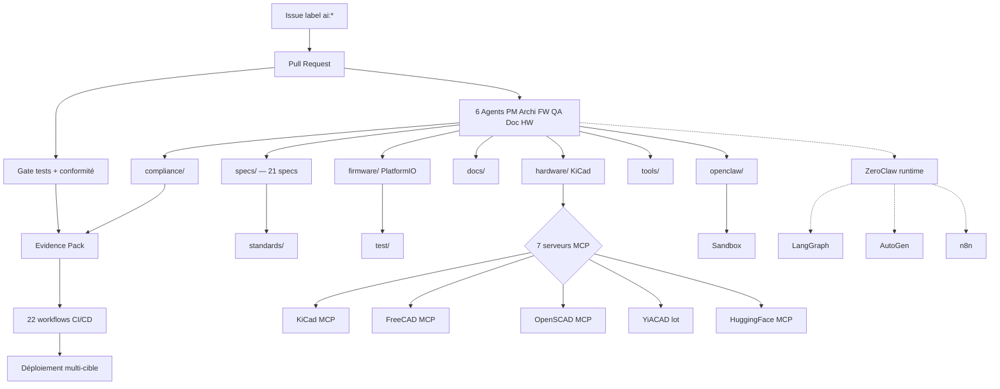

# Kill_LIFE 🚀 — Control Plane IA-native, cockpit opérateur et lot pilote extensions

<!-- Badges -->
[](https://github.com/electron-rare/Kill_LIFE/actions)
[](licenses/MIT.txt)
[](docs/COMPLIANCE.md)

<div align="center">
  
</div>

---

Bienvenue dans **Kill_LIFE**, le control plane public du programme agentique `Kill_LIFE`. Le repo concentre aujourd'hui le cockpit opérateur, la chaîne spec-first, les contrats runtime/MCP, les preuves d'exécution, et le lot pilote qui alimente les extensions VS Code soeurs `kill-life-studio`, `kill-life-mesh` et `kill-life-operator`.

La regle de lecture 2026-03-22 est simple:

- ce `README.md` décrit le produit/programme et les décisions de consolidation
- `docs/index.md` est la navigation opérateur canonique
- `tools/cockpit/README.md` est l'entrée outillage/TUI canonique
- `specs/README.md` reste la source de vérité de la chaîne spec-first
- `docs/KILL_LIFE_CONSOLIDATION_AUDIT_2026-03-22.md` porte l'audit structure, les risques, la matrice IA et la carte de fonctionnalites

La boucle courte de gouvernance locale est désormais:

`lot_chain -> intelligence_tui(memory) -> runtime_ai_gateway(status)`

Le programme d'integration intelligence actuellement actif se suit dans:

- `docs/plans/22_plan_integration_intelligence_agentique.md`
- `docs/plans/22_todo_integration_intelligence_agentique.md`
- `docs/plans/23_plan_yiacad_git_eda_platform.md`
- `docs/plans/23_todo_yiacad_git_eda_platform.md`
- `specs/04_tasks.md`

<div align="center" style="margin: 16px 0;">
  
  <a href="https://www.youtube.com/playlist?list=PLApocalypse42" target="_blank">Playlist apocalypse</a>
</div>

## Entrées canoniques

| Surface | Rôle | Entrée recommandée |
| --- | --- | --- |
| Produit / programme | Vue d'ensemble, périmètre, stratégie | `README.md` |
| Navigation opérateur | Index docs, runbooks, preuves, routines | `docs/index.md` |
| Cockpit / TUI | Commandes shell, contrats `cockpit-v1`, santé runtime | `bash tools/cockpit/yiacad_operator_index.sh --action status` |
| Gouvernance intelligence | owners, mémoire et prochaines actions | `bash tools/cockpit/intelligence_tui.sh --action status --json` |
| Gateway runtime/MCP/IA | synthèse consolidée runtime, mesh et Mascarade | `bash tools/cockpit/runtime_ai_gateway.sh --action status --refresh --json` |
| Chaîne spec-first | Intake -> spec -> arch -> plan -> tasks | `specs/README.md` |
| Audit consolidé | forces, faiblesses, opportunités, risques, IA | `docs/KILL_LIFE_CONSOLIDATION_AUDIT_2026-03-22.md` |
| Veille OSS | benchmark MCP, orchestration, VS Code agents | `docs/WEB_RESEARCH_OPEN_SOURCE_2026-03-22.md` |

## 🧩 Présentation

Kill_LIFE n'est plus seulement un squelette embarqué. Le repo sert désormais de source de vérité publique pour un programme plus large: opérations locales, gouvernance tri-repo, runtime MCP/IA, lot YiACAD, et spécialisation progressive des extensions VS Code.

Le positionnement retenu pour cette passe de consolidation est:

- `Kill_LIFE` = control plane, cockpit, contrats, preuves et référentiel documentaire
- `kill-life-studio` = produit, specs, décisions, périmètre, roadmap
- `kill-life-mesh` = orchestration multi-repo, handoffs, ownership, dépendances
- `kill-life-operator` = exécution, checks, evidence, runbooks

> « Bienvenue dans le meilleur des mondes : ici, chaque commit est validé, chaque gate est passé, et chaque agent sait que la vraie liberté, c'est d'avoir un evidence pack bien rangé. »
> — Aldous Huxley, version CI/CD

---

## 🧩 Architecture & Principes

- **Spec-first** : Chaque évolution commence par une définition claire dans `specs/` ([Spec Generator FX](https://www.youtube.com/watch?v=9bZkp7q19f0)).
  > _Schaeffer : Les agents du pipeline écoutent le bruit des specs comme une symphonie de sons trouvés._
- **Injection de standards** : Standards versionnés et profils injectés (Agent OS).
- **BMAD / BMAD-METHOD** : Agents par rôles (PM, Architecte, Firmware, QA, Doc, HW), rituels, gates, handoffs ([agents/](agents/), [bmad/](bmad/)).
- **Tool-first** : Scripts reproductibles ([tools/](tools/)), evidence pack canonique dans `docs/evidence/` et expose en artifact CI.
- **Pipeline hardware/firmware** : Bulk edits, exports, tests, conformité, snapshots.
- **CAD headless** : KiCad 10 first + FreeCAD + OpenSCAD via MCP, conteneurisés.
- **YiACAD** : lot IA-native de fusion KiCad + FreeCAD (with logs dédiés et smoke canari).
- **Pilotage tri-repo** : contract `ready|degraded|blocked` piloté par `mesh_sync_preflight.sh` + `refonte_tui.sh`.
- **Sécurité & conformité** : Sanitisation, sorties sûres, sandboxing, scope guard, anti-prompt injection ([OpenClaw Sandbox](https://www.openclaw.io/)).
- **Runtime agentique** : `ZeroClaw` en local on-demand, `LangGraph` et `AutoGen` comme patterns d'intégration optionnels.

<div align="center" style="margin: 16px 0;">
  
</div>

> « La réponse à la question ultime de la vie, de l'univers et du développement embarqué IA : 42 specs, 7 agents, et un pipeline qui ne panique jamais. »
> — Le README qui ne panique jamais
> 

([Les particules font-elles l'amour ?](https://lelectron-fou.bandcamp.com/album/les-particules-font-elles-l-amour-la-physique))

---

## ✨ Fonctionnalités principales

- **Développement guidé par la spec** : User stories, contraintes, architecture, plans, backlog.
- **Automatisation** : Issue → PR avec tests unitaires, sanitisation, evidence pack.
- **Multi-cibles** : ESP32, STM32, Linux, tests natifs.
- **Pipeline matériel** : KiCad, exports SVG/ERC/DRC/BOM/netlist, bulk edits.
- **Conformité** : Profils injectés, validation automatique.
- **OpenClaw** : Labels & commentaires sanitisés, jamais de commit/push, sandbox obligatoire.
- **Workflow catalog** : Workflows JSON éditables par `crazy_life`, validés contre un schéma JSON.

<div align="center" style="margin: 16px 0;">
  
</div>

---

## 🖥️ Schéma agentique (Mermaid)

<div align="center">



</div>

> _Parmegiani : Un bulk edit, c'est une métamorphose électronique, un peu comme un pack d'évidence qui se transforme en nuage de sons._

---

## 🗺️ Structure du projet

<div align="center" style="margin: 16px 0;">
  
</div>

```text
Kill_LIFE/
├── firmware/                    # Code PlatformIO (ESP32/STM32)
├── hardware/                    # Assets hardware et blocs KiCad
├── specs/                       # 21 specs et tâches canoniques (00_intake → 04_tasks + MCP/ZeroClaw/CAD)
├── workflows/                   # Workflows JSON canoniques + templates + schéma
├── agents/                      # 6 agents spécialisés (PM, Archi, FW, QA, Doc, HW)
├── bmad/                        # Gates (S0, S1), rituels (kickoff), templates (handoff, status)
├── compliance/                  # Profils réglementaires, standards catalog, evidence
├── standards/                   # Standards globaux versionnés
├── openclaw/                    # Labels, sandbox, onboarding
├── tools/
│   ├── compliance/              # Validation compliance
│   ├── hw/                      # Stack CAD, MCP, exports, smoke, schops
│   ├── ai/                      # ZeroClaw launchers, intégrations (langgraph, autogen, n8n)
│   ├── mistral/                 # Safe patch et outils Mistral
│   └── ci/                      # Audit CI
├── web/                         # Frontend Next.js YiACAD (dashboard, editor, viewer, review)
├── deploy/cad/                  # Dockerfiles et compose CAD/runtime
├── docs/                        # Docs opérateur, bridge, plans, workflows
├── test/                        # Tests Python (stable + MCP)
├── .github/
│   ├── agents/                  # 6 définitions agents GitHub
│   ├── prompts/                 # 37 prompts (plan_wizard_*, start_*, Eureka_*)
│   └── workflows/               # 22 workflows CI/CD
├── KIKIFOU/                     # Diagnostic, diagramme, mapping, recommandations
├── mcp.json                     # 7 serveurs MCP configurés
└── mkdocs.yml                   # Site docs
```

## Gouvernance refonte / IA-native

- Audit de consolidation: [docs/KILL_LIFE_CONSOLIDATION_AUDIT_2026-03-22.md](docs/KILL_LIFE_CONSOLIDATION_AUDIT_2026-03-22.md)
- Spec intelligence: [specs/agentic_intelligence_integration_spec.md](specs/agentic_intelligence_integration_spec.md)
- Feature map intelligence: [docs/AGENTIC_INTELLIGENCE_FEATURE_MAP_2026-03-21.md](docs/AGENTIC_INTELLIGENCE_FEATURE_MAP_2026-03-21.md)
- Manifeste: [docs/REFACTOR_MANIFEST_2026-03-20.md](docs/REFACTOR_MANIFEST_2026-03-20.md)
- Contrat mesh: [docs/TRI_REPO_MESH_CONTRACT_2026-03-20.md](docs/TRI_REPO_MESH_CONTRACT_2026-03-20.md)
- Plans lot: [specs/04_tasks.md](specs/04_tasks.md)
- Gestion des agents: [docs/plans/12_plan_gestion_des_agents.md](docs/plans/12_plan_gestion_des_agents.md)
- To-do mesh: [docs/plans/19_todo_mesh_tri_repo.md](docs/plans/19_todo_mesh_tri_repo.md)
- CAD AI-native: [docs/CAD_AI_NATIVE_FORK_STRATEGY.md](docs/CAD_AI_NATIVE_FORK_STRATEGY.md)
- Git EDA platform: [docs/YIACAD_GIT_EDA_PLATFORM_2026-03-22.md](docs/YIACAD_GIT_EDA_PLATFORM_2026-03-22.md)
- Web stack spec: [specs/yiacad_git_eda_platform_spec.md](specs/yiacad_git_eda_platform_spec.md)
- YiACAD lane: `bash tools/cockpit/refonte_tui.sh --action yiacad-fusion:prepare` et `tools/cad/yiacad_fusion_lot.sh`
- Workflow IA: [docs/AI_WORKFLOWS.md](docs/AI_WORKFLOWS.md)
- TUI intelligence: `bash tools/cockpit/intelligence_tui.sh --action status`
- Memoire intelligence: `bash tools/cockpit/intelligence_tui.sh --action memory --json`
- Scorecard intelligence: `bash tools/cockpit/intelligence_tui.sh --action scorecard --json`
- Comparaison inter-repos: `bash tools/cockpit/intelligence_tui.sh --action comparison --json`
- File recommandations IA: `bash tools/cockpit/intelligence_tui.sh --action recommendations --json`
- Gateway runtime/MCP/IA: `bash tools/cockpit/runtime_ai_gateway.sh --action status --refresh --json`
- Sync locale: `bash tools/cockpit/lot_chain.sh status` rafraichit la memoire `intelligence_tui` avant de mettre a jour le suivi `lots`
- Commande d'entrée: `bash tools/cockpit/refonte_tui.sh --action status`
- Index operateur YiACAD: `bash tools/cockpit/yiacad_operator_index.sh --action status`
- Phase active 2026-03-21: alignement lot 22, durcissement cockpit/logs, veille officielle MCP/agentique/IA, politique racine/mirror explicite et priorisation firmware/CAD/MCP.

### Refonte UI/UX Apple-native 2026

- Audit UX: [docs/YIACAD_APPLE_UI_UX_AUDIT_2026-03-20.md](docs/YIACAD_APPLE_UI_UX_AUDIT_2026-03-20.md)
- Audit exhaustif refonte: [docs/YIACAD_EXHAUSTIVE_REFOUNTE_AUDIT_2026-03-20.md](docs/YIACAD_EXHAUSTIVE_REFOUNTE_AUDIT_2026-03-20.md)
- Spécification technique: [specs/yiacad_uiux_apple_native_spec.md](specs/yiacad_uiux_apple_native_spec.md)
- Spécification lot suivant `T-UX-004`: [specs/yiacad_tux004_orchestration_spec.md](specs/yiacad_tux004_orchestration_spec.md)
- Feature map UI/UX: [docs/YIACAD_APPLE_UI_UX_FEATURE_MAP_2026-03-20.md](docs/YIACAD_APPLE_UI_UX_FEATURE_MAP_2026-03-20.md)
- Feature map lot suivant: [docs/YIACAD_TUX004_FEATURE_MAP_2026-03-20.md](docs/YIACAD_TUX004_FEATURE_MAP_2026-03-20.md)
- Veille Apple + OSS: [docs/YIACAD_APPLE_UI_UX_OSS_RESEARCH_2026-03-20.md](docs/YIACAD_APPLE_UI_UX_OSS_RESEARCH_2026-03-20.md)
- Plan dédié: [docs/plans/20_plan_refonte_ui_ux_yiacad_apple_native.md](docs/plans/20_plan_refonte_ui_ux_yiacad_apple_native.md)
- To-do dédié: [docs/plans/20_todo_refonte_ui_ux_yiacad_apple_native.md](docs/plans/20_todo_refonte_ui_ux_yiacad_apple_native.md)
- TUI dédiée: `bash tools/cockpit/yiacad_uiux_tui.sh --action status|program-audit|next-spec|next-feature-map`

### Bundle global YiACAD 2026

- Audit global: [docs/YIACAD_GLOBAL_REFACTOR_AUDIT_2026-03-20.md](docs/YIACAD_GLOBAL_REFACTOR_AUDIT_2026-03-20.md)
- Evaluation IA: [docs/YIACAD_GLOBAL_AI_INTEGRATION_ASSESSMENT_2026-03-20.md](docs/YIACAD_GLOBAL_AI_INTEGRATION_ASSESSMENT_2026-03-20.md)
- Feature map globale: [docs/YIACAD_GLOBAL_FEATURE_MAP_2026-03-20.md](docs/YIACAD_GLOBAL_FEATURE_MAP_2026-03-20.md)
- Recherche OSS globale: [docs/YIACAD_GLOBAL_OSS_RESEARCH_2026-03-20.md](docs/YIACAD_GLOBAL_OSS_RESEARCH_2026-03-20.md)
- Architecture backend: [docs/YIACAD_BACKEND_ARCHITECTURE_2026-03-20.md](docs/YIACAD_BACKEND_ARCHITECTURE_2026-03-20.md)
- Spec globale: [specs/yiacad_global_refonte_spec.md](specs/yiacad_global_refonte_spec.md)
- Spec backend: [specs/yiacad_backend_architecture_spec.md](specs/yiacad_backend_architecture_spec.md)
- Plan global: [docs/plans/21_plan_refonte_globale_yiacad.md](docs/plans/21_plan_refonte_globale_yiacad.md)
- TODO globale: [docs/plans/21_todo_refonte_globale_yiacad.md](docs/plans/21_todo_refonte_globale_yiacad.md)
- TUI globale: `bash tools/cockpit/yiacad_refonte_tui.sh --action status`
- Prochain front canonique:
  - architecture: backend YiACAD derriere `tools/cad/yiacad_native_ops.py`
  - produit: `T-UX-004` (`command palette`, `review center`, `inspector` persistant)

### Chaîne de specs

Le workflow spec-first suit une séquence canonique dans `specs/` :

```text
00_intake.md → 01_spec.md → 02_arch.md → 03_plan.md → 04_tasks.md
```

Specs spécialisées : `kicad_mcp_scope_spec.md`, `knowledge_base_mcp_spec.md`, `github_mcp_conversion_spec.md`, `cad_modeling_tasks.md`, `zeroclaw_dual_hw_orchestration_spec.md`, `mcp_agentics_target_backlog.md`.

Contraintes : [`specs/constraints.yaml`](specs/constraints.yaml) — source de vérité pour cibles, toolchain, sécurité IA et compliance.

### Agents & prompts

6 agents spécialisés dans [`agents/`](agents/) et [`.github/agents/`](.github/agents/) :

| Agent | Rôle |
|---|---|
| `pm_agent` | Gestion de projet, planning, backlog |
| `architect_agent` | Architecture système, ADR |
| `firmware_agent` | Code embarqué PlatformIO |
| `hw_schematic_agent` | Schémas KiCad, bulk edits |
| `qa_agent` | Tests, qualité, evidence packs |
| `doc_agent` | Documentation, onboarding |

37 prompts dans [`.github/prompts/`](.github/prompts/) couvrent : brainstorming, spécification, coordination agents, CI/CD, compliance, troubleshooting, release, bulk edit HW, et les prompts de démarrage (`start_*`) et d'idéation (`Eureka_*`).

### BMAD (gates & rituels)

Le framework BMAD dans [`bmad/`](bmad/) structure la progression :

- **Gates** : `gate_s0.md` (pré-spec), `gate_s1.md` (pré-implémentation)
- **Rituels** : `kickoff.md`
- **Templates** : `handoff.md`, `status_update.md`

Voir [KIKIFOU/diagramme.md](KIKIFOU/diagramme.md) pour le diagramme complet et [KIKIFOU/mapping.md](KIKIFOU/mapping.md) pour la table de mapping.

Plan d'analyse repo courant:

- [docs/plans/REPO_DEEP_ANALYSIS_2026-03-11.md](docs/plans/REPO_DEEP_ANALYSIS_2026-03-11.md)
- [docs/REFACTOR_MANIFEST_2026-03-20.md](docs/REFACTOR_MANIFEST_2026-03-20.md)
- [docs/WEB_RESEARCH_OPEN_SOURCE_2026-03-20.md](docs/WEB_RESEARCH_OPEN_SOURCE_2026-03-20.md)
- [docs/KILL_LIFE_FEATURE_MAP_2026-03-11.md](docs/KILL_LIFE_FEATURE_MAP_2026-03-11.md)
- [docs/KILL_LIFE_WORKFLOW_LOCAL_SEQUENCE_2026-03-11.md](docs/KILL_LIFE_WORKFLOW_LOCAL_SEQUENCE_2026-03-11.md)
- [docs/KILL_LIFE_WORKFLOW_GITHUB_SEQUENCE_2026-03-11.md](docs/KILL_LIFE_WORKFLOW_GITHUB_SEQUENCE_2026-03-11.md)
- [docs/EVIDENCE_ALIGNMENT_2026-03-11.md](docs/EVIDENCE_ALIGNMENT_2026-03-11.md)
- [docs/AGENTIC_LANDSCAPE.md](docs/AGENTIC_LANDSCAPE.md)
- [docs/AI_WORKFLOWS.md](docs/AI_WORKFLOWS.md)
- [tools/cockpit/refonte_tui.sh](tools/cockpit/refonte_tui.sh)
- [docs/CAD_AI_NATIVE_FORK_STRATEGY.md](docs/CAD_AI_NATIVE_FORK_STRATEGY.md)
- [docs/TRI_REPO_MESH_CONTRACT_2026-03-20.md](docs/TRI_REPO_MESH_CONTRACT_2026-03-20.md)

Infrastructure opérationnelle:

- Machines SSH opérateur (port SSH: `22`, priorité opérationnelle: Tower -> KXKM -> CILS -> local -> root):

  | Machine | Utilisateur | Rôle | Port | Script principal |
  |---|---|---|---:|---|
  | `clems@192.168.0.120` | `clems` | Machine de pilotage / orchestration locale | `22` | `run_alignment_daily.sh`, `ssh_healthcheck.sh` |
  | `kxkm@kxkm-ai` | `kxkm` | Mac opérateur | `22` | `run_alignment_daily.sh` |
  | `cils@100.126.225.111` | `cils` | Mac opérateur secondaire (`photon`, locké: pas de service essentiel) | `22` | `run_alignment_daily.sh` |
  | `root@192.168.0.119` | `root` | Serveur système / exécution matérielle (réserve) | `22` | `run_alignment_daily.sh` |

- Politique de charge P2P: `mesh_sync_preflight.sh --load-profile tower-first`
  - ordre: `Tower -> KXKM -> CILS -> local -> root`
  - `cils` accepte uniquement le repo critique `Kill_LIFE` en mode verrouillé.
- Repos GitHub actifs:
  - `electron-rare/Kill_LIFE`
  - `electron-rare/mascarade`
  - `electron-rare/crazy-life` (privé)
- Snapshot machines/repos:
  - [docs/MACHINE_SYNC_STATUS_2026-03-20.md](docs/MACHINE_SYNC_STATUS_2026-03-20.md)
  - [docs/MACHINE_ALIGNMENT_CONTRACT_2026-03-20.md](docs/MACHINE_ALIGNMENT_CONTRACT_2026-03-20.md)

### Health-check SSH (vérification machine)

```bash
bash tools/cockpit/ssh_healthcheck.sh --json
```

- Vérification de connectivité par machine avec statut `OK`/`KO` par ligne.
- Logs horodatés: `artifacts/cockpit/ssh_healthcheck_<YYYYMMDD>_<HHMMSS>.log`.
- Contrat d’alignement opérationnel: [docs/MACHINE_ALIGNMENT_CONTRACT_2026-03-20.md](docs/MACHINE_ALIGNMENT_CONTRACT_2026-03-20.md)

Routine quotidienne:

```bash
bash tools/cockpit/run_alignment_daily.sh --json
bash tools/cockpit/run_alignment_daily.sh --skip-healthcheck --json
```

- Lance health-check SSH + `repo_refresh` en mode header-only.
- Intègre la mémoire opérationnelle: [docs/MACHINE_SYNC_STATUS_2026-03-20.md](docs/MACHINE_SYNC_STATUS_2026-03-20.md) et [docs/MESH_SYNC_INCIDENT_REGISTER_2026-03-20.md](docs/MESH_SYNC_INCIDENT_REGISTER_2026-03-20.md).
- En mode charge sensible, utiliser `--mesh-load-profile photon-safe`.
- Écrit un log horodaté: `artifacts/cockpit/machine_alignment_daily_<YYYYMMDD>_<HHMMSS>.log`.
- Purge auto configurable (`--purge-days <N>`, défaut `14`).
- Sur les machines non-pilotes, utiliser `--skip-healthcheck` si la clé SSH n’est pas prévue pour l’auto-check mutuel.

---

## 🚀 Installation & démarrage rapide

### Prérequis

- OS : Linux, macOS, Windows (WSL)
- Python ≥ 3.10
- Docker + `docker compose`
- `gh` pour les opérations GitHub
- PlatformIO en natif ou via la stack conteneurisée
- KiCad (hardware)

### Installation rapide

```bash
git clone https://github.com/electron-rare/Kill_LIFE.git
cd Kill_LIFE
bash install_kill_life.sh
```

Voir [INSTALL.md](INSTALL.md) pour les détails.

### Bootstrap Python repo-local

```bash
bash tools/bootstrap_python_env.sh
```

Options utiles :
- `--venv-dir /tmp/kill-life-venv` pour vérifier le bootstrap sur un environnement vierge
- `--reinstall` pour recréer proprement le venv cible

Le chemin supporté pour le Python du repo est `./.venv/bin/python`.

### Tests Python

```bash
bash tools/test_python.sh
```

| Suite | Commande | Contenu |
|---|---|---|
| `stable` | `--suite stable` | Tests repo-locaux (specs, compliance, sanitizer, safe patch, schops) |
| `mcp` | `--suite mcp` | Tests MCP locaux (knowledge-base, github-dispatch, nexar) |
| `all` | `--suite all` | Les deux suites enchaînées |

Options : `--bootstrap` pour créer le venv avant, `--list` pour lister les commandes couvertes.

### Vérifications utiles

```bash
.venv/bin/python tools/compliance/validate.py --strict
.venv/bin/python tools/validate_specs.py --json
bash tools/hw/cad_stack.sh doctor
KILL_LIFE_PIO_MODE=container .venv/bin/python tools/auto_check_ci_cd.py
```

`tools/validate_specs.py` inclut un preflight PyYAML avant d'appeler `tools/compliance/validate.py` et retourne un message d'installation explicite si la dependance manque.

---

## 🔧 Serveurs MCP

Le projet expose **7 serveurs MCP** (Model Context Protocol) configurés dans [`mcp.json`](mcp.json) :

| Serveur | Type | Rôle |
|---|---|---|
| `kicad` | local | Gestion de projet, schémas, PCB, bibliothèques, validation, exports, sourcing |
| `validate-specs` | local | Validation specs, compliance, RFC2119 (CLI + MCP stdio) |
| `knowledge-base` | local | Recherche, lecture, ajout de memos (docmost) |
| `github-dispatch` | local | Dispatch de workflows GitHub allowlistés |
| `freecad` | local | Modélisation 3D, rendu, export, validation |
| `openscad` | local | Modélisation paramétrique, export, validation |
| `huggingface` | distant | Accès au Hub HuggingFace (datasets, modèles, papers) |

La stack CAD est documentée dans [`deploy/cad/README.md`](deploy/cad/README.md) et pilotée par [`tools/hw/cad_stack.sh`](tools/hw/cad_stack.sh).

- Cible actuelle : **KiCad 10 first** + FreeCAD + OpenSCAD
- Launcher MCP : [`tools/hw/run_kicad_mcp.sh`](tools/hw/run_kicad_mcp.sh)
- Configuration MCP : [`docs/MCP_SETUP.md`](docs/MCP_SETUP.md) et [`mcp.json`](mcp.json)

---

## 🤖 ZeroClaw & intégrations agentiques (optionnel)

Le runtime opérateur `ZeroClaw` peut tourner nativement sur la machine opérateur. Le launcher supporté essaie d'abord le binaire repo-local `zeroclaw/target/release/zeroclaw`, puis retombe sur `command -v zeroclaw` (typiquement `~/.cargo/bin/zeroclaw`).

```bash
bash tools/ai/zeroclaw_stack_up.sh    # démarrer
bash tools/ai/zeroclaw_stack_down.sh  # arrêter
```

Les runbooks et intégrations vivent dans [`tools/ai/integrations/`](tools/ai/integrations/) :

| Intégration | Rôle |
|---|---|
| `zeroclaw/` | Runtime opérateur local, boucles agentiques |
| `langgraph/` | Pattern d'intégration LangGraph |
| `autogen/` | Pattern d'intégration AutoGen |
| `n8n/` | Orchestration no-code / workflows externes |

Ces intégrations restent consultables même quand le runtime n'est pas démarré.

---

## 📦 Workflow catalog

Les workflows éditables par `crazy_life` vivent dans [`workflows/`](workflows/) et sont validés contre [`workflows/workflow.schema.json`](workflows/workflow.schema.json).

| Workflow | Fichier |
|---|---|
| Spec-first | `workflows/spec-first.json` |
| Embedded CI local | `workflows/embedded-ci-local.json` |
| Compliance release | `workflows/compliance-release.json` |

- `workflows/templates/*.json` : templates de création
- `.crazy-life/runs/` : état des runs locaux généré par `crazy_life` si l'éditeur est utilisé
- `.crazy-life/backups/workflows/` : révisions/restores générés localement par `crazy_life` (non versionnés)

---

## 🦾 Workflows agents détaillés

### 1. Spécification → Implémentation Firmware

1. Rédige la spec dans `specs/`.
2. Ouvre une issue avec le label `ai:spec`.
3. L'agent PM/Architecte génère le plan et l'architecture.
4. L'agent Firmware implémente le code dans `firmware/`.
5. L'agent QA ajoute des tests Unity.
6. Evidence pack généré automatiquement.

<div align="center" style="margin: 16px 0;">
  
</div>

### 2. Bulk Edit Hardware KiCad

1. Ouvre une issue `type:systems` + `scope:hardware`, puis ajoute `ai:plan` (ou `ai:impl` si le batch est déjà cadré).
2. L'agent HW effectue un bulk edit via `tools/hw/schops`.
3. Exporte ERC/DRC, BOM, netlist.
4. Snapshot avant/après dans `artifacts/hw/<timestamp>/`.

<div align="center" style="margin: 16px 0;">
  
</div>

### 3. Documentation & Conformité

1. Ouvre une issue avec le label `ai:docs` ou `ai:qa`.
2. L'agent Doc met à jour `docs/` et le README.
3. L'agent QA valide le profil de conformité et génère le rapport, avec relais doc si nécessaire.

<div align="center" style="margin: 16px 0;">
  
</div>

---

## 🛡️ Sécurité & conformité

- OpenClaw : sandbox obligatoire, jamais d'accès aux secrets ou au code source.
- Workflows CI : validation, sanitisation, scope guard, anti-prompt injection.
- Evidence packs : tous les rapports dans `artifacts/<domaine>/<timestamp>/`.
- Tests hardware reproductibles via scripts documentés.

<div align="center" style="margin: 16px 0;">
  
  <br/><br/>
  
  
  
  
  
</div>

### Chaîne de compliance

```text
compliance/
├── active_profile.yaml          # Profil actif (ex: "prototype")
├── profiles/
│   ├── prototype.yaml           # Standards requis + evidence pour prototype
│   └── iot_wifi_eu.yaml         # Profil IoT WiFi marché EU
├── standards_catalog.yaml       # Catalogue de standards versionnés
├── plan.yaml                    # Produit, marché, radio, alimentation
└── evidence/
    ├── risk_assessment.md       # Évaluation des risques
    ├── security_architecture.md # Architecture de sécurité
    ├── test_plan_radio_emc.md   # Plan de test radio/EMC
    └── supply_chain_declarations.md
```

Contraintes projet (depuis [`specs/constraints.yaml`](specs/constraints.yaml)) :
- **Orientation** : ESP-first (cibles : esp32s3, esp32, esp32dev)
- **Firmware** : PlatformIO + Unity (tests requis)
- **Hardware** : KiCad ≥ 9 minimum, chemin préféré KiCad 10-first, bulk edits autorisés, ERC green requis
- **IA** : un label `ai:*` adapte a l'etape est requis, secrets interdits, pas d'hypothese reseau
- **Compliance** : profil actif injecté, validé par `tools/compliance/validate.py`

---

## 🌐 Écosystème

| Repo | Rôle | Accès |
|---|---|---|
| **Kill_LIFE** | Source de vérité : workflows, runtime, evidence packs, firmware, CAD, compliance | 🌍 public |
| **ai-agentic-embedded-base** | Compagnon local : miroir exporté des `specs/` + seed firmware minimal, jamais source de vérité primaire | local |
| **crazy_life** | Surface web/devops et workflow editor | 🔒 privé |
| **mascarade** | Orchestration et bridge historique (sync uniquement) | 🔒 privé |

### Datasets HuggingFace

8 datasets de fine-tuning publiés sur [HuggingFace](https://huggingface.co/clemsail) (JSON, 1K-10K entrées chacun) :

`mascarade-stm32` · `mascarade-spice` · `mascarade-iot` · `mascarade-power` · `mascarade-dsp` · `mascarade-emc` · `mascarade-kicad` · `mascarade-embedded`

Articulation détaillée : [`docs/MASCARADE_BRIDGE.md`](docs/MASCARADE_BRIDGE.md)

---

## ⚙️ CI & release

**22 workflows GitHub Actions** couvrent l'ensemble du cycle :

| Catégorie | Workflows |
|---|---|
| **Gate principal** | `ci.yml` (bootstrap Python + suite stable) |
| **Release** | `release_signing.yml` (tag `v*` ou `workflow_dispatch`) |
| **Qualité** | `badges.yml`, `evidence_pack.yml`, `repo_state.yml`, `repo_state_header_gate.yml` |
| **Sécurité** | `secret_scan.yml`, `sbom_validation.yml`, `supply_chain.yml`, `incident_response.yml` |
| **Tests avancés** | `api_contract.yml`, `model_validation.yml`, `performance_hil.yml` |
| **Infra** | `dependency_update.yml`, `community_accessibility.yml` |
| **Pages** | `jekyll-gh-pages.yml`, `static.yml` (surfaces secondaires docs/evidence) |
| **Orchestration** | `zeroclaw_dual_orchestrator.yml` |

---

## 🤝 Contribuer

1. Forke le dépôt et clone-le localement.
2. Suis le guide d'onboarding ([docs/index.md](docs/index.md), [RUNBOOK.md](RUNBOOK.md)).
3. Ajoute des exemples minimalistes pour chaque agent (voir [agents/](agents/)).
4. Propose des blocks hardware, profils de conformité, tests.
5. Ouvre une PR, passe les gates, fournis un evidence pack.
6. Respecte les conventions de commit et de labelling (`ai:*`).

> « Les particules rêvent-elles d'électron-ironique ? Peut-être font-elles l'amour dans le dossier hardware, pendant que les agents QA se demandent si la conformité est un rêve ou une réalité. »
> — Inspiré par Le Réplicant de K. Dick & Les particules font-elles l'amour

_« J'ai vu des evidence packs briller dans l'obscurité près des gates S1… »_

---

## 🔗 Liens utiles

- [Documentation complète](docs/index.md)
- [RUNBOOK opérateur](RUNBOOK.md)
- [Guide d'installation](INSTALL.md)
- [Configuration MCP](docs/MCP_SETUP.md)
- [Synthèse technique](KIKIFOU/synthese.md)
- [Diagramme pipeline](KIKIFOU/diagramme.md)
- [Mapping dossiers](KIKIFOU/mapping.md)

---

## ❓ FAQ

**Q : Comment démarrer rapidement ?**
R : `bash install_kill_life.sh` puis `bash tools/bootstrap_python_env.sh`.

**Q : Comment lancer les tests ?**
R : `bash tools/test_python.sh --suite stable`

**Q : Comment sécuriser OpenClaw ?**
R : Sandbox obligatoire, jamais d'accès aux secrets ou au code source.

**Q : Comment contribuer ?**
R : Forke, suis le RUNBOOK, ouvre une PR avec evidence pack, respecte les labels `ai:*`.

**Q : Où trouver la documentation complète ?**
R : [docs/index.md](docs/index.md), [RUNBOOK.md](RUNBOOK.md), [INSTALL.md](INSTALL.md).

---

## 📜 Licence

MIT. Voir [`licenses/MIT.txt`](licenses/MIT.txt).


<!-- CHANTIER:AUDIT START -->
## Audit & Execution Plan (2026-03-10)

### Snapshot
- Priority: `P2`
- Tech profile: `other`
- Workflows: `yes`
- Tests: `yes`
- Debt markers: `6`
- Source files: `156`

### Corrections Prioritaires
- [ ] Optimisation ciblée perf/maintenabilité
- [ ] Ajouter/fiabiliser les commandes de vérification automatiques.
- [ ] Clore les points bloquants avant optimisation avancée.

### Optimisation
- [ ] Identifier le hotspot principal et mesurer avant/après.
- [ ] Réduire la complexité des modules les plus touchés.

### Mémoire chantier
- Control plane: `/Users/electron/.codex/memories/electron_rare_chantier`
- Repo card: `/Users/electron/.codex/memories/electron_rare_chantier/REPOS/Kill_LIFE.md`

<!-- CHANTIER:AUDIT END -->

## Delta mesh tri-repo 2026-03-20

Cette refonte opere desormais en mode maillé entre `Kill_LIFE`, `mascarade` et `crazy_life`.

- Contrat de gouvernance: [docs/TRI_REPO_MESH_CONTRACT_2026-03-20.md](docs/TRI_REPO_MESH_CONTRACT_2026-03-20.md)
- Spec des contrats publics: [specs/mesh_contracts.md](specs/mesh_contracts.md)
- Todo de transition: [docs/plans/19_todo_mesh_tri_repo.md](docs/plans/19_todo_mesh_tri_repo.md)
- Preflight machines/repos: [tools/cockpit/mesh_sync_preflight.sh](tools/cockpit/mesh_sync_preflight.sh)
- Operations logs: [tools/cockpit/log_ops.sh](tools/cockpit/log_ops.sh)

Regles actives:

- un lot doit declarer `owner_repo`, `owner_agent`, `write_set`, `preflight`, `validations`, `evidence`, `sync_targets`
- aucun revert de changements externes
- aucune propagation sans preflight de convergence
- les MCP sont conformes en `ready` ou `degraded`; `blocked` doit etre justifie

## Full operator lane (2026-03-20)

- Workflow source of truth: `workflows/embedded-operator-live.json`
- Live provider bridge:
  - `tools/ops/operator_live_provider_smoke.js`
  - `tools/ops/operator_live_provider_smoke.py`
- TUI runbook: `bash tools/cockpit/full_operator_lane.sh all`
- Patchset sync: `bash tools/cockpit/full_operator_lane_sync.sh --json`
- Evidence contract: `specs/contracts/operator_lane_evidence.schema.json`
- Operator doc: `docs/FULL_OPERATOR_LANE_2026-03-20.md`
- Provider/runtime note: `docs/PROVIDER_RUNTIME_COMPAT_2026-03-20.md`
- Validated on `clems`:
  - dry-run `success`
  - live `success`
  - provider/model observed: `claude` / `claude-sonnet-4-6`

### Refonte globale YiACAD 2026

- Audit global: [docs/YIACAD_GLOBAL_REFACTOR_AUDIT_2026-03-20.md](docs/YIACAD_GLOBAL_REFACTOR_AUDIT_2026-03-20.md)
- Evaluation IA: [docs/YIACAD_GLOBAL_AI_INTEGRATION_ASSESSMENT_2026-03-20.md](docs/YIACAD_GLOBAL_AI_INTEGRATION_ASSESSMENT_2026-03-20.md)
- Feature map globale: [docs/YIACAD_GLOBAL_FEATURE_MAP_2026-03-20.md](docs/YIACAD_GLOBAL_FEATURE_MAP_2026-03-20.md)
- Recherche OSS globale: [docs/YIACAD_GLOBAL_OSS_RESEARCH_2026-03-20.md](docs/YIACAD_GLOBAL_OSS_RESEARCH_2026-03-20.md)
- Spec globale: [specs/yiacad_global_refonte_spec.md](specs/yiacad_global_refonte_spec.md)
- Plan global: [docs/plans/21_plan_refonte_globale_yiacad.md](docs/plans/21_plan_refonte_globale_yiacad.md)
- TODO globale: [docs/plans/21_todo_refonte_globale_yiacad.md](docs/plans/21_todo_refonte_globale_yiacad.md)
- Index operateur: `bash tools/cockpit/yiacad_operator_index.sh --action status`
- TUI globale: `bash tools/cockpit/yiacad_refonte_tui.sh --action status`
- Facade backend locale: `python3 tools/cad/yiacad_backend_service.py status`

### Delta 2026-03-21 - backend service YiACAD

- Service local: [docs/YIACAD_BACKEND_SERVICE_2026-03-21.md](docs/YIACAD_BACKEND_SERVICE_2026-03-21.md)
- Client service-first: `python3 tools/cad/yiacad_backend_client.py --json-output health`
- TUI backend: `bash tools/cockpit/yiacad_backend_service_tui.sh --action status`

## 2026-03-21 - Canonical operator entry
- Entree publique recommandee: `bash tools/cockpit/yiacad_operator_index.sh --action status`.
- Surface de preuves: `bash tools/cockpit/yiacad_proofs_tui.sh --action status`.
- Surface de logs: `bash tools/cockpit/yiacad_logs_tui.sh --action status`.
- Les routes directes historiques restent compatibles, mais ne sont plus l'entree publique recommandee.
