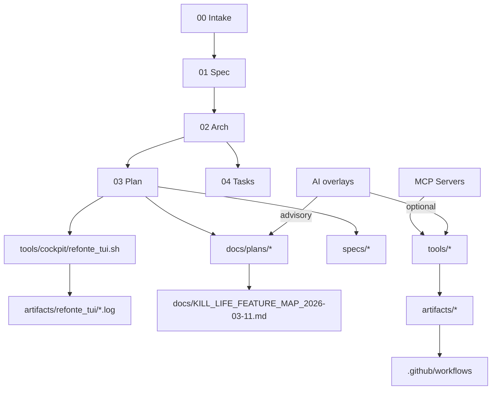

# Architecture

## Diagramme bloc

## ADR (Décisions)
- ADR-001: Conserver une chaîne spec-first stricte comme source de vérité, avec AI en overlay et gates non optionnels.
- ADR-002: Mutualiser la gouvernance via des plans canoniques (`docs/plans/*`, `specs/04_tasks.md`) et un manifeste de refonte dédié.
- ADR-003: Préférer les intégrations MCP/supportées déjà répertoriées avant d’introduire de nouvelles briques.
- ADR-004: Imposer une boucle logs opérationnelle (write/read/cleanup) pour tout lot auto.

## Énergie
- States du lot:
  - `planning`: mise à jour des priorités
  - `execution`: lot automatique ou manuel en cours
  - `validation`: commandes de validation déclenchées
  - `stabilization`: analyse logs + mise à jour des plans
- Wake sources:
  - changement de specs/plans
  - divergence docs ↔ source
  - gate bloquant dans le lot

## Risques & mitigations
- Risque de dérive AI: mitigation par gates, contraintes réseau, sortie manuelle sur lots critiques.
- Risque de doublons logs: mitigation par politique de rétention et nommage horaire.
- Risque de désynchronisation plan/spec: mitigation par script de revue README + chain plan.
