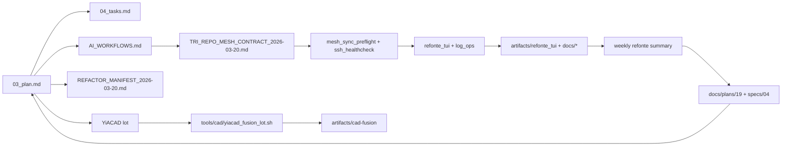

# Plan d'enchainement autonome des lots utiles

Last updated: 2026-03-21

## Objectif
Dans le cadre de la refonte complète, ce lot-chain sert à verrouiller la cohérence docs/plans/specs, sans casser la cadence CI.

Faire tourner une boucle locale simple:

1. detecter les lots auto-corrigeables,
2. les executer sans attente humaine inutile,
3. revalider le repo,
4. ne poser une question qu'au moment ou un vrai choix manuel devient necessaire.

## Scope

- `tools/cockpit/lot_chain.sh`
- `tools/autonomous_next_lots.py`
- `tools/run_autonomous_next_lots.sh`
- `tools/cockpit/refonte_tui.sh`
- `tools/cockpit/log_ops.sh`
- `tools/cockpit/intelligence_tui.sh`
- `tools/cockpit/runtime_ai_gateway.sh`
- `tools/cockpit/agent_matrix_tui.sh`
- `tools/cockpit/yiacad_uiux_tui.sh`
- `tools/cockpit/render_weekly_refonte_summary.sh`
- `tools/cockpit/mesh_sync_preflight.sh`
- `tools/cockpit/mesh_dirtyset_sync.sh`
- `tools/specs/sync_spec_mirror.sh`
- `tools/doc/readme_repo_coherence.sh`
- `tools/cad/yiacad_fusion_lot.sh`
- `tools/test_python.sh`
- `docs/plans/18_plan_enchainement_autonome_des_lots_utiles.md`
- `docs/plans/18_todo_enchainement_autonome_des_lots_utiles.md`
- `docs/AGENT_SPEC_MODULE_MATRIX_2026-03-20.md`
- `docs/YIACAD_NATIVE_UI_INSERTION_POINTS_2026-03-20.md`
- `docs/YIACAD_APPLE_UI_UX_AUDIT_2026-03-20.md`
- `docs/YIACAD_APPLE_UI_UX_OSS_RESEARCH_2026-03-20.md`
- `docs/YIACAD_APPLE_UI_UX_FEATURE_MAP_2026-03-20.md`
- `docs/WEB_RESEARCH_AGENTIC_STACK_2026-03-20.md`
- `docs/AI_WORKFLOWS.md`
- `docs/plans/22_plan_integration_intelligence_agentique.md`
- `docs/plans/22_todo_integration_intelligence_agentique.md`
- `specs/agentic_intelligence_integration_spec.md`
- `docs/AGENTIC_INTELLIGENCE_FEATURE_MAP_2026-03-21.md`
- `docs/MESH_DIRTYSET_CLEANUP_2026-03-20.md`
- `specs/03_plan.md`
- `specs/04_tasks.md`
- `specs/constraints.yaml`
- `ai-agentic-embedded-base/specs/`

## Regles d'enchainement

- Auto-fix avant validation.
- Validation stricte apres chaque lot.
- Plans/todos mis a jour depuis l'etat reel, pas a la main.
- Question operateur uniquement quand aucun lot auto n'est encore pertinent.

## Commandes canoniques

- `bash tools/cockpit/lot_chain.sh status`
- `bash tools/cockpit/lot_chain.sh all --yes`
- `bash tools/cockpit/run_next_lots_autonomously.sh --update-tracker`
- `bash tools/run_autonomous_next_lots.sh status`
- `bash tools/run_autonomous_next_lots.sh run`
- `bash tools/cad/yiacad_fusion_lot.sh --action prepare`
- `bash tools/cad/yiacad_fusion_lot.sh --action smoke`
- `bash tools/cockpit/refonte_tui.sh --action yiacad-fusion:status`
- `bash tools/cockpit/refonte_tui.sh --action weekly-summary`
- `bash tools/cockpit/render_weekly_refonte_summary.sh`
- `bash tools/cockpit/agent_matrix_tui.sh --action summary`
- `bash tools/cockpit/agent_matrix_tui.sh --action owners`
- `bash tools/cockpit/agent_matrix_tui.sh --action open-tasks`
- `bash tools/cockpit/agent_matrix_tui.sh --action insertion-points`
- `bash tools/cockpit/intelligence_tui.sh --action status --json`
- `bash tools/cockpit/intelligence_tui.sh --action next-actions`
- `bash tools/cockpit/intelligence_tui.sh --action memory --json`
- `bash tools/cockpit/runtime_ai_gateway.sh --action status --refresh --json`
- `bash tools/cockpit/yiacad_uiux_tui.sh --action status`
- `bash tools/cockpit/yiacad_uiux_tui.sh --action insertion-points`
- `bash tools/cockpit/yiacad_uiux_tui.sh --action agent-matrix`
- `bash tools/specs/sync_spec_mirror.sh all --yes`
- `bash tools/doc/readme_repo_coherence.sh all --yes`
- `python3 tools/validate_specs.py --strict --require-mirror-sync`
- `bash tools/test_python.sh --suite stable`
- `bash tools/cockpit/refonte_tui.sh --action all --yes`

## Notes

- `specs/` reste la source de verite.
- `ai-agentic-embedded-base/specs/` reste un miroir exporte.
- `docs/plans/18_*` capture la lane runtime/MCP/CAD synchronisee par la boucle locale.
- Les choix manuels restants doivent etre surfaces via `artifacts/cockpit/next_question.md`.
- `tools/cockpit/refonte_tui.sh` est la surface opératoire recommandée pour lire/analyser/purger les logs de refonte.
- `tools/cockpit/log_ops.sh` formalise lecture + analyse + purge des logs de refonte.
- `tools/cockpit/intelligence_tui.sh` est la surface canonique pour l'etat intelligence, la memoire `latest.*` et les prochaines actions de gouvernance.
- `tools/cockpit/lot_chain.sh` synchronise la memoire `intelligence_tui` avant d'ecrire son statut, son plan et sa prochaine question manuelle.
- `tools/cockpit/runtime_ai_gateway.sh` consomme ensuite la memoire intelligence, le mesh health et le runtime Mascarade pour produire une synthese unique runtime/MCP/IA.
- `tools/cockpit/render_weekly_refonte_summary.sh` formalise la mémoire de lot hebdomadaire et le point de passage vers les TODOs suivants.
- `tools/cockpit/agent_matrix_tui.sh` devient la surface TUI dediee a la matrice agents/specs/modules.
- `tools/cockpit/mesh_dirtyset_sync.sh` devient la commande de nettoyage conservative des dirty-sets inter-machines.

## Objectifs de refonte immédiats

- K-RE-001: Vérifier l’alignement complet `specs/*` ↔ `docs/plans/*`.
- K-RE-002: Actualiser `docs/KILL_LIFE_FEATURE_MAP_2026-03-11.md` et les diagrammes de séquence.
- K-RE-003: Activer la gestion logs dans un flux TUI + audit contrôlé.
- K-RE-004: Définir la stratégie IA-native pour KiCad/FreeCAD (overlay + garde-fous + preuve).
- K-RE-005: Intégrer le lot YiACAD dans la boucle (prepare/smoke/status/logs/clean-logs).
- K-RE-006: Générer une synthèse hebdomadaire et une checklist de sortie de lot.
- K-RE-007: Affecter chaque spec et module à un agent dédié avec write-set, TUI et preuves.
- K-RE-008: Préparer la montée UI/UX Apple-native des hooks Python vers les shells natifs KiCad/FreeCAD.

## Statut auto

<!-- BEGIN AUTO LOT-CHAIN PLAN -->
- Auto-fix lots pending: `0`
- README/repo coherence: `done`
- Spec mirror sync: `done`
- MCP/CAD runtime lane sync: `synced`
- Strict spec contract: `passed`
- Stable Python suite: `passed`
- Next real need: ask the operator to choose the next manual lot from `artifacts/cockpit/next_question.md`.
<!-- END AUTO LOT-CHAIN PLAN -->

## Delta mesh tri-repo 2026-03-20

### Workstream mesh-governance

Objectif: rendre le programme operable en codebase partage et tri-repo sans depot canonique unique.

Deliverables:

- contrat mesh versionne
- preflight multi-machines/multi-repos
- contrats publics MCP/handoff/snapshot/workflow handshake
- overlay agents et sous-agents
- lots P0/P1/P2 pour propagation dans `mascarade` et `crazy_life`

### Workstream post-e2e-hardening

Objectif: conserver la preuve `Full operator lane` validee sur `clems`, normaliser le contrat runtime observe, puis restaurer la convergence mesh.

Deliverables:

- runner live provider container-safe (`.js`) avec helper parity (`.py`)
- note de compatibilite provider/runtime issue des preuves et de la veille officielle
- TUI de propagation du patchset `full_operator_lane_sync.sh`
- mise a jour des plans/todos/readme avec la validation live reelle
- restauration conservative de la visibilite preflight sur `clems`

### Workstream agent-matrix-and-dirtyset

Objectif: affecter chaque specification et module a un agent dedie, documenter les write-sets, puis aligner les dirty-sets inter-machines sans ecrasement large.

Deliverables:

- matrice canonique spec/module tri-repo
- TUI de lecture `agent_matrix_tui`
- registre machine/capacite canonique + CLI de consultation
- veille officielle agentic stack / MCP / orchestration
- note de nettoyage dirty-set inter-machines

## Delta 2026-03-20 - progression UI/UX native YiACAD
- `T-UX-003` est maintenant majoritairement livré: insertion native KiCad compilée sur `kicad manager`, `pcbnew`, `eeschema`, et workbench FreeCAD recâblé en direct vers les utilitaires YiACAD.
- Le prochain lot recommandé devient `T-UX-004`, centré sur `command palette`, `review center` et inspector persistant plus profond.
- Le risque principal restant n'est plus le bridge intermédiaire mais l'absence d'un backend YiACAD compilé/embarqué derrière le runner Python local.

## Delta 2026-03-20 - audit exhaustif et ouverture T-UX-004
- L'audit global confirme que le projet est fort sur la gouvernance spec-first, les TUI cockpit, les artefacts et l'insertion YiACAD native deja engagee.
- Le principal point faible n'est plus l'absence de structure mais la fragmentation des deltas et le chevauchement des sources de verite.
- `T-UX-004` est maintenant formellement ouvert comme prochain lot prioritaire avec palette de commandes, review center, inspector persistant et contrat de sortie unifie.
- Le prochain palier backend recommande est un `context broker` local YiACAD puis un backend plus robuste que le runner Python local.

## Delta 2026-03-20 - refonte globale YiACAD
- Ouverture du bundle global YiACAD: audit, evaluation IA, feature map, recherche OSS, spec, plan, todo et TUI dediee.
- Le prochain lot de fond reste `T-UX-004`, mais il est maintenant subordonne a un cadrage global plus net de la couche backend YiACAD et de la navigation operateur.
- Le risque principal remonte au niveau architecture: multiplicite des entrees et runner Python local encore trop central.

## Consolidation canonique 2026-03-20

- Etat courant:
  - `T-UX-003` est largement livre sur `KiCad Manager`, `pcbnew`, `eeschema` et `YiACADWorkbench`.
  - les surfaces natives principales ciblent maintenant directement `tools/cad/yiacad_native_ops.py`.
  - le bundle global YiACAD est publie et devient la lecture d'entree pour la refonte transversale.
- Priorites canoniques:
  - `T-ARCH-101`: formaliser un backend YiACAD plus robuste que le runner Python local
  - `T-UX-004`: executer `command palette`, `review center` et `inspector` persistant
  - `T-OPS-118`: rationaliser les entrees TUI et les resumés operateurs
- Avancement architecture:
  - `T-ARCH-101A` pose maintenant un backend local partage (`tools/cad/yiacad_backend.py`)
  - chaque action YiACAD peut produire `context.json` et `uiux_output.json`
  - l'etape suivante reste un backend YiACAD plus stable qu'un simple appel CLI local
- Regle de lecture:
  - les deltas historiques ci-dessus restent utiles comme trace
  - l'arbitrage operatoire courant se fait depuis cette consolidation, `specs/04_tasks.md`, `docs/plans/20_*` et `docs/plans/21_*`

## Delta 2026-03-21 - operator index + T-UX-004A
- `T-UX-004A` est livre sur le plugin KiCad et le workbench FreeCAD avec palette legere et review center leger branches sur `--json-output`.
- `tools/cockpit/yiacad_operator_index.sh` devient l'entree operateur stable entre lane UI/UX et refonte globale.
- le prochain front produit reste l'inspector persistant et le review center plus riche.

## Delta 2026-03-21 - intelligence governance cockpit
- `tools/cockpit/intelligence_tui.sh` devient la surface canonique pour l'audit, les owners, la veille, la memoire et les prochaines actions de gouvernance intelligence.
- `tools/cockpit/intelligence_program_tui.sh` reste comme alias de compatibilite vers la nouvelle surface canonique.
- la memoire operatoire `artifacts/cockpit/intelligence_program/latest.json` et `latest.md` devient un point de passage explicite pour les automatisations et les extensions terminales.
- `tools/cockpit/runtime_ai_gateway.sh` devient la synthese courte `runtime/MCP/IA` au-dessus de `intelligence_tui`, `mesh_health_check` et `mascarade_runtime_health`.

## Delta 2026-03-21 - T-UX-005 review center enrichment
- `T-UX-005` est maintenant livre comme enrichissement du review center sur KiCad plugin et FreeCAD workbench.
- les deux surfaces affichent des sections plus lisibles: `Status`, `Severity`, `Summary`, `Details`, `Context`, `Artifacts`, `Next steps`.
- le prochain front produit se concentre maintenant sur `T-UX-006` et la persistance de session.

## Delta 2026-03-21 - T-UX-006 persistence
- `T-UX-006` franchit son premier palier utile sur KiCad plugin et FreeCAD workbench.
- les deux surfaces conservent maintenant le dernier contrat, le dernier contexte et un resume de session recent.
- le prochain front se deplace vers `T-ARCH-101C` et, cote produit, vers une session de revue plus riche et multi-vues.

## Delta 2026-03-21 - T-ARCH-101C service-first
- `T-ARCH-101C` est maintenant engage par un backend local adressable et un client service-first.
- KiCad plugin et FreeCAD workbench appellent maintenant le client backend avant de retomber sur le runner direct.
- `yiacad_uiux_tui.sh --action status` consomme maintenant ce meme chemin `service-first` et expose un JSON parseable.
- le prochain front naturel apres ce palier se deplace vers `T-UX-004`, `T-UX-003` et `T-RE-209`.

## 2026-03-21 - Lot update
- `T-ARCH-101C` est maintenant ferme: les surfaces actives KiCad / FreeCAD et la TUI UI/UX passent en `service-first` via `tools/cad/yiacad_backend_client.py`, avec auto-start du service local et fallback direct vers `tools/cad/yiacad_native_ops.py`.
- `T-OPS-119` consolide: `tools/cockpit/yiacad_operator_index.sh` devient l'entree operateur stable avec `status`, `uiux`, `global`, `backend`, `proofs` et des alias de compatibilite conserves.
- Validation executee: `yiacad_backend_proof.sh --action run` passe en `done`.
- Risque residuel: les call sites compiles plus profonds et la palette / inspector persistent restent suivis dans `T-UX-003`, `T-UX-004` et `T-RE-209`.

## 2026-03-21 - Proofs lane
- Nouveau point d'entree: `bash tools/cockpit/yiacad_proofs_tui.sh --action status`.
- Objectif: centraliser `backend`, `review-session`, `review-history`, `review-taxonomy` et l'hygiene des logs dans une surface canonique sans casser les alias historiques.
- Documentation: `docs/YIACAD_PROOFS_TUI_2026-03-21.md`.

## 2026-03-21 - Canonical operator entry
- Entree publique recommandee: `bash tools/cockpit/yiacad_operator_index.sh --action status`.
- Surface de preuves: `bash tools/cockpit/yiacad_proofs_tui.sh --action status`.
- Surface de logs: `bash tools/cockpit/yiacad_logs_tui.sh --action status`.
- Les routes directes historiques restent compatibles, mais ne sont plus l'entree publique recommandee.

## Delta 2026-03-21 - T-UX-003 and T-UX-004 closure
- `T-UX-003` est maintenant ferme comme lot parent: KiCad Manager, `pcbnew`, `eeschema`, `YiACADWorkbench` et l'ancrage `MainWindow.cpp` sont livres et verrouilles par `test/test_yiacad_native_surface_contract.py`.
- `T-UX-004` est maintenant ferme comme lot parent: plugin KiCad et workbench FreeCAD exposent palette, review center, session persistante et contexte compact comme surface produit canonique.
- le prochain front shell profond n'est plus `T-UX-003` ou `T-UX-004`, mais `T-UX-007`, tandis que le blocage runtime hote KiCad reste trace dans `T-RE-209`.
