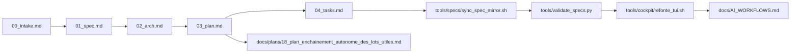

# Specs (Spec-driven)

Le dossier `specs/` est la source de vérité de la méthode Kill_LIFE. Il décrit la chaîne canonique `brief -> spec -> architecture -> plan -> tasks`, puis rattache chaque lot à un owner explicite et à une preuve exploitable par le cockpit, les plans et les extensions VS Code.

Chaîne canonique:

1. `00_intake.md` — idée brute + périmètre
2. `01_spec.md` — besoin, critères d’acceptation
3. `02_arch.md` — architecture + ADR
4. `03_plan.md` — plan de réalisation
5. `04_tasks.md` — backlog opérationnel

Contraintes non-fonctionnelles:

- `specs/constraints.yaml` (source de vérité)

## Contrat de lot canonique

Tout lot nouveau ou restructuré doit exposer les champs suivants dans sa documentation, ses TODOs ou ses preuves dérivées:

- `owner_repo`
- `owner_agent`
- `owner_subagent`
- `write_set`
- `status`
- `evidence`

Ce contrat est la charnière entre `Kill_LIFE`, `ai-agentic-embedded-base`, le cockpit shell/TUI et le trio d'extensions `kill-life-studio`, `kill-life-mesh`, `kill-life-operator`.

## Specs de référence supplémentaires

- `github_mcp_conversion_spec.md`
- `cad_modeling_tasks.md`
- `kicad_mcp_scope_spec.md`
- `mcp_agentics_target_backlog.md`
- `mcp_tasks.md`
- `knowledge_base_mcp_spec.md`
- `zeroclaw_dual_hw_orchestration_spec.md`
- `zeroclaw_dual_hw_todo.md`

## Exécutions utiles

- Synchroniser les specs exportées:
  - `bash tools/specs/sync_spec_mirror.sh all --yes`
- Vérifier le miroir:
  - `bash tools/specs/sync_spec_mirror.sh check`
- Lancer la chaîne d’exécution:
  - `bash tools/cockpit/lot_chain.sh all --yes`
  - `bash tools/run_autonomous_next_lots.sh status`
  - `bash tools/run_autonomous_next_lots.sh run`
- Valider la cohérence:
  - `bash tools/validate_specs.py --strict --require-mirror-sync`

## Politique canonique vs miroir

- `Kill_LIFE/specs/` reste la source de vérité; toute modification part de ce dossier.
- `ai-agentic-embedded-base/specs/` reste un miroir exporté; on ne l'édite pas directement, on le synchronise via `bash tools/specs/sync_spec_mirror.sh all --yes`.
- Les surfaces `docs/`, `tools/`, `artifacts/` et `firmware/` restent canoniques dans `Kill_LIFE` sauf lot explicite contraire.
- La fermeture d'un lot spec-first passe par deux commandes: `bash tools/specs/sync_spec_mirror.sh all --yes` puis `python3 tools/validate_specs.py --strict --require-mirror-sync`.

## Référentiels refonte à actualiser ensemble

- `docs/KILL_LIFE_CONSOLIDATION_AUDIT_2026-03-21.md`
- `docs/REFACTOR_MANIFEST_2026-03-20.md`
- `docs/WEB_RESEARCH_OPEN_SOURCE_2026-03-20.md`
- `docs/AGENT_SPEC_MODULE_MATRIX_2026-03-20.md`
- `docs/plans/12_plan_gestion_des_agents.md`
- `docs/plans/18_plan_enchainement_autonome_des_lots_utiles.md`
- `tools/cockpit/refonte_tui.sh`
- `tools/cockpit/log_ops.sh`
- `docs/AI_WORKFLOWS.md`
