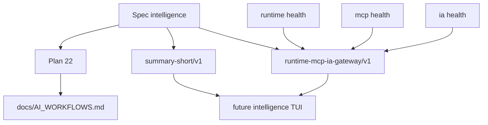

# Spec - integration intelligence agentique (2026-03-21)

## Contexte

`Kill_LIFE` dispose deja d'une gouvernance spec-first, d'un cockpit TUI, de contrats mesh et de plusieurs lanes IA/MCP/CAD. Le manque principal n'est plus l'absence de surface, mais l'absence d'un contrat court et stable pour exposer l'etat de la gouvernance intelligence de facon commune entre docs, artefacts, TUI et automation.

La phase initiale du lot 22 etait volontairement minimale: elle fixait les contrats et la gouvernance documentaire. La realite livree a depuis depasse ce cadre, avec une TUI `intelligence_tui`, une gateway `runtime_ai_gateway`, des artefacts `latest.*` et des tests de contrat deja publies.

La phase active `2026-03-21` couvre donc des travaux de durcissement et d'alignement: coherence docs/spec/plan/TODO, garde-fous de purge, robustesse des sorties machine, veille officielle actualisee et priorisation des integrations firmware/CAD/MCP.

## Objectifs

- O1: formaliser un contrat `summary-short/v1` reutilisable pour la synthese courte de gouvernance.
- O2: formaliser un contrat `runtime-mcp-ia-gateway/v1` pour la sante agregee `runtime`, `mcp` et `ia`.
- O3: aligner la spec, le plan 22 et `docs/AI_WORKFLOWS.md` sur ces deux contrats.
- O4: garder la future surface TUI en aval de ces contrats, pas l'inverse.
- O5: durcir les surfaces cockpit deja livrees pour que la memoire, les purges et les sorties JSON restent fiables hors cas ideal.

## Hors scope

- execution autonome destructive non reversible
- remplacement des TUIs YiACAD, operator ou refonte par une nouvelle surface concurrente
- ajout d'un orchestrateur externe obligatoire
- adoption forcee d'un framework agentique externe comme coeur documentaire du projet

## Exigences fonctionnelles

### F1 - Contrat `summary-short/v1`

Le projet publie un schema versionne:

- `specs/contracts/summary_short.schema.json`

Le contrat `summary-short/v1` doit rester court, portable et stable. Il porte au minimum:

- `contract_version`
- `generated_at`
- `component`
- `owner_repo`
- `owner_agent`
- `owner_subagent`
- `write_set`
- `status`
- `summary_short`
- `evidence`

Champs optionnels recommandes:

- `lot_id`
- `degraded_reasons`
- `next_steps`

Usage cible:

- synthese courte d'un lot
- resume de statut pour cockpit ou docs
- memoire courte publiee dans un artefact `latest.json`

### F2 - Contrat `runtime-mcp-ia-gateway/v1`

Le projet publie un schema versionne:

- `specs/contracts/runtime_mcp_ia_gateway.schema.json`

Le contrat `runtime-mcp-ia-gateway/v1` expose un statut global et trois surfaces nommees:

- `runtime`
- `mcp`
- `ia`

Le payload top-level doit porter au minimum:

- `contract_version`
- `generated_at`
- `component`
- `owner_repo`
- `owner_agent`
- `owner_subagent`
- `write_set`
- `status`
- `summary_short`
- `evidence`
- `surfaces`

Chaque surface doit porter au minimum:

- `status`
- `summary_short`
- `evidence`

Champs optionnels recommandes par surface:

- `degraded_reasons`
- `upstreams`

### F3 - Gouvernance documentaire

Les sources suivantes doivent rester alignees pour ce lot:

- `specs/agentic_intelligence_integration_spec.md`
- `docs/plans/22_plan_integration_intelligence_agentique.md`
- `docs/AI_WORKFLOWS.md`
- `specs/contracts/summary_short.schema.json`
- `specs/contracts/runtime_mcp_ia_gateway.schema.json`

Le vocabulaire canonique reste:

- `owner_repo`
- `owner_agent`
- `owner_subagent`
- `write_set`
- `status`
- `evidence`

### F4 - Sequencement minimal

Le lot a livre d'abord les contrats et leur gouvernance d'usage.

La TUI `intelligence` consomme deja:

- un `summary-short/v1` comme sortie courte par lot
- un `runtime-mcp-ia-gateway/v1` comme signal agrege de sante

La phase active durcit maintenant:

- la coherence spec/plan/TODO/taches
- la securite des purges non interactives
- la stabilite des sorties JSON et des chemins de reference
- la priorisation des integrations firmware/CAD/MCP a raccorder aux contrats

### F5 - Politique canonique root / miroir / firmware

- `Kill_LIFE/specs/` reste la source de verite documentaire et contractuelle.
- `ai-agentic-embedded-base/specs/` reste un miroir exporte, synchronise via `bash tools/specs/sync_spec_mirror.sh all --yes`.
- Les surfaces `docs/`, `tools/`, `artifacts/` et `firmware/` restent canoniques dans `Kill_LIFE` sauf lot explicite contraire.
- Le chemin firmware executable canonique pour la phase active est `firmware/platformio.ini` avec `firmware/src/main.cpp`.
- `firmware/src/voice_controller.cpp` et `firmware/include/voice_controller.h` restent en pre-integration tant qu'ils ne sont ni relies au `main.cpp`, ni couverts par une lane de build/test/release explicite.
- `ai-agentic-embedded-base/firmware/` reste un repo compagnon minimal, pas une source de verite runtime.

## Architecture cible minimale

## Modele de donnees minimum

### `summary-short/v1`

Contrat court, lisible par humain et automation, pour repondre rapidement a:

- qui own le lot
- sur quel `write_set`
- avec quel `status`
- avec quelle `evidence`
- avec quel resume court

### `runtime-mcp-ia-gateway/v1`

Contrat agrege de sante pour repondre rapidement a:

- quel est le `status` global
- quelle surface precise degrade (`runtime`, `mcp`, `ia`)
- quelles preuves sont associees
- quelles dependances amont restent ouvertes

## Integrations IA retenues

| Surface | Mode | Decision |
| --- | --- | --- |
| docs/specs | assiste | generation guidee, jamais source de verite autonome |
| synthese courte | pilote | `summary-short/v1` comme sortie courte commune |
| sante runtime/MCP/IA | pilote | `runtime-mcp-ia-gateway/v1` comme contrat agrege |
| orchestration longue | optionnelle | LangGraph / Agents SDK comme overlays, pas comme coeur documentaire |
| MCP | pilote | standard de connexion et de discovery prioritaire |

## Criteres d'acceptation

- AC1: `specs/contracts/summary_short.schema.json` existe et impose `owner_repo`, `owner_agent`, `write_set`, `status`, `summary_short`, `evidence`.
- AC2: `specs/contracts/runtime_mcp_ia_gateway.schema.json` existe et impose un `status` global plus trois surfaces `runtime`, `mcp`, `ia`.
- AC3: `docs/AI_WORKFLOWS.md` reference explicitement ces deux contrats comme base de la gouvernance intelligence.
- AC4: `docs/plans/22_plan_integration_intelligence_agentique.md` explicite les lanes actives, leur `owner_agent`, leur `owner_subagent`, leur `write_set` et leur usage des contrats.
- AC5: la spec, le plan 22, le TODO 22 et `specs/04_tasks.md` restent alignes sur la realite livree du lot 22.
- AC6: les purges non interactives exigent un opt-in explicite et les sorties JSON critiques restent parseables.
- AC7: la politique `Kill_LIFE/specs` canonique -> `ai-agentic-embedded-base/specs` miroir exporte est documentee avec sa commande de synchronisation.
- AC8: le chemin firmware canonique et le statut pre-integration de la stack voice sont documentes avant tout raccord aux contrats intelligence.
