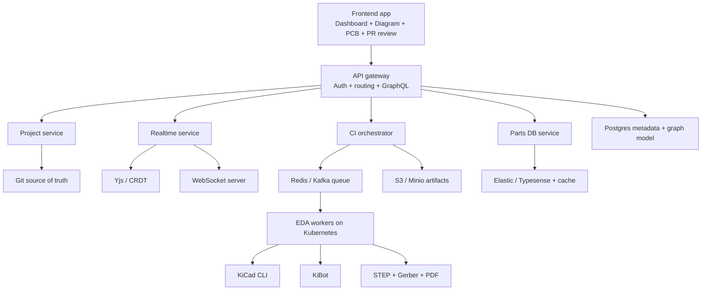

# Spec - YiACAD Git-based EDA platform

## Intent

Build the web-facing YiACAD product as a Git-first EDA platform:

- each project maps to a Git repository
- KiCad files remain the source of truth
- Excalidraw diagrams live as versioned JSON beside the EDA project
- the web product adds dashboard, review, artifacts, realtime collaboration, and CI orchestration

## Core decisions

### 1. Platform core

- self-hosted `Gitea` or `GitLab`
- multi-tenant orgs and teams
- one project equals one repository

### 2. EDA engine

- queue-backed worker orchestration
- `KiCad` headless in containers
- `KiBot` for reproducible outputs
- `KiAuto` for ERC and DRC gates

### 3. Frontend

- `Next.js` + `React`
- `Excalidraw` for system and wiring diagrams
- `KiCanvas` for PCB and schematic viewing
- `Three.js` and `WASM` are phase-2/phase-3 concerns, not MVP blockers

### 4. Realtime

- `Yjs` as CRDT layer
- dedicated websocket server
- persistence lane isolated from the HTTP GraphQL gateway

### 5. Data model

- Git keeps canonical EDA and diagram files
- Postgres or equivalent metadata/graph layer powers search, analytics, intelligent diffs, and SaaS controls

### 6. Parts/library system

- `ElasticSearch` or `Typesense`
- Redis cache
- imports from KiCad libs and external catalogs

### 7. Hardware CI/CD

- Git push triggers CI
- workers run KiBot and KiCad CLI
- outputs include Gerber, BOM, STEP, PDF

### 8. Infra

- Kubernetes-backed workers
- S3 or Minio for artifacts
- Postgres for metadata
- Redis or Kafka for queueing
- OAuth or SSO at the edge

### 9. Multi-tenancy

- namespace isolation
- CI quotas
- usage-based controls

### 10. Business model

- free tier: public projects, limited CI
- paid tier: private repos, compute CI, advanced collaboration
- expansion: fabrication API, pricing, sourcing, component marketplace

### 11. Intelligence overlay

- review assist stays read-only until Git and CI read models are real
- `MCP` or service-first tools are the preferred boundary for parts search, CI triggers, artifact fetch, and ops summary
- Git remains the only product source of truth; Yjs remains collaboration transport; workers remain execution

## Product pages

- Project dashboard
- Diagram editor
- PCB viewer
- PR review

## Roadmap

### Phase 1

- Git + KiBot CI
- web viewer
- artifact surfacing

### Phase 2

- collaboration and comments
- parts DB
- PR previews

### Phase 3

- browser-side editing
- simulation
- AI assist

## Mermaid

## Current implementation delta

- `web/` now hosts the first Next.js scaffold.
- GraphQL currently exposes project state, diagrams, CI queue, artifacts, and PR review placeholders.
- Realtime transport is present as a dedicated Yjs websocket lane, but Excalidraw scene binding to CRDT is not done yet.
- KiCanvas support is vendored from the official bundle path into `web/public/vendor/kicanvas.js`.
- Queueing is now Redis-backed through `BullMQ`, with a dedicated worker entry at `web/workers/eda-worker.mjs`.
- The worker already routes into existing repo tools for `kicad-headless`, `step-export`, KiBot-compatible output generation, and KiAuto hooks.
- The remaining gaps are explicit: no real Git/PR read model yet, no live artifact serving surface, no Excalidraw-to-Yjs scene binding, and no read-only review assist/ops summary inside the product.
