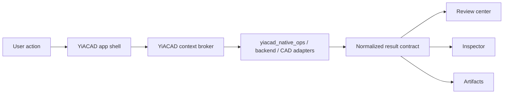

# YiACAD T-UX-004 - Orchestration UX native

## Intent

Faire passer YiACAD d'un ensemble d'actions et d'adaptateurs CAD disponibles a une app autonome pilotee: palette de commandes, review center, inspector persistant et contrats de restitution homogenes entre l'app, le backend et les artefacts.

## Contexte

- Normalisation canonique `2026-03-29`:
  - `YiACAD` est une app independante.
  - `KiCad`, `FreeCAD`, `KiBot`, `KiAuto` et les runtimes CAD sont des moteurs integres a YiACAD, pas les shells produit de reference.
  - les references historiques aux forks `kicad-ki` / `freecad-ki`, plugins et workbenches restent archivees comme traces d'exploration, mais ne definissent plus la cible produit.
- Les actions de base sont disponibles via `tools/cad/yiacad_native_ops.py`.
- Le prochain risque n'est plus l'absence d'action mais la dispersion de l'experience utilisateur.
- Les ancrages SOT 2026 sont publies dans:
  - `specs/yiacad_2026_stack_target_spec.md`
  - `specs/yiacad_adr_20260329_sot.md`
  - `specs/yiacad_90_day_delivery_plan.md`
  - `specs/yiacad_plugin_workbench_ci_plan.md`

## Objectifs

1. Exposer une palette de commandes YiACAD sur les surfaces majeures de l'app.
2. Creer un review center lisible pour `ERC/DRC`, `BOM review`, `ECAD/MCAD sync`.
3. Rendre l'inspector YiACAD persistant et contextuel.
4. Uniformiser les contrats de sortie pour chaque action YiACAD.

## Non-objectifs

- construire un backend compile complet dans ce lot
- faire de `KiCad` ou `FreeCAD` les surfaces hotes principales de YiACAD
- lancer des validations lourdes automatiques depuis l'UI

## Requirements fonctionnels

- La palette doit exposer au minimum:
  - `YiACAD Status`
  - `YiACAD ERC/DRC`
  - `YiACAD BOM Review`
  - `YiACAD ECAD/MCAD Sync`
  - `Open Artifacts`
- Le review center doit afficher:
  - statut global
  - severite
  - chemin artefact
  - prochaine action recommandee
- L'inspector doit pouvoir rester ouvert et se mettre a jour selon le contexte projet.
- L'app doit rester exploitable sans integration compilee dans `KiCad` ou `FreeCAD`.
- Les retours doivent rester compréhensibles hors IA et sans magie implicite.

## Requirements non fonctionnels

- fallback non-IA explicite
- latence et etat de traitement visibles
- sorties deterministes reutilisables par les TUI
- pas de dependance obligatoire a un shell `KiCad` ou `FreeCAD`
- echec d'adaptateur visible et isole du shell produit YiACAD
- authoring canonique sur `desktop`, review canonique sur `web`

## Contrat de sortie cible

```json
{
  "component": "yiacad",
  "surface": "yiacad-desktop|yiacad-web|yiacad-api|tui",
  "action": "review.erc_drc",
  "execution_mode": "interactive|batch|background",
  "status": "done|degraded|blocked",
  "severity": "info|warning|error",
  "summary": "human readable summary",
  "details": "optional long form details",
  "artifacts": [
    {
      "kind": "report|log|export|evidence",
      "path": "/abs/path/to/file",
      "label": "optional human label"
    }
  ],
  "next_steps": ["open review center", "rerun with project loaded"],
  "context_ref": "optional project/runtime reference"
}
```

Schema canonique publiée:
- `specs/contracts/yiacad_uiux_output.schema.json`
- exemple: `specs/contracts/examples/yiacad_uiux_output.example.json`

Règles de compat:
- `status` reste strictement borné à `done | degraded | blocked`
- `severity` reste strictement borné à `info | warning | error`
- toutes les extensions doivent être additives et optionnelles
- les surfaces UI ne doivent jamais avoir à parser un message libre pour retrouver `artifacts` ou `next_steps`

## Diagramme de flux



## Agents

- `DesignOps-UI`: orchestration UX, palette, review center
- `YiACAD-App lane`: shell desktop/web/app et navigation
- `EDA-Engines lane`: KiCad, FreeCAD, KiBot, KiAuto, workers et imports/exports
- `AgentMatrix lane`: plans, TODOs, competence mapping

## Taches prioritaires

1. definir le contrat de sortie UI commun
2. creer la palette de commandes YiACAD dans l'app
3. monter le review center
4. rendre l'inspector persistant
5. brancher les actions app sur le contrat unifie et les moteurs integres
