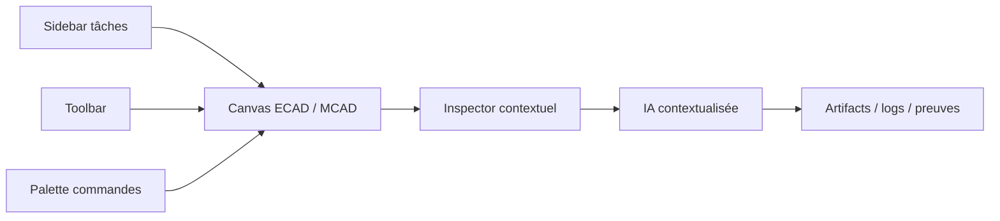

# Spec - YiACAD UI/UX Apple-native

## Contexte

`YiACAD` est la base `KiCad + FreeCAD` pilotée par la lane IA-native de `Kill_LIFE`. La présente spec cadre la refonte UI/UX Apple-native au `2026-03-20`.

## Objectifs

- unifier l’expérience KiCad, FreeCAD et cockpit autour d’une architecture cohérente;
- rendre les actions `review`, `sync`, `inspect` et `artifacts` immédiatement accessibles;
- intégrer l’IA comme assistance contextualisée, traçable et révocable;
- aligner la hiérarchie visuelle sur les patterns Apple/macOS actuels.

## Non-objectifs

- ne pas réécrire immédiatement les noyaux ECAD/MCAD;
- ne pas masquer les fonctions natives de KiCad ou FreeCAD;
- ne pas auto-appliquer des correctifs IA sur les modèles CAD.

## Principes UX

- `clarity`: navigation lisible, faible bruit, labels explicites;
- `context`: détails et suggestions dans l’inspector, pas dans des modales en cascade;
- `focus`: toolbar courte, actions primaires visibles, secondaires dans la palette;
- `traceability`: chaque sortie IA renvoie vers les artefacts et preuves;
- `reversibility`: aucune action destructive implicite.

## Architecture fonctionnelle

## Capacités clés

| Capability | Description | Entrée | Sortie |
| --- | --- | --- | --- |
| `review.erc_drc` | lancer et résumer `ERC` + `DRC` | board + schematic | rapports JSON + digest |
| `review.bom` | exporter et auditer une BOM | schematic | CSV + résumé des champs vides |
| `sync.ecad_mcad` | exporter les artefacts STEP croisés | board + document FreeCAD | STEP + résumé de sync |
| `status.surface` | exposer l’état YiACAD | artefacts existants | snapshot markdown |
| `ai.explain` | expliquer un warning/signal | sélection utilisateur | explication + provenance |

## Contrat d’intégration IA

- l’IA n’est qu’une couche d’assistance;
- toutes les suggestions doivent être rattachées à une preuve ou à un artefact;
- les commandes doivent rester utilisables sans modèle distant;
- les sorties doivent être enregistrées dans `artifacts/cad-ai-native/`.

## Instrumentation

- surfaces utilisateur: répertoires KiCad et FreeCAD liés aux forks natifs;
- utilitaires concrets: `tools/cad/yiacad_native_ops.py`;
- TUI de pilotage: `tools/cockpit/yiacad_uiux_tui.sh`;
- documentation de référence: `docs/YIACAD_APPLE_UI_UX_*`.

## Mesures de succès

- temps moyen pour lancer une review réduit;
- nombre d’étapes manuelles entre CAD et artefacts réduit;
- état et provenance compréhensibles sans lire les scripts;
- convergence visuelle entre KiCad, FreeCAD et cockpit.

## Plan de livraison

### Phase 1

- audit, spec, feature map, recherche, plan et TODO;
- hooks directs dans les forks;
- TUI dédiée UI/UX.

### Phase 2

- command palette;
- review center;
- inspector contextuel.

### Phase 3

- intégration compilée native dans les forks;
- extension vers App Intents / automatisation locale lorsque la pile est prête.
