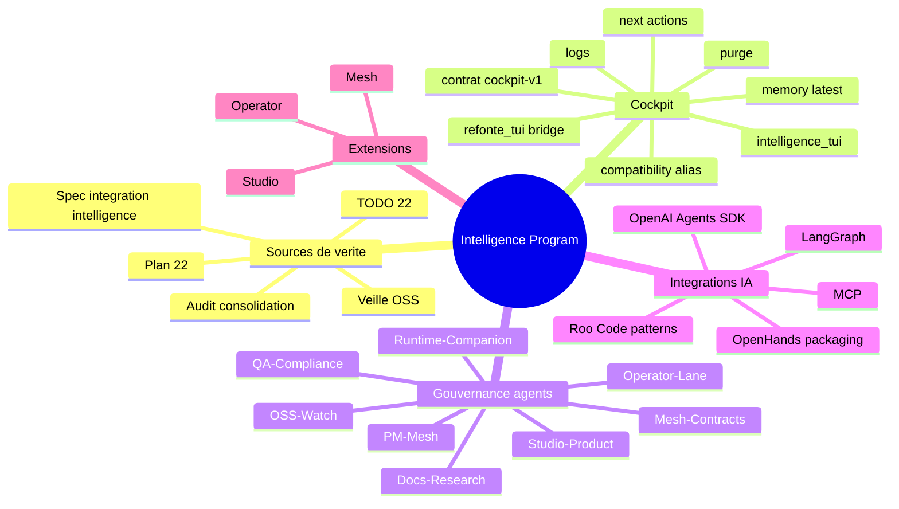
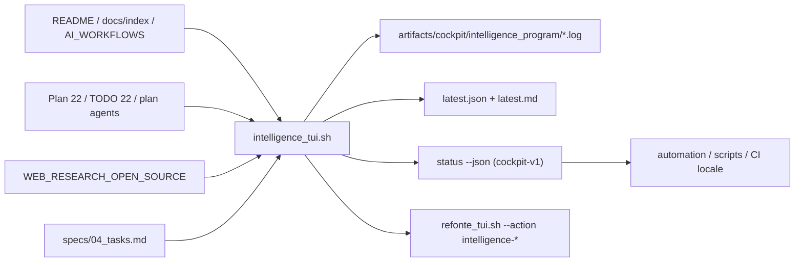

# Feature map - integration intelligence agentique (2026-03-21)

## Vue d'ensemble

## Carte fonctionnelle

## Priorites de livraison

1. surface TUI + logs + contrat JSON
2. memoire + next-actions
3. plan/todo/owners a jour
4. veille 2026 exploitable
5. raccord docs index + README cockpit
6. tests de contrat
