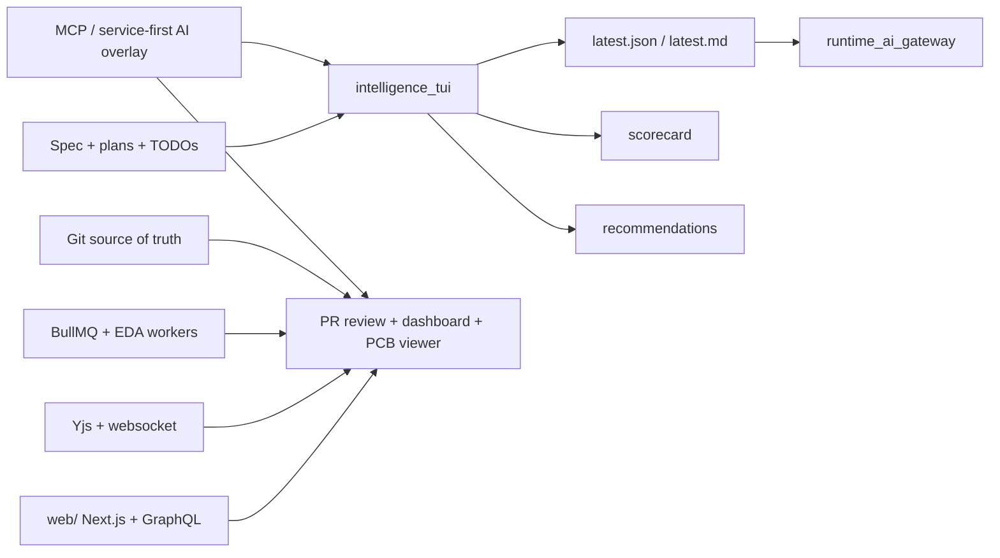

# Agentic intelligence feature map (2026-03-22)

## Scope

This map covers the current 2026 intelligence lane across docs, cockpit, YiACAD native CAD, and the `web/` Git EDA platform.

## Feature lanes

| Lane | Current state | Next meaningful lot |
| --- | --- | --- |
| Contracts | `cockpit-v1`, `summary-short/v1`, `runtime-mcp-ia-gateway/v1` are live | stabilize the canonical source matrix and artifact cadence |
| Intelligence TUI | status, memory, scorecard, comparison, recommendations | surface `plan 23` and web runtime signals |
| Native YiACAD CAD | KiCad/FreeCAD shells, backend service-first, review center | deeper compiled UI and richer direct backend hooks |
| Web Git EDA | buildable scaffold, GraphQL, Yjs transport, BullMQ worker | real Git read model, live artifacts, Yjs scene binding |
| Review assist | not yet productized | read-only hints from changed files, ERC/DRC, ops summary |
| MCP/service tools | tracked in docs/backlog | formalize parts, CI, artifact and review tool boundaries |
