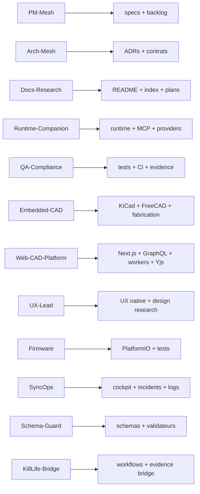

# Matrice agentique spec/module tri-repo

Last updated: 2026-03-29

Cette matrice aligne les surfaces du repo avec le catalogue canonique 2026. Les seuls `owner_agent` top-level autorisés sont `PM-Mesh`, `Arch-Mesh`, `Docs-Research`, `Runtime-Companion`, `QA-Compliance`, `Embedded-CAD`, `Web-CAD-Platform`, `UX-Lead`, `Firmware`, `SyncOps`, `Schema-Guard` et `KillLife-Bridge`.

## Règles

- Une surface = un `owner_agent` top-level canonique.
- Les sous-agents sont de la metadata de lane et ne remplacent jamais l'owner top-level.
- Les write sets restent disjoints par lot.
- Les surfaces bridge et evidence doivent publier `owner_repo`, `owner_agent`, `write_set`, `status`, `evidence`.

## Specifications Kill_LIFE

| Surface | Owner agent | Metadata de lane | Write set principal |
| --- | --- | --- | --- |
| `specs/00_intake.md` | `PM-Mesh` | `Intake-Guard` | `specs/00_intake.md` |
| `specs/01_spec.md` | `Arch-Mesh` | `Requirements-Lead` | `specs/01_spec.md` |
| `specs/02_arch.md` | `Arch-Mesh` | `Contract-Guard` | `specs/02_arch.md` |
| `specs/03_plan.md` | `PM-Mesh` | `Plan-Orchestrator` | `specs/03_plan.md` |
| `specs/04_tasks.md` | `PM-Mesh` | `Todo-Tracker` | `specs/04_tasks.md` |
| `specs/README.md` | `Docs-Research` | `Doc-Entry` | `specs/README.md` |
| `specs/constraints.yaml` | `QA-Compliance` | `Constraint-Gate` | `specs/constraints.yaml` |
| `specs/agentic_intelligence_integration_spec.md` | `PM-Mesh` | `Plan-Orchestrator` | `specs/agentic_intelligence_integration_spec.md` |
| `specs/mcp_agentics_target_backlog.md` | `Runtime-Companion` | `MCP-Health` | `specs/mcp_agentics_target_backlog.md` |
| `specs/kicad_mcp_scope_spec.md` | `Embedded-CAD` | `CAD-Bridge` | `specs/kicad_mcp_scope_spec.md` |
| `specs/yiacad_git_eda_platform_spec.md` | `Web-CAD-Platform` | `Project-Service` | `specs/yiacad_git_eda_platform_spec.md` |
| `specs/yiacad_uiux_apple_native_spec.md` | `UX-Lead` | `Apple-HIG` | `specs/yiacad_uiux_apple_native_spec.md` |
| `specs/zeroclaw_dual_hw_orchestration_spec.md` | `Embedded-CAD` | `CAD-Fusion` | `specs/zeroclaw_dual_hw_orchestration_spec.md` |
| `specs/zeroclaw_dual_hw_todo.md` | `Firmware` | `FW-Build` | `specs/zeroclaw_dual_hw_todo.md` |
| `specs/contracts/agent_catalog.schema.json` | `Schema-Guard` | `Catalog-Schema` | `specs/contracts/agent_catalog.schema.json` |
| `specs/contracts/kill_life_agent_catalog.json` | `Schema-Guard` | `Catalog-Registry` | `specs/contracts/kill_life_agent_catalog.json` |
| `specs/contracts/agent_handoff.schema.json` | `Schema-Guard` | `Handoff-Schema` | `specs/contracts/agent_handoff.schema.json` |
| `specs/contracts/runtime_mcp_ia_gateway.schema.json` | `Schema-Guard` | `Gateway-Schema` | `specs/contracts/runtime_mcp_ia_gateway.schema.json` |
| `specs/contracts/operator_lane_evidence.schema.json` | `Schema-Guard` | `Evidence-Schema` | `specs/contracts/operator_lane_evidence.schema.json` |

## Modules Kill_LIFE

| Surface | Owner agent | Metadata de lane | Write set principal |
| --- | --- | --- | --- |
| `kill_life/server.py`, `kill_life/agent_catalog.py` | `Arch-Mesh` | `Contract-Guard` | `kill_life/` |
| `agents/*`, `.github/agents/*` | `Docs-Research` | `Agent-Catalog` | `agents/*`, `.github/agents/*` |
| `.github/prompts/*` | `PM-Mesh` | `Prompt-Registry` | `.github/prompts/*` |
| `.github/workflows/*` | `QA-Compliance` | `Release-Gates` | `.github/workflows/*` |
| `tools/specs/*` | `Schema-Guard` | `Catalog-Validator` | `tools/specs/*` |
| `tools/cockpit/*` | `SyncOps` | `TUI-Ops` | `tools/cockpit/*` |
| `tools/ai/*`, `tools/ops/*` | `Runtime-Companion` | `Provider-Bridge` | `tools/ai/*`, `tools/ops/*` |
| `tools/cad/*`, `tools/hw/*`, `hardware/*` | `Embedded-CAD` | `CAD-Bridge` | `tools/cad/*`, `tools/hw/*`, `hardware/*` |
| `web/app/*`, `web/components/*`, `web/lib/*`, `web/realtime/*`, `web/workers/*` | `Web-CAD-Platform` | `Project-Service`, `Realtime-Collab`, `EDA-CI-Orchestrator`, `Review-Assist`, `Artifacts-Bridge` | `web/*` |
| `docs/YIACAD_*`, `docs/CAD_AI_NATIVE_*` | `UX-Lead` | `UI-Research` | `docs/YIACAD_*`, `docs/CAD_AI_NATIVE_*` |
| `firmware/*` | `Firmware` | `FW-Build` | `firmware/*` |
| `README.md`, `README_FR.md`, `docs/index.md`, `docs/plans/*` | `Docs-Research` | `Doc-Entry`, `Plan-Recorder` | `README.md`, `README_FR.md`, `docs/index.md`, `docs/plans/*` |
| `workflows/*`, `specs/contracts/ops_*`, `specs/contracts/artifact_*` | `KillLife-Bridge` | `Workflow-Editor`, `Evidence-Runner` | `workflows/*`, `specs/contracts/ops_*`, `specs/contracts/artifact_*` |

## Surfaces tri-repo

| Surface | Owner agent | Metadata de lane | Intention |
| --- | --- | --- | --- |
| `kill-life-studio` product/spec surfaces | `PM-Mesh` | `Plan-Orchestrator` | arbitrage produit, lot sequencing, dépendances |
| `kill-life-mesh` contract and ownership surfaces | `Arch-Mesh` | `Mesh-Contracts` | contrats tri-repo, ownership, propagation |
| `kill-life-operator` runbooks and execution evidence | `SyncOps` | `Doc-Runbook`, `Log-Ops` | opérations, incidents, evidence packs |
| `mascarade-main` runtime bridge | `Runtime-Companion` | `Provider-Bridge`, `MCP-Health` | runtime live, provider routing, degraded-safe bridge |
| `crazy_life-main` workflow/evidence bridge | `KillLife-Bridge` | `Workflow-Editor`, `Schema-Consumer` | bridge API/workflow/evidence |

## Delta 2026-03-29

- Les anciens owners prose comme `Web-Cockpit`, `DesignOps-UI`, `Studio-Product`, `Mesh-Contracts` et `Operator-Lane` ne servent plus de couche top-level dans cette matrice.
- Le runtime public et les producteurs de gouvernance doivent exposer uniquement les 12 IDs canoniques.
- Les détails de lane restent possibles via `owner_subagent` ou métadonnées équivalentes, sans casser la couche top-level canonique.
