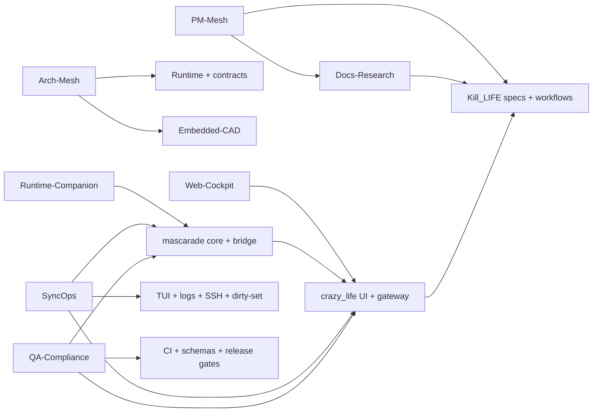

# Matrice agentique spec/module tri-repo

Last updated: 2026-03-22 14:30 CET

## Regles d'affectation

- Une specification ou un module = un `owner_agent`, un `sub_agent`, un `write_set` et une preuve attendue.
- Les surfaces cross-repo et hors-repo sont `single-writer`.
- Les write-sets restent disjoints par lot.
- Les lanes mesh `*-main` sont les seules lanes de propagation.
- `cils` reste sous garde `cils-lockdown` pour les surfaces non critiques.

## Kill_LIFE - specifications

| Specification | Owner agent | Sub-agent | Competences / skills | Write-set principal |
| --- | --- | --- | --- | --- |
| `specs/00_intake.md` | `PM-Mesh` | `Intake-Guard` | cadrage, triage, backlog | `specs/00_intake.md` |
| `specs/01_spec.md` | `Arch-Mesh` | `Requirements-Lead` | exigences, AC, frontieres | `specs/01_spec.md` |
| `specs/02_arch.md` | `Arch-Mesh` | `Contract-Guard` | architecture, ADR, compat | `specs/02_arch.md` |
| `specs/03_plan.md` | `PM-Mesh` | `Plan-Orchestrator` | sequencing, dependances, lots | `specs/03_plan.md` |
| `specs/04_tasks.md` | `PM-Mesh` | `Todo-Tracker` | execution, preuve, priorisation | `specs/04_tasks.md` |
| `specs/constraints.yaml` | `QA-Compliance` | `Constraint-Gate` | gates, invariants, drift control | `specs/constraints.yaml` |
| `specs/README.md` | `Docs-Research` | `Spec-Index` | navigation, source of truth | `specs/README.md` |
| `specs/knowledge_base_mcp_spec.md` | `Runtime-Companion` | `KB-MCP` | MCP, degraded-safe runtime | `specs/knowledge_base_mcp_spec.md` |
| `specs/github_mcp_conversion_spec.md` | `Runtime-Companion` | `Dispatch-MCP` | GitHub dispatch, runtime bridge | `specs/github_mcp_conversion_spec.md` |
| `specs/ci_cd_spec.md` | `QA-Compliance` | `CI-Gate` | CI, release gates, evidence packs | `specs/ci_cd_spec.md` |
| `specs/agentic_intelligence_integration_spec.md` | `PM-Mesh` | `Plan-Orchestrator` | gouvernance intelligence, contrats courts, lanes TUI | `specs/agentic_intelligence_integration_spec.md` |
| `specs/mcp_agentics_target_backlog.md` | `Runtime-Companion` | `MCP-Orchestrator` | backlog MCP, orchestration agentique | `specs/mcp_agentics_target_backlog.md` |
| `specs/mcp_tasks.md` | `Runtime-Companion` | `MCP-Orchestrator` | plan d'execution MCP, checklist | `specs/mcp_tasks.md` |
| `specs/kicad_mcp_scope_spec.md` | `Embedded-CAD` | `CAD-Bridge` | KiCad MCP, host-first CAD | `specs/kicad_mcp_scope_spec.md` |
| `specs/zeroclaw_dual_hw_orchestration_spec.md` | `Embedded-CAD` | `ZeroClaw-Orchestrator` | hardware orchestration, smokes | `specs/zeroclaw_dual_hw_orchestration_spec.md` |
| `specs/zeroclaw_dual_hw_todo.md` | `Embedded-CAD` | `ZeroClaw-Orchestrator` | firmware backlog, execution lot | `specs/zeroclaw_dual_hw_todo.md` |
| `specs/yiacad_uiux_apple_native_spec.md` | `UX-Lead` | `Apple-HIG` | Apple-native UX, CAD shell | `specs/yiacad_uiux_apple_native_spec.md` |
| `specs/yiacad_git_eda_platform_spec.md` | `Web-CAD-Platform` | `Project-Service` | Git-first EDA product, GraphQL, workers, review, multi-tenant path | `specs/yiacad_git_eda_platform_spec.md` |
| `specs/cad_modeling_tasks.md` | `Embedded-CAD` | `CAD-Smoke` | CAD tasking, modeling workflow | `specs/cad_modeling_tasks.md` |
| `specs/mesh_contracts.md` | `Arch-Mesh` | `Mesh-Contracts` | tri-repo contract, handoffs | `specs/mesh_contracts.md` |
| `specs/contracts/agent_handoff.schema.json` | `Schema-Guard` | `Handoff-Schema` | schema versioning, strict contract | `specs/contracts/agent_handoff.schema.json` |
| `specs/contracts/repo_snapshot.schema.json` | `Schema-Guard` | `Snapshot-Schema` | repo-state, snapshot contract | `specs/contracts/repo_snapshot.schema.json` |
| `specs/contracts/workflow_handshake.schema.json` | `Schema-Guard` | `Workflow-Schema` | workflow handshake, compat UI/API | `specs/contracts/workflow_handshake.schema.json` |
| `specs/contracts/operator_lane_evidence.schema.json` | `Schema-Guard` | `Evidence-Schema` | E2E evidence, operator lane | `specs/contracts/operator_lane_evidence.schema.json` |

## Kill_LIFE - modules

| Module | Owner agent | Sub-agent | Competences / skills | Write-set principal |
| --- | --- | --- | --- | --- |
| `tools/cockpit/*` | `SyncOps` | `TUI-Ops` | `bash-cli-tui`, SSH, logs, runbooks | `tools/cockpit/*` |
| `tools/cad/*` | `Embedded-CAD` | `CAD-UX` | host-first CAD, native hooks, review/sync ops | `tools/cad/*` |
| `tools/ai/*` | `Runtime-Companion` | `Agent-Orchestrator` | runtime AI, orchestration, provider bridges | `tools/ai/*` |
| `tools/hw/*` | `Embedded-CAD` | `CAD-Bridge` | KiCad, FreeCAD, MCP, exports, smoke | `tools/hw/*` |
| `tools/ops/*` | `Runtime-Companion` | `Provider-Bridge` | live provider bridge, smoke E2E | `tools/ops/*` |
| `tools/repo_state/*` | `SyncOps` | `Repo-State` | repo refresh, machine memory | `tools/repo_state/*` |
| `tools/specs/*` | `Schema-Guard` | `Spec-Mirror` | schema checks, mirror sync | `tools/specs/*` |
| `web/app/*` | `Web-CAD-Platform` | `Product-Web` | Next.js routes, dashboard, review, product shell | `web/app/*` |
| `web/components/*` | `Web-CAD-Platform` | `Review-Assist` | Excalidraw, KiCanvas, PR review, diff UX | `web/components/*` |
| `web/lib/graphql/*`, `web/lib/project-store.ts`, `web/lib/types.ts` | `Web-CAD-Platform` | `Project-Service` | GraphQL, Git read model, project metadata, contracts | `web/lib/graphql/*`, `web/lib/project-store.ts`, `web/lib/types.ts` |
| `web/lib/eda-queue.ts`, `web/lib/ci-enqueue.ts`, `web/workers/*` | `Web-CAD-Platform` | `EDA-CI-Orchestrator` | BullMQ, Redis, KiCad/KiBot/KiAuto worker orchestration | `web/lib/eda-queue.ts`, `web/lib/ci-enqueue.ts`, `web/workers/*` |
| `web/realtime/*` | `Web-CAD-Platform` | `Realtime-Collab` | Yjs, CRDT, websocket, presence, persistence | `web/realtime/*` |
| `web/project/*`, `web/public/vendor/*` | `Web-CAD-Platform` | `Artifacts-Bridge` | demo fixtures, artifacts, vendored viewers, sample state | `web/project/*`, `web/public/vendor/*` |
| `hardware/*` | `Embedded-CAD` | `HW-BOM` | hardware assets, BOM, DRC, previews | `hardware/*` |
| `firmware/*` | `Firmware` | `FW-Build` | PlatformIO, firmware loop, evidence | `firmware/*` |
| `compliance/*` | `QA-Compliance` | `Constraint-Gate` | standards, evidence, quality gates | `compliance/*` |
| `openclaw/*` | `Runtime-Companion` | `Sandbox-Guard` | safe automation, labels, scope guard | `openclaw/*` |
| `agents/*` + `.github/agents/*` | `Docs-Research` | `Agent-Catalog` | role docs, ownership, onboarding | `agents/*`, `.github/agents/*` |
| `.github/prompts/*` | `PM-Mesh` | `Prompt-Registry` | orchestration prompts, handoff prompts | `.github/prompts/*` |
| `workflows/*` | `KillLife-Bridge` | `Workflow-Editor` | workflow contracts, operator lane | `workflows/*` |
| `.github/workflows/*` | `QA-Compliance` | `Release-Gates` | CI, static checks, contract gates | `.github/workflows/*` |
| `docs/plans/*` | `Docs-Research` | `Plan-Recorder` | plan memory, ownership, priorities | `docs/plans/*` |
| `docs/*manifest*`, `docs/*LANDSCAPE*`, `docs/*FEATURE*` | `Docs-Research` | `Mermaid-Map` | narrative docs, feature maps | `docs/REFACTOR_MANIFEST_2026-03-20.md`, `docs/AGENTIC_LANDSCAPE.md`, `docs/KILL_LIFE_FEATURE_MAP_2026-03-11.md` |
| `docs/index.md`, `docs/QUICKSTART.md`, `docs/RUNBOOK.md` | `Docs-Research` | `Doc-Entry` | entry docs, operator navigation, discoverability | `docs/index.md`, `docs/QUICKSTART.md`, `docs/RUNBOOK.md` |
| `docs/CAD_AI_NATIVE_*`, `docs/YIACAD_*` | `UX-Lead` | `UI-Research` | Apple-native UX, runbooks, insertion points | `docs/CAD_AI_NATIVE_GUI_RUNBOOK_2026-03-20.md`, `docs/CAD_AI_NATIVE_HOOKS_2026-03-20.md`, `docs/YIACAD_*` |
| `.runtime-home/cad-ai-native-forks/kicad-ki/*` | `Embedded-CAD` | `KiCad-Native` | wx, AUI, tool actions, shell natif | `.runtime-home/cad-ai-native-forks/kicad-ki/*` |
| `.runtime-home/cad-ai-native-forks/freecad-ki/*` | `Embedded-CAD` | `FreeCAD-Native` | Qt, workbench, dock windows, shell natif | `.runtime-home/cad-ai-native-forks/freecad-ki/*` |

## `mascarade-main` - workstreams

| Workstream | Owner agent | Sub-agent | Competences / skills | Write-set principal |
| --- | --- | --- | --- | --- |
| `WS0 Gouvernance / sync` | `SyncOps` | `Docs-Research` | publication, merge preflight, hub | `README.md`, `plan.md`, `docs/EXECUTION_HUB.md`, `scripts/merge_preflight.sh` |
| `WS1 Core routing/providers` | `Runtime-Companion` | `Provider-Bridge` | providers, routing, metrics | `core/mascarade/router/**`, `load_balancer/**`, `provider_admin.py` |
| `WS2 Core agents/orchestrator` | `Runtime-Companion` | `Agent-Orchestrator` | orchestration, conversation, dispatch | `core/mascarade/agents/**`, `orchestrator/**`, `dispatch/**` |
| `WS3 Cluster / P2P` | `SyncOps` | `Mesh-Cluster` | P2P, topology, host review | `core/mascarade/p2p/**`, `core/scripts/p2p/**`, `cluster.py` |
| `WS4 Node engine` | `Arch-Mesh` | `Graph-Engine` | graph workflow, type mirror | `core/mascarade/node_engine/**`, `api/src/types/node-engine.ts`, `api/src/routes/nodes.ts` |
| `WS5 API gateway` | `Runtime-Companion` | `Gateway-Contracts` | API auth, routes, proxy core | `api/src/**` hors `killlife.ts` et `node-engine.ts` |
| `WS6 Kill_LIFE bridge` | `KillLife-Bridge` | `Evidence-Runner` | cross-repo workflow/evidence bridge | `api/src/lib/killlife.ts`, `api/src/routes/killlife.ts`, `docker-compose.yml` |
| `WS7 Web cockpit bridge` | `Web-Cockpit` | `Ops-Views` | bridge web, snapshots, operator views | `web/src/**` hors `KillLife*`, `api/public/**` |
| `WS8 Deploy / ops stack` | `SyncOps` | `Compose-Generator` | compose, services, deploy, observability | `docker-compose.yml`, `deploy/**`, `scripts/lib.sh`, `scripts/services.sh`, `scripts/compose.sh`, `scripts/modules/**` |
| `WS9 Finetune / training` | `Runtime-Companion` | `Finetune-Ops` | datasets, finetune, batch runner | `finetune/**`, `training/**`, `core/scripts/finetune/**` |

## `crazy_life-main` - workstreams

| Workstream | Owner agent | Sub-agent | Competences / skills | Write-set principal |
| --- | --- | --- | --- | --- |
| `WS-01 Shell-nav` | `Web-Cockpit` | `UI-Flow` | shell UI, routing, layout | `src/main.tsx`, `src/App.tsx`, `src/components/layout/**` |
| `WS-02 Auth-theme-config` | `Web-Cockpit` | `UI-Theme` | auth, providers settings, design system | `src/index.css`, `src/components/ui/**`, `src/auth/**`, `src/pages/Settings.tsx` |
| `WS-03 Core AI/operator` | `Web-Cockpit` | `UI-Flow` | dashboard, agents, orchestrate | `src/pages/Dashboard.tsx`, `src/pages/Agents.tsx`, `src/pages/Orchestrate.tsx`, `src/api/agents.ts` |
| `WS-04 Ops/observability` | `Web-Cockpit` | `Log-Ops` | logs, metrics, infrastructure, ops hub | `src/pages/OpsHub.tsx`, `src/pages/Logs.tsx`, `src/pages/Metrics.tsx`, `src/pages/Infrastructure.tsx`, `src/api/ops.ts` |
| `WS-05 Integrations externes` | `Web-Cockpit` | `Schema-Consumer` | knowledge base, ComfyUI, external bridges | `src/pages/KnowledgeBrowser.tsx`, `src/pages/ComfyUI.tsx`, `src/api/knowledgeBase.ts`, `src/api/comfyui.ts` |
| `WS-06 Crazy Lane UI` | `Web-Cockpit` | `Schema-Consumer` | Crazy Lane, workflow editor UI | `src/pages/CrazyLane.tsx`, `src/pages/CrazyLaneEditor.tsx`, `src/api/killlife.ts` |
| `WS-07 Gateway core` | `Web-Cockpit` | `Gateway-Core` | Hono gateway, auth, proxy allowlist | `api/src/index.ts`, `api/src/index.test.ts` |
| `WS-08 Kill_LIFE backend lane` | `KillLife-Bridge` | `Schema-Consumer` | backend lane, operator bridge, evidence | `api/src/routes/killlife.ts`, `api/src/lib/killlife.ts`, `api/src/routes/killlife.integration.test.ts`, `api/src/lib/killlife.test.ts` |
| `WS-09 Build/release/deploy` | `SyncOps` | `Release-Gates` | package/build/deploy/release | `package.json`, `api/package.json`, `Dockerfile`, `docker-compose.local.yml`, `deploy/**`, `scripts/**`, `.github/workflows/**` |
| `WS-10 Docs/contracts` | `Docs-Research` | `Mermaid-Map` | operator docs, publish flow, lot split | `README.md`, `plan.md`, `docs/**` |
| `WS-11 Legacy quarantine` | `Web-Cockpit` | `Quarantine-Guard` | legacy freeze, drift prevention | `src/pages/KillLifeWorkflows.tsx`, `src/pages/KillLifeWorkflowEditor.tsx` |

## Hotspots `single-writer`

- `Kill_LIFE`: `tools/cockpit/mesh_sync_preflight.sh`, `tools/cockpit/full_operator_lane.sh`, `workflows/embedded-operator-live.json`.
- `mascarade-main`: `api/src/lib/killlife.ts`, `api/src/routes/killlife.ts`, `docker-compose.yml`, `scripts/mesh_runtime_preflight.sh`.
- `crazy_life-main`: `api/src/index.ts`, `api/src/lib/killlife.ts`, `api/src/routes/killlife.ts`, `src/pages/CrazyLaneEditor.tsx`.

## Prochains lots recommandes

1. `T-AG-004` - brancher cette matrice dans les runbooks et TODOs companions sans casser les single-writer hotspots.
2. `T-UX-003` - exposer la matrice et les points d’insertion natifs dans les TUI operatoires.
3. `T-RE-204` - reprendre `zeroclaw-integrations` une fois la matrice agentique publiee.
4. `T-RE-209` - finaliser `yiacad-fusion` avec ownership strict `Arch-Mesh` / `CAD-Bridge`.
5. `T-OL-005` - requalifier le `model` explicite apres stabilisation complete du chemin par defaut.

## Delta 2026-03-20 - mapping spec/module T-UX-004
- `specs/yiacad_tux004_orchestration_spec.md` -> owner `DesignOps-UI` -> sous-agents `Sagan/Godel`, `Peirce/Locke`, `AgentMatrix lane`.
- module `kicad-ki/*` -> owner `Sagan/Godel lane` -> focus `command palette`, `review center`, `output contract hookup`.
- module `freecad-ki/src/Mod/YiACADWorkbench/*` -> owner `Peirce/Locke lane` -> focus `persistent inspector`, `review center`, `command palette`.
- module `tools/cad/yiacad_native_ops.py` -> owner `CAD IA runtime lane` -> focus `normalized outputs`, `context broker`, `artifact lineage`.

## Delta 2026-03-20 18:35 - canonical mapping T-UX-003 / T-UX-004

- `T-UX-003A` -> owner `CAD-UX / KiCad-Shell` -> write-set `kicad-ki/pcbnew/toolbars_pcb_editor.cpp`, `kicad-ki/eeschema/toolbars_sch_editor.cpp`
- `T-UX-003B` -> owner `CAD-UX / FreeCAD-Shell` -> write-set `freecad-ki/src/Mod/YiACADWorkbench/yiacad_freecad_gui.py`
- `T-UX-003C` -> owner `CAD-UX / KiCad-Native` -> write-set `kicad-ki/pcbnew/tools/board_editor_control.*`, `kicad-ki/eeschema/tools/sch_editor_control.*`
- `T-UX-003D` -> owner `CAD-UX / FreeCAD-Native` -> write-set `freecad-ki/src/Gui/MainWindow.cpp`
- `T-UX-004A` -> owner `CAD-UX / KiCad-Surface + FreeCAD-Surface` -> write-set `kicad-ki/scripting/plugins/yiacad_kicad_plugin/yiacad_action.py`, `freecad-ki/src/Mod/YiACADWorkbench/yiacad_freecad_gui.py`
- `T-UX-004B` -> owner `Doc-Research / Mermaid-Map + OSS-Watch` -> write-set `docs/YIACAD_*`, `docs/plans/20_*`, `specs/04_tasks.md`
- `Support UI/UX Ops` -> owner `SyncOps / TUI-Ops + Log-Guard` -> write-set `tools/cockpit/yiacad_uiux_tui.sh`, `artifacts/uiux_tui/*`

## Delta 2026-03-22 - canonical mapping intelligence web / plan 23

- `T-AI-320` -> owner `PM-Mesh / Plan-Orchestrator` -> write-set `specs/agentic_intelligence_integration_spec.md`, `docs/plans/22_*`, `tools/cockpit/intelligence_tui.sh`
- `T-AI-321` -> owner `Docs-Research / Runbook-Editor + Mermaid-Map + OSS-Watch` -> write-set `docs/KILL_LIFE_CONSOLIDATION_AUDIT_2026-03-22.md`, `docs/WEB_RESEARCH_OPEN_SOURCE_2026-03-22.md`, `docs/AGENTIC_INTELLIGENCE_FEATURE_MAP_2026-03-22.md`
- `T-AI-322` -> owner `Docs-Research / Plan-Recorder` -> write-set `docs/plans/12_plan_gestion_des_agents.md`, `docs/AGENT_SPEC_MODULE_MATRIX_2026-03-20.md`
- `T-AI-323` -> owner `Web-CAD-Platform / EDA-CI-Orchestrator + Realtime-Collab` -> write-set `web/lib/*`, `web/realtime/*`, `web/workers/*`, `tools/cockpit/intelligence_tui.sh`
- `T-AI-324` -> owner `Web-CAD-Platform / Project-Service` -> write-set `web/lib/project-store.ts`, `web/lib/graphql/*`, `web/app/api/*`
- `T-AI-325` -> owner `Web-CAD-Platform / Realtime-Collab` -> write-set `web/components/excalidraw-canvas.tsx`, `web/lib/realtime/*`, `web/components/project-shell.tsx`
- `T-AI-326` -> owner `Runtime-Companion / Review-Assist` -> write-set `web/lib/intelligence/*`, `docs/AI_WORKFLOWS.md`, `specs/mcp_agentics_target_backlog.md`
