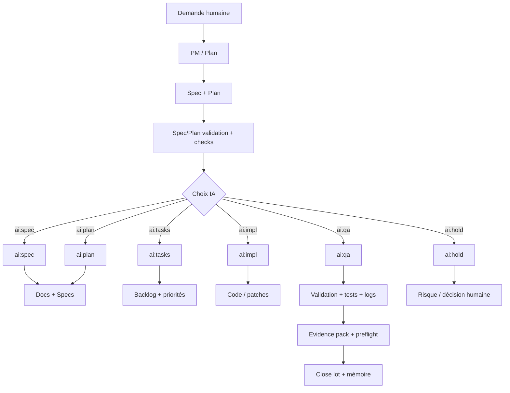
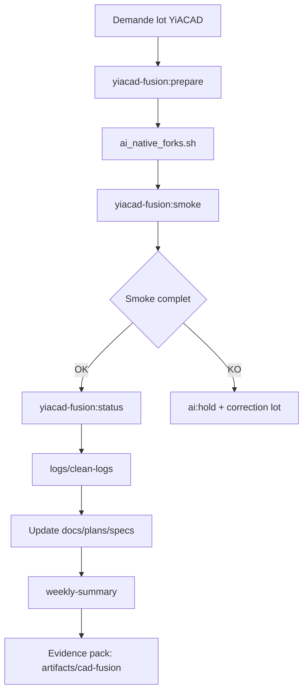
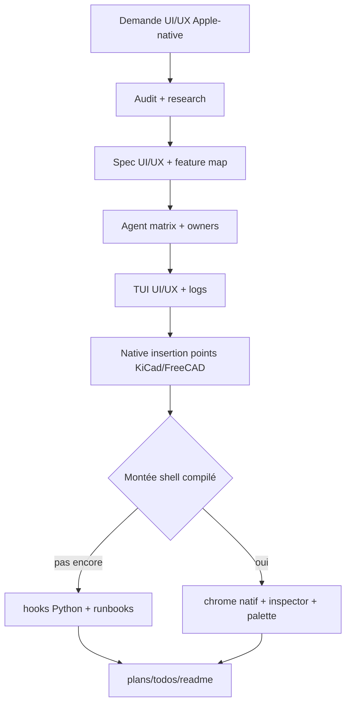
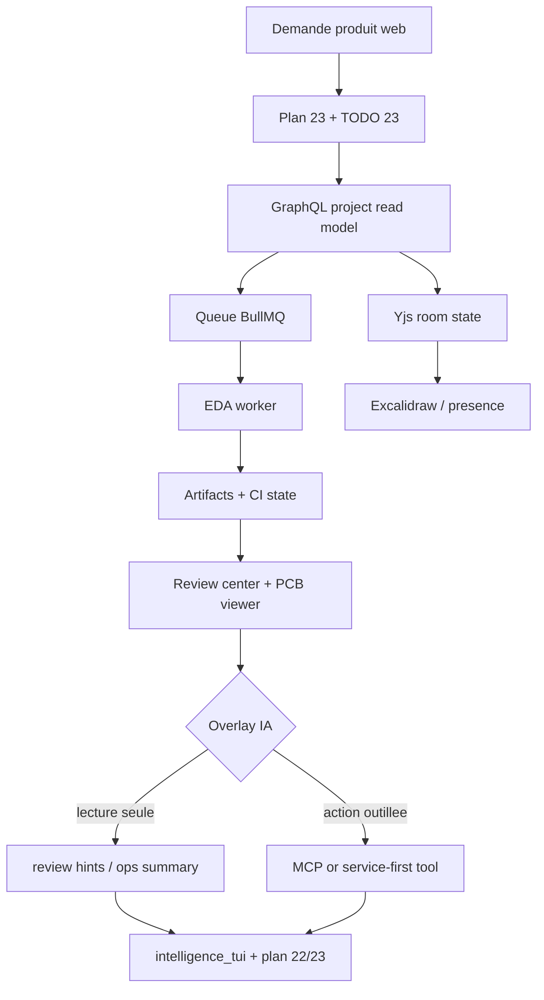
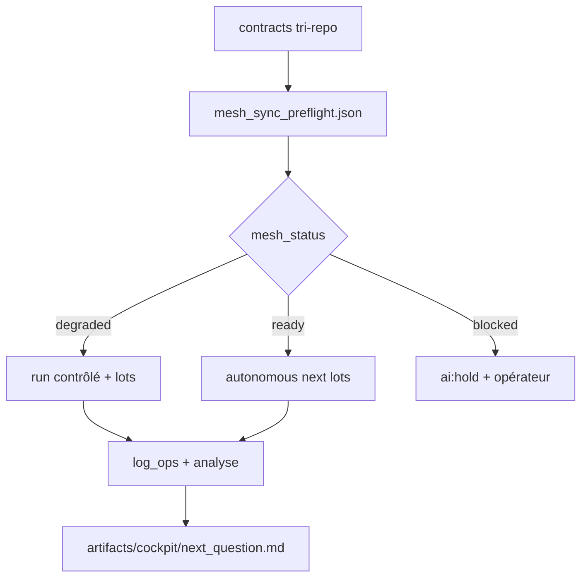
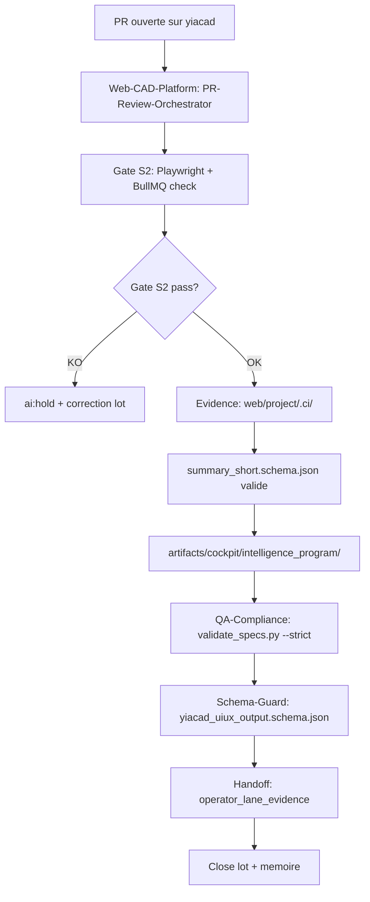

# Workflows IA Kill_LIFE (2026-03-22)

Cette feuille de route pilote l’usage de l’IA en mode overlay: utile, traçable, non bloquante par défaut.

## Flux principal

## Flux dédié YiACAD

## Flux dédié YiACAD UI/UX

## Flux dedie YiACAD Git EDA + intelligence

## Modes d’intégration IA (actuel)

| Mode | Usage | Contrôle |
| --- | --- | --- |
| `assisté` | génération de brouillon + proposition, sans écriture automatique | `owner_agent` requis, aucune écriture sans lot |
| `piloté` | exécution d’action avec pré-validation automatisée (spec/plan/tests) | logs + evidence + preflight |
| `manuel` | décision humaine requise (`ai:hold`) sur portée non maîtrisée | lot explicitement arrêté + justification |

## Etat de l'art 2026 retenu

- `MCP` reste le standard prioritaire pour la couche outils et discovery.
- `OpenAI Responses API` reste la bonne surface pour un overlay web `tools-first` si la lane review-assist s'ouvre, sans deplacer la source de verite hors Git.
- `Roo Code` est retenu comme reference de modes/personas outilles dans l'editeur.
- `OpenHands` est retenu comme reference de separation `SDK / CLI / GUI / cloud`.
- `LangGraph` reste la reference de workflows longs avec etat, reprise et human-in-the-loop.
- `OpenAI Agents SDK` reste une reference utile pour les patterns `tools + handoffs + sessions`, mais pas comme source de verite documentaire du projet.

## Delta officiel verifie le 2026-03-21

- `Model Context Protocol`: la release officielle du `2025-11-25` confirme MCP comme standard de fait pour connecter outils, donnees et applications aux LLM; la trajectoire 2025 a deja ajoute structured tool outputs, OAuth-based authorization et elicitation. Source: [One Year of MCP: November 2025 Spec Release](https://blog.modelcontextprotocol.io/posts/2025-11-25-first-mcp-anniversary/) et [Update on the Next MCP Protocol Release](https://blog.modelcontextprotocol.io/posts/2025-09-26-mcp-next-version-update/).
- `OpenAI Tools / Responses API`: au `2026-03-22`, la doc officielle outille clairement une approche `tools-first`, avec `MCP and Connectors`, `WebSocket mode`, `background mode` et `tracing/evals` dans la meme famille de docs. Decision projet: si une aide IA web s'ouvre, elle restera un overlay de review et d'ops, jamais une source de verite en concurrence avec Git/Yjs/workers. Source: [Using tools](https://developers.openai.com/api/docs/guides/tools).
- `VS Code AI extensibility`: l'API officielle de tools positionne explicitement les `extension tools`, les `built-in tools` et les `MCP tools` comme briques de l'agent mode. Decision projet: garder les extensions `studio/mesh/operator` legères et reutiliser MCP quand l'outil doit rester cross-environment. Source: [Language Model Tool API](https://code.visualstudio.com/api/extension-guides/tools) et [Chat tutorial](https://code.visualstudio.com/api/extension-guides/ai/chat-tutorial).
- `OpenAI Agents SDK`: les patterns officiellement solides pour ce repo sont `handoffs`, `tools`, `mcp_servers` et `tracing`, donc des overlays de coordination et d'observabilite, pas une source de verite documentaire. Source: [Agents](https://openai.github.io/openai-agents-python/agents/), [Handoffs](https://openai.github.io/openai-agents-js/guides/handoffs/), [Tracing](https://openai.github.io/openai-agents-js/guides/tracing/).
- `LangGraph`: reste la meilleure reference officielle pour les workflows longs avec durable execution, checkpoints et human-in-the-loop. Decision projet: deferer l'adoption au-dessus des contrats `summary-short/v1` et `runtime-mcp-ia-gateway/v1`, pas en dessous. Source: [LangGraph overview](https://docs.langchain.com/oss/python/langgraph/overview).

## Surfaces IA et gouvernance

| Surface | Mode | Règle de contrôle |
| --- | --- | --- |
| `specs/` | piloté | `python3 tools/validate_specs.py --strict --require-mirror-sync` |
| Documentation | assisté | revue humaine + préflight README coherence |
| QA | piloté | preuves de tests + traces d’exécution |
| MCP/Runtime | piloté | `ai:*` labels, denylist, preuve de lot |
| Firmware/Hardware | assisté-piloté | pas d’écriture sans lot + validation |
| CAD / KiCad / FreeCAD | piloté | `tools/cad/yiacad_fusion_lot.sh` + preflight + evidence |
| UI/UX Apple-native | piloté | `tools/cockpit/yiacad_uiux_tui.sh` + `tools/cockpit/agent_matrix_tui.sh` + preuves docs |
| Web Git EDA / `web/` | piloté | `docs/plans/23_*`, Git source of truth, Yjs transport, workers BullMQ, review-assist en lecture seule |

## Politique canonique 2026-03-21

### Root vs miroir

- `Kill_LIFE/specs/` reste la source de vérité documentaire et contractuelle.
- `ai-agentic-embedded-base/specs/` reste un miroir exporté piloté par `bash tools/specs/sync_spec_mirror.sh all --yes`.
- Les surfaces `docs/`, `tools/`, `artifacts/` et `firmware/` ne sont pas mirror-first: on les maintient dans `Kill_LIFE`, puis on exporte seulement si un lot le demande explicitement.
- La validation de fermeture d'un lot spec-first combine `bash tools/specs/sync_spec_mirror.sh all --yes` et `python3 tools/validate_specs.py --strict --require-mirror-sync`.

### Firmware canonique actuel

- Le chemin executable canonique pour la phase active est `firmware/platformio.ini` + `firmware/src/main.cpp`.
- `firmware/src/voice_controller.cpp` et `firmware/include/voice_controller.h` restent une stack voice en pre-integration: presentes dans le repo, mais pas branchees au `main.cpp` ni a une lane release testee.
- `ai-agentic-embedded-base/firmware/` reste un seed minimal compagnon; il ne doit pas etre utilise comme verite runtime ou release path.
- La gateway `runtime_ai_gateway.sh` publie maintenant une surface auxiliaire `firmware_cad` plus un artefact `summary-short/v1` compagnon (`artifacts/cockpit/runtime_ai_gateway/firmware_cad_summary_short_latest.json`) a partir du `firmware/` racine et de `artifacts/yiacad_backend_proof/latest.json`.
- Le statut `voice` reste indirect tant que `voice_controller.*` n'est pas branche au boot avec une preuve build/test/release explicite.

## Contrats de gouvernance intelligence

Deux contrats minimaux servent maintenant de base commune pour la gouvernance intelligence:

- `summary-short/v1`: `specs/contracts/summary_short.schema.json`
- `runtime-mcp-ia-gateway/v1`: `specs/contracts/runtime_mcp_ia_gateway.schema.json`

Le premier sert a publier une synthese courte stable avec:

- `contract_version`
- `generated_at`
- `component`
- `owner_repo`
- `owner_agent`
- `owner_subagent`
- `write_set`
- `status`
- `summary_short`
- `evidence`

Le second sert a publier une sante agregee pour:

- `runtime`
- `mcp`
- `ia`

avec un `status` global, un `summary_short` global, une `evidence` exploitable par automation, plus:

- `contract_version`
- `generated_at`
- `component`

`cockpit-v1` reste l'enveloppe de transport des TUIs et des artefacts cockpit.

Le "contrat lot" n'est pas un troisieme schema canonique: c'est un overlay derive de `cockpit-v1` et/ou `summary-short/v1` selon la surface.

## Contrat lot (run-time)

Le contrat de lot canonique doit porter au minimum:

- `owner_repo`
- `owner_agent`
- `owner_subagent`
- `write_set`
- `status`
- `evidence`

Champs recommandés en plus:

- `lot_id`
- `mesh_status` pour le signal runtime `ready|degraded|blocked`
- `degraded_reasons`
- `next_steps`

Pour une lane de gouvernance intelligence, l'evidence recommandee devient:

- un artefact `summary-short/v1` pour la lecture courte
- un artefact `runtime-mcp-ia-gateway/v1` pour la sante `runtime/mcp/ia`

Exemple:
- `lot_id: lc-019`, `owner_repo: Kill_LIFE`, `owner_agent: PM-Mesh`, `owner_subagent: Plan-Orchestrator`, `write_set: docs/AI_WORKFLOWS.md,docs/REFACTOR_MANIFEST_2026-03-20.md`, `status: degraded`, `evidence: artifacts/cockpit/intelligence_program/latest.json`.
- Les lots `autonomous_next_lots` exposent ce contrat en JSON lorsqu'ils sont exécutés avec `--json`.

## Références officielles 2026 vérifiées

- [VS Code AI extensibility](https://code.visualstudio.com/api/extension-guides/ai/chat-tutorial)
- [Model Context Protocol intro](https://modelcontextprotocol.io/docs/getting-started/intro)
- [Model Context Protocol registry](https://registry.modelcontextprotocol.io/)
- [OpenAI tools guide](https://developers.openai.com/api/docs/guides/tools)
- [OpenAI Agents SDK](https://openai.github.io/openai-agents-python/)
- [LangGraph overview](https://docs.langchain.com/oss/python/langgraph/overview)

## Carte opérationnelle IA-native CAD

```mermaid
flowchart LR
  RepoSpecs[specs/] --> CADPlan[docs/CAD_AI_NATIVE_FORK_STRATEGY.md]
  CADPlan --> Fork[kicad + freecad branches]
  Fork --> Launch[tools/hw/* + MCP launchers]
  Launch --> Audit[tools/cockpit/mesh_sync_preflight.sh]
  Audit --> Logs[artifacts/refonte_tui/*.log]
  Logs --> Revue[docs/OSS_AI_NATIVE_CAD_RESEARCH_2026-03-20.md]
  Revue --> CadTask[docs/plans/18_plan_enchainement_autonome_des_lots_utiles.md]
  CadTask --> LotSync[tools/cockpit/lot_chain.sh]
  LotSync --> Summary[tools/cockpit/render_weekly_refonte_summary.sh]
```

## Carte tri-repo et exécution

## Commandes de pilotage recommandées

- Lire et valider la cohérence:
  - `bash tools/cockpit/refonte_tui.sh --action log-ops`
  - `bash tools/doc/readme_repo_coherence.sh all --yes`
  - `python3 tools/validate_specs.py --strict --require-mirror-sync`
- Gestion logs (lecture/analyse/purge contrôlée):
  - `bash tools/cockpit/refonte_tui.sh --action logs`
  - `bash tools/cockpit/refonte_tui.sh --action clean-logs --days 14 --yes-auto`
  - `bash tools/cockpit/refonte_tui.sh --action clean-logs --days 7 --yes-auto`
- Lot YiACAD:
  - `bash tools/cockpit/refonte_tui.sh --action yiacad-fusion:prepare`
  - `bash tools/cockpit/refonte_tui.sh --action yiacad-fusion:smoke`
  - `bash tools/cockpit/refonte_tui.sh --action yiacad-fusion:status`
  - `bash tools/cockpit/refonte_tui.sh --action yiacad-fusion:logs`
  - `bash tools/cockpit/refonte_tui.sh --action yiacad-fusion:clean-logs --days 7 --yes`
- Lot YiACAD UI/UX:
  - `bash tools/cockpit/yiacad_uiux_tui.sh --action status`
  - `bash tools/cockpit/yiacad_uiux_tui.sh --action insertion-points`
  - `bash tools/cockpit/yiacad_uiux_tui.sh --action agent-matrix`
  - `bash tools/cockpit/yiacad_uiux_tui.sh --action logs-summary`
  - `bash tools/cockpit/yiacad_uiux_tui.sh --action logs-list`
  - `bash tools/cockpit/yiacad_uiux_tui.sh --action logs-latest`
  - `bash tools/cockpit/yiacad_uiux_tui.sh --action purge-logs --days 14 --yes`
- Synthèse opératoire:
  - `bash tools/cockpit/refonte_tui.sh --action weekly-summary`
  - `bash tools/cockpit/render_weekly_refonte_summary.sh`
- Gouvernance intelligence:
  - `bash tools/cockpit/intelligence_tui.sh --action status --json`
  - `bash tools/cockpit/intelligence_tui.sh --action next-actions`
  - `bash tools/cockpit/intelligence_tui.sh --action memory --json`
  - `bash tools/cockpit/intelligence_tui.sh --action scorecard --json`
  - `bash tools/cockpit/intelligence_tui.sh --action comparison --json`
  - `bash tools/cockpit/intelligence_tui.sh --action recommendations --json`
  - `bash tools/cockpit/refonte_tui.sh --action intelligence`
- `bash tools/cockpit/refonte_tui.sh --action log-ops`
- `bash tools/cockpit/log_ops.sh --action purge --retention-days 7 --apply`
- Lot-chain:
  - `bash tools/run_autonomous_next_lots.sh status`
  - `bash tools/run_autonomous_next_lots.sh run`
  - `bash tools/autonomous_next_lots.py json`
- Raccourcis santé:
  - `bash tools/cockpit/refonte_tui.sh --action status`
  - `bash tools/cockpit/refonte_tui.sh --action mesh-preflight`
  - `bash tools/cockpit/refonte_tui.sh --action mcp-check`

## Flux dedie PR review automation (2026-03-29)

