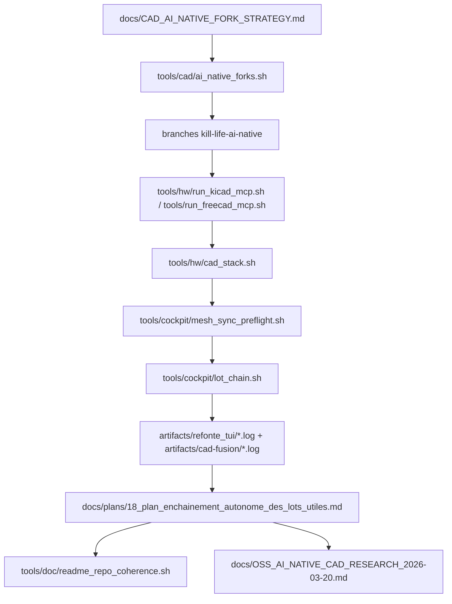

# Fork IA-native KiCad + FreeCAD (YiACAD) pour Kill_LIFE

Objectif: disposer de forks dédiés pour la couche technique `AI-native` de Kill_LIFE
(automations MCP, scripts de conversion, audits, benchmarks) sans casser la chaîne principale.
Le lot associé est nommé **YiACAD** et pilote une fusion opérationnelle **KiCad + FreeCAD**
(avec OpenSCAD en couverture 3D) dans un mode host-first piloté par lot.

## 1) Principe de production

1. Ne pas réinventer la stack existante:
   - conserver `tools/hw/cad_stack.sh`, `tools/hw/run_kicad_mcp.sh` et `tools/run_freecad_mcp.sh`.
2. Maintenir les forks locaux de référence:
   - `KiCad/ KiCad`
   - `FreeCAD/FreeCAD`
3. Travailler des branches IA-native par repo:
   - `kill-life-ai-native`
4. Garder un manifeste de provenance et de remotes stable:
   - fork `origin`
   - source `upstream`

## 2) Script d'amorçage (prêt à exécuter)

Le script de base ajouté:
- `tools/cad/ai_native_forks.sh`

Flux type:

1. Préparer l’infra locale:
```bash
mkdir -p .runtime-home/cad-ai-native-forks
```

2. Générer une base locale sans créer de fork GitHub:
```bash
bash tools/cad/ai_native_forks.sh --dry-run --base-dir .runtime-home/cad-ai-native-forks
```

3. Créer les forks GitHub (si besoin), puis cloner:
```bash
gh auth login
bash tools/cad/ai_native_forks.sh \
  --create-forks \
  --base-dir .runtime-home/cad-ai-native-forks \
  --owner <ton-org-github> \
  --branch kill-life-ai-native
```

4. Vérifier le manifeste:
```bash
cat .runtime-home/cad-ai-native-forks/manifest.md
```

## 3) Lot YiACAD (pilotage de fusion CAD)

Le lot `yiacad-fusion` regroupe l'amorçage + smoke CAD + preuves:

- préparation des forks (`prepare`) via `tools/cad/ai_native_forks.sh`
- smoke de santé CAD (`smoke`) via:
  - `tools/hw/cad_stack.sh doctor-mcp`
  - `tools/hw/run_kicad_mcp.sh --doctor`
  - `tools/hw/kicad_host_mcp_smoke.py --json --quick`
  - `tools/freecad_mcp_smoke.py --json --quick`
  - `tools/openscad_mcp_smoke.py --json --quick`
  - `tools/run_freecad_mcp.sh --doctor`
  - `tools/run_openscad_mcp.sh --doctor`
- statut (`status`) et logs (`logs`) dans `artifacts/cad-fusion`
- purge contrôlée (`clean-logs`) avec rétention définie.

Entrées disponibles:

- `bash tools/cad/yiacad_fusion_lot.sh --action prepare`
- `bash tools/cad/yiacad_fusion_lot.sh --action smoke`
- `bash tools/cad/yiacad_fusion_lot.sh --action status`
- `bash tools/cad/yiacad_fusion_lot.sh --action logs`
- `bash tools/cad/yiacad_fusion_lot.sh --action clean-logs --days 7 --yes`
- via cockpit: `bash tools/cockpit/refonte_tui.sh --action yiacad-fusion:prepare`
- via cockpit: `bash tools/cockpit/refonte_tui.sh --action yiacad-fusion:smoke`

Lancement standard:

```bash
bash tools/cockpit/refonte_tui.sh --action yiacad-fusion:prepare
bash tools/cockpit/refonte_tui.sh --action yiacad-fusion:smoke
```

## 4) Intégration Kill_LIFE

- `tools/cad/ai_native_forks.sh` orchestre déjà:
  - le clone local des dépôts,
  - la création éventuelle de branches `kill-life-ai-native`,
  - la normalisation des remotes (`origin`/`upstream`).
- Le flux de refonte attend que chaque lot touchant KiCad/FreeCAD fournisse:
  - un `lot_id`,
  - un `owner_agent` explicite,
  - un `write_set` restreint,
  - une preuve `log_ops`,
  - et une validation `mesh_status` (de `mesh_sync_preflight.sh`).
- Les preuves YiACAD sont archivées dans:
  - `artifacts/cad-fusion/yiacad-fusion-last.log`
  - `artifacts/cad-fusion/yiacad-fusion-last-status.md`

## 5) Structure actuelle (2026-03-20 11:20)

- Base locale: `/Users/electron/Documents/Lelectron_rare/Kill_LIFE/.runtime-home/cad-ai-native-forks/`
- Répertoires détectés:
  - `kicad-ki` (branche `kill-life-ai-native` préparée localement)
  - `freecad-ki` (branche `kill-life-ai-native` préparée localement)
- Remotes:
  - `origin` (fork GitHub cible)
  - `upstream` (remote principal)
- Manifeste actif:
  - `/Users/electron/Documents/Lelectron_rare/Kill_LIFE/.runtime-home/cad-ai-native-forks/manifest.md`
- Artefacts YiACAD:
  - `artifacts/cad-fusion/`

## 6) Prochaine phase opérationnelle

- `--create-forks` non encore exécuté côté GitHub (forks distants non publiés).
- Après création des forks distants:
  - pousser la branche `kill-life-ai-native`,
  - déclarer les remotes `origin`/`upstream`,
  - publier la preuve de CI dans:
    - `docs/CAD_AI_NATIVE_FORK_STRATEGY.md`
    - `CHANGELOG_AI_NATIVE.md` (par repo fork)
  - compléter la preuve YiACAD (prepare + smoke + status + purge contrôlée).

## 6bis) Dernière exécution opératoire validée (2026-03-21 13:31 CET)

- `prepare`: `ok`
  - manifeste présent
  - `kicad-ki` sur `kill-life-ai-native` (`eec5b07179`)
  - `freecad-ki` sur `kill-life-ai-native` (`5ea732ef3c`)
- `status`: `ok`
  - snapshot canonique mis à jour dans `artifacts/cad-fusion/yiacad-fusion-last-status.md`
- `logs`: `ok`
  - l’inventaire `artifacts/cad-fusion/*` reste lisible via `tools/cad/yiacad_fusion_lot.sh --action logs`
- `clean-logs --days 14`: `ok`
  - aucun candidat à purger sur cette passe
- `smoke`: `blocked`
  - `CAD stack doctor`: `ok`
  - `KiCad MCP host doctor`: `ok`
  - `KiCad MCP host smoke`: `blocked`
  - `FreeCAD MCP smoke`: `ready`
  - `OpenSCAD MCP smoke`: `ready`
- blocage observé:
  - la lane `mascarade-main` ne matérialise pas l’entrypoint hôte attendu: `finetune/kicad_mcp_server/dist/index.js`
  - le doctor KiCad recadre désormais `REQUESTED_RUNTIME=auto` vers `SELECTED_RUNTIME=container`
  - la priorité immédiate est soit de matérialiser cet entrypoint, soit de conserver explicitement le fallback conteneur comme état supporté
- preuves:
  - `artifacts/cad-fusion/yiacad-fusion-last.log`
  - `artifacts/cad-fusion/yiacad-fusion-last-status.md`
  - `artifacts/refonte_tui/refonte_tui_20260321_133030.log`
  - `artifacts/refonte_tui/refonte_tui_20260321_133042.log`

## 7) Gouvernance de livraison

- Point d'entrée IA-native:
  - lier toute évolution KiCad/FreeCAD aux lots `T-LOT-*` et aux tâches mesh tri-repo.
- Règles minimales:
  - aucune écriture directe sur `main` sans lot validé,
  - passer par le cockpit TUI (`tools/cockpit/refonte_tui.sh`) pour préflight/log + evidence,
  - valider les artefacts CAD avant export (ERC/DRC/BOM/netlist/export).
- Alignement externe:
  - maintenir la veille OSS similaire (`docs/OSS_AI_NATIVE_CAD_RESEARCH_2026-03-20.md`) en revue périodique.
- Carte de conformité YiACAD:
  - chaque exécution du lot doit produire un statut, un log et le fichier `status` mis à jour.

## 8) Carte opérationnelle IA-native CAD (2026-03-20)



## 9) Rappels de conformité

- `constraints.yaml` reste source de vérité pour les choix d’outils.
- Les gates hardware (`ERC/DRC/netlist/BOM`) restent obligatoires pour les artefacts exportés vers `Kill_LIFE`.
- Aucune modification de source upstream n’est poussée sans branche dédiée et revue.

## 10) Delta 2026-03-21 - etat reel `yiacad-fusion`

- le write-set `Kill_LIFE` du lot est maintenant proprement cadre:
  - `tools/cad/yiacad_fusion_lot.sh`
  - `tools/cockpit/refonte_tui.sh`
  - `tools/cockpit/render_weekly_refonte_summary.sh`
  - ce document de strategie
- l'hygiene locale est alignee:
  - `refonte_tui.sh` propage maintenant `--days` vers `yiacad-fusion:clean-logs`
  - la synthese hebdomadaire distingue explicitement le blocage externe du repo local
- le blocage dur restant reste externe a `Kill_LIFE`:
  - `mascarade-main/finetune/kicad_mcp_server/dist/index.js` n'est pas materialise
  - tant que cet entrypoint hote manque, `KiCad MCP host smoke` reste `blocked`
- consequence operatoire:
  - `yiacad-fusion` peut etre clos comme lot `implémenté/documenté`, mais ne doit pas etre promu comme lane `ready` sans soit materialisation de cet entrypoint, soit decision explicite d'accepter le fallback conteneur comme etat supporte.
