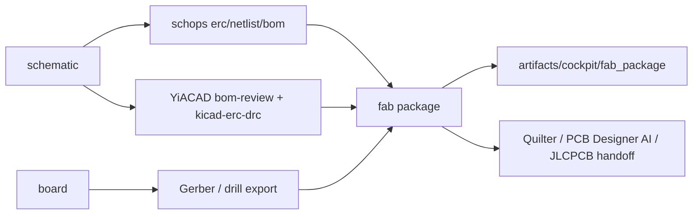

# Fab package contract (2026-03-22)

## Objectif

Donner a `Kill_LIFE` un contrat local unique pour la preparation fabrication PCB, avant tout handoff `Quilter`, `PCB Designer AI` ou `JLCPCB`.

Le contrat couvre le minimum requis:

- `BOM`
- `CPL`
- `Gerber`
- `drill`
- `DRC`
- `review artifacts`
- `provenance`

Le but n'est pas de remplacer `YiACAD`, `schops` ou `hw_check`.
Le but est de les agreger dans un package unique et traçable.

## Principe

- `schops` reste la source deterministe pour `ERC`, `netlist`, `BOM`
- `YiACAD` reste la source de review locale pour `ERC/DRC` et `bom-review`
- le `fab package` est la couche d'orchestration au-dessus
- toute lane externe doit redescendre vers ce contrat

## Flux retenu

## Regles d'acceptation

Un package est:

- `ready` si les gates `erc_ok`, `drc_ok`, `bom_review_ok`, `artifacts_complete` sont vrais
- `degraded` si la chaine a produit des artefacts partiels mais pas un package fabrication complet
- `blocked` si les sources d'entree sont absentes ou inutilisables

## Constat 2026-03-22

- le repo courant ne fournit pas encore d'export `CPL` local canonique
- le repo courant ne fournit pas encore de package fabrication unique
- les assets Hypnoled references dans le TODO 25 ne sont pas presents dans ce checkout

Conclusion:
- le contrat `fab package` est maintenant cadre
- le premier objectif d'execution est de produire une chaine locale honnete `ready|degraded|blocked`
- la parite complete `JLCPCB assembly-ready` reste un lot suivant
