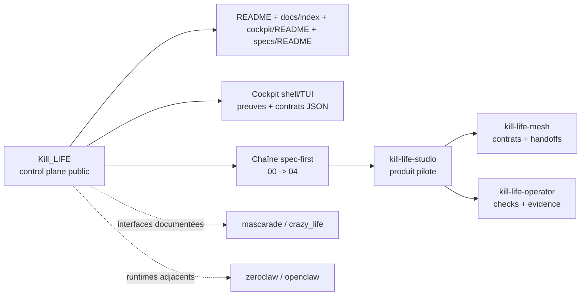
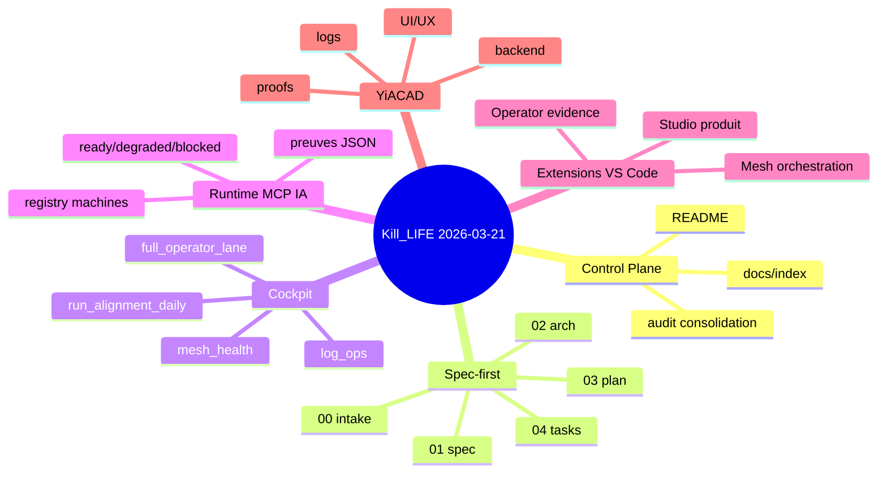

# Audit de consolidation Kill_LIFE + Extensions

Date: `2026-03-21`

Périmètre actif:

- `Kill_LIFE`
- `ai-agentic-embedded-base`
- `kill-life-studio`
- `kill-life-mesh`
- `kill-life-operator`

Surfaces adjacentes documentées, hors refonte de premier rang:

- `mascarade`
- `crazy_life`
- `zeroclaw`
- `openclaw`

## Résumé exécutif

Kill_LIFE possède déjà un socle rare et solide: une gouvernance spec-first explicite, un cockpit shell/TUI structuré, des contrats JSON/MCP qui commencent à converger, et une vraie culture de preuve. En revanche, le centre de gravité du projet s'est déplacé plus vite que sa documentation: le repo raconte encore parfois un "template embarqué générique" alors qu'il sert désormais de control plane public pour un programme multi-repo, multi-lanes et multi-extensions.

La décision de consolidation du `2026-03-21` est la suivante:

- `Kill_LIFE` devient le control plane public, documentaire et opératoire
- `kill-life-studio` devient le produit pilote pour l'expérience auteur et les artefacts produit
- `kill-life-mesh` hérite ensuite du socle robuste pour l'orchestration multi-repo
- `kill-life-operator` hérite ensuite du même socle pour l'exécution, les checks et les preuves

## Sources de vérité canoniques

| Surface | Source canonique | Rôle |
| --- | --- | --- |
| Produit / programme | `README.md` | vision, périmètre, décisions de consolidation |
| Navigation opérateur | `docs/index.md` | table de routage docs et runbooks |
| Cockpit / TUI | `tools/cockpit/README.md` | commandes, contrats `cockpit-v1`, routines |
| Chaîne spec-first | `specs/README.md` | séquence canonique et contrat de lot |
| Audit consolidé | ce document | diagnostic, priorités, matrice IA |
| Veille OSS | `docs/WEB_RESEARCH_OPEN_SOURCE_2026-03-20.md` | benchmark externe et décisions d'adoption |

## Diagramme de consolidation

## Points forts

- Chaîne spec-first déjà installée, lisible et outillée.
- Cockpit shell/TUI riche avec sorties JSON, logs, preuves et modes dégradés.
- Une surface `intelligence_tui` relie maintenant audit, spec, plan, TODO, research, owners, memoire et prochaines actions.
- Contrats MCP et runtime déjà présents, avec une vraie logique `ready | degraded | blocked`.
- Tests Python repo-locaux déjà en place pour les surfaces critiques de validation.
- Matrice agents/sous-agents déjà amorcée, donc gouvernance extensible sans repartir de zéro.
- Positionnement YiACAD, CAD IA-native et bridge opérateur déjà documentés avec un niveau de détail rare.

## Points faibles

- Documentation trop éclatée: plusieurs "pages d'entrée" racontent des versions différentes du projet.
- README racine encore partiellement rédigé comme un template générique et non comme un control plane tri-repo.
- Dépendances locales/SSH/Docker nombreuses, donc testabilité et onboarding encore fragiles.
- Gros scripts shell/TUI encore inégalement testés malgré la convergence documentaire vers `cockpit-v1`.
- Les trois extensions VS Code existaient surtout comme variations de branding; leur promesse produit restait insuffisamment spécialisée.

## Opportunités d'amélioration

- Utiliser `kill-life-studio` comme surface auteur unique: brief, spec, decisions, acceptance criteria, plan.
- Réutiliser le même socle d'état dans Mesh et Operator pour éviter trois implémentations divergentes.
- Pousser les contrats JSON cockpit jusqu'aux surfaces qui publient encore du texte ad hoc.
- Réduire le nombre de documents concurrents en privilégiant des pages d'entrée courtes et des documents de référence denses.
- Transformer la veille OSS en décisions d'adoption explicites, pas en catalogue parallèle.
- Brancher la memoire `artifacts/cockpit/intelligence_program/latest.*` vers les automatisations et les extensions terminales.

## Risques et garde-fous

| Risque | Impact | Garde-fou retenu |
| --- | --- | --- |
| Inflation documentaire | perte de lisibilité | consolider avant de créer, et garder un seul point d'entrée par surface |
| Divergence entre extensions | dette produit + support | `kill-life-studio` pilote, puis propagation du socle validé |
| Scripts shell difficiles à fiabiliser | régressions opératoires | contrats JSON communs + tests de contrat ciblés |
| Dépendances externes instables | faux positifs et blocages | mode `degraded` explicite, preuves, fallback documentés |
| Publication trop tôt | dette publique durable | rester en `0.1.0-dev.x` jusqu'à docs + tests + smoke convergés |

## Matrice d'intégration IA

| Surface | Mode cible | Existant utile | Optimisation IA prioritaire | Garde-fou |
| --- | --- | --- | --- | --- |
| Specs / docs | `assisté` | chaîne 00 -> 04, validation stricte | génération guidée de brief/spec/plan et synchronisation documentaire | `tools/validate_specs.py --strict --require-mirror-sync` |
| Cockpit / TUI | `manuel` puis `assisté` | `refonte_tui`, `full_operator_lane`, `run_alignment_daily` | résumés intelligents, triage d'incidents, suggestions d'action | contrat `cockpit-v1`, logs, sorties JSON |
| Santé MCP / runtime | `piloté` | checks `ready | degraded | blocked` | gateway canonique de santé IA/MCP partagée | preuves horodatées + raisons de dégradation |
| Studio | `assisté` | scan d'agents + artefacts + chat | grounding projet actif, fichiers ouverts, sélection utile, artefacts produit | fallback déterministe, commandes sans modèle pour `/agents` |
| Mesh | `assisté` | commandes de rôles et discovery | vue contrats, dépendances, ownership, handoffs | propagation seulement après validation Studio |
| Operator | `assisté` | runbooks, checks, preuves | briefing opérateur contextualisé, lecture des preuves, raccourcis evidence | aucune action destructive implicite |
| CAD / YiACAD | `manuel` puis `assisté` | lots, audits, forks et TUI dédiées | revue contextualisée et aides au chaînage des lanes | lane isolée + rollback explicite |

## Carte de fonctionnalités

## Benchmark OSS intégré aux décisions

Les références externes les plus actionnables pour cette passe sont:

- `Roo Code`: référence pour les modes spécialisés dans l'éditeur, les agents par rôle et l'usage MCP.
- `OpenHands`: référence pour la séparation claire SDK / CLI / GUI locale / cloud.
- `LangGraph`: référence pour l'orchestration stateful, la mémoire, le `human-in-the-loop` et la reprise d'exécution.
- `modelcontextprotocol/servers` + registre MCP: référence pour les patterns de serveurs, la sécurité d'accès et la découverte outillée.

Le détail de benchmark et les liens de source sont maintenus dans `docs/WEB_RESEARCH_OPEN_SOURCE_2026-03-20.md`.

## Affectation agents et sous-agents

| Lead | Sous-agents | Compétences | Priorité immédiate |
| --- | --- | --- | --- |
| `PM-Mesh` | `Plan-Orchestrator`, `Risk-Triager`, `Release-Gate` | priorisation, arbitrage, synchro plans/TODOs | baseline sale, P0/P1, barre "prêt avant public" |
| `Docs-Research` | `Doc-Entry`, `Mermaid-Map`, `Feature-Map`, `Runbook-Editor` | consolidation documentaire, benchmark, cartes | README, `docs/index`, `tools/cockpit/README`, `specs/README` |
| `Studio-Product` | `UX-Lead`, `Context-Builder`, `Artifact-Model`, `Extension-Test` | UX auteur, état persistant, grounding, tests | projet actif, contexte chat, artefacts, tests extension-host |
| `Mesh-Contracts` | `Handoff-Guard`, `Contract-View`, `Dependency-Mapper` | contrats multi-repo, ownership, dépendances | reprise du socle Studio validé |
| `Operator-Lane` | `Runbook-Guard`, `Evidence-Runner`, `Log-Ops` | runbooks, evidence, logs, exécution | reprise du socle Studio validé |
| `Runtime-Companion` | `MCP-Health`, `Prompt-Eval`, `Bridge-Queue` | santé runtime/MCP, prompt eval, bridges | gateway canonique `ready/degraded/blocked` |
| `QA-Compliance` | `Contract-Tests`, `Shell-Harness`, `Smoke-E2E` | tests, contrats JSON, smokes | stable suite, tests shell/TUI ciblés, smoke VSIX |
| `OSS-Watch` | `VSCode-Agent-Benchmark`, `Agent-Framework-Benchmark`, `MCP-Benchmark` | veille stratégique et décisions d'adoption | benchmark unique et exploitable |

## Priorités 2026-03-21

### P0

- Consolider les points d'entrée documentaires.
- Installer `tools/cockpit/intelligence_tui.sh` comme point d'entree canonique pour la gouvernance intelligence.
- Stabiliser `kill-life-studio` comme produit pilote.
- Propager le socle de sélection de projet actif et de grounding chat vers Mesh et Operator.
- Tester les contrats JSON des scripts cockpit les plus stables.

### P1

- Poursuivre la spécialisation produit de Mesh et Operator.
- Généraliser les tests shell/TUI à d'autres scripts cockpit.
- Renforcer la preuve multi-root locale pour les extensions.

### P2

- Étendre la gateway de santé IA/MCP en source unique consommable par le cockpit et les extensions.
- Réduire la dette documentaire historique restante.
- Préparer la barre de sortie `v0.1.0` publique sans activer la publication Marketplace avant stabilisation.

## Critères "prêt avant v0.1.0 publique"

- Documentation convergée, avec un seul point d'entrée par surface.
- `kill-life-studio` stabilisé avec tests unitaires + extension-host.
- Mesh et Operator propagés sur le même socle et validés localement.
- Contrats JSON cockpit stables sur les surfaces critiques.
- Smoke multi-root et VSIX rejoués avant tout tag public.
