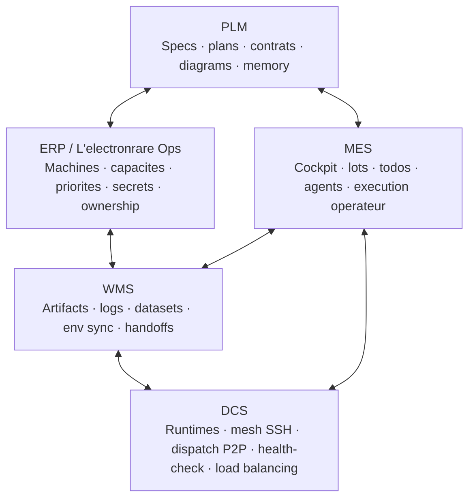

# Kill_LIFE — Digital Factory System Map

Date: 2026-03-22
Scope: cadrage produit et technique de `Kill_LIFE` selon le modele `PLM / ERP / MES / WMS / DCS`
Status: working baseline

## 1. Resume

`Kill_LIFE` peut etre lu comme une digital factory logicielle:

- `PLM`: memoire produit, specifications, plans, contrats, cartes de fonctionnalites
- `ERP`: `L'electronrare Ops`, couche de gouvernance operative des ressources, machines, capacites, secrets, priorites
- `MES`: execution des lots, pilotage operateur, orchestration des agents et des actions
- `WMS`: stockage, artefacts, logs, datasets, sorties de handoff et synchronisation de configuration
- `DCS`: controle runtime, sante machine, dispatch P2P, routage de charge, services actifs

L'etat actuel est coherent sur `PLM + MES + DCS`, partiel sur `WMS`, et encore incomplet sur `ERP`.

## 2. Mermaid — architecture cible

## 3. Lecture par couche

### 3.1 PLM

Role:
- definir le produit, ses contrats, ses plans et sa memoire de conception

Contenu attendu:
- specifications
- plans de lot
- cartes de fonctionnalites
- diagrammes Mermaid
- README et contrats inter-modules

Etat actuel:
- fort
- deja bien present dans `docs/`, `docs/plans/`, `specs/`

### 3.2 ERP

Role:
- gerer les ressources du systeme global
- decider qui porte quelle charge, avec quelles contraintes et quelles priorites
- porter la couche de gouvernance `L'electronrare Ops`

Reference produit:
- [Ops — L'Electron Rare](https://www.lelectronrare.fr/ops)

Contenu attendu:
- registre machine canonique
- roles et ports par machine
- ordre de priorite de charge
- gouvernance des cles et variables d'environnement
- ownership par lot et par domaine

Etat actuel:
- present mais disperse
- encore trop technique et pas assez formalise comme couche produit
- la surface produit existe deja via `/ops`, mais elle n'est pas encore totalement raccordee aux contrats et scripts internes `Kill_LIFE`

### 3.3 MES

Role:
- piloter l'execution quotidienne
- lancer, suivre, valider et reprendre les lots

Contenu attendu:
- cockpit operateur
- lot chain
- runbooks
- syntheses quotidiennes et hebdomadaires
- attribution d'agents et handoffs

Etat actuel:
- tres fort
- c'est aujourd'hui la couche dominante de `Kill_LIFE`

### 3.4 WMS

Role:
- stocker et rendre retrouvables les objets de travail et de preuve

Contenu attendu:
- artefacts JSON/Markdown
- logs
- datasets fine-tune
- snapshots de run
- synchronisation de secrets/config

Etat actuel:
- fonctionnel mais encore heterogene
- conventions de rangement et TTL partiellement stabilises

### 3.5 DCS

Role:
- controler les runtimes actifs et les noeuds mesh

Contenu attendu:
- health-check SSH
- preflight mesh
- dispatch P2P
- load balancing
- etat des providers et runtimes Mascarade/Ollama

Etat actuel:
- fort
- de nombreux scripts existent deja pour cette couche

## 4. Carte des modules existants

## 4.1 Vue synthese

| Couche | Role principal | Modules / zones existantes |
|---|---|---|
| `PLM` | Conception, contrat, memoire | `docs/`, `docs/plans/`, `specs/` |
| `ERP / L'electronrare Ops` | Gouvernance ressources / machines / secrets | `tools/cockpit/machine_registry.sh`, `tools/cockpit/mistral_workspace_guard.sh`, `tools/cockpit/mascarade_mesh_env_sync.sh`, `tools/cockpit/kill_life_mistral_governance_sync.sh`, `specs/contracts/`, [lelectronrare.fr/ops](https://www.lelectronrare.fr/ops) |
| `MES` | Pilotage execution / lots / agents | `tools/cockpit/full_operator_lane.sh`, `tools/cockpit/run_alignment_daily.sh`, `tools/cockpit/lot_chain.sh`, `tools/cockpit/refonte_tui.sh`, `tools/cockpit/intelligence_tui.sh` |
| `WMS` | Artefacts / logs / datasets / handoffs | `artifacts/`, `tools/cockpit/mascarade_logs_tui.sh`, `tools/cockpit/mascarade_incident_registry.sh`, `tools/cockpit/dataset_audit_tui.sh` |
| `DCS` | Controle runtime / mesh / load balancing | `tools/cockpit/mesh_sync_preflight.sh`, `tools/cockpit/ssh_healthcheck.sh`, `tools/cockpit/mascarade_runtime_health.sh`, `tools/cockpit/mascarade_dispatch_mesh.sh` |

## 4.2 Mapping detaille

### PLM

| Module | Fonction |
|---|---|
| `docs/plans/` | suivi de lot, journal de session, priorites |
| `specs/` | contrats, plan global, backlog, taches |
| `docs/*FEATURE_MAP*` | cartes de fonctionnalites |
| `docs/*CONTRACT*` | contrats produit et techniques |
| `docs/*WEB_RESEARCH*` | veille et decisions appuyees |

### ERP

| Module | Fonction |
|---|---|
| [lelectronrare.fr/ops](https://www.lelectronrare.fr/ops) | couche de gouvernance operatoire metier |
| `tools/cockpit/machine_registry.sh` | registre machine/capacite |
| `tools/cockpit/mistral_workspace_guard.sh` | source de verite de dossier |
| `tools/cockpit/mascarade_mesh_env_sync.sh` | sync `.env` Mascarade sur le mesh |
| `tools/cockpit/kill_life_mistral_governance_sync.sh` | sync secret gouvernance hors repo |
| `specs/contracts/machine_registry.*` | contrat machine canonique |

### MES

| Module | Fonction |
|---|---|
| `tools/cockpit/full_operator_lane.sh` | lane operateur principale |
| `tools/cockpit/run_alignment_daily.sh` | routine quotidienne |
| `tools/cockpit/lot_chain.sh` | enchainement et reprise de lots |
| `tools/cockpit/refonte_tui.sh` | interface TUI de pilotage |
| `tools/cockpit/intelligence_tui.sh` | vue memoire / intelligence |
| `tools/cockpit/render_product_contract_handoff.sh` | point de reprise court canonique |

### WMS

| Module | Fonction |
|---|---|
| `artifacts/` | stockage des preuves et sorties d'execution |
| `tools/cockpit/mascarade_logs_tui.sh` | gestion des logs runtime |
| `tools/cockpit/mascarade_incident_registry.sh` | registre d'incidents |
| `tools/cockpit/render_mascarade_incident_*` | briefs, queue, watch, history |
| `tools/cockpit/dataset_audit_tui.sh` | audit/preflight datasets |

### DCS

| Module | Fonction |
|---|---|
| `tools/cockpit/mesh_sync_preflight.sh` | etat mesh / routage machine |
| `tools/cockpit/ssh_healthcheck.sh` | sante SSH |
| `tools/cockpit/mascarade_runtime_health.sh` | sante runtime Mascarade/Ollama |
| `tools/cockpit/mascarade_dispatch_mesh.sh` | dispatch P2P / charge |
| `tools/cockpit/run_alignment_daily.sh` | pont entre controle runtime et execution operateur |

## 5. Trous de couche

## 5.1 Trous ERP

Manques principaux:
- source de verite unique plus visible pour:
  - ownership par lot
  - capacite par machine
  - role critique / non critique
  - budget/provider/secrets par domaine
- pont explicite entre `/ops` et les contrats internes `Kill_LIFE`
- separation partielle seulement entre:
  - secret routeur
  - secret gouvernance
  - secret runtime
- absence d'une table canonique simple:
  - `module -> owner -> machine cible -> criticite -> secret scope`

Impact:
- bonne execution locale, mais gouvernance encore trop implicite
- la couche metier existe, mais le raccord `Ops -> contrats -> cockpit` reste incomplet

## 5.2 Trous WMS

Manques principaux:
- conventions de cycle de vie des artefacts encore heterogenes
- index global incomplet entre:
  - logs
  - handoffs
  - watchboards
  - datasets
- relation artefact -> lot -> reprise encore dispersée

Impact:
- beaucoup de preuves existent, mais la recuperation reste couteuse

## 5.3 Trous DCS

Manques principaux:
- doublons de racines Mascarade sur certaines machines
- heterogeneite des layouts:
  - Linux `/home/...`
  - macOS `/Users/...`
- distinction repo/runtime encore ambigue sur `kxkm`

Impact:
- controle bon, mais cout cognitif trop eleve pour les changements de machine

## 5.4 Trous MES

Manques principaux:
- trop de scripts cockpit exposent des vues proches sans index central unique
- certains chemins restent reactifs au lieu d'etre drives par un contrat commun plus strict

Impact:
- execution possible, mais surface encore large et parfois redondante

## 5.5 Trous PLM

Manques principaux:
- il manque une carte produit unique reliant clairement:
  - docs
  - scripts
  - contrats
  - couches `PLM/ERP/MES/WMS/DCS`

Impact:
- le sens global existe, mais n'est pas encore assez visible pour une reprise rapide

## 6. Plan de refonte

## 6.1 Objectif

Faire converger `Kill_LIFE` vers un systeme lisible ou:

- `PLM` dit ce qui doit exister
- `ERP` dit avec quelles ressources et quelle gouvernance
- `MES` execute
- `WMS` conserve et retrouve
- `DCS` controle l'etat reel

## 6.2 Priorites

### Phase A — fermer la gouvernance ERP minimale

Objectif:
- transformer la gouvernance technique actuelle en couche explicite

Actions:
- creer une table canonique `machine -> role -> charge -> criticite -> racine active`
- creer une table canonique `secret -> scope -> owner -> consumer`
- raccorder explicitement `L'electronrare Ops` aux contrats internes `Kill_LIFE`
- relier ces tables aux scripts de sync et aux contrats machine

Done attendu:
- plus aucune ambiguite sur:
  - quelle machine porte quoi
  - quelle racine repo/runtime est la bonne
  - quelle cle sert a quel usage

### Phase B — unifier WMS

Objectif:
- rendre tous les artefacts retrouvables et utiles a la reprise

Actions:
- definir une convention unique pour:
  - latest
  - history
  - daily
  - weekly
  - incidents
  - datasets
- construire un index simple `artifact -> lot -> couche -> consumer`

Done attendu:
- un operateur retrouve en une seule vue:
  - le dernier etat
  - la derniere preuve
  - la prochaine action

### Phase C — compacter MES

Objectif:
- reduire la dispersion du cockpit

Actions:
- designer un index operateur central par couche:
  - `PLM`
  - `ERP`
  - `MES`
  - `WMS`
  - `DCS`
- faire converger les scripts de synthese vers cet index

Done attendu:
- moins de surface, plus de predictibilite

### Phase D — nettoyer DCS

Objectif:
- stabiliser la topologie runtime

Actions:
- choisir une racine Mascarade unique par machine
- documenter les exceptions volontaires
- reduire les doublons `mascarade` / `mascarade-main`
- distinguer explicitement:
  - repo de travail
  - runtime actif
  - dossier de secrets

Done attendu:
- plus de redetection ad hoc des chemins machine

### Phase E — refermer PLM

Objectif:
- rendre la lecture d'ensemble triviale

Actions:
- maintenir ce document comme carte mere
- ajouter des liens croises vers:
  - contrats machine
  - handoff produit
  - plans de lot Mistral
  - cartes Mascarade ops

Done attendu:
- reprise possible en lisant une seule page avant d'entrer dans le detail

## 7. Definition de done par couche

| Couche | Done attendu |
|---|---|
| `PLM` | toutes les grandes decisions sont cartographiees et reliees aux modules |
| `ERP` | machines, secrets, capacites, ownership et priorites sont explicites |
| `MES` | un operateur sait quoi lancer, ou reprendre, et avec quel owner |
| `WMS` | chaque execution laisse une preuve indexable et recuperable |
| `DCS` | l'etat runtime reel est visible et raccorde a la machine canonique |

## 8. Prochain lot recommande

Ordre recommande:

1. fermer `ERP` minimal
2. unifier `WMS`
3. compacter `MES`
4. nettoyer `DCS`
5. refermer `PLM`

Traduction immediate en travail:

1. creer un registre canonique `machine / root / secret scope / criticite`
2. creer un index `artifact / lot / couche`
3. exposer un index operateur central par couche
4. normaliser la topologie `mascarade` vs `mascarade-main`

## 9. Related documents

- bridge contract: `/Users/electron/Documents/Lelectron_rare/Kill_LIFE/docs/OPS_KILL_LIFE_ERP_BRIDGE_CONTRACT_2026-03-22.md`
- ERP registry: `/Users/electron/Documents/Lelectron_rare/Kill_LIFE/specs/contracts/ops_kill_life_erp_registry.json`
- ERP TUI: `/Users/electron/Documents/Lelectron_rare/Kill_LIFE/tools/cockpit/ops_erp_registry_tui.sh`
- web research: `/Users/electron/Documents/Lelectron_rare/Kill_LIFE/docs/WEB_RESEARCH_DIGITAL_FACTORY_STACK_2026-03-22.md`
- WMS artifact index: `/Users/electron/Documents/Lelectron_rare/Kill_LIFE/docs/ARTIFACT_WMS_INDEX_2026-03-22.md`
