# Kill_LIFE Feature Map - 2026-03-11

## Scope

Cette carte fixe les surfaces canoniques de `Kill_LIFE` comme repo source de verite spec-first, runtime outille et evidence-first.
Cette feature map sert aussi d'ancre stable pour les prochains diagrammes de sequence et pour le README operateur.

## Feature map

```mermaid
flowchart TD
    KL[Kill_LIFE]

    KL --> SPECS[specs/ canon spec-first]
    KL --> WF[workflows/ registry JSON]
    KL --> AGENTS[agents/ + .github/agents + prompts]
    KL --> BMAD[bmad/ gates + rituels + templates]
    KL --> TOOLS[tools/ runtime, validation, CAD, CI]
    KL --> HW[hardware/ blocs + regles]
    KL --> FW[firmware/ PlatformIO]
    KL --> COMP[compliance/ profils + evidence]
    KL --> OC[openclaw/ sandbox + onboarding]
    KL --> DOCS[docs/ operator, plans, evidence]
    KL --> GH[.github/workflows + issue templates]
    KL --> TEST[test/ verification Python + MCP]

    SPECS --> SPECCHAIN[00_intake -> 01_spec -> 02_arch -> 03_plan -> 04_tasks]
    SPECS --> CONSTRAINTS[specs/constraints.yaml]

    WF --> WFREG[spec-first / embedded-ci-local / compliance-release]
    WF --> WFTPL[templates/*.json]
    WF --> WFSCHEMA[workflow.schema.json]

    AGENTS --> AG1[PM / Architect / Firmware / QA / Doc / HW]
    AGENTS --> AG2[prompts plan_wizard / start / Eureka]

    TOOLS --> T1[validate_specs + specs]
    TOOLS --> T2[cad_runtime + hw/cad_stack + MCP launchers]
    TOOLS --> T3[freecad_mcp / openscad / kicad]
    TOOLS --> T4[mcp_runtime_status + repo_state + CI audits]
    TOOLS --> T5[github dispatch + community + security + quality]

    HW --> HW1[hardware/blocks]
    HW --> HW2[hardware/rules]

    FW --> FW1[firmware/src]
    FW --> FW2[firmware/test]

    COMP --> C1[active_profile + plan]
    COMP --> C2[evidence/*]
    COMP --> C3[profiles/* + standards_catalog]

    DOCS --> D1[plans + handoffs + workflows]
    DOCS --> D2[evidence + security + rituals]

    GH --> G1[18+ GitHub workflows]
    GH --> G2[issue templates]

    WF --> CL[crazy_life editor]
    TOOLS --> M[mascarade bridge / ops consumers]
```

## Canonical surfaces

| Surface | Role canonique | Anchors |
| --- | --- | --- |
| `specs/` | chaine spec-first et backlog de reference | `specs/00_intake.md`, `specs/01_spec.md`, `specs/02_arch.md`, `specs/03_plan.md`, `specs/04_tasks.md`, `specs/constraints.yaml` |
| `workflows/` | workflows executables et templates consommes par `crazy_life` | `workflows/spec-first.json`, `workflows/embedded-ci-local.json`, `workflows/compliance-release.json`, `workflows/workflow.schema.json` |
| `agents/` + `.github/agents/` | roles operationnels et contrats agentiques | `agents/*.md`, `.github/agents/*.md`, `.github/prompts/*.md` |
| `bmad/` | discipline de passage entre spec, plan, handoff et gate | `bmad/gates/*`, `bmad/rituals/kickoff.md`, `bmad/templates/*` |
| `tools/` | coeur operatoire du repo: validation, CAD, runtime MCP, CI, hygiene | `tools/validate_specs.py`, `tools/cad_runtime.py`, `tools/mcp_runtime_status.py`, `tools/freecad_mcp.py`, `tools/hw/cad_stack.sh`, `tools/run_github_dispatch_mcp.sh` |
| `hardware/` | blocs reutilisables et regles de bulk edit CAD | `hardware/blocks/`, `hardware/rules/` |
| `firmware/` | implementation embarquee PlatformIO et tests associes | `firmware/src/`, `firmware/test/` |
| `compliance/` | profil actif, plan de conformite et evidence packs | `compliance/active_profile.yaml`, `compliance/plan.yaml`, `compliance/profiles/*`, `compliance/evidence/*` |
| `openclaw/` | couche d'exploitation sandboxee, onboarding et garde-fous d'usage | `openclaw/README.md`, `openclaw/onboarding/*`, `openclaw/local_setup/*` |
| `docs/` | documentation operateur, plans actifs, rituels et preuves | `docs/plans/*`, `docs/workflows/*`, `docs/evidence/*`, `docs/security/*` |
| `.github/workflows/` | automation GitHub allowlistee et gates de depot | `.github/workflows/*.yml` |
| `test/` | verification Python/MCP du repo outille | `test/test_validate_specs.py`, `test/test_github_dispatch_mcp.py`, `test/test_freecad_mcp.py`, `test/test_mcp_runtime_status.py` |

## Execution lanes

- spec lane: `specs/00_intake.md` -> `01_spec.md` -> `02_arch.md` -> `03_plan.md` -> `04_tasks.md`
- workflow lane: `workflows/*.json` + `workflow.schema.json` -> edition/validation locale -> execution locale ou dispatch GitHub
- tooling lane: `tools/validate_specs.py` + `tools/compliance/*` + `tools/hw/*` + MCP runtime helpers
- hardware lane: `hardware/blocks` + `hardware/rules` -> `tools/hw/*` -> exports/smokes/evidence
- firmware lane: `firmware/` + tests -> evidence + CI gates
- compliance lane: `compliance/active_profile.yaml` -> standards/evidence -> release readiness
- operator lane: `openclaw/` + `.github/workflows/` + `docs/` -> contribution guidee, sandbox, gate, trace

## Source-of-truth contract

- `Kill_LIFE` reste la source de verite pour les specs, workflows, templates, policies de compliance, outillage CAD/MCP et evidence packs.
- `crazy_life` consomme et edite les workflows de `Kill_LIFE`, mais n'en devient pas la source canonique.
- `mascarade` consomme une partie des surfaces runtime/outillage comme repo compagnon d'ops et d'integration, sans remplacer le contrat spec-first de `Kill_LIFE`.

## Current gaps and next lots

- `K-DA-001` est ferme par cette carte versionnee.
- `K-DA-002`: diagramme de sequence `spec -> workflow local -> validation -> evidence`.
- `K-DA-003`: diagramme de sequence `workflow -> github dispatch -> workflow CI -> evidence pack`.
- `K-DA-004`: resynchroniser `README`, `docs/plans` et la doc operateur autour de cette carte.
