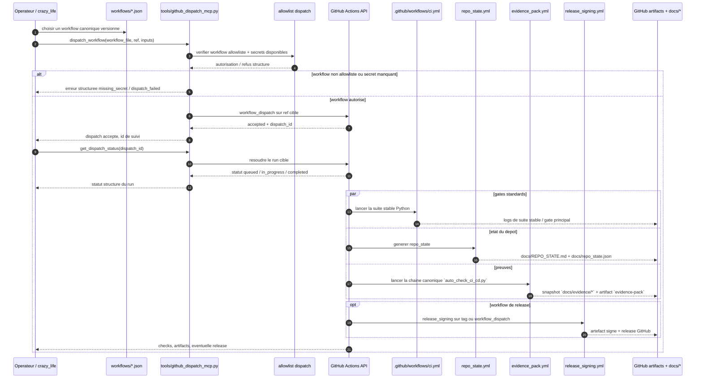

# Kill_LIFE Workflow GitHub Sequence - 2026-03-11

## Scope

Ce diagramme fixe la sequence canonique quand un workflow `Kill_LIFE` quitte la machine operateur pour passer par le dispatch GitHub et revenir sous forme de statut et d'evidence pack.

## Sequence

## Anchors

| Surface | Role dans la sequence GitHub |
| --- | --- |
| `workflows/*.json` | choix de la lane et parametrage amont |
| `tools/github_dispatch_mcp.py` | serveur MCP local qui cadre `list_allowlisted_workflows`, `dispatch_workflow`, `get_dispatch_status` |
| `tools/run_github_dispatch_mcp.sh` | launcher stdio du dispatch GitHub |
| `.github/workflows/ci.yml` | gate principal `python-stable` sur la branche ou la PR |
| `.github/workflows/repo_state.yml` | photographie exploitable du repo et artefacts de statut |
| `.github/workflows/evidence_pack.yml` | bootstrap Python + `platformio` repo-local + caches `pip`/`PlatformIO` + evidence lane forcee en `native-pio` + Step Summary |
| `.github/workflows/release_signing.yml` | chemin de release signee par tag ou `workflow_dispatch` |
| `docs/evidence/evidence_pack.md` | contrat minimal et chemins canoniques d'un evidence pack |
| `docs/EVIDENCE_ALIGNMENT_2026-03-11.md` | note d'audit qui ferme l'ecart entre CI, preuves locales et doc |

## Reading

- La machine operateur ne pousse pas elle-meme une logique arbitraire; elle demande le dispatch d'un workflow allowliste.
- Le retour utile n'est pas seulement `success/fail`, mais un ensemble de checks, artefacts et preuves consultables.
- L'artifact `evidence-pack` est un dump de `docs/evidence/`; il reste utile meme si un target sort en `incomplete`.
- La lane evidence GitHub n'a plus besoin du CAD stack Docker pour `PlatformIO`; elle force la voie `native-pio` depuis le venv repo-local.
- Les caches `pip` et `PlatformIO` accelerent la lane sans changer le contrat des preuves produites.
- Le GitHub Step Summary donne une lecture humaine immediate du lane status sans remplacer le JSON d'audit.
- `Kill_LIFE` garde la definition canonique des workflows et de leurs gates; le dispatch n'est qu'un mode d'execution distant.

## Next lots

- `K-DA-003` est ferme par ce diagramme versionne.
- `K-DA-004`: resynchroniser plus largement README et docs/plans autour des deux sequences `local` et `github`.
- `K-DA-005`: synchroniser la doc operateur avec les preuves et artefacts effectivement exposes.
- `K-DA-006` est ferme par l'alignement du workflow `evidence_pack.yml` avec la chaine reelle `docs/evidence/*`.
- `K-DA-007` est ferme par la voie `native-pio` repo-locale et le durcissement anti-artefacts obsoletes.
- `K-DA-008` est ferme par l'ajout des caches `pip` / `PlatformIO` et du versionnement `requirements-platformio.txt`.
- `K-DA-009` est ferme par la generation du GitHub Step Summary depuis `tools/auto_check_ci_cd.py`.
- `K-DA-010`: ajouter un sidecar Markdown `docs/evidence/ci_cd_audit_summary.md` pour revue locale et artifact.
