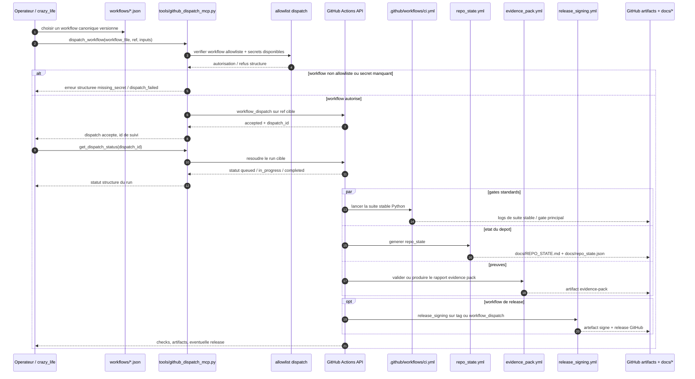

# Kill_LIFE Workflow GitHub Sequence - 2026-03-11

## Scope

Ce diagramme fixe la sequence canonique quand un workflow `Kill_LIFE` quitte la machine operateur pour passer par le dispatch GitHub et revenir sous forme de statut et d'evidence pack.

## Sequence

## Anchors

| Surface | Role dans la sequence GitHub |
| --- | --- |
| `workflows/*.json` | choix de la lane et parametrage amont |
| `tools/github_dispatch_mcp.py` | serveur MCP local qui cadre `list_allowlisted_workflows`, `dispatch_workflow`, `get_dispatch_status` |
| `tools/run_github_dispatch_mcp.sh` | launcher stdio du dispatch GitHub |
| `.github/workflows/ci.yml` | gate principal `python-stable` sur la branche ou la PR |
| `.github/workflows/repo_state.yml` | photographie exploitable du repo et artefacts de statut |
| `.github/workflows/evidence_pack.yml` | validation/production du rapport evidence pack |
| `.github/workflows/release_signing.yml` | chemin de release signee par tag ou `workflow_dispatch` |
| `docs/evidence/evidence_pack.md` | contrat minimal de contenu d'un evidence pack |

## Reading

- La machine operateur ne pousse pas elle-meme une logique arbitraire; elle demande le dispatch d'un workflow allowliste.
- Le retour utile n'est pas seulement `success/fail`, mais un ensemble de checks, artefacts et preuves consultables.
- `Kill_LIFE` garde la definition canonique des workflows et de leurs gates; le dispatch n'est qu'un mode d'execution distant.

## Next lots

- `K-DA-003` est ferme par ce diagramme versionne.
- `K-DA-004`: resynchroniser plus largement README et docs/plans autour des deux sequences `local` et `github`.
- `K-DA-005`: synchroniser la doc operateur avec les preuves et artefacts effectivement exposes.
