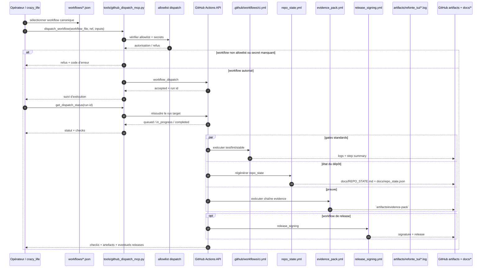

# Kill_LIFE Workflow GitHub Sequence - 2026-03-20

## Scope

Diagramme canonique de la sortie locale vers GitHub Actions, puis retour état + evidence pack.

## Sequence

## Anchors

| Surface | Rôle |
| --- | --- |
| `tools/run_github_dispatch_mcp.sh` | façade locale pour l’allowlist dispatch |
| `.github/workflows/ci.yml` | gate principal python-stable |
| `.github/workflows/repo_state.yml` | photo d’état de repo |
| `.github/workflows/evidence_pack.yml` | lane evidence pack et preuve synthétique |
| `.github/workflows/release_signing.yml` | signature éventuelle |
| `docs/evidence/evidence_pack.md` | contrat de lecture des preuves |
| `docs/EVIDENCE_ALIGNMENT_2026-03-11.md` | alignement CI ↔ doc ↔ réalité |
| `tools/repo_state/repo_refresh.sh` | génération du header global |

## Reading

- Le dispatch GitHub reste la seule voie de validation distante systématique.
- Le retour attendu n’est pas binaire, il inclut check, artefacts et proof summary.
- Le repo-state header est lu depuis `artifacts/repo_state/header.latest.md` et doit contenir au minimum `Kill_LIFE`.
- Les logs TUI (`artifacts/refonte_tui/*.log`) servent au postmortem d’exécution.

## Next lots

- `K-DA-003` clos par ce diagramme.
- `K-DA-004`: synchroniser les docs opérateur avec les preuves exposées.
- `K-DA-006`, `K-DA-007`: conserver comme preuve continue via `tools/repo_state/*`.
