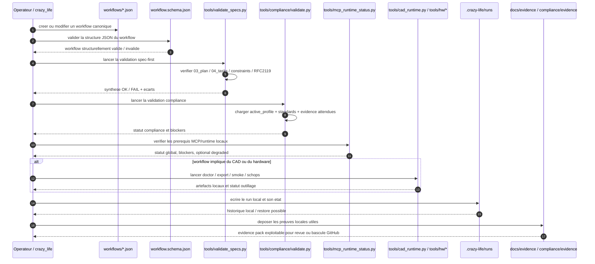

# Kill_LIFE Workflow Local Sequence - 2026-03-11

## Scope

Ce diagramme fixe la sequence locale canonique quand un workflow `Kill_LIFE` est edite, valide et execute sans passage par le dispatch GitHub.

## Sequence

## Anchors

| Surface | Role dans la sequence locale |
| --- | --- |
| `workflows/*.json` | definition executable et versionnee de la lane |
| `workflows/workflow.schema.json` | validation structurelle avant execution |
| `tools/validate_specs.py` | garde spec-first locale |
| `tools/compliance/validate.py` | validation du profil actif et des preuves attendues |
| `tools/mcp_runtime_status.py` | lecture de sante des runtimes MCP/CAD locaux |
| `tools/cad_runtime.py` et `tools/hw/*` | actions locales hardware/CAD quand le workflow en depend |
| `.crazy-life/runs/` | etat local des runs depuis l'editeur `crazy_life` |
| `.crazy-life/backups/workflows/` | revisions et restores locaux non versionnes |
| `docs/evidence/` et `compliance/evidence/` | sortie documentaire exploitable pour revue et transition release |

## Reading

- La validation locale ne remplace pas le dispatch GitHub; elle sert de sas avant CI distante.
- `Kill_LIFE` conserve la source de verite des workflows et des regles de validation.
- `crazy_life` joue le role d'editeur et d'operateur local, mais les artefacts canoniques restent dans `Kill_LIFE`.

## Next lots

- `K-DA-002` est ferme par ce diagramme versionne.
- `K-DA-003`: sequence `workflow github` avec allowlist dispatch et evidence pack CI.
- `K-DA-004`: synchroniser README et doc operateur autour des deux diagrammes `local` et `github`.
