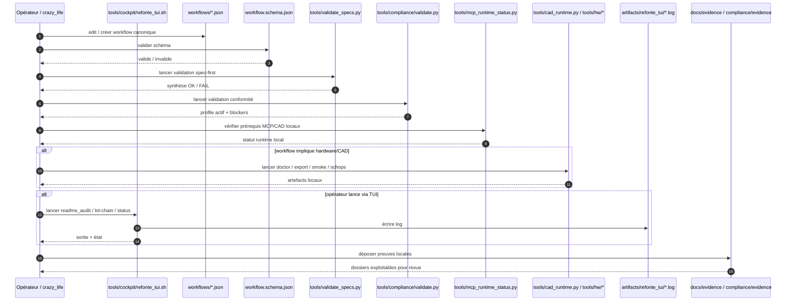

# Kill_LIFE Workflow Local Sequence - 2026-03-20

## Scope

Canonical sequence de validation locale quand un workflow `Kill_LIFE` est édité, validé puis exécuté en local.

## Sequence

## Anchors

| Surface | Role |
| --- | --- |
| `workflows/*.json` | définition executable et versionnée |
| `workflow.schema.json` | vérification structurelle |
| `tools/validate_specs.py` | garde-fou spec-first |
| `tools/compliance/validate.py` | validation profile + compliance |
| `tools/mcp_runtime_status.py` | état des runtimes MCP/CAD |
| `tools/hw/*` | actions hardware/CAD si workflow dépendant |
| `tools/cockpit/refonte_tui.sh` | exécute lot-chain et garde les logs |
| `artifacts/refonte_tui/*.log` | lecture/analyse/suppression contrôlée |
| `docs/evidence/*` | preuves pour revue |

## Reading

- La validation locale est un prérequis, pas un remplacement de la validation GitHub.
- `KILL_LIFE` garde la source de vérité des workflows et règles de validation.
- Le TUI agit comme couche opératoire uniforme pour status, logs et lots.

## Next lots

- `K-DA-002` est fermé par ce diagramme versionné.
- `K-RE-002` fermera la dette cartes/séquences restantes.
- Enchaîner ensuite avec `K-DA-003` côté GitHub.
