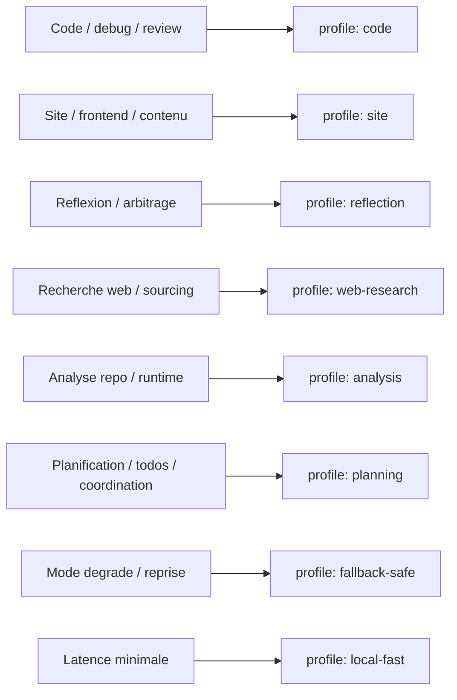

# Profils modeles Mascarade - kxkm-ai

Date: `2026-03-20`

Objectif: publier un catalogue de profils modeles pour `mascarade` sur `kxkm@kxkm-ai` afin de couvrir rapidement plusieurs usages sans redecider a chaque run: code, site, reflexion, recherche web, analyse, planification et mode degrade.

Source de verite:

- `specs/contracts/mascarade_model_profiles.kxkm_ai.json`
- TUI cockpit: `tools/cockpit/mascarade_models_tui.sh`
- smoke runtime: `tools/ops/operator_live_provider_smoke.py --profile <id>`
- sync runtime `kxkm-ai`: `tools/ops/sync_mascarade_agents_kxkm.sh`

## Profils publies

| Profil | Usage principal | Provider par defaut | Modele par defaut |
| --- | --- | --- | --- |
| `local-fast` | reponses tres rapides et triage local | `ollama` | `qwen3:4b` |
| `code` | implementation, debug, refactor | `ollama` | `mascarade-coder:latest` |
| `site` | web, contenu, structure produit | `ollama` | `qwen3.5:9b` |
| `reflection` | arbitrage, alternatives, risques | `ollama` | `qwen2.5:14b` |
| `web-research` | synthese externe et comparaison | `ollama` | `qwen3.5:9b` |
| `analysis` | diagnostic repo/runtime | `ollama` | `mascarade-power:latest` |
| `planning` | plans, todos, owners, validations | `ollama` | `qwen2.5:14b` |
| `fallback-safe` | mode degrade et reprise | `ollama` | `ollama:qwen3.5:9b` |
| `firmware` | firmware embarque, PlatformIO, ESP32 | `ollama` | `mascarade-platformio:latest` |
| `cad` | KiCad, FreeCAD, outillage CAD/EDA | `ollama` | `mascarade-kicad:latest` |
| `ops` | incidents, logs, runbooks, recovery | `ollama` | `mascarade-power:latest` |
| `docs` | README, specs, runbooks, syntheses | `ollama` | `qwen3.5:9b` |
| `security` | menace, hardening, abuse paths | `ollama` | `qwen2.5:14b` |
| `fine-tune` | datasets, distillation, LoRA, eval | `ollama` | `qwen3.5:9b` |
| `kill-life-firmware` | firmware cible Kill_LIFE | `ollama` | `mascarade-platformio:latest` |
| `yiacad-cad` | CAD/EDA cible YiACAD | `ollama` | `mascarade-kicad:latest` |
| `mesh-syncops` | mesh, SSH, logs, alignement | `ollama` | `mascarade-power:latest` |
| `docs-specs` | docs, specs, Mermaid, handoff | `ollama` | `qwen3.5:9b` |

## Carte d'usage



## Utilisation cockpit / TUI

Lister les profils:

```bash
bash tools/cockpit/mascarade_models_tui.sh --action list
```

Afficher un profil:

```bash
bash tools/cockpit/mascarade_models_tui.sh --action show --profile analysis
```

Exporter les variables a appliquer sur `kxkm-ai`:

```bash
bash tools/cockpit/mascarade_models_tui.sh --action env --profile code
```

Recuperer le prompt systeme associe:

```bash
bash tools/cockpit/mascarade_models_tui.sh --action prompt --profile planning
```

Generer les agents dynamiques qui correspondent aux profils:

```bash
bash tools/cockpit/mascarade_models_tui.sh --action agents-json
```

## Utilisation runtime Mascarade

Le smoke runtime accepte maintenant directement un profil:

```bash
python3 tools/ops/operator_live_provider_smoke.py --profile analysis
python3 tools/ops/operator_live_provider_smoke.py --profile code
python3 tools/ops/operator_live_provider_smoke.py --profile web-research
```

Le profil selectionne:

- choisit un provider par defaut
- propose un modele par defaut et des fallbacks
- ajuste la preference de routage provider
- specialise le prompt operatoire par usage

Smoke live des agents `kxkm-*` deja seeds:

```bash
bash tools/ops/smoke_mascarade_agents_kxkm.sh --json
bash tools/ops/smoke_mascarade_agents_kxkm.sh --agents kxkm-analysis,kxkm-firmware --json
```

Le script:

- interroge l'API Mascarade live sur `kxkm-ai`
- journalise un artefact JSON local dans `artifacts/ops/mascarade_agent_smoke/`
- capture pour chaque agent le `http_status`, le `provider`, le `model`, le `content` et l'eventuelle erreur

Surface UI live:

- la page `Agents` de `mascarade-main` expose maintenant un panneau `KXKM presets for live dispatch`
- cette zone remonte les lanes critiques `kxkm-analysis`, `kxkm-firmware`, `kxkm-code`, `kxkm-cad`, `kxkm-ops`, `kxkm-fallback-safe`
- chaque preset ouvre directement le detail agent via le registre live
- le build public a ete repousse dans `api/public` via `npm run build:api-public`

## Reutilisation du chat existant sur `kxkm-ai`

Le systeme de chat Mascarade deja present sur `kxkm-ai` expose des agents dynamiques avec `preferred_provider` et `preferred_model`. La publication retenue consiste donc a convertir les profils en agents natifs `kxkm-*` plutot qu'a reconstruire une autre couche.

Planifier le seed:

```bash
bash tools/ops/sync_mascarade_agents_kxkm.sh --action plan
```

Appliquer le seed sur `kxkm-ai`:

```bash
bash tools/ops/sync_mascarade_agents_kxkm.sh --action sync --apply
```

Agents seeds:

- `kxkm-local-fast`
- `kxkm-code`
- `kxkm-site`
- `kxkm-reflection`
- `kxkm-web-research`
- `kxkm-analysis`
- `kxkm-planning`
- `kxkm-fallback-safe`
- `kxkm-firmware`
- `kxkm-cad`
- `kxkm-ops`
- `kxkm-docs`
- `kxkm-security`
- `kxkm-fine-tune`
- `kxkm-kill-life-firmware`
- `kxkm-yiacad-cad`
- `kxkm-mesh-syncops`
- `kxkm-docs-specs`

Etat applique au `2026-03-20`:

- seed ecrit sur `kxkm-ai` dans `/home/kxkm/mascarade-main/data/agents.json`
- premiere passe: 8 agents crees, 0 mis a jour
- seconde passe specialisee: 6 agents supplementaires ajoutes via le meme seed
- troisieme passe metier: 4 agents supplementaires ajoutes au meme seed
- runtime live: les `18` agents `kxkm-*` sont maintenant visibles sur `127.0.0.1:3100/api/agents`
- infrastructure locale: un runtime `mascarade-ollama-runtime` en `0.18.2` est publie sur le reseau Docker Mascarade avec le store de modeles deja present sur `kxkm-ai`
- catalogue realigne: les profils `kxkm-*` passent en `ollama-first` avec des noms de modeles compatibles (`mascarade-coder`, `mascarade-platformio`, `mascarade-kicad`, `mascarade-power`, `qwen*`)
- bridge transitoire retire du chemin actif: `kxkm-ollama-bridge.service` est desactive; la pile live continue a repondre via `mascarade-ollama-runtime` uniquement
- smoke live valide:
  - `bash tools/ops/smoke_mascarade_agents_kxkm.sh --agents kxkm-analysis,kxkm-firmware,kxkm-code,kxkm-cad,kxkm-ops,kxkm-fallback-safe --json` -> `status=ok`
    - `kxkm-analysis` -> `200`, `provider=ollama`, `model=mascarade-power:latest`
    - `kxkm-firmware` -> `200`, `provider=ollama`, `model=mascarade-platformio:latest`
    - `kxkm-code` -> `200`, `provider=ollama`, `model=mascarade-coder:latest`
    - `kxkm-cad` -> `200`, `provider=ollama`, `model=mascarade-kicad:latest`
    - `kxkm-ops` -> `200`, `provider=ollama`, `model=mascarade-power:latest`
    - `kxkm-fallback-safe` -> `200`, `provider=ollama`, `model=qwen2.5:7b`
  - artefact local consolide: `artifacts/ops/mascarade_agent_smoke/latest.json`

## Politique retenue pour kxkm-ai

- `kxkm-ai` prend la charge Mascarade polyvalente derriere `tower`.
- les profils `kxkm-*` sont maintenant orientes `ollama-first` pour rester executables localement, sans cle externe.
- les profils generaux s'appuient sur `qwen3.5:9b`, `qwen2.5:14b` et `qwen3:4b` selon la charge et la profondeur attendue.
- les profils metier utilisent les modeles locaux specialises deja presents sur la machine: `mascarade-coder`, `mascarade-platformio`, `mascarade-kicad`, `mascarade-power`.
- le mode degrade garde un chemin court `qwen2.5:7b` pour une reprise plus sure et moins couteuse.

## Suite de lot

- documenter les profils effectivement valides apres la passe `ollama-first`
- ajouter si besoin des presets plus explicites dans l'UI chat Mascarade pour choisir les agents `kxkm-*`
- etendre ensuite la meme logique de presets aux surfaces `Orchestrate` et `Playground`
