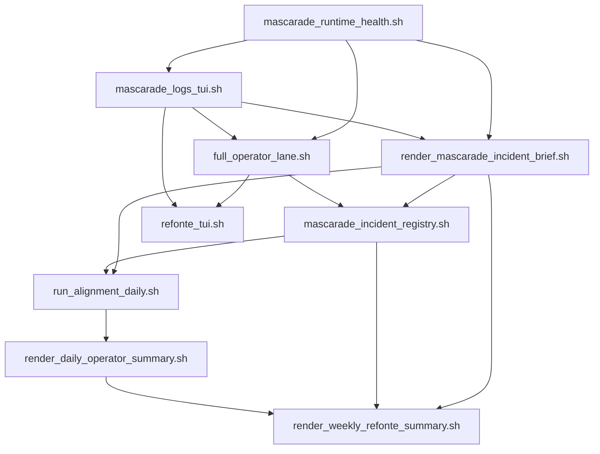

# Mascarade ops / incidents / observability feature map (2026-03-21)

## Objectif

Cartographier la couche opératoire Mascarade/Ollama désormais présente dans Kill_LIFE:

- health-check runtime
- logs TUI et logs lane opérateur
- briefs et registre d'incidents
- synthèses daily / weekly
- surfaces TUI d'accès opérateur

## Mermaid — flux opératoire

## Modules et rôle

| Module | Rôle | Entrées | Sorties |
| --- | --- | --- | --- |
| `mascarade_runtime_health.sh` | état runtime Mascarade/Ollama | SSH `kxkm-ai`, smoke agent | JSON cockpit, `latest.json`, `latest.log` |
| `mascarade_logs_tui.sh` | lecture/analyse/purge des logs | artefacts runtime + lane opérateur | JSON cockpit, vues `summary|latest|list|purge` |
| `full_operator_lane.sh` | orchestration opérateur | API locale, health runtime, logs | JSON cockpit, hints API, snapshots logs |
| `render_mascarade_incident_brief.sh` | brief court daily | runtime latest + lane opérateur | Markdown/JSON latest |
| `mascarade_incident_registry.sh` | historique d'incidents | briefs cockpit + summaries opérateur | registre Markdown/JSON latest |
| `run_alignment_daily.sh` | routine quotidienne consolidée | health, logs, brief, registry, mesh, log_ops | log daily, JSON daily, brief/logs artifacts |
| `render_daily_operator_summary.sh` | résumé opérateur quotidien | log daily + brief + registry | Markdown/JSON latest |
| `render_weekly_refonte_summary.sh` | synthèse hebdo | logs refonte/CAD + brief + registry | Markdown hebdo |
| `refonte_tui.sh` | surface TUI cockpit | actions dédiées | accès opérateur direct |

## Carte de fonctionnalités

### P0 — Déjà en place

- health-check runtime Mascarade/Ollama
- smoke agent low-cost
- logs TUI `summary|latest|list|purge`
- snapshots post-run opérateur
- brief d'incident Markdown
- registre d'incidents horodaté
- synthèse weekly enrichie
- synthèse daily opérateur

### P1 — Prochaine montée utile

- export Markdown automatique de l'incident du jour dans la revue daily complète
- liens croisés explicites entre daily summary, brief et registry
- tri des incidents par sévérité/source
- regroupement des erreurs d'API locale par classe

### P2 — Montée en puissance

- dashboards légers ou status page dérivée des artefacts
- corrélation simple `mesh / operator lane / Mascarade runtime`
- seuils et alertes locales plus explicites
- éventuelle migration vers une brique d'observabilité plus centralisée

## Affectation agents / sous-agents

| Domaine | Agent | Sous-agent | Focus |
| --- | --- | --- | --- |
| runtime | `SyncOps` | `Runtime-Smoke` | runtime health, smoke low-cost |
| logs | `SyncOps` | `Log-Curator` | lecture, purge, latest snapshots |
| lane opérateur | `SyncOps` | `Lane-Guard` | hints API, JSON cockpit, surface native |
| briefs / handoff | `PM` | `Doc-Runbook` | briefs, registry, synthèses |
| TUI cockpit | `SyncOps` | `TUI-Ops` | raccourcis, ergonomie opérateur |

## Décision de lot

- garder la stratégie actuelle `TUI + JSON cockpit + Markdown handoff`
- éviter une dépendance observabilité lourde tant que cette couche couvre les besoins opératoires
- utiliser la veille OSS seulement comme benchmark d'évolution, pas comme migration immédiate
