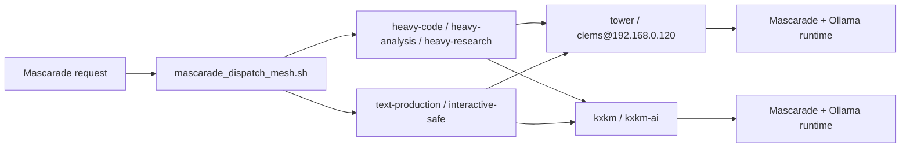

# Mascarade Tower Runtime - 2026-03-21

## Etat retenu

- `tower` = `clems@192.168.0.120`
- la stack Mascarade y est deja active:
  - `mascarade-api`
  - `mascarade-core`
  - `mascarade-ollama`
- le lot courant normalise cette machine comme premiere cible lourde du mesh Mascarade au lieu de redeployer une pile parallele.

## Profils Tower

- `tower-code`
- `tower-text`
- `tower-research`
- `tower-analysis`

Source de verite:

- `specs/contracts/mascarade_model_profiles.tower.json`

Seed distant:

- `bash tools/ops/sync_mascarade_agents_tower.sh --action sync --apply --json`

Normalisation runtime:

- `bash tools/ops/deploy_mascarade_tower_runtime.sh --action status --json`
- `bash tools/ops/deploy_mascarade_tower_runtime.sh --action apply --json`

## Politique de dispatch P2P

- charges lourdes:
  - `tower -> kxkm -> local -> cils -> root-reserve`
- texte interactif / docs:
  - `kxkm -> tower -> local -> cils -> root-reserve`
- `cils` reste non essentiel
- `root-reserve` reste strictement reserve

Contrat:

- `specs/contracts/mascarade_dispatch.mesh.json`

Surface CLI:

- `bash tools/cockpit/mascarade_dispatch_mesh.sh --action summary --json`
- `bash tools/cockpit/mascarade_dispatch_mesh.sh --action route --profile tower-code --json`
- `bash tools/cockpit/mascarade_dispatch_mesh.sh --action route --profile kxkm-analysis --json`

## Diagramme

## Decision

- `tower` porte la charge lourde par defaut.
- `kxkm` reste l'hote de chat/orchestration et le premier fallback.
- le dispatch est explicite et documente dans le repo, sans supposer un multi-endpoint natif dans Mascarade.
