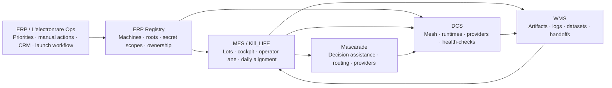

# Ops -> Kill_LIFE ERP Bridge Contract

Date: 2026-03-22
Status: baseline contract
Scope: bridge between `L'electronrare Ops`, `Kill_LIFE`, and `Mascarade`

## 1. Decision

For `Kill_LIFE`, the `ERP` layer is `L'electronrare Ops`.

Reference surface:
- [Ops — L'Electron Rare](https://www.lelectronrare.fr/ops)

Operational meaning:
- `Ops` decides priorities, manual actions, business workflow, and launch workflow
- `Kill_LIFE` executes and records continuity
- `Mascarade` assists decisions, routing, and runtime execution

## 2. Contract

The bridge is defined as:

- `Ops` provides intent and priorities
- `ERP registry` provides resource governance
- `MES` transforms priorities into executable lots
- `WMS` stores proofs, logs, artifacts, and handoffs
- `DCS` reflects the real runtime state

## 3. Mermaid — bridge flow

## 4. Canonical registry

Canonical structured source:
- [ops_kill_life_erp_registry.json](/Users/electron/Documents/Lelectron_rare/Kill_LIFE/specs/contracts/ops_kill_life_erp_registry.json)

Read-only operator surface:
- [ops_erp_registry_tui.sh](/Users/electron/Documents/Lelectron_rare/Kill_LIFE/tools/cockpit/ops_erp_registry_tui.sh)

Supported views:
- `summary`
- `machines`
- `modules`
- `secrets`

## 5. Machine governance

Current canonical machine model:

| Label | Host | Canonical root | Role | Priority | Load policy |
|---|---|---|---|---|---|
| `tower` | `clems@192.168.0.120` | `/home/clems/mascarade` | primary-heavy | 1 | prefer-heavy |
| `kxkm` | `kxkm@kxkm-ai` | `/home/kxkm/mascarade` | interactive-ai | 2 | secondary-heavy |
| `cils` | `cils@100.126.225.111` | `/Users/cils/mascarade-main` | non-essential-burst | 3 | burst-only |
| `local` | `local` | `/Users/electron/Documents/Projets/mascarade` | control-and-fallback | 4 | fallback |
| `photon` | `root@192.168.0.119` | `/root/mascarade-main` | vm-governance-reserve | 5 | avoid-heavy |

## 6. Secret governance

Router scope:
- env var: `MISTRAL_API_KEY`
- consumer: Mascarade provider/router and Studio integrations
- source of truth: Mascarade `.env`

Governance scope:
- env var: `MISTRAL_GOVERNANCE_API_KEY`
- consumer: `Kill_LIFE` governance scripts
- source of truth: `~/.kill-life/mistral.env`

Principle:
- do not invent a second provider variable in Mascarade without an explicit consumer
- keep `Mascarade` on `MISTRAL_API_KEY`
- keep governance-only routing in `Kill_LIFE`

## 7. Dedicated agent ownership

| Layer | Owner agent | Responsibility |
|---|---|---|
| `PLM` | `PLM-Archivist` | specs, plans, contracts, maps |
| `ERP` | `Ops-Governor` | machine and secret governance |
| `MES` | `SyncOps` | lots, cockpit, operator continuity |
| `WMS` | `Artifact-Curator` | artifacts, logs, datasets, retention |
| `DCS` | `Runtime-Guard` | mesh state, runtime health, dispatch |

Additional dedicated agents:

| Agent | Responsibility |
|---|---|
| `KillLife-Bridge` | governance secrets and continuity bridge |
| `Dataset-Curator` | dataset audit and fine-tune preflight |

## 8. Immediate refactor plan

1. Close `ERP minimal`
- make the registry the visible source of truth for machine, secret, and ownership policies

2. Index `WMS`
- map artifacts to lot, layer, and consumer

3. Compact `MES`
- expose one operator entrypoint per layer

4. Clean `DCS`
- reduce machine-level ambiguity between repo root and runtime root

5. Close the loop with `Ops`
- map `/ops` priorities to executable lot categories and owners
