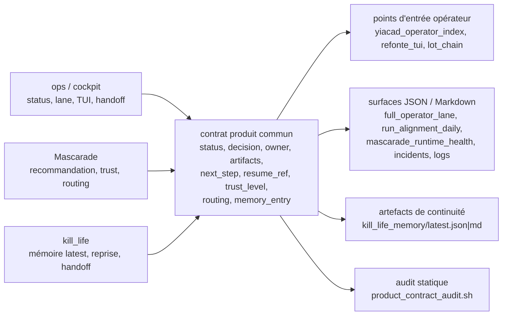

# Carte de fonctionnalités — ops / Mascarade / kill_life (2026-03-21)

## Objectif

Rendre visible le contrat produit minimal qui doit rester cohérent entre:

- les entrées opérateur
- les surfaces Mascarade
- la mémoire de continuité `kill_life`

## Vue d'ensemble

## Carte fonctionnelle

| Couche | Rôle produit | Sortie canonique | Risque si écart |
| --- | --- | --- | --- |
| `ops` | montrer l'état réel, déclencher l'action, exposer le prochain pas | `full_operator_lane`, `run_alignment_daily`, `daily_operator_summary` | l'opérateur agit sans preuve ni point de reprise clair |
| `Mascarade` | recommander, expliciter le routing, porter le `trust_level` | `mascarade_runtime_health`, `mascarade_incidents_tui`, watch/queue/brief | recommandation opaque ou non rejouable |
| `kill_life` | persister la continuité et la reprise stable | `artifacts/cockpit/kill_life_memory/latest.json` | reprise lente ou ambiguë entre deux opérateurs |
| `entrypoints` | exposer la reprise sans navigation profonde | `yiacad_operator_index`, `refonte_tui`, `lot_chain` | rupture entre surfaces courtes et surfaces détaillées |
| `audit` | contrôler la cohérence minimale sans relancer toute la pile | `product_contract_audit/latest.json|md` | dérive silencieuse des surfaces et du contrat |

## Décision

- consolider d'abord la cohérence des surfaces existantes
- éviter d'élargir encore la surface tant que la reprise n'est pas homogène
- utiliser l'audit statique comme garde-fou léger entre deux lots
