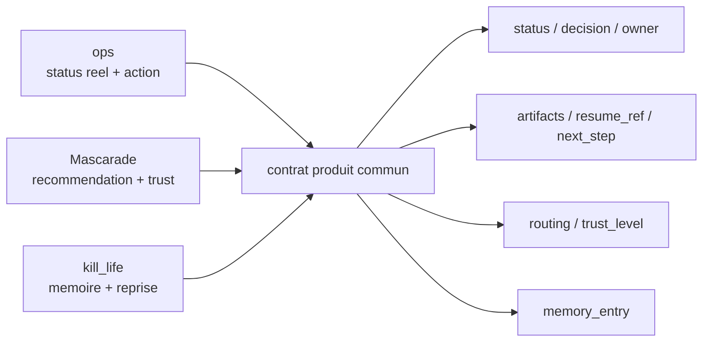

# Contrat produit `ops <-> Mascarade <-> kill_life` - 2026-03-21

## Intention

La surface produit est maintenant suffisamment large. Le bon prochain palier est de consolider la confiance et la continuité entre les trois couches:

- `ops` montre l'etat reel et declenche l'action
- `Mascarade` aide a decider sans opacite
- `kill_life` materialise la continuité d'execution

## Contrat minimal commun

Source de verite:

- `specs/contracts/ops_mascarade_kill_life.contract.json`

Champs minimaux obligatoires:

- `status`
- `decision`
- `owner`
- `artifacts`
- `next_step`
- `resume_ref`
- `trust_level`
- `routing`
- `memory_entry`

## Roles

### ops

- montre l'etat observe
- expose les preuves et artefacts
- permet le declenchement
- montre le prochain pas executable

### Mascarade

- formule une recommandation explicable
- expose la rationale
- annonce le `trust_level`
- rend visible le routing machine et les fallbacks

### kill_life

- persiste l'intention et la decision
- garde un `resume_ref` stable
- permet un handoff humain + machine sans relire tout l'historique

## Diagramme

## Decision de lot

- on gele l'extension de surface comme priorite principale
- on aligne d'abord les sorties existantes sur ce contrat
- `tower` devient la cible lourde prioritaire pour le runtime Mascarade
- `kxkm` reste la couche interactive et le premier fallback operable

## Lots suivants

1. projeter ce contrat dans les sorties JSON cockpit prioritaires
2. faire apparaitre `trust_level`, `resume_ref` et `routing` dans les surfaces ops/Mascarade
3. raccorder l'entree `memory_entry` aux traces `kill_life`
