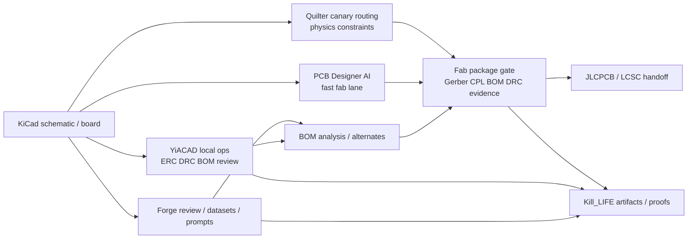

# PCB AI / Forge / BOM / fabrication map (2026-03-22)

## Objectif

Raccorder trois references externes a la pile existante `Forge + YiACAD + BOM + JLCPCB` sans brouiller la source de verite locale:

- [PCB Designer AI](https://pcbdesigner.ai/)
- [Quilter](https://www.quilter.ai/)
- [kicad-happy](https://github.com/aklofas/kicad-happy)

Le principe retenu reste strict:

- `Kill_LIFE` garde la source de verite locale pour `ERC/DRC`, `BOM`, `netlist`, `review`, `evidence`.
- `YiACAD` garde la couche d'execution locale `KiCad + FreeCAD`.
- `Forge` garde la couche review/dataset/fine-tune.
- Les outils externes sont integres comme accelerateurs specialises, pas comme nouvelle source de verite.

## Ancrages existants dans Kill_LIFE

La base existe deja sur quatre zones:

1. `Forge`
- `docs/plans/23_plan_integration_mistral_agents.md`
- `docs/plans/23_todo_integration_mistral_agents.md`
- `tools/cockpit/e2e_agents_test.sh`

2. `KiCad / YiACAD`
- `docs/KICAD_AI_LOCAL.md`
- `specs/kicad_mcp_scope_spec.md`
- `specs/yiacad_tux004_orchestration_spec.md`
- `tools/cad/yiacad_native_ops.py`
- `tools/cad/yiacad_backend_client.py`

3. `BOM / sourcing`
- `tools/hw/schops/schops.py`
- `tools/hw/hw_check.sh`
- `tools/cad/yiacad_backend_service.py`
- `agents/hw_schematic_agent.md`

4. `pilotage concret`
- `docs/plans/25_todo_hypnoled_pilote.md`

Conclusion: il n'y a pas de trou sur `review/BOM/preuves`. Le trou est sur `auto-placement/routing externe` et `fabrication one-click`.

## Ce que disent les sources externes

### PCB Designer AI

Constats verifies sur [pcbdesigner.ai](https://pcbdesigner.ai/):

- upload de schema, puis placement + routage par IA
- export `Gerber`, `ODB++`, formats natifs `KiCad` et `Altium`
- `BOM` avec pricing/stock live et suggestions d'alternatives
- DRC temps reel avec regles `JLCPCB`, `PCBWay` et custom
- ordering direct vers `JLCPCB`, `PCBWay`, `OSHPark`

Fit projet:
- tres fort pour une lane `prototype rapide -> package fab`
- tres bon pour `BOM + alternatives + fabrication`
- plus faible sur la maitrise IP et sur la tracabilite detaillee des decisions de layout

### Quilter

Constats verifies sur [Quilter](https://www.quilter.ai/) et [sa doc d'upload](https://docs.quilter.ai/using-quilter/upload-your-design-files):

- upload `schematic + board + project files`
- detection automatique de contraintes physiques depuis le schema
- parametrage `fabricators`, `stack-ups`, `fabrication rules`, `keepouts`, `pre-routed traces`
- revue de candidats de layout
- restitution des designs dans le meme format de fichier que l'entree, pour reouverture directe dans l'outil CAD

Inference explicite:
- je n'ai pas trouve sur source officielle la meme promesse `one-click JLCPCB` que PCB Designer AI
- en revanche, le retour dans le format CAD d'origine + les profils de fabrication rendent plausible un flux `KiCad -> Quilter -> package fab/JLCPCB` borne et controlable

Fit projet:
- meilleur candidat pour une lane `canary routing` sous garde `YiACAD`
- tres bon pour cartes complexes, contraintes physiques, fanout, validation de candidats
- moins adapte a une promesse produit `commande one-click` immediate

### kicad-happy

Constats verifies sur [GitHub - aklofas/kicad-happy](https://github.com/aklofas/kicad-happy):

- skills Claude Code pour analyser schemas, PCB, Gerbers et PDF de reference
- cycle complet `BOM -> sourcing -> pricing -> order files`
- connecteurs `DigiKey`, `Mouser`, `LCSC`
- skill `jlcpcb` pour design rules, `BOM/CPL` et workflow d'ordering

Fit projet:
- c'est la reference la plus proche de ce qu'on fait deja avec `Forge + YiACAD + HW-BOM`
- excellent comme reservoir de patterns pour `review.bom`, `sourcing`, `preparation fabrication`, `JLCPCB/LCSC`
- ne doit pas devenir une dependance runtime centrale; a traiter comme reference ouverte et source d'idees de playbooks

## Cartographie cible

| Outil | Role recommande dans Kill_LIFE | Couche principale | Owner agent | Statut recommande |
| --- | --- | --- | --- | --- |
| `PCB Designer AI` | fast lane `schema -> layout -> fab package` pour prototypes | `WMS + DCS` | `Embedded-CAD` + `HW-BOM` | `evaluate-fast-fab` |
| `Quilter` | canary `routing/placement` sous contraintes physiques | `DCS` | `CAD-Bridge` + `CAD-Smoke` | `canary-route` |
| `kicad-happy` | reference de playbooks `review/BOM/sourcing/JLCPCB` | `PLM + MES` | `HW-BOM` + `Forge` | `adopt-patterns` |

## Architecture d'integration

## Garde-fous retenus

1. `YiACAD` reste la reference locale pour `ERC/DRC/BOM review`.
2. Aucun outil externe ne devient source de verite unique pour les artefacts de fabrication.
3. Toute lane externe doit redescendre vers un `fab package` standardise avec preuve locale.
4. `JLCPCB` reste aujourd'hui un objectif de package/handoff; le one-click n'est pas encore un workflow interne livre dans `Kill_LIFE`.

## Trous de couche a combler

1. Pas de contrat canonique `fab package` (`Gerber + CPL + BOM + DRC + provenance`).
2. Pas de lane `routing canary` pour comparer `Quilter` et la chaine locale.
3. Pas de surface `BOM sourcing + alternates + JLC/LCSC` unifiee dans `YiACAD`.
4. Pas de politique explicite `IP boundary / SaaS CAD` par projet.

## Plan de refonte recommande

### Phase 1 - Reference et cadrage
- publier une cartographie outillage et ownership
- capter les patterns `kicad-happy` dans les playbooks `Forge/HW-BOM`
- formaliser le contrat `fab package`

### Phase 2 - Canary technique
- lot `Quilter canary` sur une carte pilote `Hypnoled`
- comparaison `route candidate / contraintes / package fab`
- pas de dependance runtime globale tant que la boucle n'est pas prouvee

### Phase 3 - Fast fabrication lane
- evaluer `PCB Designer AI` comme voie `prototype rapide`
- gate obligatoire sur package de sortie avant handoff fab
- acceptance seulement si les preuves `BOM/DRC/fab package` redescendent dans `Kill_LIFE`

## Recommandation nette

- `kicad-happy` = a adopter comme reference de workflow et de prompts
- `Quilter` = a evaluer en canary de routing/placement physique
- `PCB Designer AI` = a evaluer comme lane acceleration prototype + fabrication, sous garde-fous forts

## Sources

- [PCB Designer AI](https://pcbdesigner.ai/)
- [Quilter product](https://www.quilter.ai/)
- [Quilter docs - upload your design files](https://docs.quilter.ai/using-quilter/upload-your-design-files)
- [kicad-happy GitHub](https://github.com/aklofas/kicad-happy)
