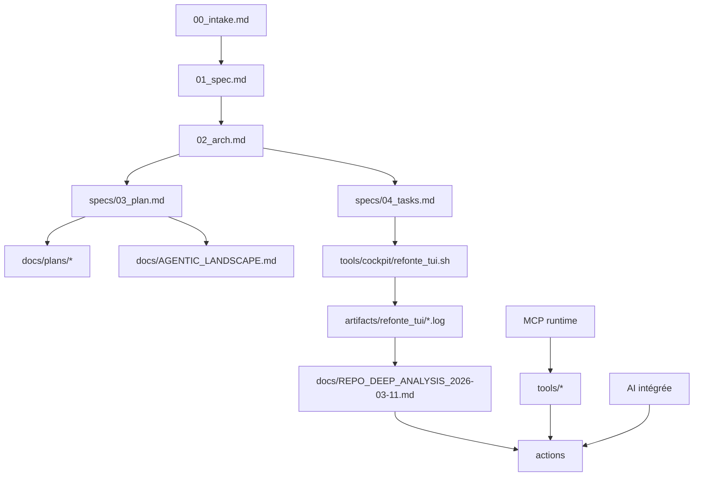
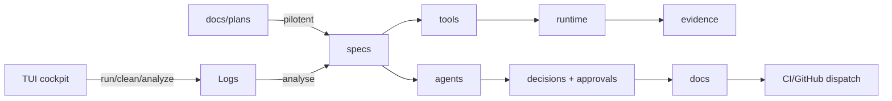

# Refonte complète - Manifeste opérateur (2026-03-20)

## Périmètre

Ce manifeste formalise la phase de refonte exhaustive de `Kill_LIFE` :

- Audit technique de bout en bout.
- Intégration de l’intelligence (LLM + orchestrateurs + MCP) de manière optionnelle et contrôlée.
- Alignement des `README`, des plans (`docs/plans/*`) et des specs (`specs/*`).
- Gouvernance multi-agent/sous-agent pour réduire la dérive.
- Scripts TUI pour exécuter les lots, suivre la dette et manipuler les logs.

## États observés (2026-03-20)

- Arborescence déjà structurée (firmware, hardware, tools, docs, specs, compliance).
- Présence d’un socle doc/plan mature, mais certaines sections demeurent placeholder.
- Outils d’enchainement automatique déjà existants (`tools/cockpit`, `tools/autonomous_next_lots.py`), mais peu d’interface opérationnelle unifiée.
- Sources de logs existantes dans `artifacts/*`, mais pas de boucle TUI dédiée à la refonte.
- Intégration IA déjà présente : ZeroClaw, n8n, LangGraph, AutoGen, MCP.

## Diagramme cible global (architecture refonte)



## Analyse d’intégration IA

| Surface | Opportunité | Bénéfice attendu | Risque | Proposition |
| --- | --- | --- | --- | --- |
| Specs + Plans | Triage + résumé de lot par lot | Réduction des erreurs de contexte et du temps de cadrage | Hallucinations, dérive de scope | Conserver `specs/constraints.yaml` comme source autoritaire et ne valider qu’avec sorties structurées (checklist + diff) |
| MCP Runtime | Orchestration de santé et de smoke | Homogénéité des contrôles locaux + CI | Latence des serveurs externes | Garde-fou : tout appel réseau signé ou explicitement autorisé |
| Firmware / Hardware | Analyses de cohérence automatique + génération d’aide à la review | Gains de répétabilité, preuve de conformité | Génération de suggestions non applicables | Mode "propose only" + mode apply par lot humain |
| CAD / KiCad + FreeCAD | Fusion IA-native par lot pour prototypage ECAD/MCAD | Réduction du temps de setup + surface commune de pilotage | Divergence fork, scripts non reproductibles | YiACAD par `tools/cad/yiacad_fusion_lot.sh`, avec preflight + statut + logs dédiés |
| UI/UX shell | Refonte Apple-native 2026 des surfaces opérateur et CAD | Navigation plus lisible, densité maîtrisée, adoption macOS cohérente | Effet cosmétique sans gain métier, surcouche incohérente avec les forks | Shell unifié `sidebar -> canvas -> inspector`, commandes IA contextualisées, TUI dédiée et artefacts auditables |
| Docs / Evidence | Rédaction de cartes et rapports d’écart | Réduction de la dette documentaire | Surcharge de fausses alertes | Checklist de sortie avec seuil de bruit et filtre |
| Logs / Incident ops | Consolidation, corrélation, purge | Traçabilité des lots et reprise rapide | Conservation trop longue, bruit | Politique de rétention explicite (`--days`, purge contrôlée) |

## Tableau des intégrations IA proposées (alignées sur le manifeste)

- [x] Activer la couche IA comme surface d’accélération, jamais comme autorité.
- [x] Prioriser l’intégration par “overlay” (optionnelle, activable), pas en hard-dependency.
- [x] Encadrer chaque automation par des labels `ai:*` et gates existants.
- [ ] Expérimenter un pilote AutoGen/CrewAI sur un lot non critique (documentation + reporting uniquement).
- [ ] Mettre en place une matrice d’usage IA par surface (`docs/AI_WORKFLOWS.md` mis à jour).
- [x] Ajouter un lot de fusion CAD `yiacad-fusion` au lot-chain avec rollback explicite.
- [ ] Créer un référentiel de prompts/bridges réutilisables pour tests et audits.

## Cartographie fonctionnelle (mermaid)



## Plan de lots et priorités

### P0 (blocage potentiel)
- [x] Stabiliser la matrice agent/sous-agent.
- [x] Supprimer les points de confusion docs/specs dans `README`, `docs/index`, `specs/*`.
- [x] Rendre exécutables : audit de cohérence + run de lot + journalisation.

### P1 (qualité + fiabilité)
- [x] Mettre à jour la feature map et les cartes mermaid canoniques.
- [x] Documenter la stratégie logs (lecture, analyse, purge) dans le manifeste.
- [x] Actualiser le plan de web research OSS et le score de similarité projet.
- [x] Compléter le lot `yiacad-fusion` (prepare, smoke, status, logs, clean-logs) côté scripts/docs/planification.
- [x] Publier l’audit UI/UX Apple-native et la carte fonctionnelle dédiée YiACAD.

### P2 (accélération future)
- [ ] Créer une extension d’assistant IA par lot (pilotable, dry-run).
- [x] Construire une synthèse hebdomadaire automatique de l’avancement.
- [ ] Industrialiser la preuve YiACAD (`artifacts/cad-fusion`) dans la fenêtre de pilotage locale.
- [ ] Injecter les patterns Apple-native directement dans les surfaces compilées des forks KiCad/FreeCAD.

## Référence des agents et sous-agents (exécution)

| Agent principal | Sous-agents | Missions | Compétences-clés |
| --- | --- | --- | --- |
| PM | PM-Plan, PM-Coord | Consolidation de backlog, priorisation, jalons, validation de faisabilité | specs, labels, gates, communication |
| Architect | Arch-Design, Arch-Decision | Schéma d’architecture refonte, ADR, cohérence interfaces | `docs`, `specs`, MCP, intégration système |
| CAD | CAD-Fusion, CAD-Smoke | Orchestration KiCad/FreeCAD, vérification smoke, gestion de rollback | kicad/mcp, freecad/mcp, scripts de statut |
| Firmware | FW-Unit, FW-Build, FW-Evidence | Plans d’implémentation, audit firmware, quality gates | PlatformIO, tests, snapshots d’evidence |
| HW Schematic | HW-Bulk, HW-BOM | Cohérence schématique, flux CAD/MCP, preuves de contrôle | kicad-tools, schops, exports, validation ERC/DRC |
| QA | QA-Tests, QA-Suite, QA-Compliance | Regression matrix, scripts, rapport de couverture, drift logs | CI, route parity, test plan |
| Doc | Doc-Refacto, Doc-Runbook | Unification manifeste, maintenance README/plans, matrice web docs | mermaid, plans, opérabilité |

## Scripts opérationnels (TUI et artefacts)

- `tools/cockpit/refonte_tui.sh` : cockpit TUI de refonte
  - audit de cohérence
  - exécution de lot auto
  - checks MCP
  - lecture logs
  - suppression contrôlée de logs
- `tools/cad/yiacad_fusion_lot.sh` : lot IA-native KiCad + FreeCAD (prepare/smoke/status/logs/clean-logs)
  - logs dédiés dans `artifacts/cad-fusion`
- `tools/cockpit/render_weekly_refonte_summary.sh` : synthèse markdown lots/logs/état machine
  - sortie canonique: `artifacts/cockpit/weekly_refonte_summary.md`
- `tools/cockpit/lot_chain.sh` + `tools/cockpit/run_next_lots_autonomously.sh` : maintien de la chaîne automatisée
- `tools/doc/readme_repo_coherence.sh` : audit README/proofs
- `tools/autonomous_next_lots.py` : lot detection et planification

Chaque commande est historisée dans `artifacts/refonte_tui/`.

## Cartes de fonctionnalités générées

- `docs/KILL_LIFE_FEATURE_MAP_2026-03-11.md`
- `docs/YIACAD_APPLE_UI_UX_FEATURE_MAP_2026-03-20.md`
- `docs/KILL_LIFE_WORKFLOW_LOCAL_SEQUENCE_2026-03-11.md`
- `docs/KILL_LIFE_WORKFLOW_GITHUB_SEQUENCE_2026-03-11.md`
- `docs/AGENTIC_LANDSCAPE.md`
- `docs/REFACTOR_MANIFEST_2026-03-20.md`
- `docs/OSS_AI_NATIVE_CAD_RESEARCH_2026-03-20.md`
- `docs/YIACAD_APPLE_UI_UX_AUDIT_2026-03-20.md`
- `specs/yiacad_uiux_apple_native_spec.md`

## Web research OSS (approuvée et intégrée)

- `docs/WEB_RESEARCH_OPEN_SOURCE_2026-03-20.md`
- `docs/OSS_AI_NATIVE_CAD_RESEARCH_2026-03-20.md`

## Bilan d’alignement machine/lot (2026-03-20 11:08)

- `ssh_healthcheck.sh --json` : OK sur les 4 machines opérationnelles.
- `run_alignment_daily.sh` : OK en local et en mode `--skip-healthcheck --json` sur cibles.
- `mesh_sync_preflight --json` : `mesh_status=degraded` (attendu tant que `cils-lockdown` reste actif en mode tower-first), pas de blocage immédiat de lot tant que la gouvernance de sécurité reste en place.
- Écart prioritaire ouvert: divergence `mascarade` entre `root` (branche `feat/apple-coreml-runtime-lot`) et cible `kxkm` (clone `mascarade` non exploitable).
- Recommandation: conserver `lots controles` jusqu’à réconciliation du contrat `mascarade`.

### Bilan d’exécution enchaînée (2026-03-20 11:08)

- `bash tools/doc/readme_repo_coherence.sh audit` : exécution OK (aucun drift bloquant actif).
- `bash tools/cockpit/log_ops.sh --action summary --json` : `status=done`, `count=66`, `stale=0`.
- `bash tools/cockpit/refonte_tui.sh --action log-ops --verbose` : `status=done`, `count=66`, `stale=0`.
- Logs inspectés pour cette passe: `artifacts/cockpit/*` et `artifacts/refonte_tui/*`.

### Priorités immédiates (2026-03-20)

- [x] Réconcilier la topologie `mascarade` (branche cible + clone sur `kxkm`) et clore `T-MESH-005`.
- [ ] Stabiliser le lot `T-RE-204` (`zeroclaw-integrations`) avec preuve de lot chain propre.
- [x] Réconcilier `T-MESH-006` (handshake `crazy_life`) après preuve d’adoption contrat.
- [ ] Exécuter une purge contrôlée `--days 14` puis `--days 7` avec conservation des artefacts utiles.
- [ ] Rejouer la preuve live YiACAD (`prepare`, `status`, puis `smoke`) après stabilisation `cad-mcp-host`.

### Plan de progression récentes (2026-03-20)

- [x] Corriger `README.md` (liens relatifs + compteur `specs/` aligné).
- [x] Ajouter des cartes Mermaid de contrôle refonte.
- [x] Actualiser la stratégie de déploiement IA native pour CAD (KiCad/FreeCAD) dans `tools/cad/ai_native_forks.sh`.

## Mémoire de lot (mise à jour prévue)

- Ajouter une entrée `manifest_date: 2026-03-20` dans le plan opératoire courant.
- Réaligner `docs/plans/12_plan_gestion_des_agents.md` et `docs/plans/18_plan_enchainement_autonome_des_lots_utiles.md` avec ce manifeste.
- Fermer les tâches `K-DA-*` correspondantes dès validation des scripts et docs.

## Delta mesh tri-repo 2026-03-20

Le manifeste est etendu a un mode tri-repo maillé.

- Canonique: aucun depot unique, gouvernance egalitaire versionnee.
- IA: coeur d'orchestration, pas simple overlay documentaire.
- Execution: chaque lot declare son `write_set` et repasse par preflight si le contexte bouge.
- Propagation: `sync continue` par defaut, `lots controles` si convergence incertaine.
- Validation: README/docs, preflight SSH/repos, contrats MCP, evidence packs.

## Carte de gouvernance IA-native (Mermaid)

```mermaid
flowchart LR
  Fork[AI-native Repos] --> KiCadFork[kicad-ki (branch kill-life-ai-native)]
  Fork --> FreeCADFork[freecad-ki (branch kill-life-ai-native)]
  KiCadFork --> CADMCP[run_freecad_mcp + run_kicad_mcp]
  FreeCADFork --> CADMCP
  CADMCP --> MCPOverlay[Kill_LIFE tools/mcp_*]
  MCPOverlay --> RefonteTUI[tools/cockpit/refonte_tui.sh]
  RefonteTUI --> Evidence[artifacts/refonte_tui + docs/*]
  Evidence --> Replan[specs/03_plan.md / specs/04_tasks.md]
```

```mermaid
flowchart TD
  Plan[Plan d'action] --> Prep[Preflight mesh + SSH]
  Prep --> Lot[Choix lot (owner_repo / owner_agent / write_set)]
  Lot --> Validate[Validation: validate_specs + readme coherence + logs]
  Validate --> Sync[Sync targets (local + remotes)]
  Sync --> Evidence
  Evidence --> Report[Question opérateur / prochain lot]
  Report --> Plan
```
