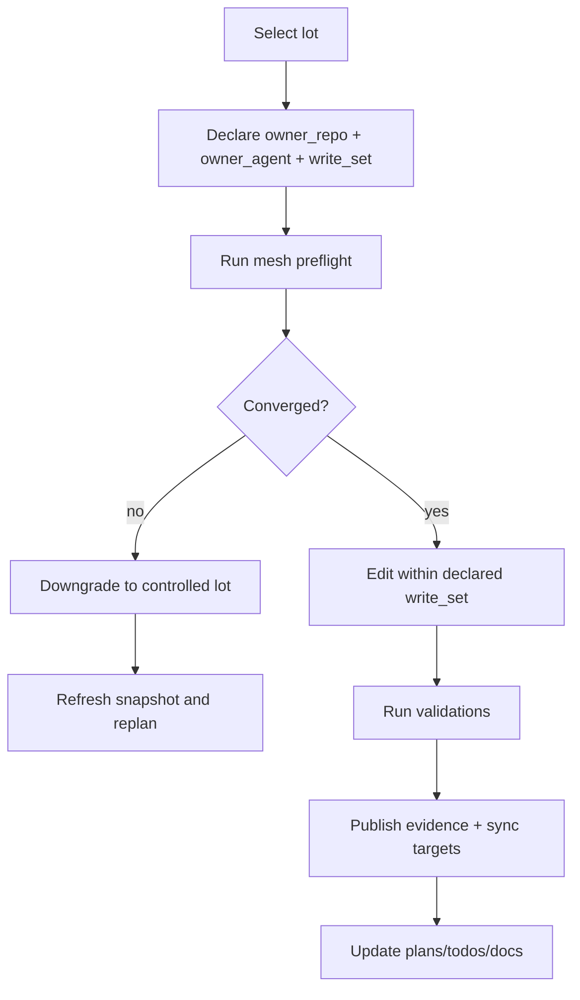
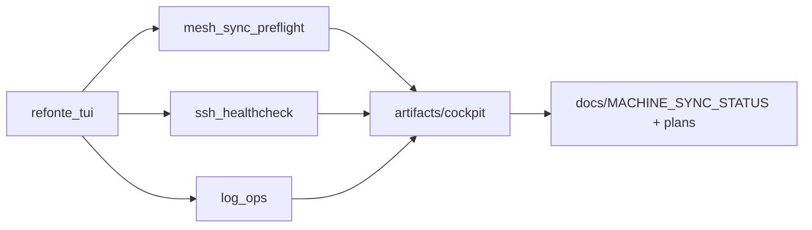

# Contrat Mesh Tri-Repo 2026-03-20

Statut: actif
Version: `mesh-contract/v1`
Date: `2026-03-20`
Portee: `Kill_LIFE`, `mascarade`, `crazy_life`, machines SSH associees

Ce document formalise la gouvernance maillée du programme tri-repo. En cas de conflit avec une documentation plus ancienne, ce contrat fait foi pour les surfaces suivantes: ownership, execution lots, sync preflight, handoff agentique, statuts MCP, snapshots machines/repos et workflow handshake inter-repos.

## Principes directeurs

- Aucun depot n'est la source de verite absolue.
- Chaque lot declare un `owner_repo`, un `owner_agent`, un `write_set`, des `validations`, des `evidence` et des `sync_targets`.
- Nous ne sommes pas seuls dans le codebase: aucun revert de changements externes, aucun merge implicite hors `write_set`.
- Toute divergence de `branch`, `sha`, `remote`, `dirty-set` ou ownership fait retrograder la propagation en `lots controles`.
- Les surfaces IA sont coeur d'orchestration, mais toute action destructive, distante ou dependante de secrets reste derriere des gates explicites.

## Roles par repo

| Repo | Mission primaire | Exemples de surfaces |
| --- | --- | --- |
| `Kill_LIFE` | embarque, evidence, orchestration locale, launchers, smokes | TUI cockpit, repo-state, scripts MCP locaux, preuves d'execution |
| `mascarade` | runtime agentique, providers, observabilite compagnon, integrations | runtime IA, adapters MCP, dispatchs applicatifs, pipelines compagnon |
| `crazy_life` | cockpit operateur, edition de workflows, supervision web/devops | UI web, workflow editor, dashboards, supervision humaine |

## Regle d'execution d'un lot

Un lot valide doit exposer les champs suivants:

```yaml
lot_id: mesh-governance
owner_repo: Kill_LIFE
owner_agent: PM-Mesh
write_set:
  - docs/TRI_REPO_MESH_CONTRACT_2026-03-20.md
  - tools/cockpit/mesh_sync_preflight.sh
preflight:
  - bash tools/cockpit/mesh_sync_preflight.sh --json
  - bash tools/cockpit/ssh_healthcheck.sh --json
validations:
  - bash tools/run_autonomous_next_lots.sh status
  - bash tools/specs/sync_spec_mirror.sh all --yes
  - bash tools/test_python.sh --venv-dir .venv --suite stable
sync_targets:
  - local
  - clems@192.168.0.120
  - root@192.168.0.119
  - kxkm@kxkm-ai
  - cils@100.126.225.111
  load_profile:
  default: tower-first
  options: [tower-first, photon-safe]
  load_aware: true
  overload_threshold: 1.8
  non_critical_skip: overload_or_cils_lockdown
  photon_safe_behavior: cils excluded from all non-SSH checks
  reserve_host: root@192.168.0.119
  critical_hosts:
    tower: clems@192.168.0.120
    secondary_kxkm: kxkm@kxkm-ai
    secondary_cils: cils@100.126.225.111
    local: local
    reserve_root: root@192.168.0.119
    critical_repo: Kill_LIFE
  host_priority_order: [clems@192.168.0.120, kxkm@kxkm-ai, cils@100.126.225.111, local, root@192.168.0.119]
  critical_repos: [Kill_LIFE]
evidence:
  - artifacts/cockpit/useful_lots_status.md
  - docs/MACHINE_SYNC_STATUS_2026-03-20.md
```

## Overlay agents / sous-agents

Les huit agents principaux et leurs sous-agents standards sont:

| Agent | Perimetre principal | Sous-agents types |
| --- | --- | --- |
| `PM-Mesh` | backlog tri-repo, arbitrage, priorisation, sequence de propagation | `Lot-Planner`, `Risk-Triager` |
| `Arch-Mesh` | contrats, ADR, versionnement interfaces | `Schema-Guard`, `Compat-Auditor` |
| `Embedded-CAD` | firmware, hardware, CAD/MCP locaux | `Firmware-Lane`, `CAD-Lane` |
| `Runtime-Companion` | runtime IA, providers, compat MCP | `Provider-Bridge`, `Runtime-Smoke` |
| `Web-Cockpit` | UI, workflow editor, supervision | `UI-Flow`, `Schema-Consumer` |
| `QA-Compliance` | matrices, evidence, gates | `Spec-Mirror`, `Evidence-Pack` |
| `Docs-Research` | README, specs, Mermaid, veille OSS | `Mermaid-Map`, `OSS-Benchmark` |
| `SyncOps` | SSH, repo-state, logs, sync continue | `SSH-Health`, `Log-Ops` |

## Mermaid: topologie tri-repo

```mermaid
flowchart LR
    KL[Kill_LIFE\nlocal orchestration\nembedded evidence] <-- contract --> MA[mascarade\nagent runtime\nproviders]
    MA <-- contract --> CL[crazy_life\nweb cockpit\nworkflow editor]
    KL <-- workflow/schema handshake --> CL
    KL <-- MCP/runtime handshake --> MA
    KL --> SSH1[clems@192.168.0.120]
    KL --> SSH2[kxkm@kxkm-ai]
    KL --> SSH3[cils@100.126.225.111]
    KL --> SSH4[root@192.168.0.119]
```

```mermaid
flowchart LR
  classDef tier1 fill:#14355f,color:#fff
  classDef tier2 fill:#2f5f9f,color:#fff
  classDef tier3 fill:#3f8fbf,color:#fff
  classDef tier4 fill:#7fb5de
  classDef tier5 fill:#b0c4de
  T1[clems@192.168.0.120\\nPriority 1\\nPriority rank: 1]:::tier1 --> T2[kxkm@kxkm-ai\\nPriority 2\\nPriority rank: 2]:::tier2
  T2 --> T3[cils@100.126.225.111\\nPriority 3\\ncritical-only in tower-first\\nPriority rank: 3]:::tier3
  T3 --> T4[local\\nPriority 4\\nPriority rank: 4]:::tier4
  T4 --> T5[root@192.168.0.119\\nPriority 5\\nReserve fallback]:::tier5
```

## Mermaid: execution d'un lot en codebase partage



## Mermaid: flux TUI et logs



## Contrats publics normalises

### Statut MCP

Valeurs autorisees:

- `ready`: outils exposes et dependances/credentials disponibles.
- `degraded`: outil demarre sans crash silencieux, expose ses outils ou son envelope, mais une dependance non critique manque.
- `blocked`: l'outil ne peut pas etre utilise ou la securite/contrat empêche l'execution.

### Handoff agentique

```json
{
  "lot_id": "mesh-governance",
  "owner_repo": "Kill_LIFE",
  "owner_agent": "PM-Mesh",
  "write_set": ["docs/TRI_REPO_MESH_CONTRACT_2026-03-20.md"],
  "preflight": ["bash tools/cockpit/mesh_sync_preflight.sh --json"],
  "validations": ["bash tools/run_autonomous_next_lots.sh status"],
  "evidence": ["artifacts/cockpit/useful_lots_status.md"],
  "sync_targets": ["local", "clems@192.168.0.120"]
}
```

### Snapshot machine/repo

```json
{
  "machine": "clems@192.168.0.120",
  "repo": "Kill_LIFE",
  "branch": "main",
  "sha": "bd3f7b99154f86057ba18b9948d940df55722b12",
  "remote": "https://github.com/electron-rare/Kill_LIFE.git",
  "dirty_set": ["docs/REPO_STATE.md", "docs/repo_state.json"],
  "required_script": "tools/repo_state/repo_refresh.sh",
  "ssh_health": "ok"
}
```

### Workflow schema handshake `Kill_LIFE <-> crazy_life`

- Le schema de workflow est versionne et publie comme artefact contractuel.
- `Kill_LIFE` fournit les smokes et la preuve de compatibilite machine/repo.
- `crazy_life` consomme le schema sans supposer des champs implicites.
- Toute rupture retrocompatible doit:
  - incrementer la version,
  - mettre a jour le mapping UI,
  - ajouter une preuve de validation dans le lot.

## Artefacts machine-readables

Contrats publies dans le repo:

- `specs/contracts/agent_handoff.schema.json`
- `specs/contracts/repo_snapshot.schema.json`
- `specs/contracts/workflow_handshake.schema.json`

Exemples de reference:

- `specs/contracts/examples/agent_handoff.mesh.json`
- `specs/contracts/examples/repo_snapshot.mesh.json`
- `specs/contracts/examples/workflow_handshake.mesh.json`

Checker local sans dependance externe:

- `python3 tools/specs/mesh_contract_check.py --schema specs/contracts/agent_handoff.schema.json --instance specs/contracts/examples/agent_handoff.mesh.json`
- `python3 tools/specs/mesh_contract_check.py --schema specs/contracts/repo_snapshot.schema.json --instance specs/contracts/examples/repo_snapshot.mesh.json`
- `python3 tools/specs/mesh_contract_check.py --schema specs/contracts/workflow_handshake.schema.json --instance specs/contracts/examples/workflow_handshake.mesh.json`

## Politique de propagation

- Mode nominal: `sync continue`.
- Downgrade automatique en `lots controles` si divergence de convergence, conflit de ownership ou dirty-set non maitrise.
- Une convergence n'est consideree acquise qu'apres preflight machine + evidence locale.

## Evidence minimale par lot

- `artifacts/cockpit/useful_lots_status.md`
- sortie JSON des preflights TUI
- doc ou spec mise a jour
- todo/plan du lot mis a jour

## Criteres de validation

- README et docs alignes sur l'etat reel.
- TUI disponible pour preflight, SSH health et log ops.
- MCP sans crash d'import: `ready` ou `degraded`, jamais `blocked` sans justification.
- Divergences machines detectees avant propagation.
