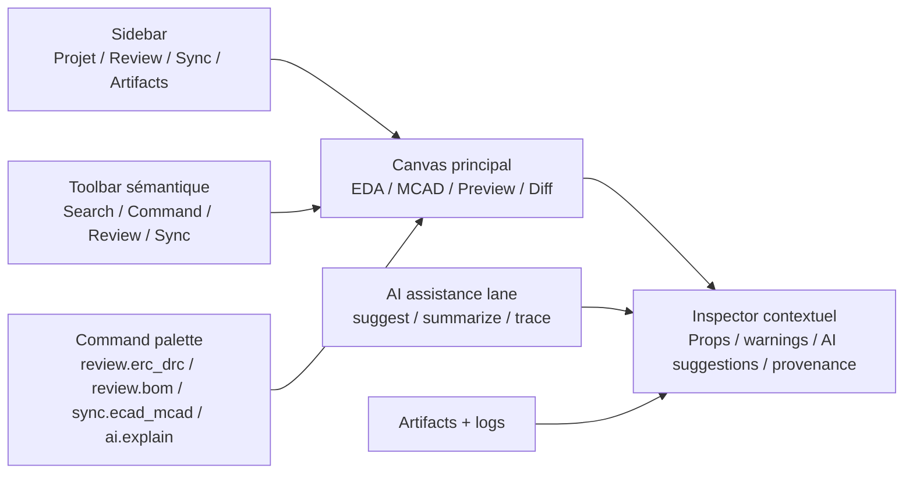

# YiACAD UI/UX Audit Apple-native - 2026-03-20

## Portée

Audit de la refonte UI/UX pour `YiACAD`, base `KiCad + FreeCAD` pilotée par la lane IA-native de `Kill_LIFE`, aligné sur les recommandations Apple officielles disponibles au `2026-03-20`.

## Résumé exécutif

YiACAD possède déjà trois atouts structurels forts:

- une base outillée et traçable;
- des surfaces CAD déjà installées dans les répertoires utilisateur;
- une culture de preuve par artefacts, lots et runbooks.

Le point faible principal n’est pas l’absence de fonctions, mais leur fragmentation. Aujourd’hui, l’opérateur passe entre cockpit, plugin KiCad, workbench FreeCAD, artefacts markdown et scripts shell. La refonte UI/UX doit donc unifier l’expérience autour d’un shell cohérent, lisible, hiérarchisé, avec des actions IA visibles mais discrètes.

## Points forts

- Gouvernance déjà spec-first avec plans, TODOs, artefacts et runbooks.
- Surfaces natives déjà présentes dans les répertoires utilisateur KiCad et FreeCAD.
- Utilitaires IA concrets déjà posés pour `ERC/DRC`, `BOM Review`, `ECAD/MCAD Sync` et `Status`.
- Pipeline de logs et d’artefacts déjà compatible avec une expérience “inspectable”.
- Découpage agentique permettant d’isoler clairement `PM`, `Architect`, `SyncOps` et désormais `DesignOps-UI`.

## Points faibles

- Absence d’architecture d’information commune entre KiCad, FreeCAD et le cockpit.
- Boutons présents, mais hiérarchie d’action encore insuffisante: pas de `command palette`, pas de regroupement par tâche, peu d’états visuels.
- Trop de surfaces textuelles secondaires pour accéder à l’essentiel: l’utilisateur doit déjà savoir quoi lancer.
- Le shell IA est encore largement Python/plugin-level, pas encore compilé et natif au cœur des forks.
- Peu de conventions visuelles partagées entre `status`, `review`, `sync`, `artifacts`.

## Opportunités majeures

- Unifier l’architecture en `sidebar -> canvas -> inspector`.
- Introduire une `command palette` commune pour les actions transverses.
- Transformer l’IA en couche d’assistance contextuelle, jamais en panneau bavard permanent.
- Faire du `review center` la destination unique pour `ERC`, `DRC`, `BOM`, `sync`, warnings, suggestions et preuves.
- Aligner les surfaces sur les patterns Apple/macOS: toolbars sobres, sidebars claires, search field centrale, inspecteurs contextuels, SF Symbols cohérents, génération IA explicitement balisée.

## Recommandations Apple 2026 retenues

### Structure

- Utiliser une navigation stable et visible.
- Réduire la concurrence visuelle dans la toolbar.
- Préférer les inspecteurs contextuels plutôt que des modales répétées.
- Donner à la recherche et aux commandes une place de premier rang.

### IA

- Signaler explicitement quand une sortie est générée ou suggérée par IA.
- Garder l’utilisateur en contrôle de l’action finale.
- Présenter le résultat avec source, contexte, confiance et possibilité d’annulation.
- Utiliser l’IA pour accélérer la tâche, pas pour masquer l’état du système.

## Architecture cible

## Carte des écarts

| Surface | État actuel | Écart | Cible |
| --- | --- | --- | --- |
| KiCad plugin | boutons fonctionnels, surface modale | trop plate, peu hiérarchisée | palette + review center + inspector |
| FreeCAD workbench | commandes disponibles | peu de narration d’état et peu de convergence visuelle | dock d’assistance + sync panel |
| Cockpit | puissant mais orienté lot | peu tourné usage design quotidien | TUI dédiée UI/UX + résumés ciblés |
| Documentation | riche | dispersée | un corpus UI/UX relié depuis le README et le manifeste |
| Forks natifs | hooks directs présents | pas encore intégrés aux surfaces compilées | shell natif YiACAD |

## Intégration IA recommandée

| Cas d’usage | Entrée | Sortie | Garde-fou |
| --- | --- | --- | --- |
| `ERC/DRC Assist` | board + schematic + violations | regroupement des priorités, suggestions de correction | ne jamais auto-appliquer |
| `BOM Review` | BOM exportée | manquants, duplications, champs vides | lister les preuves et les lignes concernées |
| `ECAD/MCAD Sync` | STEP KiCad + STEP FreeCAD | delta, état d’alignement, lot de preuves | conserver les deux exports bruts |
| `AI Explain` | warning sélectionné | explication + contexte + doc liée | source et confiance visibles |
| `Review Digest` | artefacts d’un lot | résumé opérateur | lien vers artefacts originaux |

## Phasage recommandé

### P0

- stabiliser la taxonomie visuelle des actions;
- publier le shell documentaire et la TUI UI/UX;
- préparer l’intégration native des hooks dans les forks.

### P1

- introduire la `command palette` unifiée;
- créer le `review center`;
- ajouter les inspecteurs contextuels KiCad/FreeCAD.

### P2

- remonter ces patterns dans le code natif compilé des forks;
- ouvrir la voie à `App Intents`, `Spotlight actions` et modèles on-device lorsque la pile le permet;
- mesurer adoption, latence et taux d’usage.

## Risques

- surcouche “Apple-like” superficielle sans gain métier;
- duplication entre plugin Python temporaire et shell natif futur;
- confusion si les états IA ne sont pas parfaitement explicités.

## Décision de passe

La bonne trajectoire n’est pas de “repeindre” les boutons. Il faut construire un shell opératoire unique, centré sur les workflows `review`, `sync`, `inspect`, `artifacts`, avec une IA contextuelle, traçable et toujours réversible.
