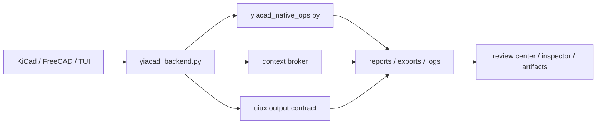

# YiACAD backend architecture (2026-03-20)

## Intent

Stabiliser la couche locale YiACAD entre les shells natifs KiCad/FreeCAD, les TUI et les utilitaires CAD. Le but n'est plus seulement d'executer des commandes, mais de fournir un contexte projet commun, des artefacts structurés et un contrat de sortie uniforme.

## Etat courant

- les shells natifs appellent `tools/cad/yiacad_native_ops.py`
- `yiacad_native_ops.py` reste le runner concret des actions `status`, `ERC/DRC`, `BOM review`, `ECAD/MCAD sync`
- le nouveau module `tools/cad/yiacad_backend.py` pose la couche backend locale commune:
  - `context broker`
  - `surface inference`
  - `context_ref`
  - `uiux_output.json`
  - `context.json`

## Architecture cible locale

## Ce que T-ARCH-101 livre maintenant

- un backend local partage dans `tools/cad/yiacad_backend.py`
- une facade backend locale adressable dans `tools/cad/yiacad_backend_service.py`
- une resolution de contexte unifiee pour:
  - `source_path`
  - `board`
  - `schematic`
  - `freecad_document`
  - `context_ref`
- un artefact `context.json` par run YiACAD
- un artefact `uiux_output.json` par run YiACAD
- un mode `--json-output` dans `tools/cad/yiacad_native_ops.py` pour exposer directement le contrat structure

## Ce qui reste a faire

### T-ARCH-101B

- sortir d'un simple appel de script local vers une couche backend plus robuste
- permettre aux shells natifs d'appeler une API locale stable plutot qu'une CLI seule

### T-ARCH-101C

- brancher `review center`, `palette` et `inspector` sur `uiux_output.json`
- rendre le `context broker` reusable entre KiCad, FreeCAD et TUI sans duplication

## Contrats relies

- sortie UX:
  - `specs/contracts/yiacad_uiux_output.schema.json`
  - `specs/contracts/examples/yiacad_uiux_output.example.json`
- contexte backend:
  - `specs/contracts/yiacad_context_broker.schema.json`
  - `specs/contracts/examples/yiacad_context_broker.example.json`

## Lecture courte

1. `yiacad_native_ops.py` reste le moteur concret.
2. `yiacad_backend.py` devient la couche commune de contexte et de contrat.
3. le prochain saut consiste a remplacer la simple invocation locale par un backend YiACAD plus stable et plus adressable.

## Delta 2026-03-21 - backend facade addressable

- `T-ARCH-101` est considere comme ferme: backend local, `context broker`, sorties normalisees et facade adressable sont maintenant publies.
- `tools/cad/yiacad_backend_service.py` fournit un point d’entree local stable pour:
  - `status`
  - `invoke status`
  - `invoke kicad-erc-drc`
  - `invoke bom-review`
  - `invoke ecad-mcad-sync`
- `T-ARCH-101C` est maintenant execute sur les surfaces actives: la facade locale est prouvee operatoirement et promue jusque dans la TUI UI/UX.

## Delta 2026-03-21 - shell helpers rerouted

- les helpers shell Python KiCad et FreeCAD privilegient maintenant `tools/cad/yiacad_backend_service.py` comme transport local:
  - `.runtime-home/cad-ai-native-forks/kicad-ki/scripting/plugins/yiacad_kicad_plugin/_native_common.py`
  - `.runtime-home/cad-ai-native-forks/freecad-ki/src/Mod/YiACADWorkbench/yiacad_freecad_gui.py`
- `tools/cockpit/yiacad_uiux_tui.sh --action status` consomme maintenant le meme client `service-first`.
- le fallback direct vers `tools/cad/yiacad_native_ops.py` reste present si la facade locale est absente.
- la suite se deplace maintenant vers:
  - `T-UX-004` pour la palette et l'inspector persistants,
  - `T-UX-003` pour les points d'insertion natifs plus profonds,
  - `T-RE-209` pour le lot operateur YiACAD complet.
