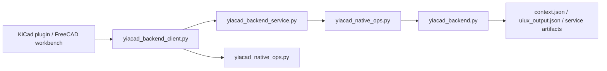

# YiACAD backend service - 2026-03-21

## Objectif

Remplacer le chemin purement CLI direct par un backend local plus stable et adressable, tout en gardant un fallback direct pour ne pas casser les surfaces deja livrees.

## Livrables

- service local:
  - `tools/cad/yiacad_backend_service.py`
- client service-first:
  - `tools/cad/yiacad_backend_client.py`
- TUI operatoire:
  - `tools/cockpit/yiacad_backend_service_tui.sh`

## Fonctionnement

## Chemin d'execution

1. la surface appelle `yiacad_backend_client.py`
2. le client tente `service-first`
3. si le service n'est pas disponible, il l'auto-demarre
4. si le service reste indisponible, le client retombe sur `yiacad_native_ops.py`

## Surfaces recablees

- KiCad plugin:
  - `.runtime-home/cad-ai-native-forks/kicad-ki/scripting/plugins/yiacad_kicad_plugin/yiacad_action.py`
- FreeCAD workbench:
  - `.runtime-home/cad-ai-native-forks/freecad-ki/src/Mod/YiACADWorkbench/yiacad_freecad_gui.py`

## Commandes utiles

- statut:
  - `bash tools/cockpit/yiacad_backend_service_tui.sh --action status`
- health JSON:
  - `bash tools/cockpit/yiacad_backend_service_tui.sh --action health --json`
- logs:
  - `bash tools/cockpit/yiacad_backend_service_tui.sh --action logs-summary`

## Artefacts

- `artifacts/cad-ai-native/service/latest_server.json`
- `artifacts/cad-ai-native/service/latest_health.json`
- `artifacts/cad-ai-native/service/latest_response.json`
- `artifacts/cad-ai-native/service/server.log`

## Veille officielle utile

- [Python `urllib.request`](https://docs.python.org/3/library/urllib.request.html)
- [Python `http.server`](https://docs.python.org/3/library/http.server.html)
- [Python `socketserver`](https://docs.python.org/3/library/socketserver.html)

## Etat

- `T-ARCH-101C` est maintenant engage sur les surfaces actives Python.
- le prochain palier restant est l'extension eventuelle du chemin service-first aux surfaces compilees plus profondes.
