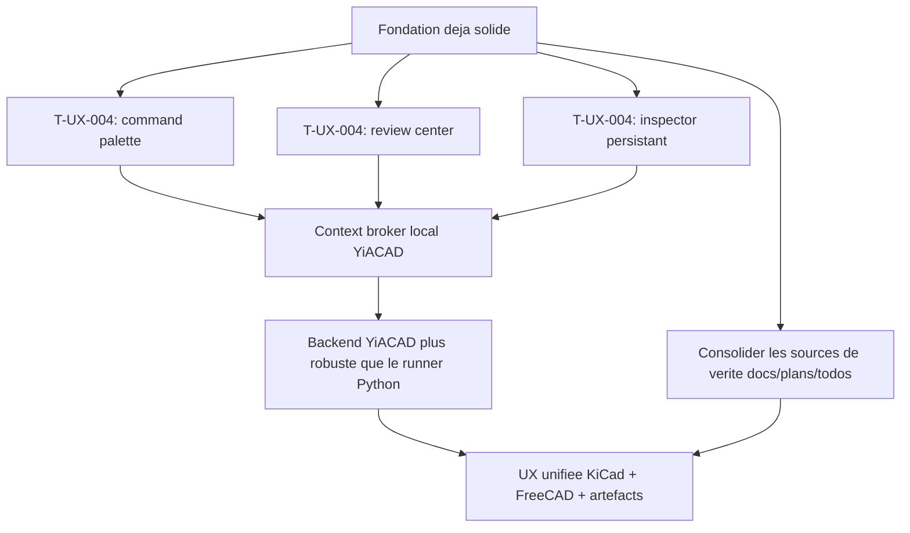

# YiACAD / Kill_LIFE - Audit exhaustif de refonte 2026-03-20

## Synthese executive

Kill_LIFE dispose deja d'une base rarement aussi structuree pour un programme IA-native embarque/CAD: spec-first, plans vivants, lots autonomes, cockpit TUI, traces d'artefacts, forks natifs KiCad/FreeCAD et matrice agentique. Le point faible principal n'est pas l'absence d'outillage mais la multiplication des couches de gouvernance et des deltas documentaires. YiACAD est maintenant suffisamment cable pour quitter la phase "brancher des commandes" et entrer dans la phase "designer l'orchestration utilisateur et fiabiliser le backend natif".

## Points forts

- `specs/00_intake.md` a `specs/04_tasks.md` forment une colonne vertebrale claire.
- `tools/cockpit/` fournit deja une vraie surface de pilotage TUI avec logs et artefacts.
- `docs/plans/12_plan_gestion_des_agents.md`, `docs/AGENT_SPEC_MODULE_MATRIX_2026-03-20.md` et `docs/plans/18_*` donnent une memoire projet operationnelle.
- YiACAD dispose maintenant d'une presence native reelle dans `kicad-ki` et `freecad-ki`, au dela du simple plugin local.
- `tools/cad/yiacad_native_ops.py` fournit un runner CAD commun pour `status`, `ERC/DRC`, `BOM review`, `ECAD/MCAD sync`.
- Le repo couvre plusieurs horizons a la fois: firmware, hardware, CAD, MCP, compliance, mesh tri-repo, ops.

## Points faibles

- La documentation est riche mais tres fragmentee. Beaucoup de fichiers jouent un role voisin: audit, manifeste, plan, delta, handoff, todo, resume hebdomadaire.
- Les sources de verite se chevauchent entre `README.md`, `specs/03_plan.md`, `specs/04_tasks.md`, `docs/plans/18_*`, `docs/plans/20_*`, `docs/AGENT_SPEC_MODULE_MATRIX_2026-03-20.md`.
- YiACAD reste hybride: KiCad a deja des points d'insertion compiles, FreeCAD reste surtout au niveau workbench Python, et le backend final reste un runner Python local.
- Les lanes externes `n8n`, MCP, Docker, mesh machines et tri-repo ajoutent de la puissance mais aussi beaucoup de volatilite operationnelle.
- La densite des artefacts et logs augmente plus vite que les surfaces de lecture synthese.

## Opportunites d'amelioration

- Reducer les doublons en designant un "hub canonique de refonte" qui pointe vers les docs detaillees au lieu d'ajouter des deltas partout.
- Faire de `T-UX-004` la prochaine priorite: palette de commandes, review center, inspector persistant, latence et etats explicites.
- Stabiliser le backend YiACAD derriere une API locale unique plutot qu'un simple runner Python expose.
- Uniformiser la logique de contexte projet entre KiCad, FreeCAD et les artefacts CAD.
- Faire remonter les resultats `ERC/DRC`, `BOM review` et `ECAD/MCAD sync` dans une meme couche de restitution UX.

## Evaluation de l'integration IA

### Ce qui est deja bien positionne

- IA comme copilote contextualise et non comme autorite opaque.
- Utilitaires CAD concrets deja exposes dans l'UI native.
- Base MCP deja presente pour brancher davantage d'outils contextuels.
- Trajectoire Apple-native correcte: feedback explicite, surfaces contextualisees, actions reversibles, documents de reference deja produits.

### Ce qui manque encore

- Une couche de synthese IA transversale qui relie schema, PCB, BOM, FCStd, status machine et artefacts.
- Une experience utilisateur persistante pour les revues, recommandations et diffs.
- Une couche backend plus robuste que le simple lancement de script local.
- Des contrats de sortie normalises entre chaque action YiACAD pour une UI plus riche.

### Integrations IA prioritaires

1. `review center` multi-surface pour agreger `ERC/DRC`, BOM, sync et recommandations.
2. `command palette` YiACAD avec actions, recent projects, contexts et suggestions.
3. `context broker` local qui unifie projet KiCad, document FreeCAD, artefacts et etat runtime.
4. `native response cards` dans KiCad/FreeCAD pour afficher resultats, severite, liens artefacts, prochaines actions.

## Audit gouvernance / ops

### Mature aujourd'hui

- `tools/cockpit/refonte_tui.sh`
- `tools/cockpit/yiacad_uiux_tui.sh`
- `tools/cockpit/agent_matrix_tui.sh`
- `tools/cockpit/log_ops.sh`
- `tools/cockpit/render_weekly_refonte_summary.sh`
- `docs/plans/12_plan_gestion_des_agents.md`
- `docs/plans/18_plan_enchainement_autonome_des_lots_utiles.md`
- `docs/plans/20_plan_refonte_ui_ux_yiacad_apple_native.md`

### Fragile aujourd'hui

- duplication de deltas dans les plans et TODOs
- visibilite diffuse du "prochain lot canonique"
- fragmentation de la documentation entre audit, runbook, handoff, synthese et README
- lisibilite inegale des logs quand plusieurs lanes tournent en parallele

## Recommandation de priorisation

## Cartographie rapide des zones

| Zone | Etat actuel | Lecture |
| --- | --- | --- |
| `tools/cockpit/` | fort | couche ops deja tres exploitable |
| `specs/` | fort | colonne vertebrale projet claire |
| `docs/plans/` | moyen | riche mais diffuse |
| `tools/cad/` | moyen/fort | runner YiACAD utile, prochaine marche backend |
| `.runtime-home/cad-ai-native-forks/` | moyen | insertion native engagee mais encore heterogene |
| `tools/ai/` | moyen | interessant mais volatilite runtime plus elevee |
| `artifacts/` | moyen | riche, besoin de lecture plus synthese |

## Sources externes utiles

- [Apple Human Interface Guidelines](https://developer.apple.com/design/human-interface-guidelines/)
- [Human Interface Guidelines for Generative AI](https://developer.apple.com/design/human-interface-guidelines/generative-ai)
- [What’s new - Design - Apple Developer](https://developer.apple.com/design/whats-new/)
- [App Intents](https://developer.apple.com/documentation/AppIntents)
- [KiCad source mirror](https://github.com/KiCad/kicad-source-mirror)
- [FreeCAD](https://github.com/FreeCAD/FreeCAD)
- [KiCad StepUp](https://github.com/easyw/kicadStepUpMod)
- [CadQuery](https://github.com/CadQuery/cadquery)
- [CQ-editor](https://github.com/CadQuery/CQ-editor)
- [kicad-mcp](https://github.com/lamaalrajih/kicad-mcp)
