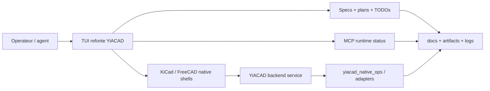

# Evaluation des integrations IA - YiACAD / Kill_LIFE (2026-03-20)

## Principe directeur

L'IA doit rester une couche d'acceleration, de lecture et d'orchestration, jamais la source d'autorite. Le projet dispose deja des briques necessaires; le gain principal vient maintenant de leur coordination et de la reduction du cout d'usage.

## Matrice priorisee

| Surface | Integration IA prioritaire | Gain attendu | Garde-fou | Priorite |
| --- | --- | --- | --- | --- |
| Specs, plans, TODOs | Resume structure, triage de lots, handoff automatique | Meilleure continuite, moins de perte de contexte | Toujours adosser aux specs et au manifeste | P0 |
| YiACAD native shells | Actions contextualisees `Status`, `ERC/DRC`, `BOM Review`, `ECAD/MCAD Sync` | Valeur immediate pour ECAD/MCAD | Resultats auditables, jamais d'auto-apply opaque | P0 |
| Review center | Regroupement IA des findings CAD, docs et backlog | UX plus lisible, moins de dispersion | Les commandes restent explicites et annulables | P0 |
| MCP runtime | Orchestration et lecture de sante des serveurs CAD/knowledge/github | Deblocage rapide et meilleure observabilite | Contrat `ready|degraded|blocked` conserve | P1 |
| Docs et evidence | Synthese de drift, de coherence README/docs/plans | Dette documentaire reduite | Validation humaine + liens sources | P1 |
| Firmware / hardware review | Assistance de lecture, tri de warnings, preparation de revues | Gain de temps en revue technique | Mode propose-only | P1 |
| ZeroClaw / mesh ops | Aide au diagnostic et a la priorisation cross-repo | Coordination plus stable | Sorties structurees et journalisees | P2 |

## Architecture IA recommandee

## Briques externes pertinentes

- [KiCad upstream](https://github.com/KiCad/kicad-source-mirror): base ECAD canonique, active, multi-surface.
- [FreeCAD upstream](https://github.com/FreeCAD/FreeCAD): base MCAD parametrique canonique.
- [kicadStepUp](https://github.com/easyw/kicadStepUpMod): pont ECAD/MCAD pratique pour l'alignement FreeCAD/KiCad.
- [CadQuery](https://github.com/CadQuery/cadquery): moteur de CAD scriptable, utile pour scenarios generatifs et parametrisation.
- [kicad-mcp](https://github.com/lamaalrajih/kicad-mcp): exposition MCP utile pour automatisation et contextualisation.
- [freecad-mcp](https://github.com/contextform/freecad-mcp): meme logique cote FreeCAD.

## Recommandations d'integration

### P0

- Garder les shells natifs comme surfaces visibles.
- Faire emerger un backend YiACAD stable entre les shells et `yiacad_native_ops.py`.
- Ajouter une palette de commandes commune et un review center multi-surface.

### P1

- Standardiser le format de sortie IA pour specs, docs et CAD reviews.
- Mutualiser les artefacts de resultat afin d'eviter les differences entre KiCad, FreeCAD et TUI.

### P2

- Explorer une IA plus proactive pour planning et reporting inter-repo, une fois la couche backend YiACAD stabilisee.

## Conclusion

Le projet n'a pas besoin de "plus d'IA" en premier. Il a besoin d'une IA mieux concentree, mieux exposee et plus uniforme entre shells natifs, TUI, plans et evidence packs.
