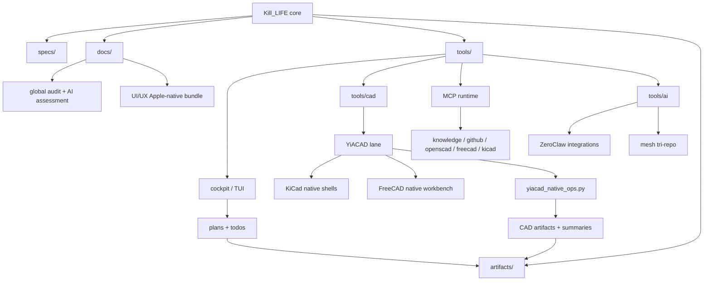

# YiACAD global feature map (2026-03-20)

## Carte Mermaid

## Cartes de fonctionnalites

### 1. Gouvernance

- Manifeste de refonte
- Plans vivants
- TODOs prioritaires
- Matrice agents / write-sets

### 2. Pilotage operateur

- Cockpit de refonte
- TUI YiACAD UI/UX
- TUI globale YiACAD
- Resume hebdomadaire
- Politique logs / purge

### 3. CAD IA-native

- Fusion KiCad + FreeCAD
- Hooks natifs dans `kicad manager`, `pcbnew`, `eeschema`
- Workbench FreeCAD YiACAD
- Utilities `status`, `ERC/DRC`, `BOM Review`, `ECAD/MCAD Sync`

### 4. IA et orchestration

- Runtime MCP
- ZeroClaw integrations
- Patterns LangGraph / AutoGen
- Knowledge base / GitHub dispatch

### 5. Compliance et evidence

- Evidence packs
- Badges
- Validation spec / repo / compliance
- Historisation des lots et de leurs artefacts
