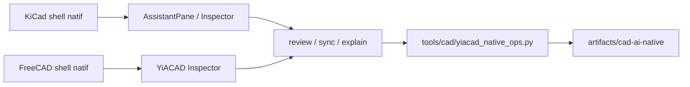

# YiACAD Native UI Insertion Points - 2026-03-20

## Objectif

Consolider les points d’insertion natifs les plus sûrs pour faire monter YiACAD du niveau `plugin/workbench Python` vers un shell compilé et persistant dans les forks `kicad-ki` et `freecad-ki`.

## KiCad - points d’insertion recommandés

### Menus

- `EDA_BASE_FRAME::doReCreateMenuBar()` et ses déclinaisons par frame.
- Ancrages principaux:
  - `common/eda_base_frame.cpp`
  - `kicad/menubar.cpp`
  - `pcbnew/menubar_pcb_editor.cpp`
  - `eeschema/menubar.cpp`

### Toolbar

- `configureToolbars()` et les factories de contrôles custom.
- Ancrages principaux:
  - `include/eda_base_frame.h`
  - `common/eda_base_frame.cpp`
  - `common/eda_draw_frame.cpp`
  - `pcbnew/toolbars_pcb_editor.cpp`
  - `eeschema/toolbars_sch_editor.cpp`
- décision `T-UX-003`:
  - `common/eda_base_frame.cpp` reste `no-touch` pour ce lot;
  - la surface canonique est editor-locale: `toolbars_*` + `*_editor_control.*`;
  - raison: `EDA_BASE_FRAME` est partagé, `configureToolbars()` y est générique, et la recréation de menu macOS y est déjà sensible.

### Inspector / panneau assistant

- utiliser un `AssistantPane` dockable parallèle au panneau propriétés, pas imbriqué dedans;
- ancrages:
  - `pcbnew/pcb_edit_frame.cpp`
  - `eeschema/sch_edit_frame.cpp`
  - `common/widgets/properties_panel.h`

### Commandes IA

- surface native recommandée: `TOOL_ACTION` + `ACTION_MENU` + boutons toolbar;
- panneau riche recommandé: `WEBVIEW_PANEL`;
- ancrages:
  - `include/tool/tool_action.h`
  - `include/tool/action_menu.h`
  - `include/widgets/webview_panel.h`
  - `common/widgets/webview_panel.cpp`

### Risques majeurs

- couplage fort à la persistance AUI/layout;
- recréation de menu macOS déjà différée et sensible;
- forte dépendance métier des panneaux propriétés PCB/SCH;
- extension plus fragile côté `pcbnew` à cause du mélange API/IPC/legacy Python.

## FreeCAD - points d’insertion recommandés

### Workbench natif

- workbench `YiACADWorkbench` comme point d’entrée stable;
- chaîne native:
  - `src/Mod/YiACADWorkbench/InitGui.py`
  - `src/Gui/FreeCADGuiInit.py`
  - `src/Gui/Application.cpp`
  - `src/Gui/Workbench.cpp`

### Menus / toolbars globaux

- injecter globalement par workbench manipulator, pas via patchs locaux dispersés;
- ancrages:
  - `src/Gui/ApplicationPy.cpp`
  - `src/Gui/WorkbenchManipulator.h`
  - `src/Gui/WorkbenchManipulatorPython.cpp`

### Inspector / dock natif

- point d’entrée natif: `MainWindow` + `DockWindowManager`;
- recommandation: un seul `YiACAD Inspector` à droite, réutilisant la logique `ComboView`;
- ancrages:
  - `src/Gui/MainWindow.cpp`
  - `src/Gui/DockWindow.h`
  - `src/Gui/DockWindowManager.cpp`
  - `src/Gui/ComboView.h`
  - `src/Gui/ComboView.cpp`
  - `src/Gui/PropertyView.h`
- décision `T-UX-003` / `T-UX-004`:
  - write-set sûr immédiat: `src/Mod/YiACADWorkbench/yiacad_freecad_gui.py`;
  - plus petit write-set shell compilé défendable: `src/Gui/MainWindow.cpp` seul;
  - `DockWindowManager.cpp` et `ComboView.cpp` restent `no-touch` tant qu’un besoin shell démontré n’impose pas plus.

### Commandes IA

- commandes conservées en Python via `FreeCADGui.addCommand` tant que le chrome n’est pas remonté en C++;
- ancrages:
  - `src/Mod/YiACADWorkbench/yiacad_freecad_gui.py`
  - `src/Gui/Command.cpp`

### Risques majeurs

- menus/toolbars reconstruits à chaque changement de workbench;
- persistance de layout sensible aux noms des docks et toolbars;
- manipulator Python insuffisant pour remodeler proprement les docks;
- tabification des docks appliquée une fois, donc fragile si le design dérive.

## Décision d’architecture

## Priorité d’implémentation

1. KiCad: `kicad_manager` puis `pcbnew` et `eeschema`
2. FreeCAD: `YiACADWorkbench` puis `MainWindow`/`DockWindowManager`
3. Réplication secondaire: footprint editor, symbol editor, raffinements de toolbar et palette

## Delta 2026-03-20 - surfaces maintenant branchées
- `kicad/kicad_manager_*`: action native `YiACAD Status` déjà branchée.
- `pcbnew/tools/board_editor_control.*`: handler `YiACAD Status` ajouté et exposé dans `pcbnew/menubar_pcb_editor.cpp` et `pcbnew/toolbars_pcb_editor.cpp`.
- `eeschema/tools/sch_editor_control.*`: handler `YiACAD Status` ajouté et exposé dans `eeschema/menubar.cpp` et `eeschema/toolbars_sch_editor.cpp`.
- `freecad-ki/src/Mod/YiACADWorkbench/*`: `YiACAD Inspector` dockable disponible comme première surface native de travail.
- Prochain remplacement prévu: suppression du bridge local au profit d'un backend YiACAD directement adressable par les shells natifs.

## Delta 2026-03-20 - direct runner integration
- `kicad/kicad_manager_*`: les actions YiACAD passent maintenant directement par `tools/cad/yiacad_native_ops.py`.
- `pcbnew/tools/board_editor_control.*`: `Status`, `ERC/DRC`, `BOM Review`, `ECAD/MCAD Sync` appellent directement le runner natif YiACAD.
- `eeschema/tools/sch_editor_control.*`: même recâblage direct vers le runner natif YiACAD.
- `freecad-ki/src/Mod/YiACADWorkbench/yiacad_freecad_gui.py`: chargement direct en mémoire de `yiacad_native_ops.py` via `importlib`.
- Le prochain point d'insertion critique devient la couche de retour UX persistante plutôt que la simple exécution de commandes.

## Delta 2026-03-20 18:18 - garde-fous shell KiCad
- `EDA_BASE_FRAME` est explicitement sorti du write-set `T-UX-003`.
- write-set minimal retenu côté KiCad:
  - `pcbnew/toolbars_pcb_editor.cpp`
  - `pcbnew/tools/board_editor_control.*`
  - `eeschema/toolbars_sch_editor.cpp`
  - `eeschema/tools/sch_editor_control.*`
- risque explicite:
  - les runners shell PCB/SCH restent synchrones (`wxExecute(..., wxEXEC_SYNC)` + `wxMessageBox`) et peuvent geler l’UI;
  - le comportement shell est dupliqué entre PCB et SCH, donc toute extension doit rester strictement symétrique.

## Delta 2026-03-20 18:20 - garde-fous shell FreeCAD
- write-set sûr retenu:
  - `freecad-ki/src/Mod/YiACADWorkbench/yiacad_freecad_gui.py`
- plus petit write-set shell compilé admissible à la prochaine tranche:
  - `freecad-ki/src/Gui/MainWindow.cpp`
- surfaces explicitement hors write-set pour l’instant:
  - `freecad-ki/src/Gui/DockWindowManager.cpp`
  - `freecad-ki/src/Gui/ComboView.cpp`
- risque explicite:
  - double ownership du dock si le workbench Python et un dock shell `Std_YiACADView` coexistent;
  - persistance de layout cassée si le nom du dock diverge;
  - `run_native_action()` reste synchrone dans le thread UI et amplifierait les freezes si on remonte trop vite en shell global.

## Delta 2026-03-20 23:06 - T-UX-003D shell anchor
- `MainWindow.cpp` porte maintenant un premier ancrage shell compilé `Std_YiACADShellView`.
- Le dock reste cache par défaut pour éviter une double autorité avec l’inspector workbench Python.
- Ce palier ne touche ni `DockWindowManager.cpp` ni `ComboView.cpp`; il sert uniquement de point d’entrée shell stable pour les prochaines cartes résultat YiACAD.

## Delta 2026-03-20 23:22 - shell card scaffold
- L’ancrage `Std_YiACADShellView` expose maintenant une première carte shell lisible avec les rubriques du contrat YiACAD: `surface`, `status`, `severity`, `summary`, `artifacts`, `next_steps`.
- Le toggle d’affichage du dock est nommé explicitement `YiACAD Shell`, ce qui le rend pilotable depuis les menus de docks sans nouvelle logique dans `DockWindowManager.cpp`.
