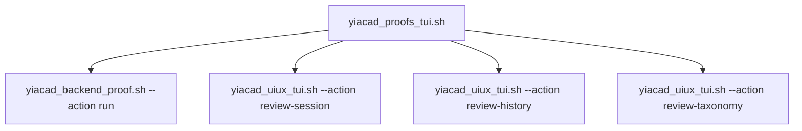

# YiACAD proofs TUI - 2026-03-21

## Intent
- Provide a canonical proof surface without breaking historical operator aliases.
- Centralize proof-oriented actions and log hygiene in a dedicated TUI.
- Keep the change isolated in new files because the codebase is shared.

## Canonical entry
- `bash tools/cockpit/yiacad_proofs_tui.sh --action status`

## Actions
- `status`
- `backend`
- `review-session`
- `review-history`
- `review-taxonomy`
- `logs-summary`
- `logs-list`
- `logs-latest`
- `purge-logs --days 14 --yes`

## Routing

## Notes
- This lot does not remove aliases yet.
- This lot prepares a safer follow-up cleanup by giving operators a single proofs entry.
- No execution validation was run in this pass.
