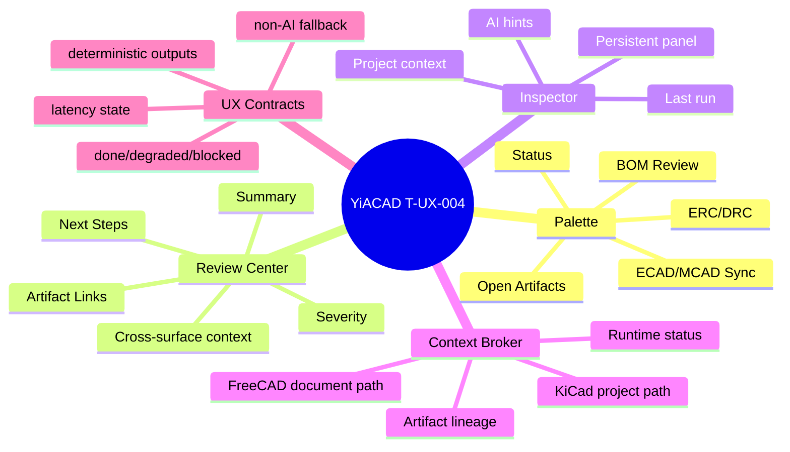

# YiACAD T-UX-004 - Feature map

```mermaid
mindmap
  root((YiACAD T-UX-004))
    Palette
      Status
      ERC/DRC
      BOM Review
      ECAD/MCAD Sync
      Open Artifacts
    Review Center
      Severity
      Summary
      Artifact Links
      Next Steps
      Cross-surface context
    Inspector
      Persistent panel
      Project context
      Last run
      AI hints
    Context Broker
      KiCad project path
      FreeCAD document path
      Artifact lineage
      Runtime status
    UX Contracts
      done/degraded/blocked
      latency state
      non-AI fallback
      deterministic outputs
```
