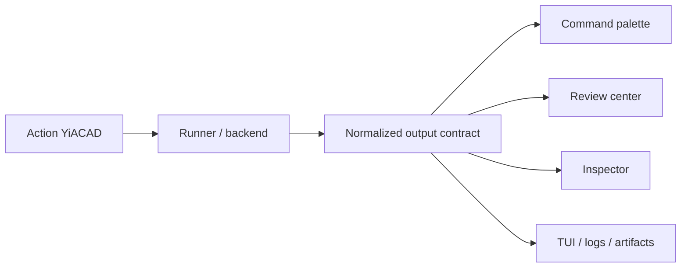

# YiACAD UI/UX Output Contract - 2026-03-20

## Objectif

Normaliser la restitution des actions YiACAD pour que KiCad, FreeCAD, les TUI et les artefacts lisent tous la meme forme de resultat, sans parser un texte libre.

## Canon

- schema: `specs/contracts/yiacad_uiux_output.schema.json`
- exemple: `specs/contracts/examples/yiacad_uiux_output.example.json`
- lot source: `T-UX-004B`

## Champs obligatoires

| Champ | Type | Rôle |
| --- | --- | --- |
| `component` | string | composant canonique, ici `yiacad` |
| `surface` | string | surface d’émission: `kicad-pcb`, `kicad-sch`, `freecad-workbench`, `tui`, etc. |
| `action` | string | identifiant stable d’action, ex. `review.erc_drc` |
| `execution_mode` | string | `interactive`, `batch` ou `background` |
| `status` | string | `done`, `degraded`, `blocked` |
| `severity` | string | `info`, `warning`, `error` |
| `summary` | string | résumé lisible immédiatement |
| `artifacts` | array | liste de preuves et exports |
| `next_steps` | array | prochaines actions explicites |

## Champs optionnels

| Champ | Type | Rôle |
| --- | --- | --- |
| `details` | string/null | détail long-form ou message enrichi |
| `context_ref` | string/null | référence projet/runtime/workflow |
| `generated_at` | string | horodatage ISO |
| `provider` | string/null | provider IA ou backend, si applicable |
| `model` | string/null | modèle IA, si applicable |
| `latency_ms` | integer/null | latence utile à l’UI |
| `artifacts[].label` | string/null | libellé lisible |
| `artifacts[].kind` | string | `report`, `log`, `export`, `evidence` |

## Règles de compat

- `status` ne sort jamais de `done | degraded | blocked`
- `severity` ne sort jamais de `info | warning | error`
- les extensions doivent etre additives et optionnelles
- l’absence d’IA ne doit pas casser le contrat
- `artifacts` et `next_steps` doivent toujours etre structurés, jamais cachés dans `summary`

## Flux d’usage

## Exemple de lecture UI

- `status=degraded`
- `severity=warning`
- `summary=ERC/DRC completed with 3 warnings`
- `artifacts[0].path=/abs/path/to/erc-report.md`
- `next_steps[0]=open review center`

Cela permet a l’UI d’afficher directement une carte resultat sans logique ad hoc dependante de la surface source.
