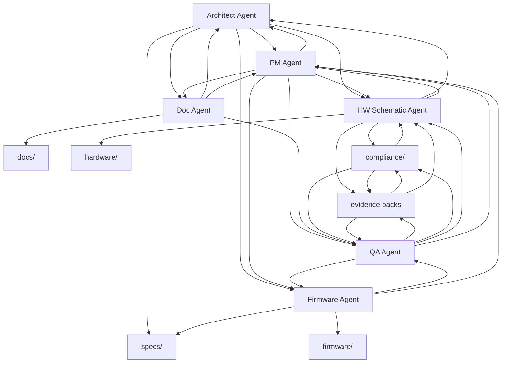

# Diagramme agentique Kill_LIFE

Ce diagramme illustre les interactions entre les agents, les artefacts et les evidence packs du projet.

```mermaid
graph TD
  Architect[Architect Agent]
  Doc[Doc Agent]
  Firmware[Firmware Agent]
  HW[HW Schematic Agent]
  PM[PM Agent]
  QA[QA Agent]
  Specs[specs/]
  Docs[docs/]
  FirmwareDir[firmware/]
  HardwareDir[hardware/]
  Compliance[compliance/]
  Evidence[evidence packs]

  Architect --> Specs
  Architect --> PM
  Architect --> HW
  Architect --> Firmware
  Architect --> Doc
  PM --> Architect
  PM --> HW
  PM --> Firmware
  PM --> QA
  PM --> Doc
  HW --> HardwareDir
  HW --> Compliance
  HW --> Evidence
  HW --> Architect
  HW --> PM
  Firmware --> FirmwareDir
  Firmware --> Specs
  Firmware --> QA
  Firmware --> PM
  QA --> Evidence
  QA --> Compliance
  QA --> Firmware
  QA --> HW
  QA --> PM
  Doc --> Docs
  Doc --> Architect
  Doc --> PM
  Doc --> QA

  Compliance --> Evidence
  Compliance --> HW
  Compliance --> QA

  Evidence --> QA
  Evidence --> Compliance
  Evidence --> HW
```

> Diagramme généré automatiquement (GPT-4.1)
